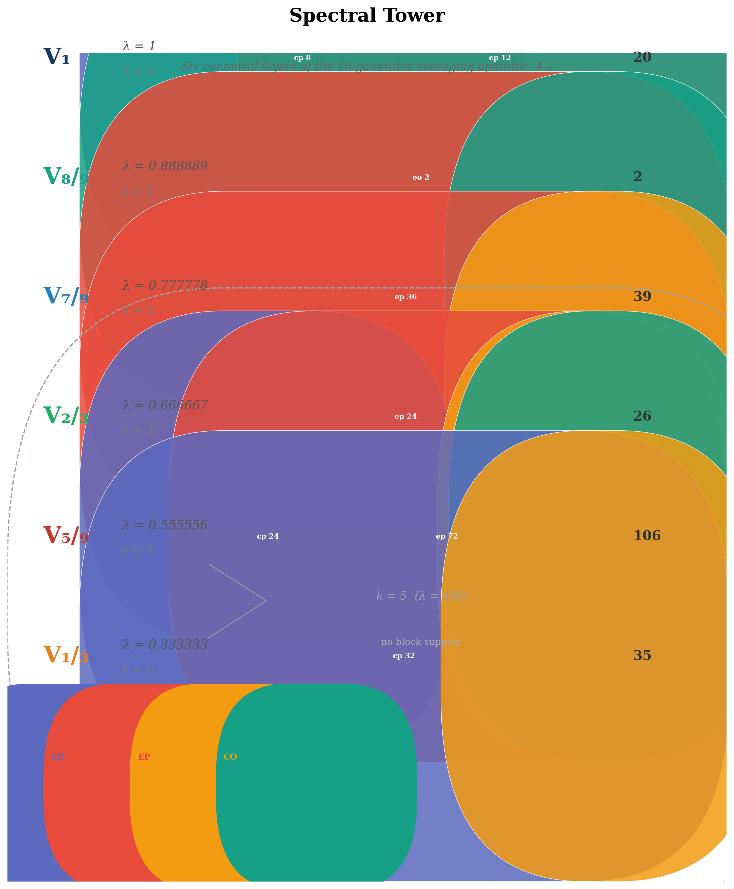
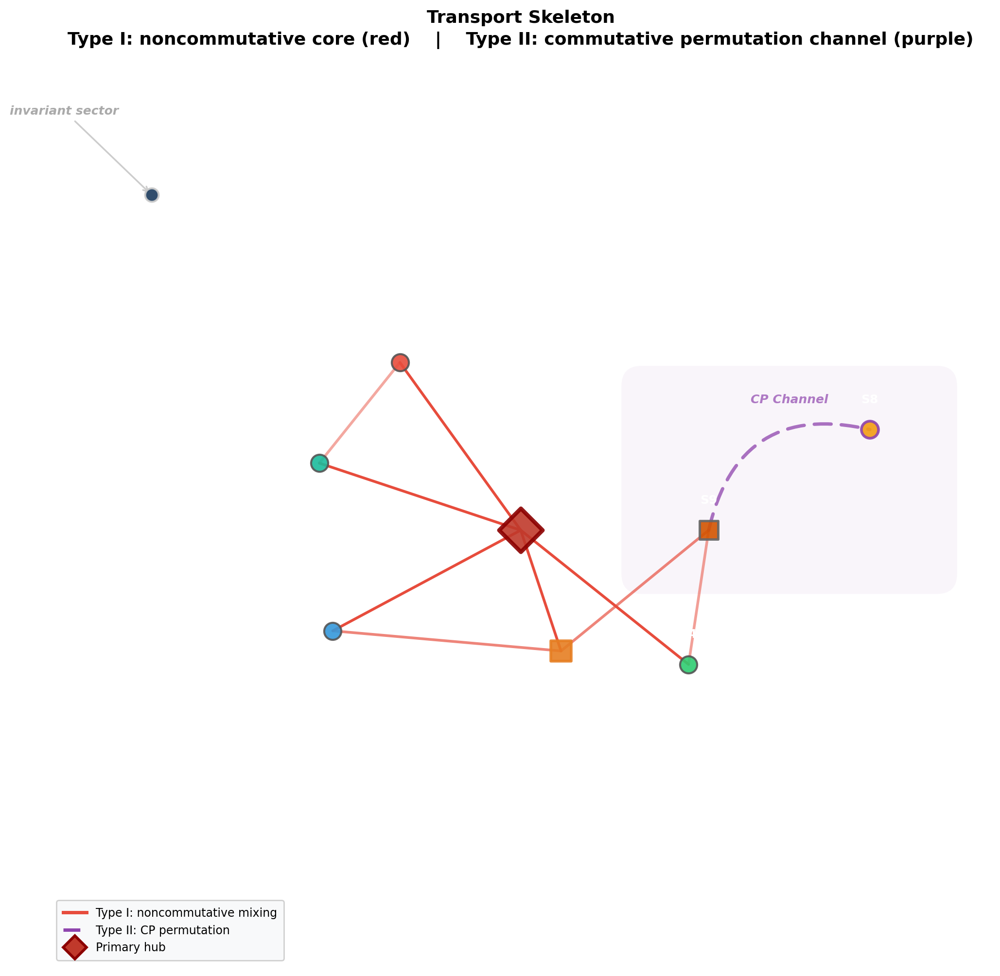
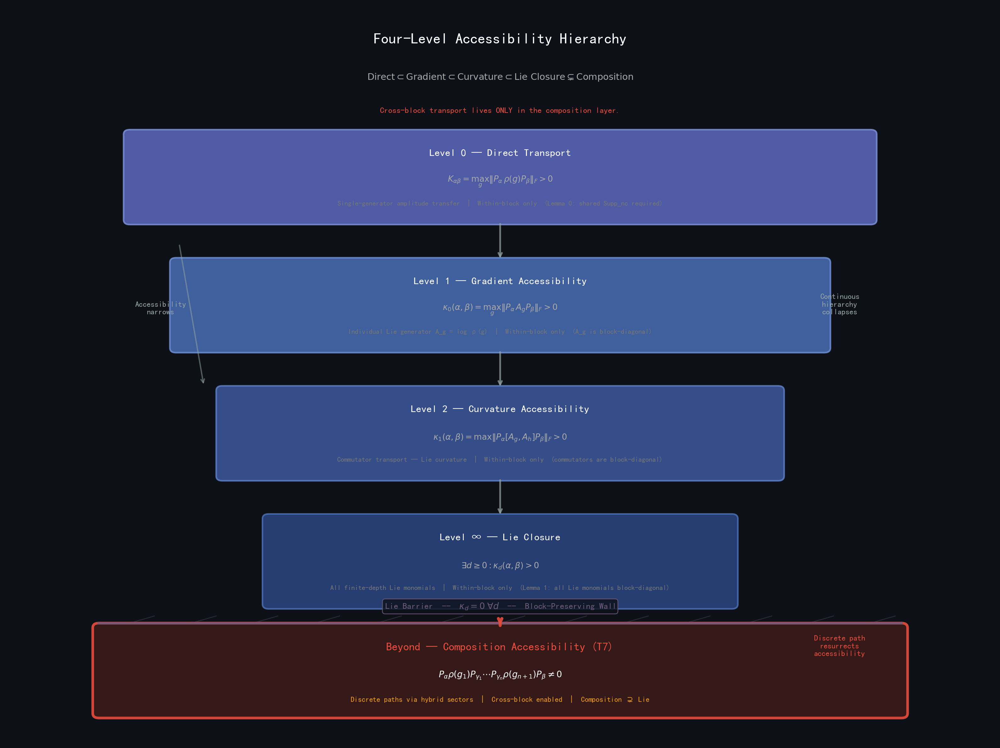
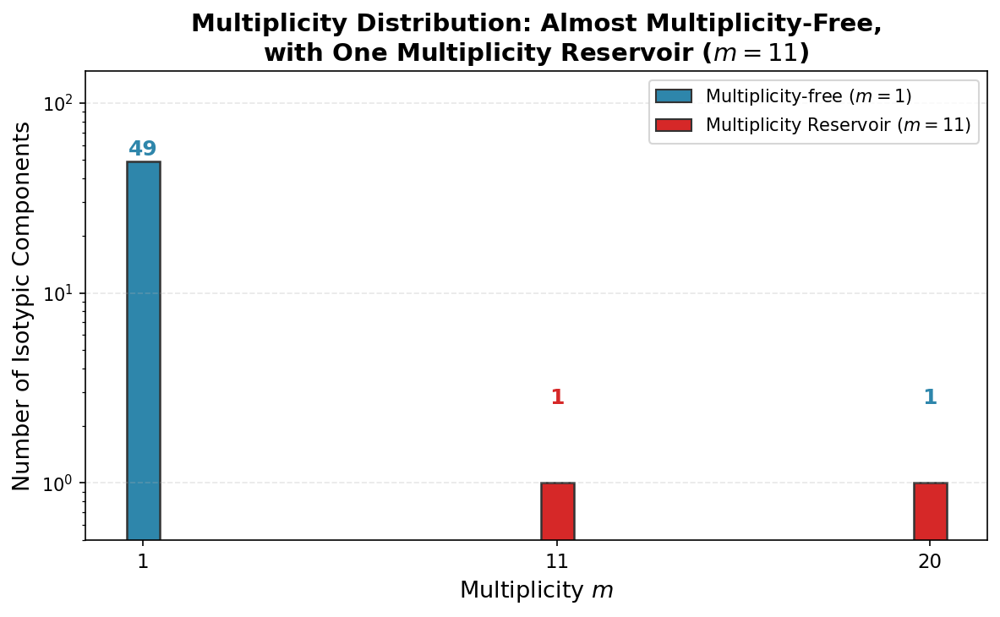

# RIME

**R**epresentation-theoretic spectral analysis of the Rub**I**k's Cube group — a **M**athematical **E**ngine for understanding how discrete symmetry controls dynamical accessibility.

---

## Core Results

<p align="center">
  
  
  
  
</p>

**Left to right:** The six rational spectral layers. Sparse transport skeleton between primitive sectors. Five-level accessibility hierarchy (L0–L4). Multiplicity distribution — 50 of 51 isotypic components are multiplicity-free; a single reservoir at $m=11$.

---

## Mathematical Objects

The 228-dimensional cubie representation of the Rubik's Cube group:

$$
\rho : G \to U(228), \qquad
A = \frac{1}{|S|}\sum_{s \in S} \rho(s), \qquad
\mathrm{Spec}(A) = \left\{1,\;\frac{8}{9},\;\frac{7}{9},\;\frac{2}{3},\;\frac{5}{9},\;\frac{1}{3}\right\}
$$

The averaging operator $A$ decomposes the representation into six spectral layers $V_\lambda = \operatorname{im}(P_\lambda)$. Further refinement by the center $\mathrm{Center}\{A, \mathrm{QT}_{\mathrm{all}}, \mathrm{HT}_{\mathrm{all}}\}$ yields nine primitive sectors. The full commutant $\mathrm{Comm}_G(V_\lambda)$ resolves 51 isotypic components — of which 50 are multiplicity-free. The single exception, $V_{5/9}^{(3,11)}$, is the *multiplicity reservoir* where all fibre-level transport concentrates.

---

## Core Discoveries

**Hybrid transport sectors.** Three of nine primitive sectors span multiple cubie-type blocks (edge-permutation + edge-orientation + corner-orientation). These hybrid sectors are the transport hubs — without them, cross-block connectivity collapses entirely.

**T7 mechanism.** Five sector pairs have zero direct transport ($K=0$), zero Lie gradient coupling ($\kappa_0=0$), and zero curvature coupling ($\kappa_1=0$), yet are reachable via 2-step discrete composition. The continuous (Lie) limit is structurally incomplete — it annihilates composition-only transport channels that exist at finite order. Minimal prototype: $S_3$ natural ⊕ regular, 9-dimensional.

**Multiplicity-fibre transport.** The representation is *almost multiplicity-free*. One isotypic component — $V_{5/9}$ with $d=3$, $m=11$ — carries the entire internal multiplicity structure. Its $11 \times 11$ multiplicity transfer matrix has full rank, 2.18 bits of entropy, and non-zero inter-copy dynamical coupling.

**N=2 negative control.** The pocket cube (corners only, 72-dimensional) has zero hybrid sectors and zero T7 pairs. The edge-permutation block — specifically its $M_2(\mathbb{C})$ Artin–Wedderburn components — is *necessary* for both phenomena. The $N=2$ system is the minimal T7-free model within the framework.

---

## Quick Start

```bash
pip install -e .
python experiments/t7_minimal.py
```

Requires Python ≥ 3.10, numpy, scipy, matplotlib. All experiments are self-contained — no data files, no precomputed caches.

| Script | Supports |
|--------|----------|
| `t7_minimal.py` | T7 Theorem — $S_3$ prototype (Paper III) |
| `n2_negative_control.py` | $N=2$ pocket cube — T7 absent without edge block |
| `transport_closure.py` | 84-check Lie accessibility hierarchy |
| `primitive_sectors.py` | 9 primitive sectors from joint diagonalization |
| `ep_algebra.py` | EP algebra $\cong M_2(\mathbb{C})^4 \oplus M_1(\mathbb{C})^4$ |
| `isotypic_decomposition.py` | 51 isotypic components + multiplicity reservoir |

---

## Papers

**[Paper I](paper/Paper%20I.md)** — Spectral origin. *Why is the spectrum rational?*
**[Paper II](paper/Paper%20II.md)** — Transport topology. *Why does the transport graph have its observed structure?*
**[Paper III](paper/Paper%20III.md)** — Lie accessibility. *Why can discrete composition beat the continuous limit?*
