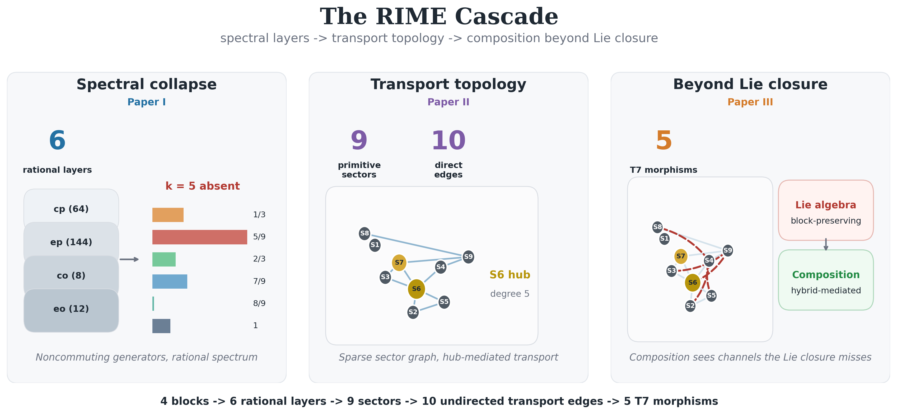

# RIME

**Representation-Theoretic Investigation of Mathematical Emergence**

[](https://doi.org/10.5281/zenodo.21108197)
[](https://doi.org/10.5281/zenodo.21127271)
[](https://doi.org/10.5281/zenodo.21152972)
[](https://doi.org/10.5281/zenodo.21154656)

This repository currently publishes the three-paper RIME trilogy, its
Computational Canonical Specification (CCS), and Papers IV--VI of the RIME
program.

The public trilogy release is archived on Zenodo as
[*The RIME Trilogy: Spectral, Transport, and Accessibility Structures in
Finite Group Representations*](https://doi.org/10.5281/zenodo.21108197).
Paper IV is archived separately as
[*Collision Geometry of Joint Spectra*](https://doi.org/10.5281/zenodo.21127271).
Paper V is archived separately as
[*Accessibility Repair Calculus*](https://doi.org/10.5281/zenodo.21152972).
Paper VI is archived separately as
[*Phase Transition Geometry on the Generator-Set Moduli Space*](https://doi.org/10.5281/zenodo.21154656).

The project studies spectral, transport, and Lie-accessibility structures arising from finite-group representations, using the 228-dimensional Rubik's Cube cubie representation as a canonical finite testbed.

The Rubik's Cube group is not used here as a solving problem. It is used as an explicit, highly noncommutative finite representation with rich internal block structure, making it a useful laboratory for studying how spectra, sector decompositions, transport tensors, and Lie-generated closures interact.

## Public Release Scope

The current public release contains:

- **Paper I**: spectral sector decomposition and rationality;
- **Paper II**: noncommutative transport topology;
- **Paper III**: Lie-generated versus compositional accessibility;
- **Paper IV**: fixed joint-spectral collision geometry;
- **Paper V**: local accessibility repair calculus for length-2 witnesses;
- **Paper VI**: generator-set deformation and accessibility-wall geometry;
- **CCS**: the computational specification supporting the trilogy.

Later research directions, including generic accessibility completion, are
active development notes. They are not part of the current public paper
release.

---

<p align="center">
  
</p>

<p align="center">
  <em>The RIME cascade: spectral layers, transport topology, and composition-only accessibility.</em>
</p>

---

## Start Here

| If you want to... | Start with |
|-------------------|------------|
| get the one-page project summary | [`docs/overview.md`](docs/overview.md) |
| read the papers in order | [`Paper I`](papers/paper1/Paper%20I.md) -> [`Paper II`](papers/paper2/Paper%20II.md) -> [`Paper III`](papers/paper3/Paper%20III.md) -> [`Paper IV`](papers/paper4/Paper%20IV.md) -> [`Paper V`](papers/paper5/Paper%20V.md) -> [`Paper VI`](papers/paper6/Paper%20VI.md) |
| check the canonical numerical data | [`ccs/canonical_specification.md`](ccs/canonical_specification.md) |
| understand the public trilogy scope | [`docs/PAPER_SCOPE.md`](docs/PAPER_SCOPE.md) |
| inspect the core mathematical invariants | [`docs/CORE_INVARIANTS.md`](docs/CORE_INVARIANTS.md) |
| reproduce the main computations | [`tests/run_all_tests.py`](tests/run_all_tests.py), [`experiments/`](experiments/) |

## Reading Path

1. [`docs/overview.md`](docs/overview.md) - a one-page external-facing summary.
2. [`papers/paper1/Paper I.md`](papers/paper1/Paper%20I.md) - spectral decomposition and rationality.
3. [`papers/paper2/Paper II.md`](papers/paper2/Paper%20II.md) - transport topology between primitive sectors.
4. [`papers/paper3/Paper III.md`](papers/paper3/Paper%20III.md) - Lie-generated accessibility versus discrete composition.
5. [`papers/paper4/Paper IV.md`](papers/paper4/Paper%20IV.md) - collision geometry of the QT/HT joint spectrum.
6. [`papers/paper5/Paper V.md`](papers/paper5/Paper%20V.md) - accessibility repair calculus for length-2 witnesses.
7. [`papers/paper6/Paper VI.md`](papers/paper6/Paper%20VI.md) - generator-set deformation and accessibility walls.
8. [`ccs/canonical_specification.md`](ccs/canonical_specification.md) - canonical data, controls, figures, and verification details.

## Papers

| Component | Source | Main question |
|-----------|--------|---------------|
| Paper I | [`papers/paper1/Paper I.md`](papers/paper1/Paper%20I.md) | Why does the averaging operator have a rational six-layer spectrum? |
| Paper II | [`papers/paper2/Paper II.md`](papers/paper2/Paper%20II.md) | Why does the nine-sector transport graph have its observed sparse structure? |
| Paper III | [`papers/paper3/Paper III.md`](papers/paper3/Paper%20III.md) | Why can discrete composition create channels invisible to Lie-generated accessibility? |
| Paper IV | [`papers/paper4/Paper IV.md`](papers/paper4/Paper%20IV.md) | Why are the six spectral layers a collision quotient of a nine-point joint spectrum? |
| Paper V | [`papers/paper5/Paper V.md`](papers/paper5/Paper%20V.md) | What repairs binary support after path-commutator cancellation? |
| Paper VI | [`papers/paper6/Paper VI.md`](papers/paper6/Paper%20VI.md) | How do spectral phases and accessibility data bifurcate under generator variation? |
| CCS | [`ccs/canonical_specification.md`](ccs/canonical_specification.md) | Which numerical objects, figures, stability checks, and claim dependencies are canonical? |

The public papers form a dependency chain:

```text
spectral projector geometry
        -> transport topology
        -> Lie-generated vs compositional accessibility
        -> joint-spectral collision geometry
```

The unified structural theme is that projector-mediated composition can create accessibility structures that are not captured by the Lie algebra generated from the same representation.

Papers I-III study this phenomenon at the spectral, transport, and
accessibility levels respectively. Paper IV begins the post-trilogy geometric
line by showing that the six spectral layers are the collision quotient of a
nine-point QT/HT joint spectrum.

## Main Objects

The central operator in Paper I is the generator average

```text
A = (1 / |S|) sum_{s in S} rho(s),
```

where `S` is the standard 18 face-turn generator set and `rho` is the unitary cubie representation. In the canonical computation,

```text
Spec(A) = {1, 8/9, 7/9, 2/3, 5/9, 1/3}.
```

The representation decomposes into four physical blocks:

| Block | Dimension | Meaning |
|-------|-----------|---------|
| `cp` | 64 | corner permutation |
| `ep` | 144 | edge permutation |
| `co` | 8 | corner orientation |
| `eo` | 12 | edge orientation |

The canonical center decomposition yields nine primitive sectors. Paper II studies transport between these sectors via

```text
K_{alpha,beta} = max_g || P_alpha rho(g) P_beta ||.
```

Paper III compares discrete composition with the Lie algebra generated by

```text
A_g = log rho(g).
```

The key observation is that discrete composition can create accessibility channels that remain invisible to the Lie-generated closure. In the Rubik representation, the canonical computation identifies five T7 morphisms: cross-block compositional channels with no direct transport and no Lie-generated accessibility at depth 0 or 1, with higher-depth obstruction following from block support.

## What This Repository Is Not

This is not a cube-solving repository. It does not implement or study:

- Kociemba's algorithm,
- pruning tables,
- search heuristics for solving scrambles,
- sticker rendering,
- neural-network solvers.

The cube is used as a finite representation-theoretic testbed.

## Repository Structure

```text
rime-lite/
|-- rime/                 core representation and spectral computation
|-- experiments/          reproducibility scripts, diagnostics, and figures
|   |-- paper1/           Paper I support scripts
|   |-- paper2/           Paper II / Paper IV joint-spectral support scripts
|   |-- paper3/           Paper III support scripts
|   |-- paper4/           Paper IV collision-geometry support scripts
|   |-- paper5/           Paper V accessibility-repair support scripts
|   |-- paper6/           Paper VI active support scripts
|   |   `-- archive/      historical Paper VI exploratory scripts only
|   |-- paper7/           active development scripts for generic completion
|   `-- cross_ref/        related-work diagnostics, not theorem sources
|-- tests/                invariant checks, plain Python assertions
|-- papers/
|   |-- paper1/           Paper I markdown source
|   |-- paper2/           Paper II markdown source
|   |-- paper3/           Paper III markdown source
|   |-- paper4/           Paper IV markdown source
|   |-- paper5/           Paper V markdown source
|   |-- paper6/           Paper VI markdown source
|   |-- paper7/           active development draft
|   `-- tex/              PDF build pipeline and shared bibliography
|-- ccs/                  Computational Canonical Specification source
|-- figures/              frozen generated figures used by papers
`-- docs/                 project overview, invariants, scope, conventions
```

Important documents:

- `docs/overview.md` - one-page project overview.
- `docs/CORE_INVARIANTS.md` - six core structural invariants.
- `experiments/README.md` - experiment map and support-script guide.
- `ccs/canonical_specification.md` - canonical numerical and methodological supplement.

Additional program notes may exist under `docs/`, but the public release entry
point is Papers I--VI plus CCS listed above.

Paper-specific support scripts live under `experiments/paperN/`.
`experiments/paper6/archive/` is provenance only, not part of the canonical
Paper VI reproducibility suite.

## Navigation by Task

| Task | File or directory |
|------|-------------------|
| construct the representation | [`rime/cubie.py`](rime/cubie.py), [`rime/cubieoperator.py`](rime/cubieoperator.py) |
| compute spectral layers and projectors | [`rime/cubieoperator.py`](rime/cubieoperator.py), [`experiments/paper1/spectral_ladder.py`](experiments/paper1/spectral_ladder.py) |
| inspect primitive sectors | [`experiments/paper2/primitive_sectors.py`](experiments/paper2/primitive_sectors.py) |
| inspect transport topology | [`experiments/paper2/transport_graph.py`](experiments/paper2/transport_graph.py) |
| inspect noncommutative support | [`experiments/paper2/supp_nc.py`](experiments/paper2/supp_nc.py) |
| inspect T7 morphisms | [`experiments/paper3/t7_detection.py`](experiments/paper3/t7_detection.py) |
| reproduce Paper IV collision geometry | [`experiments/paper4/`](experiments/paper4/) |
| reproduce Paper V accessibility repair | [`experiments/paper5/`](experiments/paper5/) |
| reproduce Paper VI deformation tables | [`experiments/paper6/`](experiments/paper6/) |
| run fast invariant checks | [`tests/run_all_tests.py`](tests/run_all_tests.py) |
| run slow verification checks | [`tests/run_slow_tests.py`](tests/run_slow_tests.py) |
| find generated figures | [`figures/`](figures/) |

## Reproducibility

Install the package in editable mode:

```bash
pip install -e .
```

Run the fast invariant test suite:

```bash
python tests/run_all_tests.py
```

Run the slower verification suite:

```bash
python tests/run_slow_tests.py
```

Validate notation and canonical numerical registry entries:

```bash
python papers/validate_registry.py
```

Representative experiment scripts:

```bash
python experiments/paper1/spectral_ladder.py
python experiments/paper2/primitive_sectors.py
python experiments/paper3/t7_detection.py
python experiments/paper4/rubik_collision_quotient.py
python experiments/paper5/matrix_nondegeneracy.py
python experiments/paper6/tangent_commutator_map.py
```

All numerical claims in the papers are intended to be traceable to explicit tests, experiment scripts, or CCS tables.

## Current Canonical Values

| Quantity | Canonical value |
|----------|-----------------|
| representation dimension | 228 |
| physical blocks | `cp`, `ep`, `co`, `eo` |
| spectral layers | 6 |
| primitive sectors | 9 |
| direct transport edges (undirected) | 10 |
| T7 morphisms, Rubik `N=3` | 5 |
| T7 morphisms, pocket cube `N=2` | 0 |
| isotypic components | 51 |
| multiplicity reservoir | one component |

## Claim-Status Discipline

The papers distinguish:

- proved structural statements,
- computationally verified canonical numerical statements,
- observed patterns across tested systems,
- exploratory evidence and open generalizations.

The broader goal is to understand which observed structures are representation-specific and which reflect more general phenomena in finite-dimensional noncommutative representations.

## Requirements

Python 3.10 or newer is recommended.

Core Python dependencies:

- `numpy`
- `scipy`
- `matplotlib`
- `joblib` (optional cache acceleration; pickle fallback exists)

## License

Code: MIT License. See [`LICENSE`](LICENSE).

Papers and manuscript sources: Creative Commons Attribution 4.0 International (CC BY 4.0). See [`LICENSE-PAPERS`](LICENSE-PAPERS).

## Citation

```bibtex
@article{rime-trilogy,
  title  = {The RIME Trilogy: Spectral Sector Decomposition,
            Noncommutative Transport Topology, and Accessibility Structure
            in the Rubik's Cube Representation},
  author = {Chen, WuJun},
  year   = {2026},
  note   = {Three-paper series with unified computational supplement}
}
```
