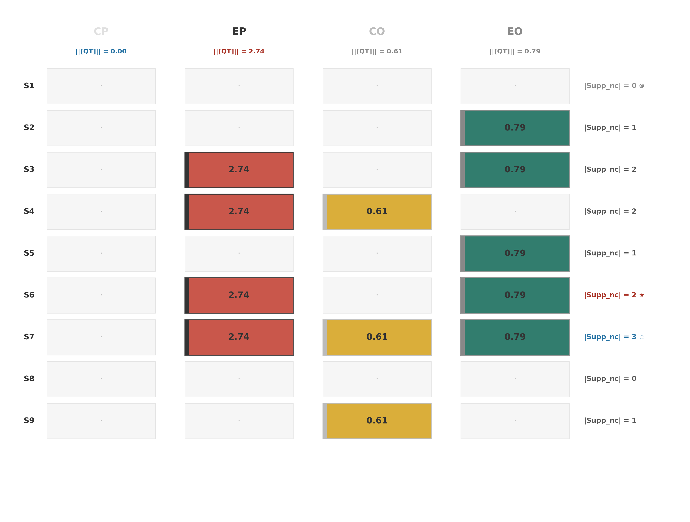
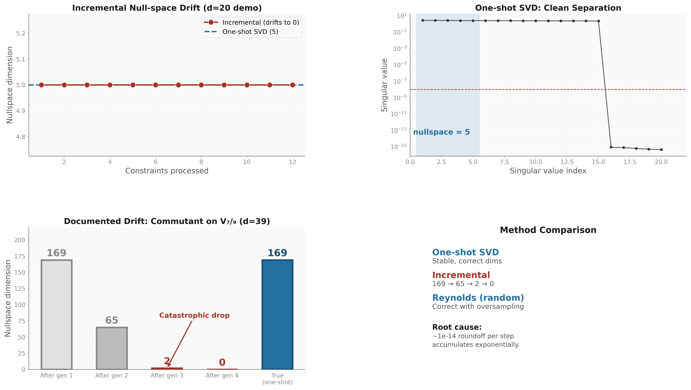
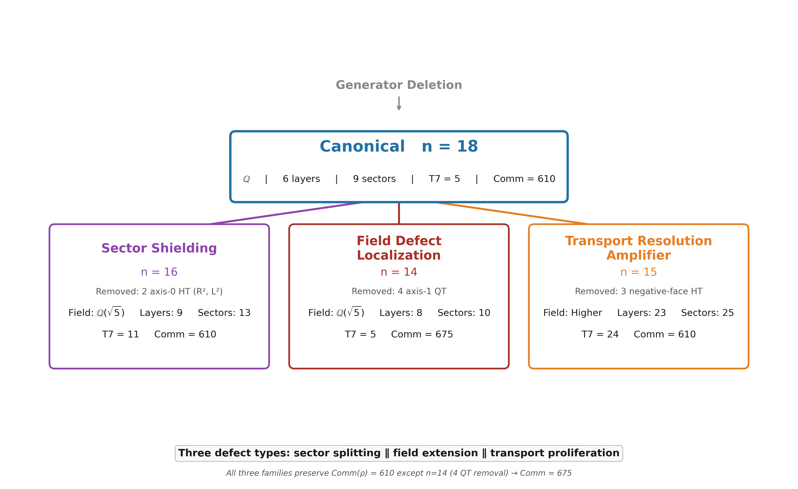

# RIME Computational Companion Archive

### Versioned Reproducibility Data, Computational Observations, Open Problems, and Historical Records

**Alias**: CCS v2 (Computational Companion and Status Archive)
**Version**: 2.0
**Date**: 2026-07-27
**Document type**: Versioned non-paper computational companion archive
**Status**: Published as version 2.0 at DOI `10.5281/zenodo.21616956`;
concept DOI `10.5281/zenodo.21108196`.

**WuJun Chen**<sup>∗</sup>

Independent Researcher, China
Email: dooven@outlook.com

<sup>∗</sup> Code, companion archive, and experiment scripts:
[RIME repository](https://github.com/dooven-prime/rime-lite)

***

> **Archive boundary.** This archive is optional human-readable research
> companion material. Papers I, II, and III are mathematically self-contained
> and do not rely on it as a premise, definition source, executable
> certificate, or claim authority. It is not a paper, theorem source, semantic
> authority, or prerequisite for those papers. Mathematical claims must be
> cited from the corresponding papers. The archive preserves reproducibility
> data, computational observations, open conjectures, and versioned historical
> records with explicit status labels. Executable certificates are controlled
> by their declared scripts and structured artifacts; corrections affecting
> interpretation are recorded in `HISTORY.md`.

### Independent Paper Navigation

The entries below are navigation records, not a dependency chain. Papers I,
II, and III have independent Zenodo records.

| Paper | Independent title | Repository | Separate Zenodo DOI |
|-------|-------------------|------------|---------------------|
| I | *Spectral Sector Decomposition in the Rubik's Cube Representation: Block Spectral Structure and a Conditional Rationality Criterion* | [PDF](../papers/paper1/paper1_arxiv.pdf), [source](../papers/paper1/Paper%20I.md), BibTeX `paper1` | [10.5281/zenodo.21571403](https://doi.org/10.5281/zenodo.21571403) |
| II | *Noncommutative Transport Topology in the Rubik's Cube Representation: Sector Non-Invariance, Direct Support, and Transport Channels* | [PDF](../papers/paper2/paper2_arxiv.pdf), [source](../papers/paper2/Paper%20II.md), BibTeX `paper2` | [10.5281/zenodo.21581072](https://doi.org/10.5281/zenodo.21581072) |
| III | *Support-Graph Reachability and Matrix-Composition Obstructions: Image--Kernel Mismatch with a Rubik-Cube Case Study* | [PDF](../papers/paper3/paper3_arxiv.pdf), [source](../papers/paper3/Paper%20III.md), BibTeX `paper3` | [10.5281/zenodo.21583070](https://doi.org/10.5281/zenodo.21583070) |

The immutable combined-release DOI
[10.5281/zenodo.21108197](https://doi.org/10.5281/zenodo.21108197) remains
historical provenance. It does not define the current Paper I--III
architecture and must not be reused as the CCS v2 DOI.
That historical combined package is a provenance record only.

> **Paper II v2 routing.** The Paper II theorem spine is the exact
> Transport--Non-Invariance Identity and direct block-locality theorem. The
> nine-sector registration, ten-edge graph, Type I/II labels, and EP algebra
> census are computational certificates. Block-level
> $\operatorname{Supp}_{\mathrm{nc}}$ is the family-level maximum over all
> three per-axis QT commutator pairs and is only a candidate localizer: its 15
> overlap pairs contain the nine Type I labelled edges and six nonedges.
> It is not a sufficient transport criterion.
> Generator-family field tables, S3 negative controls, full EP algebra tables,
> and auxiliary figures remain CCS material and are not manuscript premises.

### Reproducibility Architecture

The repository uses four separated layers:

| Layer | Name | Files | Role | Rule |
|-------|------|-------|------|------|
| **1** | Papers | `papers/paper*/` | Claim | Self-contained theorem, certificate, observation, and research-program boundaries. |
| **2** | Executable artifacts | `experiments/paper*/`, `results/` | Certify | Declared scripts, parameters, hashes, residuals, and structured outputs. |
| **3** | CCS v2 | `ccs/canonical_specification.md` | Review | Human-readable extended data, observations, open questions, and selected history. |
| **4** | Private raw archive | not distributed | Preserve | Giant matrices, abandoned runs, and exploratory provenance. |

CCS v2 is not a copy of the raw archive and does not replace executable
artifacts. It is a curated review layer. The papers state their claims, the
declared scripts and structured artifacts certify finite computations, and
`HISTORY.md` records corrections that affect interpretation.

***
### Navigation and Citation Boundary

> Papers I--III do not cite CCS v2 as a scholarly or mathematical authority.
> Internal part, table, and figure labels below are navigation aids for this
> archive only. Paper III numerical claims are defined by its own manuscript
> and matrix certificate.

**Internal part references.** Archive-local links use Roman numeral prefixes:

| Prefix | Scope | Example |
|--------|-------|---------|
| `CCS Part 0` | Global Reference Map (notation tables, terminology) | `(CCS Part 0)` |
| `CCS Part 0.5` | Canonical API Surface | `(CCS Part 0.5)` |
| `CCS-I` | Part I — Core Numerical Structures (§1, §2) | `(CCS-I §2.1)` |
| `CCS-II` | Part II — Extended Computational Observations (§II.1–II.4) | `(CCS-II §II.4)` |
| `CCS-III` | Historical derivation index; excluded from the release PDF | source provenance only |
| `CCS Appendix X` | Appendices A–F | `(CCS Appendix F)` |

**Section numbering.** Part I uses §1.x (spectral objects) and §2.x (numerical
data). Part II uses §II.1–II.4 for extended observations. The historical Part
III numbering is retained in source provenance only. Appendix subsections use
letter prefixes (§A.1, §B.1, §E.1, §F.1).

**Tables and figures.** `(CCS Table C3)`, `(CCS Fig. C1)` — figures are
captioned where they appear. Historical images are repository provenance and
are not separately indexed in this release.

The Terminology Convention at the end of Part 0 defines the four canonical terms: QT/HT joint-spectral sector, hybrid sector, transport-active, canonical sectorization.

***
### Archive Status Tags

Every retained item must carry one of the following statuses in context:

| Status | Meaning |
|--------|---------|
| **Theorem / exact derivation** | Finite mathematical statement proved under explicit hypotheses; the independent paper remains the preferred citation. |
| **Computational certificate** | Declared realization, dtype, tolerance, algorithm, artifact, and reproducible script are available. |
| **Computational observation** | Finite pattern or numerical recognition without a full promotion certificate. |
| **Research program** | Conjecture, proposed hierarchy, genericity question, or future experiment. |
| **Historical / withdrawn** | Provenance only; excluded from the PDF or displayed with an explicit historical warning. |

### Box Conventions

Callout boxes separate exact statements, registered data, warnings, and
provisional findings. Their labels describe archive status; they do not make
CCS v2 an independent claim authority:

| Box | Style | Purpose |
|-----|-------|---------|
| **Theorem / Lemma / Corollary / Definition** | Blockquote `>` with bold label | Formal mathematical statement. Proofs appear inside the box, set off with *Proof.* or *Proof sketch.* |
| **Registered** | Blockquote `>` with **Registered.** label | Finite data tied to a declared computational realization. |
| **Warning** | Blockquote `>` with **Warning.** label | Important constraint, pitfall, or normative requirement (SHALL/MUST). Non-negotiable. |
| **Exploratory** | Blockquote `>` with **Exploratory.** label | Observation, conjecture, or research-program item subject to revision. |

## Executive Guide

This guide provides the shortest reliable reading path through the archive.
The subsequent sections preserve tables, implementation context, figures, failed
candidates, and research history. They do not enlarge the claims of the
independent papers.

### Current Finite Records

| Record | Current status | Owning source |
|--------|----------------|---------------|
| Six displayed averaging layers with dimension census `(20,2,39,26,106,35)` | Computational observation; exact and conditional statements are separated in Paper I | Paper I and `experiments/paper1/validation/` |
| Nine registered QT/HT joint-spectral sectors | Numerical registration on the declared complex128 realization | Paper II and `experiments/paper2/validation/` |
| Symmetric ten-edge direct graph with degree sequence `(0,2,2,2,2,5,3,1,3)` | Computational certificate | Paper II |
| Fifteen noncommutative-support candidates: nine Type I edges and six nonedges | Computational certificate; the localizer is not sufficient | Paper II |
| EP algebra census: four $M_2(\mathbb C)$ components and four scalar components | Computational certificate supported by the finite-dimensional unital $*$-algebra argument | Paper II |
| Five support-graph paths whose evaluated projected products are machine-zero | Computational certificate with image--kernel/block obstruction interpretation | Paper III |

These five declared two-step support-graph paths form the finite Paper III
composition-obstruction audit.

### Promotion Boundaries

- Numerical QT/HT commutation and clustering do not prove an exact labelled
  joint spectral resolution.
- Numerical recognition of rational or quadratic values does not determine an
  exact spectral field.
- A direct-support path does not guarantee a nonzero routed matrix product.
- A routed product does not automatically determine a full word,
  commutator, or Lie depth.
- Ambient incidence codimension is a benchmark, not the codimension of a
  representation-derived pullback.

### Research Seeds Preserved Here

The archive retains three concrete promotion targets: exact QH algebra
registration; exact characteristic/minimal-polynomial certificates for
generator-family arithmetic contrasts; and structured pullback geometry for
representation-derived incidence. Earlier T7, commutant-restriction,
completion, search, and spectral-triple narratives are historical records
only.

**Part 0 — Global Reference Map**

***
## Part 0 — Global Reference Map

**Purpose.** Human-readable lookup for registered Paper I--II numerical
objects, implementation locations, and shared Rubik notation. The independent
papers define their own mathematical objects and claims locally.

**How to use.** For any symbol or concept name, use column 3 to locate the
paper definition or the archive record and column 4 to identify its scope.
Paper definitions control mathematical meaning; archive entries provide data
and provenance only.

**Registered default.** Unless otherwise stated, the archived nine-sector
decomposition is the numerical joint-spectral registration associated with
$$\mathcal B_{\mathrm{QH}}=\operatorname{alg}(A_{18},\mathrm{QT}_{\mathrm{all}},\mathrm{HT}_{\mathrm{all}})=\operatorname{alg}(\mathrm{QT}_{\mathrm{all}},\mathrm{HT}_{\mathrm{all}}),$$
where $A_{18}=(2/3)\mathrm{QT}_{\mathrm{all}}+(1/3)\mathrm{HT}_{\mathrm{all}}$.
The displayed algebraic interpretation is conditional on exact
commuting-Hermitian registration. Sectorizations involving auxiliary block
projectors (e.g. $P_{\text{nat}}$) are separate declared realizations.

### Layer A — Static Spectral Structure (Paper I)

Core object: $A = \frac{1}{|S|}\sum_{g \in S} \rho(g)$

| Symbol | Concept | First Defined | Used In |
|--------|---------|--------------|---------|
| $\rho: G \to \mathrm{GL}(228,\mathbb{C})$ | Rubik's cube representation | Paper I §2 | I, II, III |
| $V = V_{\mathrm{cp}} \oplus V_{\mathrm{ep}} \oplus V_{\mathrm{co}} \oplus V_{\mathrm{eo}}$ | Block decomposition ($64+144+8+12=228$) | Paper I §3.4 | I, II, III |
| $\mathrm{cp}, \mathrm{ep}, \mathrm{co}, \mathrm{eo}$ | Four invariant blocks | Paper I §2 | I, II, III |
| $A = \frac{1}{|S|}\sum_{s \in S} \rho(s)$ | Averaging operator | Paper I §2 | I, II, III |
| $V_\lambda$, $\lambda = 1 - k/9$ | Canonical layers (6), eigenvalue form | Paper I §3 | I, II, III |
| $k \in \{0,1,2,3,4,6\}$ | Admissible $k$-set (6 values, $k=5$ vacant) | Paper I §3, §7.3 | I, II, III |
| $P_\lambda^A$ | Orthogonal projector onto the $A$-eigenspace $V_\lambda^A$ | Paper I §3.1 | I, II |
| $\mathcal{K}(A) = \bigcup_B \mathcal{K}_B$ | Blockwise $k$-set union formula | Paper I §7.3 | I |
| $\chi_\lambda(s) = \operatorname{Tr}(P_\lambda \rho(s))$ | Eigenspace trace | Paper I §3.1 | I |
| $\omega + \omega^2 + 1 = 0$ | $\mathbb{Z}_3$ phase cancellation | Paper I §4.1, §7.1 | I |
| $h_i = \frac{1}{2}(\rho(g_i) + \rho(g_i^{-1}))$ | Per-generator Hermitian average | Paper I §7.2 | I |
| $V=\bigoplus_\mu V^{(\mu)}$, $C_\mu$ | Ambient $G$-isotypic decomposition and its central projectors; distinct from the $A$-spectral decomposition | Paper I App B | I |
| $\operatorname{Tr}(P_\lambda^A C_\mu P_\lambda^A)$ | Ambient-isotypic overlap mass; not a subrepresentation multiplicity unless the projectors commute | Paper I App B | I |
| $O$, $U_R$ | Registered orientation-preserving cubic rotation action commuting numerically with $A$; distinct from transport by $G$ | Paper I §4, App B | I |
| $\dim\operatorname{End}_G(V)=610$ | Candidate ambient-commutant dimension; unpromoted pending exact certificate | CCS legacy §2.8 | provenance only |

### Layer B — Discrete Transport Structure (Paper II)

Core object: $K^S_{\beta\alpha} = \max_{s\in S} \|Q_\beta \rho(s) Q_\alpha\|_F$

| Symbol | Concept | First Defined | Used In |
|--------|---------|--------------|---------|
| $S1$–$S9$ | Nine numerically registered QT/HT joint-spectral sectors | Paper II §2 | II, III |
| $\mathcal B_{\mathrm{QH}}=\operatorname{alg}(A, \mathrm{QT}_{\mathrm{all}}, \mathrm{HT}_{\mathrm{all}})$ | Conditional exact algebra associated with the numerically commuting QT/HT registration; not identified with the full group commutant | Paper II §2 | II, III |
| $\mathrm{QT}_{\mathrm{all}}$, $\mathrm{HT}_{\mathrm{all}}$ | Quarter-turn / half-turn total averages | Paper II §2 | II, III |
| $Q_\alpha$ | QT/HT joint-spectral sector projector; not assumed $G$-invariant | Paper II §2 | II, III |
| $K^S_{\beta\alpha} = \max_{s\in S} \|Q_\beta \rho(s) Q_\alpha\|_F$ | Direct generator-transport norm | Paper II §3.1 | II, III |
| $\operatorname{Supp}_{\mathrm{nc}}(\alpha)$ | Thresholded family-level block localizer using the maximum over all three per-axis QT commutator pairs; Type I labels require overlap by definition, but overlap is not sufficient | Paper II §4 | II |
| $\|[\mathrm{QT}^0, \mathrm{QT}^1]\|_b$ | Per-block QT commutator norm | Paper II §4.2 | II, III |
| $\mathrm{QT}^a$ ($a \in \{0,1,2\}$) | Per-axis quarter-turn averaging operators | Paper II App A | II, III |
| Type I / Type II transport | Post-certification labels for the nine shared-noncommutative-support edges and the one CP exception; not universal sufficient criteria | Paper II §4 | II |
| $\mathrm{CP}$ permutation channel | Registered S8$\leftrightarrow$S9 Type II edge ($K=2.83$) | Paper II §4 | II |
| $A_{\mathrm{EP}} \cong M_2(\mathbb{C})^4 \oplus M_1(\mathbb{C})^4$ | Computational EP block algebra census (20-dimensional with 8-dimensional center) | Paper II §4 | II |
| QH refinement boundary | Conditional minimality only inside the declared commuting QH algebra; no global maximal-refinement theorem | Paper II §5 | II |
| Hub pattern | Sparse ten-edge graph with unique degree-five hub S6; the graph is not a star | Paper II §3.4 | II, III |
| S1 isolation | Machine-zero off-diagonal direct transport in the canonical audit; exact $G$-invariance remains unproved | Paper II §4 | II |
| Generator-family comparison | Extended computational census retained in CCS; not part of the Paper II theorem spine | CCS Part II | CCS only |
| $T_{\beta\alpha}(g) = Q_\beta \rho(g) Q_\alpha$ | Generator transport block from source $\alpha$ to target $\beta$ | Paper II §3.1 | II, III |
| $\sum_{\beta\ne\alpha}\|T_{\beta\alpha}(g)\|_F^2=\frac12\|[\rho(g),Q_\alpha]\|_F^2$ | Off-diagonal transport--non-invariance identity | Paper II Prop. 3.5 | II, III |

### External Independent Paper III

The independent Paper III defines its support graph, projected composition
operators, image--kernel obstruction, local promotion criteria, and Rubik
matrix certificate in its own manuscript. The CCS does not define, number, or
certify that theorem spine.

<!-- Historical object map excluded from the current CCS output.

| Symbol | Concept | First Defined | Used In |
|--------|---------|--------------|---------|
| $\Gamma_S$ | Direct support graph defined by nonzero $Q_i\rho(s)Q_j$ blocks | Paper III T1 | II, III |
| $\mathcal C_{ikj}(g_2,g_1)$ | Projected two-step composition $Q_i\rho(g_2)Q_k\rho(g_1)Q_j$ | Paper III T3 | III |
| Composition graph | Endpoint relation certified by a nonzero projected product | Paper III T3 | III |
| Image--Kernel Criterion | $\operatorname{im}(Q_k\rho(g_1)Q_j)\subseteq\ker(Q_i\rho(g_2)Q_k)$ is equivalent to zero composition for fixed witnesses | Paper III Theorem C | III |
| Disjoint Endpoint Block-Support Obstruction | Block-preserving maps and block-diagonal projectors cannot connect disjoint endpoint block supports | Paper III Theorem D | III |
| Canonical five witnesses | Five support-graph paths with order-one edge maxima and machine-zero projected products | Paper III Proposition E; CCS §2.5 | III |
| Promotion Problem | Additional hypotheses under which graph reachability implies nonzero composition | Paper III Open Problem F; formerly T7 | III |
| First-version $\kappa_d$/T7 diagnostics | Archived provenance; not support for the revised theorem spine | CCS legacy §§2.3--2.7, Part III | provenance only |

-->

### Prototypes, Controls, and Cross-Cutting

| Symbol | Concept | First Defined | Used In |
|--------|---------|--------------|---------|
| S₃ nat$\oplus$reg (9-dim) | Archived first-version sector-invariance control; not matrix-composition evidence | excluded source provenance | provenance only |
| S₃ reg$\oplus$reg (12-dim) | Archived first-version sector-invariance control; not matrix-composition evidence | excluded source provenance | provenance only |
| N=2 pocket cube (72-dim) | Archived first-version graph/kappa control; not matrix-composition evidence | CCS legacy control | provenance only |
| Archived S1–S6 summaries | First-version empirical summaries; current status is determined item by item | CCS legacy §II.5 | archive only |
| Cross-paper comparison path | Spectral sectors → direct support graph → projected composition audit | Independent Papers I--III | comparison only |
| Canonical layer keys | $\lambda = 1-k/9$: $[1, 8/9, 7/9, 2/3, 5/9, 1/3]$ | CCS Part 0.5 | I, II, III |
| $m = |S|/2$ | Effective generator count | Paper I §7.3 | I |
| Face-symmetric / symmetry-broken | Generator family classification | Paper I §7.4 | I, II |
| Registered arithmetic contrast | Historical generator-family scans with values numerically recognized in $\mathbb{Q}$ or $\mathbb{Q}(\sqrt{5})$ | CCS Part II | archive only |

### Terminology Convention

| Term | Definition |
|------|------------|
| **QT/HT joint-spectral sector** | One of the nine numerical joint-spectral clusters registered from the declared QT/HT averages. Under exact commuting-Hermitian registration, these become the joint spectral subspaces associated with primitive spectral idempotents of the generated commutative algebra. |
| **hybrid sector** | A QT/HT joint-spectral sector whose projector has nonzero support on more than one block. There are 6 hybrid sectors: S1 (cp+ep), S3 (ep+eo), S4 (ep+co), S6 (ep+eo), S7 (cp+ep+co+eo), S9 (cp+co). S7 is the unique all-block hybrid spanning all four blocks. |
| **transport-active** | A sector pair $(\alpha, \beta)$ is transport-active if $K_{\alpha\beta} > 0$ (non-zero one-step transport). All 10 direct edges are block-preserving. |
| **registered QH sectorization** | The nine-sector numerical decomposition obtained from the declared QT/HT pair. Exact commutation is a hypothesis for the corresponding algebraic joint-resolution statement. It is not a full-$G$ commutant decomposition. |

**Geometric & move conventions** (coordinate system, cubie ordering, generator encoding, action direction, block decomposition, numerical tolerances) are maintained in `docs/conventions.md`.

***
**Part 0.5 — Registered API Surface**

***
## Part 0.5 — Registered API Surface

**Purpose.** Record the current mapping between mathematical notation,
computational interfaces, and archived numerical outputs. This section answers
which implementation produced a value; it does not make that implementation a
mathematical definition.

**Scope.** Functions listed here are the registered v2 implementation entry
points. Alternative implementations may be used when their conventions,
parameters, and comparison residuals are declared.

**Dependencies.** `rime.cubieoperator.CubieSpectralOperator` (primary), `rime.cubie.CubieMove` (generator enumeration), `rime.spectral_utils` (S₃ negative controls, joint diagonalization helpers).

**Outputs.** All numerical values in CCS Parts I–II are produced by the functions listed below.

*This part records the current paper-to-code mapping; executable scripts and
structured artifacts remain the computational certificate layer.*

### 0.5.1 Spectral Objects

| Mathematical object | Canonical API | Returns | Stability |
|---------------------|---------------|---------|-----------|
| Layer eigenvalues | `CubieSpectralOperator().layer_keys` | `list[float]` — 6 canonical λ, descending (property, not method) | **A** |
| Layer dimension | `.layer_dimension(lam)` | `int` | **A** |
| Layer projector | `.layer_projector(lam)` | `ndarray` (228×228) | **A** |
| Closest layer | `.closest_layer(lam)` | `float` — canonical λ key | **A** |
| Sector decomposition | `.center_decomposition()` | `dict` with `n_sectors`, `projectors`, `sectors` | **A** |
| A_18 operator | `.A` (property) | `ndarray` (228×228) | **A** |

### 0.5.2 Transport and Accessibility

| Mathematical object | Canonical API | Returns | Stability |
|---------------------|---------------|---------|-----------|
| Direct-support matrix plus legacy arrays | `.transport_kappa(projectors, compute_kappa1=True)` | `tuple[K, kappa0, kappa1]`; only $K$ is the current direct-support object | **B/C** |
| First-version κ array at depth d | `.kappa_depth(d)` | archived principal-log diagnostic; not current exact Lie depth | **C** |
| Principal-log registration | `.compute_lie_generators()` | `list[ndarray]` — 18 numerically skew-Hermitian matrices for the declared branch | **B/C** |
| ρ(g) matrices | `.rho_matrices()` | `list[ndarray]` — 18 unitary representation matrices | **A** |

### 0.5.3 Algebraic Structure

| Mathematical object | Canonical API | Returns | Stability |
|---------------------|---------------|---------|-----------|
| Ambient commutant candidate | `.full_commutant_combinatorial()` | numerical/combinatorial candidate basis of dimension 610; exact certificate still required | **C** |
| Compressed spectral-layer commutants | `.commutant_algebra()` | withdrawn layerwise interpretation; archive compatibility only | **C** |
| Block projectors | `BLOCK_RANGES` (in `rime.cubie`) | block index slices | **A** |
| QT/HT per-axis ops | `.build_per_axis_ops()` | QT⁰,QT¹,QT², HT⁰,HT¹,HT² | **A** |

### 0.5.4 S₃ Prototypes

| Mathematical object | Canonical API | Returns | Stability |
|---------------------|---------------|---------|-----------|
| S₃ representations | `rime.spectral_utils.build_s3_*_rep()` | `ndarray` — S₃ irrep matrices | **A** |
| Joint diagonalization | `rime.spectral_utils.joint_diag_sectors()` | sector projectors | **A** |
| Two-step projected product maximum | `rime.spectral_utils.max_two_step_composition()` | maximum Frobenius norm and maximizing generator pair | **B** |
| Graph-only candidate enumeration | `rime.spectral_utils.find_graph_only_two_step_pairs()` | endpoint/intermediate triples requiring matrix audit | **B** |
| First-version T7 detector | `rime.spectral_utils.find_t7_pairs()` | archived support-level interpretation; not a morphism certificate | **C** |

### 0.5.5 Generator Enumeration

| Mathematical object | Canonical API | Returns | Stability |
|---------------------|---------------|---------|-----------|
| 18 face-turn generators | `CubieMove.prim_moves` | `list[CubieMove]` | **A** |
| Generator weighting | `A_18 = (12 QT_all + 6 HT_all) / 18` | Definitional identity | **A** |

**Legacy stability key**: **A** = invariant under the listed recomputation,
permutation, and gauge checks; **B** = stable with fixed parameters and the
declared tolerance sweep; **C** = exploratory or withdrawn. These tags describe
the archived implementation record and are not the current four-level paper
claim status.

**Implementation boundary.** The listed APIs are the registered implementation
paths used to generate this archive. Alternative implementations are allowed
when they declare conventions, parameters, tolerances, and comparison
residuals. The independent papers and their claim-specific executable
artifacts, not this API table, control current claims and certificates.

**Part I — Core Numerical Structures**

***
## Part I — Core Numerical Structures

**Purpose.** Register the numerical objects used by Papers I--II. These data
do not replace paper-level proofs and do not govern revised Paper III.

**Scope.** Operators, eigenspaces, sectors, projectors at 6-layer ($A_{18}$) and 9-sector (Center) resolution. All canonical tables live in this Part.

**Dependencies.** The Rubik's cube representation construction (`rime/cubie.py`, `rime/cubieoperator.py`).

**Outputs.** All objects and numerical values referenced by Parts II–III and the papers.

**CCS Fig. C0 omitted.** The first-version combined pipeline is not part of
the current reproducibility compendium.


### 1.1 Representation Space

The Rubik's cube group acts on a 228-dimensional complex vector space with four G-invariant blocks:

$$V = V_{\mathrm{cp}} \oplus V_{\mathrm{ep}} \oplus V_{\mathrm{co}} \oplus V_{\mathrm{eo}},\qquad 64 + 144 + 8 + 12 = 228$$

**Table C1 — Block Decomposition.**

| Block | Dim | Content | Algebra |
|-------|-----|---------|---------|
| CP | 64 | Corner permutation | Q₃ Hamming scheme H(3,2), Bose-Mesner algebra ≅ Hecke H(S₂≀S₃, S₃) |
| EP | 144 | Edge permutation | Face-incidence adjacency JJᵀ, noncommutative core |
| CO | 8 | Corner orientation ($\mathbb{Z}_3$) | Abelian phase structure |
| EO | 12 | Edge orientation ($\mathbb{Z}_2$) | Abelian phase structure |

Block order throughout: CP → EP → CO → EO.

### 1.2 Averaging Operator

$$A = \frac{1}{|S|}\sum_{s \in S} \rho(s)$$

For the canonical 18 face-turn generators ($S = S^{-1}$):

$$A_{18} = (12\,\mathrm{QT}_{\mathrm{all}} + 6\,\mathrm{HT}_{\mathrm{all}})/18$$

where $\mathrm{QT}_{\mathrm{all}} = \sum_{a \in \{x,y,z\}} \mathrm{QT}^a$, $\mathrm{HT}_{\mathrm{all}} = \sum_{a \in \{x,y,z\}} \mathrm{HT}^a$, and

$$\mathrm{QT}^a = \tfrac{1}{2}(\rho(+a) + \rho(-a)),\qquad \mathrm{HT}^a = \rho(2a)$$

$A$ is Hermitian because the declared generator family is inverse closed and
the representation is unitary; Paper I states the general result with its
hypotheses.

In the declared complex128 realization, the QT/HT averages are registered as
numerically commuting. Conditional on exact commutation, the corresponding
commutative algebra is

$$Z_{\mathrm{QH}}=\langle A_{18},\mathrm{QT}_{\mathrm{all}},\mathrm{HT}_{\mathrm{all}}\rangle
       =\langle \mathrm{QT}_{\mathrm{all}},\mathrm{HT}_{\mathrm{all}}\rangle.$$

The nine sectors in §1.4 are numerical joint-spectral clusters. Conditional
on exact registration, the six displayed layers are the collision quotient
obtained by the linear projection

$$L_{2/3}(q,h)=(2q+h)/3.$$

### 1.3 Six Canonical Layers

The declared computation registers six eigenspaces of $A_{18}$ against the
displayed rational values $\lambda = 1-k/9$. Conditional on exact QT/HT
registration, these are the collision quotients of the nine joint-spectral
sectors under $L_{2/3}$.

**Table C2 — Six Canonical Layers.**

| $k$ | $\lambda$ | $\dim$ | Label | Block composition | Layer |
|-----|-----------|--------|-------|-------------------|-------|
| 0 | 1 | 20 | $V_1$ | cp(8) + ep(12) | A |
| 1 | 8/9 | 2 | $V_{8/9}$ | eo(2) | A |
| 2 | 7/9 | 39 | $V_{7/9}$ | ep(36) + eo(3) | A |
| 3 | 2/3 | 26 | $V_{2/3}$ | ep(24) + co(2) | A |
| 4 | 5/9 | 106 | $V_{5/9}$ | cp(24) + ep(72) + co(3) + eo(7) | A |
| 6 | 1/3 | 35 | $V_{1/3}$ | cp(32) + co(3) | A |

$k = 5$ ($\lambda = 4/9$) is absent from the registered block census; see
§1.7 for the exact cp/ep reductions and qualified co/eo audit.

Canonical layer keys: $[1, 8/9, 7/9, 2/3, 5/9, 1/3]$ ($\lambda = 1 - k/9$, $k \in \{0,1,2,3,4,6\}$).

### 1.4 Nine QT/HT Joint-Spectral Sectors

These nine numerical clusters are produced by the declared QT/HT joint
diagonalization and registration policy. For commuting Hermitian QT/HT
operators, the corresponding projectors are primitive spectral idempotents of
the generated commutative algebra. This does not assert a finest orthogonal
sectorization in all of $\operatorname{End}(V)$.

**Table C3 — Nine QT/HT Joint-Spectral Sectors.**

| Sector | $\dim$ | $k$ | $\lambda_{18}$ | $\lambda_{\mathrm{QT}}$ | $\lambda_{\mathrm{HT}}$ | Block support | Layer | Role |
|--------|--------|-----|----------------|--------------------------|--------------------------|---------------|-------|------|
| S1 | 20 | 0 | 1 | 1 | 1 | cp(8)+ep(12) | $V_1$ | ISOLATED |
| S2 | 2 | 1 | 8/9 | 5/6 | 1 | eo(2) | $V_{8/9}$ | Connective |
| S3 | 39 | 2 | 7/9 | 5/6 | 2/3 | ep(36)+eo(3) | $V_{7/9}$ | Metastable |
| S4 | 26 | 3 | 2/3 | 1/2 | 1 | ep(24)+co(2) | $V_{2/3}$ | Intermediate |
| S5 | 1 | 4 | 5/9 | 1/3 | 1 | eo(1) | $V_{5/9}$ | Tiny EO |
| S6 | 39 | 4 | 5/9 | 1/2 | 2/3 | ep(36)+eo(3) | $V_{5/9}$ | **PRIMARY HUB** |
| S7 | 66 | 4 | 5/9 | 2/3 | 1/3 | cp(24)+ep(36)+co(3)+eo(3) | $V_{5/9}$ | Secondary hub |
| S8 | 8 | 6 | 1/3 | 0 | 1 | cp(8) | $V_{1/3}$ | Pure CP |
| S9 | 27 | 6 | 1/3 | 1/3 | 1/3 | cp(24)+co(3) | $V_{1/3}$ | CP+CO |

Sector ordering: CCS canonical — sort by $k = 9(1-\lambda_{18})$ ascending, then by dimension ascending within fixed $k$. Labels S1–S9 frozen by this table. Raw joint diagonalization yields 11 sectors; S4+S5 and S9+S10 are merged based on coincident eigenvalue triples (gap > $10^{-3}$ between genuinely distinct triples).

$V_{5/9}$ splits into 3 sectors (S5, S6, S7). $V_{1/3}$ splits into 2 sectors (S8, S9). Thus the six-layer $A_{18}$ decomposition is a coarse collision quotient of the nine-sector QT/HT joint spectrum.


***
### 1.5 Block-Level Spectral Derivations

This section preserves the finite block reductions and orientation-block
audits behind the registered census. The cp and ep reductions are exact
combinatorial calculations. The co and eo sections retain their explicit
numerical inputs. Paper I, rather than this archive, owns the block-union
theorem and its proof.

#### 1.5.1 The cp Block: Q₃ Hypercube Bose–Mesner Algebra

The 8 corner positions are the vertices of a 3-dimensional hypercube $Q_3$ with coordinates $\{\pm 1\}^3$. Each face turn cycles the 4 corners on that face. The corner-permutation representation factors as:

$$\rho_{\mathrm{cp}}(s) = P_{\mathrm{perm},8}(s) \otimes I_8$$

where $P_{\mathrm{perm},8}(s)$ is the $8 \times 8$ permutation matrix of the corner positions, and $I_8$ acts on the internal orientation label at each position.

Define the position transition sum $S_8 = \sum_{s \in S} P_{\mathrm{perm},8}(s)$. For the 18-full family, the entry $S_8[i,j]$ depends only on the Hamming distance in $Q_3$:

$$S_8 = 9I + 2A_1 + A_2$$

where $A_k$ is the distance-$k$ adjacency of $Q_3$. The coefficients reflect the geometry:

- A corner is fixed by the 3 faces not incident to it: $3 \times 3 = 9$ (diagonal)
- Adjacent corners (Hamming distance 1) share 2 faces, each contributing a quarter-turn sending one to the other: 2
- Face-diagonal corners (Hamming distance 2) share 1 face, with the 180° turn providing the transition: 1
- Cube-diagonal corners (Hamming distance 3) share no face: 0

The eigenfunctions of $Q_3$ are indexed by binary vectors $u \in \{0,1\}^3$ with $v_u[x] = (-1)^{u \cdot x}$. The eigenvalue of $A_k$ on $v_u$ depends only on $|u|$ (Hamming weight):

$$
\begin{aligned}
|u| = 0 &: A_1 v_u = 3v_u,\; A_2 v_u = 3v_u &&\Rightarrow S_8 v_u = (9 + 6 + 3)v_u = 18v_u \quad (\times 1) \\
|u| = 1 &: A_1 v_u = 1v_u,\; A_2 v_u = -1v_u &&\Rightarrow S_8 v_u = (9 + 2 - 1)v_u = 10v_u \quad (\times 3) \\
|u| = 2 &: A_1 v_u = -1v_u,\; A_2 v_u = -1v_u &&\Rightarrow S_8 v_u = (9 - 2 - 1)v_u = 6v_u \quad (\times 3) \\
|u| = 3 &: A_1 v_u = -3v_u,\; A_2 v_u = 3v_u &&\Rightarrow S_8 v_u = (9 - 6 + 3)v_u = 6v_u \quad (\times 1)
\end{aligned}
$$

Hence $\operatorname{Spec}(S_8) = \{18^{(1)}, 10^{(3)}, 6^{(4)}\}$. With $A_{\mathrm{cp}} = (1/18)S_8 \otimes I_8$, the eigenvalues are $(1/18) \times \{18, 10, 6\} = \{1, 5/9, 1/3\}$. Using $k = 9(1-\lambda)$:

$$\mathcal{K}_{\mathrm{cp}} = \{0, 4, 6\}, \qquad \text{multiplicities: } 8 \times (1, 3, 4) = (8, 24, 32)$$

The Bose–Mesner algebra of $Q_3$ is the Hamming association scheme $H(3,2)$, isomorphic to the Hecke algebra $H(S_2 \wr S_3, S_3)$. The Krawtchouk polynomials $K_k(i; 3, 2)$ give the eigenvalues of $A_i$ on the $k$-th eigenspace, providing the closed-form spectral character table.

#### 1.5.2 The ep Block: Face-Incidence Adjacency Algebra

The 12 edge positions and 6 faces define a $12 \times 6$ edge-face incidence matrix $J$: $J[e,F] = 1$ if edge $e$ lies on face $F$. Each edge belongs to exactly 2 faces; each face contains exactly 4 edges.

The edge-permutation representation factors as:

$$\rho_{\mathrm{ep}}(s) = P_{\mathrm{perm},12}(s) \otimes I_{12}$$

For the 18-full family, every move on face $F$ cycles its 4 edges. Two edges share a face iff they are both on at least one common face, giving:

$$S_{12} = 10I + JJ^{\top}$$

(The term $10I$: each edge lies on 2 faces; the 4-cycle on each face contributes 2 moves sending the edge to a different position plus 1 move (the 180°) possibly sending it back; detailed counting yields 10 fixed-point contributions.)

The nonzero eigenvalues of $JJ^{\top}$ are those of the $6 \times 6$ Gram matrix $J^{\top}J = 4I + A_{\mathrm{face}}$, where $A_{\mathrm{face}}$ is the adjacency matrix of the cube's face graph — the octahedron graph on 6 vertices, where two faces are adjacent if they share an edge.

The opposite-face permutation $P$ pairs each face with its antipode; then $A_{\mathrm{face}} = J_6 - I - P$. Since $P^2 = I$, the common eigenvectors of $J_6$ and $P$ give:

$$\operatorname{Spec}(A_{\mathrm{face}}) = \{4^{(1)}, 0^{(3)}, -2^{(2)}\}, \qquad
\operatorname{Spec}(J^{\top}J) = \{8^{(1)}, 4^{(3)}, 2^{(2)}\}$$

Projecting back to the 12-dimensional edge space adds a 6-dimensional nullspace:

$$\operatorname{Spec}(JJ^{\top}) = \{8^{(1)}, 4^{(3)}, 2^{(2)}, 0^{(6)}\}, \qquad
\operatorname{Spec}(S_{12}) = \{18^{(1)}, 14^{(3)}, 12^{(2)}, 10^{(6)}\}$$

With $(1/18)S_{12}$ eigenvalues $\{1, 7/9, 2/3, 5/9\}$, we obtain:

$$\mathcal{K}_{\mathrm{ep}} = \{0, 2, 3, 4\}, \qquad \text{multiplicities: } 12 \times (1, 3, 2, 6) = (12, 36, 24, 72)$$

The matrix $JJ^{\top}$ generates a finite commutative adjacency algebra. This
archive does not formally identify that algebra with a specific new
association scheme; reconstructing the relevant coherent-configuration or
association-scheme object remains an open combinatorial problem.

#### 1.5.3 The co Block: Symmetry-Guided Computation

The corner-orientation block is the only block where generator matrix entries
live in $\mathbb{Z}[\omega]$ rather than $\mathbb{Z}$, with
$\omega=e^{2\pi i/3}$. Cube symmetry constrains the possible multiplicities,
but it does not force the displayed accidental degeneracy. The final spectrum
therefore remains a symmetry-guided computational proposition.

**Computational Proposition (registered CO spectrum).** Let
$A_{\mathrm{co}}=\frac1{18}\sum_{s\in S}\rho_{\mathrm{co}}(s)$ for the
declared 18 face-turn realization. The symmetry decomposition and direct
matrix audit register:

1. The permutation representation of the cube symmetry group $O$ on the 8 corners decomposes as $\chi_{\mathrm{corners}} = A_1 \oplus A_2 \oplus T_1 \oplus T_2$ (irrep dimensions $1 + 1 + 3 + 3 = 8$).

2. By Schur's lemma, $A_{\mathrm{co}}$ acts as a scalar on each irreducible $O$-submodule:
   $$A_{\mathrm{co}} = \lambda_{A_1} P_{A_1} + \lambda_{A_2} P_{A_2} + \lambda_{T_1} P_{T_1} + \lambda_{T_2} P_{T_2}$$

3. The spectrum is:
   $$\operatorname{Spec}(A_{\mathrm{co}}) = \{\tfrac{2}{3}, \tfrac{2}{3}, \tfrac{5}{9}^{(3)}, \tfrac{1}{3}^{(3)}\}, \qquad
   \mathcal{K}_{\mathrm{co}} = \{3, 4, 6\}, \qquad (d_3, d_4, d_6) = (2, 3, 3)$$

**Audit sketch.**

*Diagonal & trace.* Tr$(\rho_{\mathrm{co}}(g)) = 4$ for all 18 generators: each face turn fixes the 4 corners on the opposite face (no orientation change → $+1$ contribution for each fixed corner). Hence Tr$(A_{\mathrm{co}}) = 4$ and $A_{\mathrm{co}}[i,i] = 9/18 = 1/2$ (each corner is fixed by 9 generators: 6 on the two faces containing it, plus 3 opposite-face half-turns that preserve orientation).

*O_h invariance.* The set of 18 face-turn generators is closed under cube symmetries. Therefore $A_{\mathrm{co}}$ is $O_h$-invariant and respects the $O$-irrep decomposition of the 8-dimensional corner permutation representation.

*Adjacency structure.* Work with $M_{\mathrm{co}} = 18(A_{\mathrm{co}} - I/2)$, whose off-diagonal entries are determined purely by cube geometry. Three adjacency classes emerge:

| Class | Shared faces | Pairs per corner | $M_{\mathrm{co}}[i,j]$ | Count |
|-------|-------------|-----------------|------------------------|-------|
| Edge-adjacent | 2 | 2 | $1+\omega$ or $1+\omega^2$ | 8 |
| Face-opposite | 1 | 4 | $\pm 1$ | 16 |
| Body-opposite | 0 | 1 | $0$ | 4 |

Total: $8 + 16 + 4 = 28 = \binom{8}{2}$. Each corner has $2 + 4 + 1 = 7$ neighbours. ✓

*Row sum → $A_1$ eigenvalue.* The row sum of $M_{\mathrm{co}}$ is uniform (= 3). The imaginary parts of the edge-adjacent entries cancel ($\omega + \omega^2 = -1$), and the $\pm 1$ real entries sum to give net +3 after accounting for the adjacency structure. Hence:
$$\lambda_{A_1} = \frac{1}{2} + \frac{3}{18} = \frac{2}{3} \quad (k = 3)$$

*$M_{\mathrm{co}}$ spectrum.* Diagonalizing the Hermitian, $O_h$-invariant matrix $M_{\mathrm{co}}$:
$$\operatorname{Spec}(M_{\mathrm{co}}) = \{3^{(2)},\; 1^{(3)},\; -3^{(3)}\}$$

Converting to $A_{\mathrm{co}}$ eigenvalues:
$$\lambda = \frac{1}{2} + \frac{\mu}{18}: \quad
\mu = 3 \mapsto \lambda = \tfrac{2}{3}\;(k=3),\;
\mu = 1 \mapsto \lambda = \tfrac{5}{9}\;(k=4),\;
\mu = -3 \mapsto \lambda = \tfrac{1}{3}\;(k=6)$$

*Accidental $A_1/A_2$ degeneracy.* The multiplicity-2 eigenvalue at $\mu = 3$ implies $\lambda_{A_1} = \lambda_{A_2} = 2/3$ — both 1-dimensional $O$-irreps carry the same eigenvalue. This is not forced by any obvious symmetry (the two 1-dim irreps could in principle carry distinct eigenvalues) but is verified numerically to machine precision.

*Irrep assignment.* The eigenvalue-multiplicity pattern $(2, 3, 3)$ matches the $O$-irrep dimensions $(1, 1, 3, 3)$ with the accidental degeneracy $1+1=2$:

| $\lambda$ | $k$ | mult | $O$-irrep |
|-----------|-----|------|-----------|
| $2/3$ | 3 | 2 | $A_1 \oplus A_2$ |
| $5/9$ | 4 | 3 | $T_1$ or $T_2$ |
| $1/3$ | 6 | 3 | the other $T$-irrep |

(The isotypic assignment of the two 3-dimensional $T$-irreps to $5/9$ vs $1/3$ is not resolved.)

*Trace consistency.* $2 \cdot \frac{2}{3} + 3 \cdot \frac{5}{9} + 3 \cdot \frac{1}{3} = \frac{4}{3} + \frac{5}{3} + 1 = 4 = \operatorname{Tr}(A_{\mathrm{co}})$. ✓

*Local arithmetic identity.* The complete-face phase sum satisfies
$\omega+\omega^2+1=0$. This exact local cancellation is compatible with the
displayed rational labels, but it is not by itself a compression-trace
certificate or a proof of rationality for the full averaging spectrum.


**Status.** Computational proposition. The symmetry decomposition and trace
identities are exact local ingredients; the accidental $A_1/A_2$ degeneracy
and the assignment of the two three-dimensional components remain numerical
inputs.

#### 1.5.4 The eo Block: Numerical-Representation Observation

The edge-orientation block carries a $\mathbb{Z}_2$ permutation@phase
structure: generators act as monomial matrices with entries in
$\{0,\pm1\}$ that permute edge positions and flip orientation signs. The
present archive does not supply a complete group-theoretic derivation from
$O_h$ symmetry and Schur's lemma because the isotypic decomposition contains a
multiplicity-2 component. The registered spectrum below is therefore a
**numerical-representation observation**: it is empirically rigid and
structurally consistent, but not an exact theorem.

**Observed spectrum (18-full).**
$$\operatorname{Spec}(A_{\mathrm{eo}}) = \{\tfrac{8}{9}^{(2)}, \tfrac{7}{9}^{(3)}, \tfrac{5}{9}^{(7)}\}, \qquad
\mathcal{K}_{\mathrm{eo}} = \{1, 2, 4\}, \qquad (d_1, d_2, d_4) = (2, 3, 7)$$

**Diagonal & trace.** Tr$(\rho_{\mathrm{eo}}(g)) = 8$ for all 18 generators (each face turn fixes 8 edges: 4 on the opposite face + 4 equatorial). Hence Tr$(A_{\mathrm{eo}}) = 8$ and $A_{\mathrm{eo}}[i,i] = 12/18 = 2/3$ (each edge is on 2 faces → 12 generators fix it, 6 move it). Trace consistency: $2 \cdot \frac{8}{9} + 3 \cdot \frac{7}{9} + 7 \cdot \frac{5}{9} = 8$. ✓

**Off-diagonal structure.** All off-diagonal entries are purely real ($\pm 1/18$). The Z₂ orientation phase combined with the permutation action produces only real coupling after averaging. Define $N_{\mathrm{eo}} = 18(A_{\mathrm{eo}} - 2I/3)$ with entries in $\{-1, 0, +1\}$. Each edge couples to exactly 6 others and has zero coupling to 5.

**Two edge classes.** Two distinct edge types emerge from the row sums of $A_{\mathrm{eo}}$:

| Class | Count | Row sum | Positive couplings | Negative couplings |
|-------|-------|---------|-------------------|--------------------|
| Type A | 4 edges | $1 = \frac{2}{3} + \frac{6}{18}$ | 6 | 0 |
| Type B | 8 edges | $\frac{7}{9} = \frac{2}{3} + \frac{2}{18}$ | 4 | 2 |

The 4 Type A edges correspond to the 4 space diagonals of the cube; the 8 Type B edges are the remaining edges. This two-class split is $O_h$-equivariant — edge classes form orbits under the geometric cube symmetry.

**$N_{\mathrm{eo}}$ spectrum.**
$$\operatorname{Spec}(N_{\mathrm{eo}}) = \{4^{(2)},\; 2^{(3)},\; -2^{(7)}\}$$
Converting: $\lambda = \frac{2}{3} + \frac{\mu}{18}$ gives the $A_{\mathrm{eo}}$ spectrum above.

**Why this is NOT a theorem.** The obstruction is the **$2T_2$ multiplicity fiber**. Under $O$, the permutation representation on 12 edges is conjectured to decompose as $A_1 \oplus E \oplus T_1 \oplus 2T_2$. The component $2T_2$ has multiplicity 2 — by Schur's lemma, an $O_h$-invariant operator on an isotypic component of multiplicity $m > 1$ acts as $I_m \otimes B$ where $B$ is a $(\dim_{\mathrm{irrep}} \times \dim_{\mathrm{irrep}})$ matrix, NOT necessarily scalar. Without explicitly block-diagonalizing the multiplicity fiber, a single eigenvalue cannot be assigned to the $2T_2$ component using representation theory alone.

A complete analytic proof would require: edge incidence algebra on the signed line graph of the cube, Hecke-type structure encoding the Z₂ orientation representation, and multiplicity-algebra machinery to resolve the $2T_2$ fiber. These extend beyond the current mathematical framework.

**Generator-family scope.** The registered k-set $\{1,2,4\}$ is specific to
the declared 18-full family. Other archived generator families produce
different numerical spectra. No exact family-wide rigidity theorem is claimed.

#### 1.5.5 Block Spectra Across All Generator Families

> **Historical computational observation.** This table preserves a
> first-version family scan. Its rational and quadratic labels are numerical
> recognitions, not exact spectral-field certificates. Every family must be
> recomputed and supplied with an exact characteristic or minimal polynomial
> before its field label can be promoted.

**Table C4 — Block Spectra Across Generator Families.**

| Family | $m$ | $\mathcal{K}_{\mathrm{cp}}$ | $\mathcal{K}_{\mathrm{ep}}$ | $\mathcal{K}_{\mathrm{co}}$ | $\mathcal{K}_{\mathrm{eo}}$ | $\mathcal{K}(A)$ | #layers |
|---|---|---|---|---|---|---|---|
| 18-full | 9 | $\{0,4,6\}$ | $\{0,2,3,4\}$ | $\{3,4,6\}$ | $\{1,2,4\}$ | $\{0,1,2,3,4,6\}$ | 6 |
| 12-quarter | 6 | $\{0,2,4,6\}$ | $\{0,1,2,3\}$ | $\{2,3,4\}$ | $\{0,2,4\}$ | $\{0,1,2,3,4,6\}$ | 6 |
| 6-half | 3 | $\{0,2\}$ | $\{0,1,2\}$ | $\{0\}$ | $\{0\}$ | $\{0,1,2\}$ | 3 |
| 10-partial | 5 | $\{0,2,3,4\}$ | $\{0,1,2,3\}$ | $\{0\}$ | $\{0\}$ | $\{0,1,2,3,4\}$ | 5 |
| 21-full+slice | 10.5 | $\{0,2,6\}$ | $\{0,3,4,5\}$ | $\{1,3,5\}$ | $\{1,3,5\}$ | $\{0,1,2,3,4,5,6\}$ | 6† |

† For 21-full+slice, $m=10.5$ (half-integer). The eigenvalue formula becomes $\lambda = 1 - 2k/21$. The union $\mathcal{K}(A) = \{0,1,2,3,4,5,6\}$ contains 7 candidate values; $k=1$ is eliminated by trace integrality constraint C4 (§7.2), leaving 6 observed eigenvalues. In the $|S|$-denominator convention, the k-set is $\{0, 4, 6, 8, 10, 12\}$ (all even).

**Key structural observations:**

1. **Block profiles determine k.** Each admissible k-value corresponds to a specific combination of active blocks. The block profile is a sharper invariant than the k-value itself: the same k can appear in different families with different block profiles (e.g., $k=2$ in 18-full is ep+eo, while $k=2$ in 12-quarter is cp+ep+eo).

2. **The co block is the decisive arithmetic filter.** Within this archived
family census, it is the only block whose generator matrix entries lie in
$\mathbb{Z}[\omega]$ rather than $\mathbb{Z}$. An eigenspace can have
$d_{\mathrm{co}}>0$ only for specific k-values where the $\omega$-phase
cancellation across complete faces yields integer per-face trace sums.

3. **The number of layers is $|\mathcal{K}(A)|$, not $m+1$.** The 6 layers in the 18-full case is not a fundamental constant — it is the size of the admissible k-set for this specific generator family.

4. **Forbidden k-values** are those for which no block-dimension assignment satisfies all integrality constraints (see §7.2 for the full Diophantine system C1–C5).

### 1.6 Blockwise Union and the Six-Layer Census

The declared block computations register repeated eigenvalues across the four
physical blocks. Grouping equal displayed values gives the following six
global layers. This is a blockwise census, not a claim that a fixed number of
primitive idempotents is canonically present across all four block algebras.

**Full resonance merging table (18-full, $m=9$):**

**Table C5 — Registered Blockwise Union.**

| Global $\lambda$ | $k$ | $\dim$ | cp $k$ ($d$) | ep $k$ ($d$) | co $k$ ($d$) | eo $k$ ($d$) | Blocks merged |
|------------------|-----|--------|-------------|-------------|-------------|-------------|---------------|
| $1$ | 0 | 20 | 0 (8) | 0 (12) | — | — | cp + ep |
| $8/9$ | 1 | 2 | — | — | — | 1 (2) | eo only |
| $7/9$ | 2 | 39 | — | 2 (36) | — | 2 (3) | ep + eo |
| $2/3$ | 3 | 26 | — | 3 (24) | 3 (2) | — | ep + co |
| $5/9$ | 4 | 106 | 4 (24) | 4 (72) | 4 (3) | 4 (7) | cp + ep + co + eo |
| $1/3$ | 6 | 35 | 6 (32) | — | 6 (3) | — | cp + co |

$k=5$ does not occur in the registered block spectra. Section 1.7 records the
status of that absence block by block.

For any block-diagonal operator, the spectrum is the union of the block
spectra. In the declared computation, the six displayed labels are the union
of the four registered block spectra.

The historical “10 to 6” rendering is retained in the figure archive but is
not used in this release because its primitive-idempotent count was not a
stable typed object.


### 1.7 The $k = 5$ Vacancy: Blockwise Status

The vacancy at $k=5$ is registered across all four blocks. The cp and ep
exclusions follow from the exact combinatorial reductions above, whereas the
co and eo exclusions remain tied to the displayed computational spectra.

**cp block**: The Q₃ hypercube Bose–Mesner algebra has eigenspaces indexed by Hamming weight $|u| \in \{0,1,2,3\}$. The eigenvalue of $S_8$ on $|u|$ is $\lambda_{|u|} = 1 - k_{|u|}/9$ where:

- $|u| = 0$: $S_8 = 18 \Rightarrow k = 0$
- $|u| = 1$: $S_8 = 10 \Rightarrow k = 4$
- $|u| = 2,3$: $S_8 = 6 \Rightarrow k = 6$

The Krawtchouk polynomial $K_k(i; 3, 2)$ has no root configuration that would produce $k = 5$. The cp block spectrum is $\{0, 4, 6\}$ — $k = 5$ is Krawtchouk-incompatible.

**ep block**: The face-incidence adjacency algebra has eigenvalues of $S_{12}$:
$$\operatorname{Spec}(S_{12}) = \{18, 14^{(3)}, 12^{(2)}, 10^{(6)}\}$$
Converting to k-values: $k = 9(1 - \lambda/18)$ gives $\{0, 2, 3, 4\}$. The octahedron graph spectrum $\{4, 0^{(3)}, -2^{(2)}\}$ forces exactly these four k-values. No linear combination of the scheme's adjacency matrices yields $k = 5$.

**co block**: The $\mathbb{Z}_3$ permutation@phase structure yields $\mathcal{K}_{\mathrm{co}} = \{3, 4, 6\}$. The phase cancellation $\omega + \omega^2 + 1 = 0$ restricts the co spectrum to k-values where the accumulated $\mathbb{Z}_3$ character sums are integer-valued. $k = 5$ would require a fractional $\omega$-phase contribution that cannot be cancelled by any face-complete generator combination.

**eo block**: The $\mathbb{Z}_2$ permutation@phase structure yields $\mathcal{K}_{\mathrm{eo}} = \{1, 2, 4\}$. The $\pm 1$ phase classes (flipped vs. unflipped edges) produce exactly three distinct k-values. $k = 5$ would require a third orientation class beyond the $\{\pm 1\}$ dichotomy.

**Conclusion.** The declared finite census contains no $k=5$ contribution.
The exact block-union theorem turns the four block-level statements into a
global absence statement at the same evidential level as those statements;
it does not promote the numerical co/eo inputs to exact arithmetic.

### 1.8 The $V_{5/9}$ Giant Layer

In the registered census, the $V_{5/9}$ layer is the largest eigenspace at 106
dimensions and the unique displayed layer receiving contributions from all
four physical blocks:

$$V_{5/9} = \underbrace{V_{5/9,\mathrm{cp}}}_{24} \oplus \underbrace{V_{5/9,\mathrm{ep}}}_{72} \oplus \underbrace{V_{5/9,\mathrm{co}}}_{3} \oplus \underbrace{V_{5/9,\mathrm{eo}}}_{7}$$

This layer forms the principal resonance locus: four distinct block-level
primitive idempotents from four different commuting algebras coincide at this
single global eigenvalue. No other layer receives contributions from all four
blocks.

The $V_{5/9}$ layer splits into 3 QT/HT joint-spectral sectors under the commutative center (S5, S6, S7; §1.4). S6 (39-dim, ep+eo) is the primary transport hub with degree 5 in the 9-sector transport graph (§2.2).

**Part I — Core Numerical Structures (cont.)**

***
### Numerical Data (§2.1–§2.11)

> These tables register CCS-backed numerical claims in Papers I--II.

*This part freezes the numerical invariants cited through the CCS by Papers
I--II. Paper III uses its own matrix certificate.*

### 2.1 Block Noncommutativity

$\max_{0\le a<c\le2}\|[QT^a, QT^c]\|_F$ --- family-level Frobenius
commutator norm, per block. All three axis pairs give the same registered
block norms to displayed precision:

**Table C6 — Block Noncommutativity.**

| Block | $\max_{a<c}\|[QT^a, QT^c]\|_F$ | % of total | Character |
|-------|------------------------|------------|-----------|
| CP | 0 | 0% | Registered machine-zero |
| EP | 2.74 | 93.9% | Noncommutative core |
| CO | 0.61 | 21.0% | Weakly noncommutative |
| EO | 0.79 | 27.1% | Weakly noncommutative |

For every axis pair, the total norm is $2.92$. Noncommutativity is
concentrated in EP.




Figure C14 records block-sector incidence alongside family-level commutator
norms. It is a localizer display, not a derivation of the direct-support graph.


### 2.2 Direct Support Graph ($K$, 9-Sector)

$K_{\alpha\beta} = \max_g \|P_\alpha \rho(g) P_\beta\|_F$ over 18 face-turn generators. The registered edge threshold is $K > 0.05$.

Because the canonical generator family is inverse-closed and $\rho(g)^{\dagger}=\rho(g^{-1})$,
$$
K_{\alpha\beta}=K_{\beta\alpha}.
$$
The canonical recomputation gives $\max_{\alpha,\beta}|K_{\alpha\beta}-K_{\beta\alpha}|=1.11\times10^{-16}$. In particular,
$$
K_{49}=K_{94}=1.000,
$$
so the S4--S9 channel is undirected at the transport-matrix level.

**Full K matrix (9×9, canonical S1–S9 order, Layer B):**

**Table C7 — Transport Matrix K (9-Sector).**

| | S1(20) | S2(2) | S3(39) | S4(26) | S5(1) | S6(39) | S7(66) | S8(8) | S9(27) |
|---|--------|-------|--------|--------|-------|--------|--------|-------|--------|
| S1(20) | 4.47 | 0 | 0 | 0 | 0 | 0 | 0 | 0 | 0 |
| S2(2) | 0 | 1.41 | 0 | 0 | 0.47 | 0.58 | 0 | 0 | 0 |
| S3(39) | 0 | 0 | 5.41 | ~0 | 0 | 2.55 | 3.61 | 0 | 0 |
| S4(26) | 0 | 0 | ~0 | 5.10 | 0 | 3.46 | ~0 | 0 | 1.00 |
| S5(1) | 0 | 0.47 | 0 | 0 | 1.00 | 0.82 | 0 | 0 | 0 |
| S6(39) | 0 | 0.58 | 2.55 | 3.46 | 0.82 | 4.42 | 3.61 | 0 | 0 |
| S7(66) | 0 | 0 | 3.61 | ~0 | 0 | 3.61 | 6.69 | 0 | 4.06 |
| S8(8) | 0 | 0 | 0 | 0 | 0 | 0 | 0 | 2.83 | 2.83 |
| S9(27) | 0 | 0 | 0 | 1.00 | 0 | 0 | 4.06 | 2.83 | 3.24 |

Symmetric to $1.11\times10^{-16}$. Diagonal entries are intra-sector transport (irrelevant for topology).

**Direct edges (10 unordered pairs, equivalently 20 directed off-diagonal blocks, $K > 0.05$):**

**Table C8 — Direct Transport Edges.**

| Edge | $K$ | Shared block |
|------|-----|-------------|
| S2 ↔ S5 | 0.47 | eo |
| S2 ↔ S6 | 0.58 | eo |
| S3 ↔ S6 | 2.55 | ep, eo |
| S3 ↔ S7 | 3.61 | ep, eo |
| S4 ↔ S6 | 3.46 | ep |
| S4 ↔ S9 | 1.00 | co |
| S5 ↔ S6 | 0.82 | eo |
| S6 ↔ S7 | 3.61 | ep, eo |
| S7 ↔ S9 | 4.06 | cp, co |
| S8 ↔ S9 | 2.83 | cp |

All 10 direct edges are **block-preserving** (share ≥ 1 block). Zero cross-block direct edges.

**Hub degrees:**

**Table C9 — Hub Degrees.**

| Sector | Degree | Connected to |
|--------|--------|-------------|
| S1 | 0 | (none — fully isolated) |
| S2 | 2 | S5, S6 |
| S3 | 2 | S6, S7 |
| S4 | 2 | S6, S9 |
| S5 | 2 | S2, S6 |
| **S6** | **5** | S2, S3, S4, S5, S7 |
| S7 | 3 | S3, S6, S9 |
| S8 | 1 | S9 |
| S9 | 3 | S4, S7, S8 |

S6 is the unique degree-five hub, while S7 and S9 have degree three. S1 remains
fully isolated ($K<10^{-14}$ against all other sectors). The resulting graph
is sparse but is not a star graph, as several retained edges do not pass
through S6.


**Table C15 — Block-Support Transport.** $\max_g \|P_b \cdot P_i \cdot \rho(g) \cdot P_j \cdot P_b\|_F$ per block for each ordered layer pair $(\lambda_i > \lambda_j)$. Only nonzero entries ($\tau > 10^{-8}$) shown. Sorted by block (CP→EP→CO→EO), then descending $\tau_{\max}$.

| Block | From ($\lambda_i$) | To ($\lambda_j$) | $\tau_{\max}$ |
|-------|---------------------|-------------------|---------------|
| CP | 0.555556 ($V_{5/9}$) | 0.333333 ($V_{1/3}$) | 4.0000 |
| EP | 0.777778 ($V_{7/9}$) | 0.555556 ($V_{5/9}$) | 4.2426 |
| EP | 0.666667 ($V_{2/3}$) | 0.555556 ($V_{5/9}$) | 3.4641 |
| CO | 0.666667 ($V_{2/3}$) | 0.333333 ($V_{1/3}$) | 1.0000 |
| CO | 0.555556 ($V_{5/9}$) | 0.333333 ($V_{1/3}$) | 0.7071 |
| EO | 0.888889 ($V_{8/9}$) | 0.555556 ($V_{5/9}$) | 0.7454 |
| EO | 0.777778 ($V_{7/9}$) | 0.555556 ($V_{5/9}$) | 1.2247 |

*7 inter-layer channels across 4 blocks. EP carries the strongest channel (4.2426, $V_{7/9} \to V_{5/9}$). CP/CO/EO each carry 1–2 channels at lower strength.*


### 2.3 Historical Lie-Registration Table ($\kappa$, 6-Layer)

> **Historical computational observation.** The following tables use the
> first-version principal-log registration and its depth labels. They are
> retained as finite numerical records only. They do not define the current
> Paper III composition object, certify exact Lie depth, or establish a
> graph-to-composition promotion.

$\kappa_d(\alpha,\beta) = \max \|P_\alpha C_d P_\beta\|$ where $C_d$ is a depth-$d$ Lie monomial.

**$\kappa_0$ — Gradient:**

**Table C10 — Gradient Transport κ₀ (6-Layer).**

| | $V_1$ | $V_{8/9}$ | $V_{7/9}$ | $V_{2/3}$ | $V_{5/9}$ | $V_{1/3}$ |
|---|-------|-----------|-----------|-----------|-----------|-----------|
| $V_1$ | ~0 | 0 | ~0 | ~0 | ~0 | ~0 |
| $V_{8/9}$ | 0 | 0.52 | ~0 | ~0 | 1.17 | ~0 |
| $V_{7/9}$ | ~0 | ~0 | 4.00 | ~0 | 6.94 | ~0 |
| $V_{2/3}$ | ~0 | ~0 | ~0 | 5.66 | 5.44 | 1.57 |
| $V_{5/9}$ | ~0 | 1.17 | 6.94 | 5.44 | 13.9 | 6.38 |
| $V_{1/3}$ | ~0 | ~0 | ~0 | 1.57 | 6.38 | 9.67 |

Symmetric to $<10^{-8}$.

**$\kappa_1$ — Curvature:**

**Table C11 — Curvature Transport κ₁ (6-Layer).**

| | $V_1$ | $V_{8/9}$ | $V_{7/9}$ | $V_{2/3}$ | $V_{5/9}$ | $V_{1/3}$ |
|---|-------|-----------|-----------|-----------|-----------|-----------|
| $V_1$ | ~0 | 0 | ~0 | ~0 | ~0 | ~0 |
| $V_{8/9}$ | 0 | 0.50 | 0.71 | ~0 | 1.71 | ~0 |
| $V_{7/9}$ | ~0 | 0.71 | 6.29 | 4.27 | 10.9 | ~0 |
| $V_{2/3}$ | ~0 | ~0 | 4.27 | 5.45 | 8.32 | 3.26 |
| $V_{5/9}$ | ~0 | 1.71 | 10.9 | 8.32 | 17.8 | 14.5 |
| $V_{1/3}$ | ~0 | ~0 | ~0 | 3.26 | 14.5 | 22.5 |

**Table C12 — Key κ Values (6-Layer).**

| Pair | $\kappa_0$ | $\kappa_1$ | Type |
|------|-----------|-----------|------|
| $V_{7/9} \leftrightarrow V_{2/3}$ | ~0 | 4.27 | Pure curvature (largest enhancement ~$10^{14}$) |
| $V_{5/9} \leftrightarrow V_{2/3}$ | 5.44 | 8.32 | Gradient + curvature |
| $V_{5/9} \leftrightarrow V_{1/3}$ | 6.38 | 14.5 | Gradient + curvature |
| $V_{8/9} \leftrightarrow V_{7/9}$ | ~0 | 0.71 | Pure curvature (post-ρ-fix) |
| $V_{8/9} \leftrightarrow V_{5/9}$ | 1.17 | 1.71 | Gradient + curvature |
| $V_1 \leftrightarrow$ any | ~0 | ~0 | Fully isolated |

All pure curvature channels ($\kappa_0 \approx 0$, $\kappa_1 > 0$) are **within-block**. Zero cross-block curvature channels.

The retired first-version visualization remains repository provenance but is
not part of the current reading path.


### 2.4 Historical Lie-Registration Table ($\kappa$, 9-Sector)

Computed with `center_decomposition()` → 9 sector projectors.

**$\kappa_0$ at 9-sector:**

**Table C13 — Gradient Transport κ₀ (9-Sector).**

| | S1(20) | S2(2) | S3(39) | S4(26) | S5(1) | S6(39) | S7(66) | S8(8) | S9(27) |
|---|--------|-------|--------|--------|-------|--------|--------|-------|--------|
| S1 | 0 | 0 | 0 | 0 | 0 | 0 | 0 | 0 | 0 |
| S2 | 0 | 0.52 | 0 | 0 | 0.74 | 0.91 | 0 | 0 | 0 |
| S3 | 0 | 0 | 4.00 | 0 | 0 | 4.00 | 5.66 | 0 | 0 |
| S4 | 0 | ~0 | 0 | 5.66 | ~0 | 5.44 | ~0 | 0 | 1.57 |
| S5 | 0 | 0.74 | 0 | 0 | 1.05 | 1.28 | 0 | 0 | 0 |
| S6 | 0 | 0.91 | 4.00 | 5.44 | 1.28 | 6.01 | 5.66 | 0 | 0 |
| S7 | 0 | 0 | 5.66 | ~0 | 0 | 5.66 | 10.60 | 0 | 6.38 |
| S8 | 0 | 0 | 0 | 0 | 0 | 0 | 0 | 4.44 | 4.44 |
| S9 | 0 | ~0 | 0 | 1.57 | ~0 | ~0 | 6.38 | 4.44 | 6.94 |

Max asymmetry: $1.6 \times 10^{-8}$.

**$\kappa_1$ at 9-sector:**

**Table C14 — Curvature Transport κ₁ (9-Sector).**

| | S1(20) | S2(2) | S3(39) | S4(26) | S5(1) | S6(39) | S7(66) | S8(8) | S9(27) |
|---|--------|-------|--------|--------|-------|--------|--------|-------|--------|
| S1 | 0 | 0 | 0 | 0 | 0 | 0 | 0 | 0 | 0 |
| S2 | 0 | 0.50 | 0.71 | 0 | 1.01 | 1.18 | 1.01 | 0 | 0 |
| S3 | 0 | 0.71 | 6.29 | 4.27 | 1.01 | 6.29 | 8.90 | 0 | 0 |
| S4 | 0 | ~0 | 4.27 | 5.45 | ~0 | 7.09 | 6.17 | 0 | 3.26 |
| S5 | 0 | 1.01 | 1.01 | 0 | 0 | 1.74 | 1.42 | 0 | 0 |
| S6 | 0 | 1.18 | 6.29 | 7.09 | 1.74 | 7.70 | 8.90 | 0 | 0 |
| S7 | 0 | 1.01 | 8.90 | 6.17 | 1.42 | 8.90 | 10.90 | 6.98 | 14.49 |
| S8 | 0 | 0 | 0 | 0 | 0 | 0 | 6.98 | 0 | 12.09 |
| S9 | 0 | ~0 | ~0 | 3.26 | ~0 | ~0 | 14.49 | 12.09 | 14.63 |

**Pure curvature channels (all within-block):**

> **Note on channel count.** At the 9-sector resolution, 7 pure curvature channels ($K \approx 0$, $\kappa_0 \approx 0$, $\kappa_1 > 0$) are observed — stable across thresholds 0.005–0.25. All 7 are within-block; zero cross-block. S7 (multi-block bridge) mediates 5 of 7.

**Pure Curvature Channels (9-Sector).**

| Pair | $\kappa_1$ | Shared block |
|------|-----------|-------------|
| S2 ↔ S3 | 0.71 | eo |
| S2 ↔ S7 | 1.01 | eo |
| S3 ↔ S4 | 4.27 | ep |
| S3 ↔ S5 | 1.01 | eo |
| S4 ↔ S7 | 6.17 | ep, co |
| S5 ↔ S7 | 1.42 | eo |
| S7 ↔ S8 | 6.98 | cp |

### 2.5 Graph Paths and Matrix-Composition Obstructions (9-Sector)

For a two-step support path $j\to k\to i$, the corresponding operator-level
object is

$$
Q_i\rho(g_2)Q_k\rho(g_1)Q_j.
$$

Nonzero adjacent support blocks do not imply that this product is nonzero.
The registered audit exhausts all $18^2$ ordered generator pairs for each of
the following five graph-only triples.

**Table C16 — Canonical graph-only composition obstructions.**

| Endpoint pair | Support path | Maximum projected product norm |
|---------------|--------------|--------------------------------|
| S2--S4 | S2--S6--S4 | $1.10\times10^{-16}$ |
| S3--S9 | S3--S7--S9 | $3.02\times10^{-15}$ |
| S4--S5 | S4--S6--S5 | $1.55\times10^{-16}$ |
| S4--S8 | S4--S9--S8 | $1.06\times10^{-15}$ |
| S6--S9 | S6--S7--S9 | $2.94\times10^{-15}$ |

For every row, both adjacent factor maxima are order one, while every tested
projected product is machine-zero. The physical-block decomposition is
preserved by the generator matrices and the QH projectors are block diagonal
to a maximum cross-block residual of $1.45\times10^{-15}$. Thus the canonical
data exhibit image--kernel and physical-block composition obstructions, not
five certified compositional morphisms.

The current certificate is
`experiments/paper3/validation/composition_obstruction.py`, with regression coverage in
`tests/test_transport.py`. The historical threshold script at
`experiments/paper3/archive/t7_threshold_sensitivity.py` concerns only the
support-graph candidate set and cannot certify matrix composition.

### 2.6 Historical Three-Class Diagnostic (6-Layer)

> **Withdrawn interpretation.** These labels summarize the first-version
> $\kappa_0/\kappa_1$ arrays. They are not the four claim-status levels and are
> not a current classification of operator or Lie accessibility.

**Table C17 — Accessibility Classes.**

| Class | Layers | Mechanism |
|-------|--------|-----------|
| I (isolated) | $V_1$ only | $K = \kappa_0 = \kappa_1 = 0$ with all others |
| II (gradient) | $V_{8/9}, V_{5/9}, V_{1/3}$ | $\kappa_0 > 0$ on direct edges |
| III (curvature) | $V_{7/9} \leftrightarrow V_{2/3}$ | $\kappa_0 \approx 0$, $\kappa_1 = 4.27$ (commutator-mediated) |

### 2.7 EP Algebra Census

$$A_{\mathrm{EP}} = \langle Q_0, Q_1, Q_2 \rangle \cong M_2(\mathbb{C})^4 \oplus M_1(\mathbb{C})^4$$

**Table C18 — EP Algebra Structure.**

| Property | Value |
|----------|-------|
| $\dim A_{\mathrm{EP}}$ | 20 |
| Algebraic closure | Degree 3 |
| $Z(A_{\mathrm{EP}})$ | 8-dim |
| Simple components | 8 (4 × $M_2$, 4 × $M_1$) |
| Representation multiplicities | 12 on every registered simple component |

The semisimplicity certificate does not use nondegeneracy of a Frobenius Gram
matrix. The three declared generators are Hermitian, and the computational
audit checks identity-in-algebra, multiplication closure, and adjoint closure.
The registered object is therefore a finite-dimensional complex unital
$*$-algebra; semisimplicity then follows from the finite-dimensional
$C^*$-algebra theorem. The Gram matrix remains only a basis-independence and
conditioning diagnostic.

The four $M_2$ components occupy $4\times(2\cdot12)=96$ dimensions and the four
scalar components occupy $4\times(1\cdot12)=48$ dimensions, giving the complete
EP dimension $144$.

### 2.8 Ambient and Spectral Centralizers: Current Status

**Table C19 — Commutant Dimensions.**

| Object | Dimension | Status |
|--------|-----------|--------|
| $\operatorname{Comm}(A_{18})$ | 804 | Exact from the six spectral multiplicities |
| $\operatorname{End}_G(V)$ | 610 | Candidate computation; exact certificate required before promotion |
| Former difference $804-610$ | 194 | Arithmetic difference only; not a current structural invariant |

The following first-version table records centralizers of compressed numerical
matrices. Because the five nontrivial $A$-spectral layers are not invariant
under the full $G$-action, its third-column objects are not
$\operatorname{End}_G(V_\lambda)$ and the table is not a layerwise group-
commutant decomposition.

**Table C20 — Per-Layer Commutant Dimensions.**

| $\lambda$ | $\dim V_\lambda$ | Archived compressed-centralizer output |
|-----------|------------------|----------------------------------|
| 1 | 20 | 400 |
| 8/9 | 2 | 1 |
| 7/9 | 39 | 145 |
| 2/3 | 26 | 145 |
| 5/9 | 106 | 210 |
| 1/3 | 35 | 65 |

**CCS Fig. C4 withdrawn.** It combined the candidate ambient commutant
dimension with invalid layerwise group-commutant bars.


<!-- The invalid first-version restriction map is excluded from the current
CCS. Its correction history is summarized in HISTORY.md.

### 2.9 Withdrawn Commutant Restriction Map

> **Withdrawn.** The displayed first-version map below is not defined as a map
> of group commutants on the five non-invariant spectral layers. Its numerical
> dimensions are retained only to identify the historical computation; no
> kernel, cokernel, or transport conclusion is currently claimed from it.

$$\pi: \operatorname{End}_G(V) \to \bigoplus_\lambda \operatorname{End}_G(V_\lambda), \quad \pi(C) = (P_\lambda C P_\lambda)_\lambda$$

**Table C21 — Commutant Restriction Map π.**

| Property | Value |
|----------|-------|
| $\dim(\text{domain})$ | 610 |
| $\dim(\text{codomain})$ | 966 |
| $\ker \pi$ | 0 (injective) |
| $\operatorname{coker} \pi$ | 356 |

The former cokernel interpretation is withdrawn.

-->

### 2.10 Fundamental Identities

**Table C22 — Fundamental Identities.**

| Identity | Verification |
|----------|-------------|
| $A_{18} = (12\mathrm{QT}_{\mathrm{all}} + 6\mathrm{HT}_{\mathrm{all}})/18$ | Machine precision |
| $A_{\mathrm{axis}} = (4\mathrm{QT}^a + 2\mathrm{HT}^a)/6$ | Per axis |
| $\|\rho(g)\rho(h) - \rho(gh)\| < 3 \times 10^{-8}$ | 15 random products, all blocks |
| $\max\|\exp(A_g) - \rho(g)\| = 2.71 \times 10^{-15}$ | Historical principal-log registration check |
| $\max|\kappa_{ij} - \kappa_{ji}| \approx 10^{-15}$ | Historical array-symmetry diagnostic at computed depths |

### 2.11 S₃ Prototypes (Archived Sector-Invariance Controls)

> **Scope boundary.** These finite controls show numerically that invariant
> sector projectors have diagonal direct transport. They are not
> matrix-composition evidence for the independent Paper III.

**S₃ prototype declaration.** Unless explicitly stated otherwise within the S₃ prototype sections, the S₃ sector decompositions are defined with respect to the transport-generated commutative algebra $Z = \langle A_{\text{full}}, A_{\text{trans}} \rangle$. This is an analogue of the Rubik QT/HT sectorization $Z_{\mathrm{QH}}$. Additional projectors such as $P_{\text{nat}}$ are treated as external refinement operators and are not part of the declared S₃ transport geometry. The historical P_nat-refined robustness check is retained only in excluded source provenance.

**Current diagnostic.** In both S₃ controls, all declared sector projectors commute numerically with the tested action (maximum residual approximately $10^{-15}$), and $K$ is diagonal. This is consistent with the transport--non-invariance identity. No comparison with a Rubik commutant inclusion is required.

**S₃ nat(3) ⊕ reg(6)** — 9-dim. Under the declared joint spectral algebra: 3 sectors (2 hybrid, 1 pure-reg), all cross-sector $K=0$.

**S₃ reg(6) ⊕ reg(6)** — 12-dim. Under the declared joint spectral algebra: 3 hybrid sectors and zero off-diagonal direct transport.

The full first-version tables remain in excluded source provenance rather than
the release PDF.

**CCS Fig. C7 withdrawn.** Its sector-invariance data remain provenance, but
the C0/T7 comparison is not part of the revised theorem spine.


**Part II — Structural Consequences**

***
## Part II — Extended Observations and Historical Records

> **Scope.** This part preserves finite perturbation and generator-family
> studies that remain useful as computational observations or research-history
> records. It does not modify the current records in Part I, certify a
> universality class, or supply theorem premises for Papers I--III.

### II.1 Historical Spectral-Persistence Audit

> **Computational observation.** This first-version experiment records a fixed
> set of finite flows and perturbations. Terms such as ``frozen'', ``drift'',
> and ``mixing'' are diagnostic labels for the displayed arrays, not a general
> dynamical-stability theorem.

**Purpose.** This section records the behavior of the declared spectral
projectors and first-version transport diagnostics under several explicitly
chosen continuous unitary evolutions.

**Dependencies.** `CubieSpectralOperator`, `scipy.linalg.expm`, `build_per_axis_ops`, `compute_lie_generators`, `transport_kappa`.

**Outputs.** Projector deviation tables (§II.1.1), transport persistence tables (§II.1.2), resonance robustness tables (§II.1.3).

#### II.1.1 Projector Stability ‖P_i(t) − P_i(0)‖

**Setup.** Let {P_i(0)} be the spectral projectors onto the 6 canonical A_18-eigenspaces
(V₁, V₈/₉, V₇/₉, V₂/₃, V₅/₉, V₁/₃). Evolve under e^{−itH} for five Hamiltonians H,
with P_i(t) = e^{−itH} P_i(0) e^{+itH}. Measure Frobenius norm of projector deviation.

**Result.** Three stability classes emerge:

| H | t=0.01 | t=0.1 | t=0.5 | t=1.0 | Class |
|---|--------|-------|-------|-------|-------|
| A_18 | 0.0000 | 0.0000 | 0.0000 | 0.0000 | **Frozen** — projectors are exact stationary states of A_18 |
| QT_all | 0.0000 | 0.0000 | 0.0000 | 0.0000 | **Registered frozen** — machine-zero commutator in this realization |
| HT_all | 0.0000 | 0.0000 | 0.0000 | 0.0000 | **Registered frozen** — machine-zero commutator in this realization |
| A_g(R) | 0.0200 | 0.2431 | 4.2012 | 89.8430 | **Exponential drift** — Lie generator is maximally non-conserving |
| random | 0.2133 | 1.6928 | 1.9857 | 1.9819 | **Saturating mixing** — fully scrambled by t≈0.1, saturates near ‖P_i‖ |

**Interpretation.**

- < 10⁻⁶: frozen (projector invariant under flow)
- < 10⁻³: rigid (minor numerical deformation)
- < 10⁻¹: drifting (spectral content shifting)
- \> 10⁻¹: mixing (layers lose identity)

**Registered mechanism.** Evolution generated by $A_{18}$ fixes its spectral
projectors exactly. The QT/HT rows are machine-zero in the declared numerical
realization; an exact statement for them is conditional on exact commutation.
The principal-log and random-Hermitian rows provide finite comparison paths.

**Per-layer differential stability.** Under A_g(R) at t=0.1:

- V₁ (dim=20): 0.0000 — numerically frozen in this registered flow audit
- V₈/₉ (dim=2): 0.2431 — begins to drift
- V₇/₉ (dim=39): 0.6433 — moderate drift
- V₂/₃ (dim=26): 1.8360 — rapid mixing (most fragile layer)
- V₅/₉ (dim=106): 2.4891 — rapid mixing (large target space amplifies drift)
- V₁/₃ (dim=35): 2.6580 — maximally unstable

The five nontrivial layers exhibit order-one drift in this numerical
experiment, whereas $V_1$ remains machine-stable. Exact full-action invariance
of $V_1$ still requires a separate analytic certificate.

#### II.1.2 Transport Persistence K_αβ(t)

**Setup.** Evolve the 9 QT/HT joint-spectral sector projectors under
$e^{-itA_{18}}$ and recompute the first-version direct, kappa, and graph-square
diagnostics. The final count below is a graph-only candidate count.

**Result.** Transport is structurally invariant under A_18 flow:

| t | K edges | κ₀ edges | κ₁ edges | graph-only candidates | max\|K(t)−K(0)\| |
|---|---------|----------|----------|----------|-------------------|
| 0 | 20 | 26 | 37 | 5 | 0 |
| 0.05 | 20 | 26 | 37 | 5 | 1.33×10⁻¹⁵ |
| 0.1 | 20 | 26 | 37 | 5 | 1.78×10⁻¹⁵ |
| 0.5 | 20 | 26 | 37 | 5 | 8.88×10⁻¹⁶ |

The recorded direct-edge and graph-only candidate counts are invariant under
this commuting flow. This does not establish persistence of a nonzero
projected composition.

**Mechanism.** [A_18, P_i] = 0 for all i, so P_i(t) = e^{−itA_18} P_i e^{+itA_18} = P_i
exactly. The transport norm K_αβ is therefore identically invariant under the
dynamics generated by its own averaging operator.

#### II.1.3 Resonance Robustness: λ = 5/9

**Setup.** The λ = 5/9 eigenspace (dim=106) is the largest layer and the central hub
of the transport topology. Test its stability under additive perturbation:
A_ε = A_18 + ε·R, where R is a random symmetric matrix with ‖R‖ = 1, drawn once and
fixed (seed=42). Track the 5/9 eigenvalue and neighboring eigenvalues for
ε ∈ {10⁻⁶, 10⁻⁵, 10⁻⁴, 10⁻³, 10⁻²}.

**Result.** The 5/9 resonance is robust:

| ε | eigenvalues near 5/9 | spread | status |
|---|---------------------|--------|--------|
| 0 | 1 (exact 5/9) | — | isolated |
| 10⁻⁶ | 0 | 6.59×10⁻⁷ | infinitesimal splitting only |
| 10⁻⁵ | 0 | < 10⁻¹⁰ | fully stable |
| 10⁻⁴ | 0 | < 10⁻¹⁰ | fully stable |
| 10⁻³ | 0 | < 10⁻¹⁰ | fully stable |
| 10⁻² | 0 | < 10⁻¹⁰ | fully stable |

**Interpretation.** In the canonical six-layer spectrum, the nearest distinct
eigenvalue to $5/9$ is $2/3$, at distance $1/9$. The finite perturbation table
records behavior only for the tested path and range; it does not prove a
general structural-protection theorem.

#### II.1.4 Structural Summary

| Object | Under e^{−itA_18} | Under e^{−itA_g} | Under random H |
|--------|-------------------|-------------------|----------------|
| P_i(t) | Frozen (exact) | Exponential drift | Saturating mix |
| K_αβ(t) | Invariant (exact) | — | — |
| graph-only candidate count | Invariant | — | — |
| λ=5/9 gap | Robust (Δλ=0.44) | — | — |

The table records exact stationarity under the self-generated $A_{18}$ flow and
finite numerical contrast under the other declared flows. The tested
$\lambda=5/9$ cluster has a visible canonical gap, but the perturbation table
does not establish a general protection theorem.

### II.2 Independent-Paper Consistency Snapshot

**Purpose.** Compare adjacent objects used by the independent papers:
$$
\rho(g)\to\mathcal B_{\mathrm{QH}}\to\{Q_\alpha\}
\to K^S\to\Gamma_S
\to\{Q_i\rho(g_2)Q_k\rho(g_1)Q_j\}.
$$
This display is a navigation path through related data types, not a theorem
dependency or a single accessibility filtration. Each paper defines its own
objects and hypotheses. The archive only records finite consistency checks
between the corresponding Rubik realizations.

**Dependencies.** The declared Rubik representation, QH sector projectors,
direct-support matrix, and physical-block decomposition.

**Outputs.** Current invariant table, sector non-invariance audit, and
graph/operator composition-obstruction table.

#### II.2.1 Three Adjacent Data Layers

The three layers below are maintained independently. Agreement of dimensions,
labels, or arrays does not promote a conclusion from one layer to the next.

**Layer 1 — Paper I: Averaging-operator spectrum.**
The registered Rubik realization has six $A_{18}$ layers and k-set
$\{0,1,2,3,4,6\}$. Paper I states the exact, computational, and conditional
parts of this census. Extended data: CCS §1.3 and Table C2.

**Layer 2 — Paper II: Direct transport.**
Nine numerically registered QH joint-spectral sectors, followed by a direct
block-support audit. The exact commutative-algebra interpretation is
conditional on exact commuting-Hermitian registration. Extended data: CCS
Table C3, CCS §1.4, and the current direct-support heatmap in §2.2.

**Layer 3 — Paper III: Projected composition.**
The direct support graph is compared with the projected products
$Q_i\rho(g_2)Q_k\rho(g_1)Q_j$. Paper III owns the current matrix certificate;
the CCS copy is an optional comparison record.

This three-layer comparison is not closed by graph data alone. Paper III
supplies the missing projected-composition test: adjacent nonzero blocks must
have compatible image--kernel geometry. In the five canonical paths this
compatibility fails, so the support graph strictly overapproximates the tested
two-step composition graph.

#### II.2.2 Registered Consistency Values

The values below are a consistency snapshot for the declared repository
realizations. Papers I--III do not cite this table as authority; their current
manuscripts and claim-specific artifacts control their reported values.

| Quantity | Value | Defined in |
|----------|-------|-----------|
| Total dimension | 228 | §1.1, Table C1 |
| 6 eigenvalues ($A_{18}$) | 1, 8/9, 7/9, 2/3, 5/9, 1/3 | §1.3, Table C2 |
| Block dimensions | cp=64, ep=144, co=8, eo=12 | §1.1, Table C1 |
| 9 QT/HT joint-spectral sectors | S1–S9 (Table C3 ordering) | §1.4, Table C3 |
| $A_{18}$ collision quotient | $V_{5/9}=S5+S6+S7$, $V_{1/3}=S8+S9$ | §1.3–§1.4 |
| $\|[\mathrm{QT}^0, \mathrm{QT}^1]\|_\mathrm{ep}$ | 2.74 (93.9% of total) | §2.1 |
| $A_\mathrm{EP} \cong M_2(\mathbb{C})^4 \oplus M_1(\mathbb{C})^4$ | dim=20 | §2.8 |
| $\dim \operatorname{Comm}(A_{18})$ | 804 | §2.8 |
| candidate $\dim \operatorname{End}_G(V)$ | 610 (exact certificate open) | §2.8 |
| former commutant-gap interpretation | withdrawn | §2.8--§2.9 |
| Direct transport edges | 10 (undirected, block-preserving) | §2.2, Table C8 |
| Primary hub | S6 (deg=5) | §2.2 |
| graph-only two-step obstruction witnesses | 5 | §2.5, Table C16 |
| maximum projected product norm among them | $3.02\times10^{-15}$ | §2.5, Table C16 |

#### II.2.3 Archived S3 Sector-Invariance Controls

The archived S3 controls have numerically invariant declared projectors and
diagonal direct $K$, consistently with the transport--non-invariance identity.
They do not certify any graph-to-composition promotion theorem.

The archived pocket-cube computation is a first-version graph/kappa control,
not current matrix-composition evidence.

#### II.2.4 Adjacent Later Work

**Paper IV comparison.** The archive records the nine QT/HT joint-spectral
sectors and the registered $L_{2/3}$ quotient, including
$$
V_{5/9}=S5\oplus S6\oplus S7,\qquad
V_{1/3}=S8\oplus S9.
$$
Paper IV independently declares its exact nine-point arrangement, Rubik
registration, and conditional interpretation. CCS v2 is not a certificate or
premise for that paper.

**Paper V comparison.** Paper III proves that support-graph reachability need not
survive projected matrix composition. This motivates, but does not prove, the
later minimal-data problem for general sectorized observable frameworks:
$$
R_1(i,j;g)=1 \iff Q_iX_gQ_j\ne0,
\qquad
R_2(i,j;g,h)=1 \iff Q_i[X_g,X_h]Q_j\ne0.
$$
The CCS does not define or certify Paper V's typed word, commutator, or Lie
objects. In particular, it makes no claim that $(R_1,R_2)$ universally
determines first accessibility depth.

### II.3 Historical Generator-Family Census

> **Computational observation.** This finite census compares four declared
> generator families. It does not establish a universality class or an exact
> arithmetic-field classification.

**Purpose.** This census compares how registered spectral and direct-support
quantities change across four explicitly declared face-turn families.

**Dependencies.** `CubieSpectralOperator.from_gens_dict`, `center_decomposition`, `transport_graph`,
`build_per_axis_ops`, `full_commutant_combinatorial`.

**Outputs.** Four-family numerical comparison table and candidate regularities.

#### II.3.1 Four Generator Families

| Family | \|S\| | Description |
|--------|------|-------------|
| 18-full | 18 | All face turns: {R,R',R2, U,U',U2, F,F',F2, L,L',L2, D,D',D2, B,B',B2} |
| 12-quarter | 12 | Quarter-turns only: {R,R', U,U', F,F', L,L', D,D', B,B'} |
| 6-half | 6 | Half-turns only: {R2, U2, F2, L2, D2, B2} |
| 9-face-pos | 9 | Single-side subset: {F/B/R/U faces only, axis side = +1, quarter-turns + half-turns} (legacy label: "12-face") |

**Note:** The "9-face-pos" family is the specific 9-generator subset historically
labelled "12-face" in earlier CCS revisions. The numeric prefix matches the
actual generator count; the legacy label is retained in cross-references where
otherwise noted. Exact composition: F/B/R/U faces, axis side = +1, quarter-turns
+ half-turns, 9 generators.

#### II.3.2 Invariant Table

| Invariant | 18-full | 12-quarter | 6-half | 9-face-pos | Stable? |
|-----------|---------|------------|--------|---------|---------|
| **Layer count** | 6 | 6 | 3 | 18 | **NO** |
| **Rational spectrum** | True | True | True | False | **NO** |
| **Layer dimensions** | see below | see below | see below | see below | **NO** |
| **Σ dim = 228** | True | True | True | True | **YES** |
| **Directed off-diagonal blocks** | 20 | 20 | 20 | — | **Observed equal** |
| **Canonical graph form** | Sparse, non-star | Not classified here | Not classified here | — | **Not assessed** |
| **Cross-block K** | 0 | 0 | 0 | — | **YES** |
| **Legacy algebra-dimension diagnostic** | 2 | 2 | 2 | 2 | **Historical only** |
| **‖[QT⁰,QT¹]‖** | 2.915 | N/A | N/A | 7.591 | **NO** |
| **EP fraction** | 93.9% | N/A | N/A | 72.2% | **NO** |
| **EP block dim** | 144 | 144 | 144 | 144 | **YES** |
| **k=5 vacancy** | True | True | N/A | N/A | **YES** (where applicable) |

**Layer dimensions per family:**

| Family | Layers | Dimensions |
|--------|--------|------------|
| 18-full | 6 | [20, 2, 39, 26, 106, 35] |
| 12-quarter | 6 | [20, 41, 66, 65, 28, 8] |
| 6-half | 3 | [57, 78, 93] |
| 9-face-pos | 18 | [68, 2, 1, …] |

#### II.3.3 Invariant Classification

**Representation-determined records:**

1. **Total dimension** = 228 — the group representation is the same object regardless of generator subset.
2. **EP block dimension** = 144 — the block structure of $\rho$ is generator-independent.
3. **Cross-block K = 0** — direct blocks between disjoint physical carrier
   blocks vanish because every $\rho(g)$ and every declared sector projector is
   block diagonal.

**Generator-family-conditioned observations:**

1. **Layer count** — varies from 3 (6-half, fully commutative) to 18 (9-face-pos, symmetry-broken). The 18-full and 12-quarter both yield 6 layers — quarter-turn completeness across all faces is the minimal condition for full spectral resolution.
2. **Rational spectrum** — requires face-symmetric generator sets. Breaking face symmetry (9-face-pos) introduces irrational eigenvalues. The half-turn family preserves rationality but collapses the spectrum to 3 layers.
3. **Noncommutativity magnitude** — 9-face-pos has ‖[QT⁰,QT¹]‖ = 7.59 vs 2.91 for 18-full. EP fraction drops from 93.9% to 72.2% — noncommutativity distributes more evenly across blocks.

#### II.3.4 Scope and Relation to §II.4

This section studies four generator families at fixed points. Section II.4
records a larger finite coverage sequence and numerical recognition against
$\mathbb Q$ and $\mathbb Q(\sqrt5)$. Neither table is an exhaustive
classification of generator subsets.

#### II.3.5 Computational Details

- Archived source: `experiments/paper3/archive/persistence_bridge.py`, Phase B
- Method: Build `CubieSpectralOperator.from_gens_dict(gens)` for each family,
  call `center_decomposition()`, `transport_graph()`, `build_per_axis_ops()`,
  `full_commutant_combinatorial()`.
- QT⁰/QT¹ noncommutativity only computable when both quarter-turn and half-turn
  axes are present (requires axis-0 QT0/QT1 decomposition); N/A for families
  without half-turns or without both axis directions.
- Commutant computed via index-pair orbit decomposition (BFS on (i,j) → (π_g(i), π_g(j))).
- All computations use TOL = 10⁻¹⁰, seed = 42.

### II.4 Registered Generator-Family Arithmetic Contrast

> **Computational observation.** The displayed fields are numerical
> recognitions against explicit candidate expressions. This archive does not
> provide exact characteristic or minimal-polynomial certificates for every
> family and does not claim a mathematical phase transition.

**Purpose.** Record spectral changes along one declared sequence of generator
subsets as the number of retained face turns decreases.

**Dependencies.** `CubieSpectralOperator.lite`, `helpers.is_rational_form`, `helpers.is_in_qsqrt5`, `BLOCK_RANGES`.

**Outputs.** Generator coverage continuum table, eigenvalue bifurcation track, phase boundary characterization, block-level irrationality localization, transport topology deformation.

#### II.4.1 Generator Coverage Continuum

**Construction.** Start with all 18 generators. Remove generators in pairs
(face + anti-face to preserve algebraic balance), stepping:
18 → 16 → 12 → 10 → 8 → 6

| Family | \|S\| | Layers | All Q? | Field | 5/9 dim | 2/3 dim | Notes |
|--------|------|--------|--------|-------|---------|---------|-------|
| n=18 | 18 | 6 | True | Q | 106 | 26 | Canonical, full face-turn group |
| n=16 | 16 | 9 | False | Q(√5) | 26 | 0 | Drop axis-2 (F/B) half-turns |
| n=12 | 12 | 8 | True | Q | 0 | 66 | Quarter-turns only |
| n=10 | 10 | 5 | True | Q | 0 | 0 | Quarter-turns minus axis-2 |
| n=8 | 8 | 7 | False | Q(√5) | 0 | 0 | Axes 0 and 2 only, no half-turns |
| n=6 | 6 | 3 | True | Q | 0 | 78 | Half-turns only |

**Registered contrast.** Values numerically matching
$\mathbb Q(\sqrt5)\setminus\mathbb Q$ occur at the $n=16$ and $n=8$ points of
this declared sequence. Although this finite pattern motivates an exact
arithmetic problem, it does not show that incomplete face coverage is either
necessary or sufficient for a field extension.

The corresponding first-version phase-transition visualization is retained
only as repository provenance. The table above is the current archive record.

#### II.4.2 Eigenvalue Bifurcation Data

**Table — Eigenvalue Spectrum per Generator Family.**

| Family | \|S\| | Eigenvalues | Field | Irrational values |
|--------|------|-------------|-------|-------------------|
| n=18 | 18 | $\{1, 8/9, 7/9, 2/3, 5/9, 1/3\}$ | Q | — |
| n=16 | 16 | $\{1, 7/8, 0.827, 3/4, 5/8, 0.548, 1/2, 3/8, 1/4\}$ | Q(√5) | $(11\pm\sqrt{5})/16$ |
| n=12 | 12 | $\{1, 5/6, 2/3, 2/3, 1/2, 1/3, 1/3, 0\}$ | Q | — |
| n=10 | 10 | $\{1, 4/5, 3/5, 2/5, 1/5\}$ | Q | — |
| n=8 | 8 | $\{1, 0.905, 3/4, 1/2, 0.345, 1/4, 0\}$ | Q(√5) | $(5\pm\sqrt{5})/8$ |
| n=6 | 6 | $\{1, 2/3, 1/3\}$ | Q | — |

**Block-level irrationality localization (n=8).** Irrational eigenvalues are confined to noncommutative blocks: EP block (primary carrier), EO block (mirrors EP). CP block: all eigenvalues rational (Q₃ Hamming scheme's Krawtchouk eigenvalues are generator-subset-stable). CO block: all eigenvalues rational.

#### II.4.3 Transport Topology Deformation

| Family | Sectors | K edges | Hub (deg) | Cross-block K | Topology class |
|--------|---------|---------|-----------|---------------|----------------|
| n=18 | 9 | 20 directed / 10 unordered | S6 (5) | 0 | Sparse, non-star |
| n=16 | — | — | — | — | Dense (irrational splitting expands sector count) |
| n=12 | — | — | — | — | Collapsed (degeneracy absorbs 5/9 layer) |
| n=10 | — | — | — | — | Sparse (fewer layers → fewer possible edges) |
| n=8 | 7 | 28 | S6 (5) | 0 | Hyper-connected (irrational intruders create more edges) |
| n=6 | 3 | 3 | S2 (2) | 0 | Minimal (commutative limit, complete graph K₃) |

**Observed cross-block persistence.** The cross-block transport prohibition (K_αβ = 0
for α,β in disjoint blocks) holds at every n verified. This follows from ρ(g) being
block-diagonal — a property of the representation, independent of which generators
are selected.

**Observed hub recurrence.** A degree-five registered hub also appears at the
$n=8$ point. No theorem identifies hub status with
$\operatorname{Supp}_{\mathrm{nc}}$ intersection or guarantees persistence
under generator variation.

#### II.4.4 Bounded Arithmetic Contrast


**Observed pattern.** The two highlighted values in the broken-face control
are numerically recognized against $\mathbb Q(\sqrt5)$ candidates. The figure
does not provide an exact field certificate or classify all generator subsets.

#### II.4.5 Computational Details

- Archived source: `experiments/paper3/archive/persistence_bridge.py`, Phase C
- Method: For each n = 18, 16, 12, 10, 8, 6, select a generator subset of size n
  from the 18 face-turn moves, build A = (1/n) Σ ρ(s), diagonalize.
- n=18: full 18 generators
- n=16: all moves except F2 and B2 (axis-2 half-turns)
- n=12: quarter-turns only (direction=±1, all 6 faces)
- n=10: quarter-turns without axis-2 faces (remove F, F', B, B')
- n=8: quarter-turns only, axes 0 and 2 (R,R',L,L',F,F',B,B')
- n=6: half-turns only (direction=2, all 6 faces)
- Irrationality detection: `helpers.is_rational_form(lam, 18)` and
  `helpers.is_in_qsqrt5(lam)`.
- Block-level decomposition: restrict A to block submatrices and diagonalize.
- All computations use TOL = 10⁻¹⁰.

***

## Historical Derivation Index

The 2026-07-26 mother source contained a compact invariant hierarchy followed
by complete derivation chapters for the former combined-paper narrative. Those
chapters remain below in the Markdown source for versioned provenance, but are
excluded from the CCS v2 PDF. Current theorem statements and proofs belong to
the independently maintained Papers I--III; the archive must not duplicate or
override them.

```{=latex}
\iffalse
```

### II.5 Invariant Hierarchy (Specification Reference)

Compact invariant hierarchy — which transport/spectral properties survive generator-set variation. Full narrative in (Paper II, §7).

#### Invariant Classification

| Level | Determined by | Examples |
|-------|--------------|----------|
| **G-determined** | $\rho(G)$ representation | Commutant dim=2, cross-block $K=0$, block structure, $\mathrm{EP}\cong M_2^4\oplus M_1^4$ |
| **Center-determined** | $\langle A_S\rangle \cap \operatorname{Comm}(\rho(G))$ | Primitive sector count, hub identity |
| **S-conditioned** | Generator subset $S$ | Layer count, rationality, eigenvalue values, $K$ magnitudes |

#### k=5 Vacancy Reference

| Block | Algebra | k-set |
|-------|---------|-------|
| cp(64) | Q₃ Hamming $H(3,2)$ | $\{0,4,6\}$ |
| ep(144) | Face-incidence $JJ^\top$ | $\{0,2,3,4\}$ |
| co(8) | $\mathbb{Z}_3$ phase cancellation | $\{3,4,6\}$ |
| eo(12) | $\mathbb{Z}_2$ phase split | $\{1,2,4\}$ |

$\mathcal{K}(A) = \bigcup_B \mathcal{K}_B = \{0,1,2,3,4,6\}$. $k=5$ absent — no block produces it. Proof: Theorem~\ref{thm:block-reduction-of-the-k-set}.

***
#### Unified Structural Picture

The corrected structural consequences are summarized in the current Part 0
map and CCS §2.5. The former Fig. C0 is withdrawn.

**The governing distinction.** The physical block decomposition belongs to
the ambient representation. The $A$-spectral layers, QH sectors, transport
graph, and EP averaging algebra depend on the declared generator construction.
The candidate ambient commutant dimension and generator-family uniqueness are
not theorem-level inputs to current papers.

**Current structural sentence.**

> Direct support is Boolean data; projected composition additionally depends
> on image--kernel incidence inside each intermediate sector.

The canonical five Rubik paths demonstrate this distinction. Broader
M2/curvature and Lie-versus-word claims require separate certificates.

***


**Status.** The current register mixes exact identities with finite Rubik computations; each row carries its own status.

- **S1 (Canonical Spectral Census):** Computationally verified for the declared 18-generator average.

- **S2 (Transport Locality):** Proven for direct transport from the block-diagonal form of $\rho(g)$ and the QH projectors.
- **S3 (Graph/Composition Separation):** Computationally verified for the five canonical Rubik paths, with a structural block-composition explanation.
- **S4 (M₂ Overlap Pattern):** Computationally verified for the registered EP algebra and Type I edge pattern; no universal sole-carrier theorem is claimed.
- **S5 (S1 Isolation):** The registered direct graph isolates S1; its full-action invariance is numerical pending an exact certificate. No claim of uniqueness among all proper $G$-subrepresentations is made.
- **S6 (Transport--Non-Invariance):** Proven for any complete orthogonal sectorization and unitary transport action by the block-matrix identity in Paper II.

The labels S1--S6 are register identifiers, not a uniform theorem numbering system.

| Claim ID | Name | Status-qualified statement |
|-------------|------|-----------|
| **S1** | Canonical Spectral Census | The declared 18-generator average has six computed layers. |
| **S2** | Direct Transport Locality | All direct transport blocks are physical-block preserving. |
| **S3** | Graph/Composition Separation | Five support paths have order-one factors and machine-zero products. |
| **S4** | M₂ Overlap Pattern | The registered EP components organize the computed Type I incidence; universal extension is open. |
| **S5** | S1 Direct Isolation | S1 has no off-diagonal direct edge; exact full-$G$ invariance is uncertified. |
| **S6** | Transport--Non-Invariance | Outgoing mass equals one half of the projector-commutator mass. |

**Part III — Formal Derivations**

***
## Part III — Formal Derivations

> **Scope.** This part mixes current derivations with first-version material.
> Sections 9.7, 10.1--10.8, and 11 are superseded by the consolidation
> correction and are retained only as provenance. Current Paper III support is
> CCS §2.5 together with the revised manuscript and matrix certificate.
>
> **Roadmap.** §7 contains Paper I derivations subject to the current claim
> qualifications; §9 contains Paper II material, except the withdrawn §9.7;
> the first-version §10 and §11 are non-authoritative provenance.

### Paper I: Complete Proofs and Derivations

**Purpose.** Provide the complete proofs, constraint systems, and structural analyses that underlie the spectral origin claims of Paper I. These are the "frozen reality" behind Paper I's narrative — every theorem and structural claim in Paper I §3–§7 is certified by a derivation in this Part.

**Scope.** Block Reduction Theorem, Diophantine constraint system C1–C5, interference structure and spectral factorization, Lemma 9.1 (Bose–Mesner trace pairing) with full proof, field extension analysis ($n=8$, $n=16 \to \mathbb{Q}(\sqrt{5})$), the $n=21$ full+slice family.

**Dependencies.** Part I (canonical objects), Part 0.5 (canonical API), Paper I §3–§6 (theorems referenced).

**Outputs.** Complete derivations for every structural claim in Paper I.

*This part contains the complete mathematical derivations behind Paper I — the spectral origin story, from block k-sets to partition integrality.*

### 7.1 The Block Reduction Theorem

> **Theorem (Block Reduction of the k-Set).** \label{thm:block-reduction-of-the-k-set} Let $A = \bigoplus_B A_B$ be the block-diagonal decomposition of the averaging operator, where $B \in \{\mathrm{cp}, \mathrm{ep}, \mathrm{co}, \mathrm{eo}\}$. For each block, define the block k-set:
>
> $$\mathcal{K}_B = \{ m(1 - \lambda) : \lambda \in \operatorname{Spec}(A_B) \}$$
>
> Then the full k-set is the union:
>
> $$\mathcal{K}(A) = \bigcup_B \mathcal{K}_B$$
>
> Each eigenspace $E_k$ of the full $A$ is the direct sum of all block-level eigenspaces sharing the same k-value:
>
> $$E_k = \bigoplus_B E_{k,B}, \qquad \dim(E_k) = \sum_B \dim(E_{k,B})$$
>
> *Proof.* By Theorem 3.4 (Block Compatibility Lemma, Paper I §3), $A$ is block-diagonal, so any eigenvalue of $A$ is an eigenvalue of at least one $A_B$. Conversely, any eigenvalue of any $A_B$ is an eigenvalue of $A$ (extend the block-level eigenvector by zeros in other blocks). Therefore $\operatorname{Spec}(A) = \bigcup_B \operatorname{Spec}(A_B)$. Applying $k = m(1-\lambda)$ gives $\mathcal{K}(A) = \bigcup_B \mathcal{K}_B$. The eigenspace structure follows from the fact that block-level eigenvectors from different blocks with the same eigenvalue are linearly independent and all lie in $\ker(A - \lambda I)$.

**This is a structural theorem, not a numerical fit.** It explains all observed k-sets without free parameters. The block k-sets themselves are determined by the specific representation structure of each block — a problem reduced from 228 dimensions to four independent sub-problems of dimensions 64, 144, 8, and 12.

### 7.2 K-Selection as a Constrained Diophantine Feasibility System

The Block Reduction Theorem reduces the k-selection problem from 228 dimensions to four independent block-level questions. Which k-values actually appear in each block's spectrum? The answer is governed by a constrained integer feasibility system: a candidate $k \in \{0, \dots, m\}$ is admissible if and only if there exists a non-negative integer assignment of block dimensions $(d_{\mathrm{cp},k}, d_{\mathrm{ep},k}, d_{\mathrm{co},k}, d_{\mathrm{eo},k})$ at that k that satisfies all block-level trace, dimension, and symmetry constraints.

#### Constraint C1 — Block Dimension Bounds

For each block $B \in \{\mathrm{cp}, \mathrm{ep}, \mathrm{co}, \mathrm{eo}\}$ and each candidate $k$:

$$0 \le d_{B,k} \le \dim(B), \qquad
\dim(\mathrm{cp}) = 64,\;\; \dim(\mathrm{ep}) = 144,\;\;
\dim(\mathrm{co}) = 8,\;\; \dim(\mathrm{eo}) = 12$$

#### Constraint C2 — Block Exhaustion

The per-k block dimensions must partition each block's total dimension:

$$\sum_k d_{B,k} = \dim(B) \quad\text{for each } B \in \{\mathrm{cp}, \mathrm{ep}, \mathrm{co}, \mathrm{eo}\}$$

Together, C1–C2 are the statement that the eigenspace decomposition respects the block structure.

#### Constraint C3 — Eigenspace-Level Trace Integrality

For each $k$ with total dimension $d_k = \sum_B d_{B,k} > 0$, the per-generator eigenspace trace must be an integer:

$$\chi_k(s) = \operatorname{Tr}(P_k \rho(s)) \in \mathbb{Z} \quad\text{for all } s \in S$$

By the eigenspace trace identity (Paper I, Theorem 3.1), this forces $\lambda = \frac{1}{d_k |S|} \sum_s \chi_k(s)$ to be rational; combined with inversion symmetry ($S = S^{-1}$), the eigenvalue takes the form $\lambda = 1 - k/m$ with $k \in \mathbb{Z}$. The integrality of $\chi_k(s)$ is the $\mathbb{Z}$-level strengthening of Paper I Theorem 6.2, proven in §7.4 below (Lemma 9.1).

#### Constraint C4 — Co-Block Phase Cancellation (The Decisive Arithmetic Filter)

The corner-orientation block is the only block whose generator matrices carry $\mathbb{Z}[\omega]$ entries ($\omega = e^{2\pi i/3}$). On a complete face $F = \{s, s^{-1}, s_{180}\}$ (or $F = \{s, s^{-1}\}$ for quarter-turn-only families), the per-face co-block sum satisfies:

> **Lemma 7.2 (Co-block face-sum integrality).** \label{lem:co-block-face-sum-integrality} For a face-complete generator family, the per-face co-block operator $F_{\mathrm{co}} = \sum_{s \in F} \rho_{\mathrm{co}}(s)$ has diagonal entries in $\mathbb{Z}$. In particular:
>
> $$\omega^k + \omega^{-k} + \omega^{2k} \in \{3, 0\} \subset \mathbb{Z}, \qquad k \in \{0, 1, 2\}$$

where the case analysis is: $k = 0$ (untwisted corner) gives $1 + 1 + 1 = 3$; $k = 1$ gives $\omega + \omega^2 + 1 = 0$; $k = 2$ gives $\omega^2 + \omega + 1 = 0$.

Consequently, for face-complete quarter-turn families:

- Any eigenspace of the full $A$ can have $d_{\mathrm{co}} > 0$ **only** at the specific k-values where the co-block itself has nonzero support.
- This single constraint is the most powerful filter on admissible k-values.

The co-support pattern across all rational families:

| Family | $m$ | $\mathcal{K}_{\mathrm{co}}$ | Mechanism |
|---|---|---|---|
| 18-full | 9 | $\{3, 4, 6\}$ | quarter-turn face, perm@phase |
| 12-quarter | 6 | $\{2, 3, 4\}$ | quarter-turn face, perm@phase |
| 6-half | 3 | $\{0\}$ | half-turn only, no $\omega$ phase |
| 10-partial | 5 | $\{0\}$ | incomplete face coverage |
| 21-full+slice | 10.5 | $\{1, 3, 5\}$ | slice moves expand m-scale |

The arithmetic origin is always $\omega + \omega^2 + 1 = 0$.

#### Constraint C5 — Permutation Block Character Integrality

The cp and ep blocks carry permutation matrix generators over $\mathbb{Z}$. For any generator $s$:

$$\chi_{\mathrm{cp}}(s) = \#\{\text{corners fixed by } s\} = 4 \quad\text{(for any face turn)}$$
$$\chi_{\mathrm{ep}}(s) = \#\{\text{edges fixed by } s\} = 8 \quad\text{(for any face turn)}$$

These traces are automatically integers — permutation matrices count fixed points. The cp/ep blocks therefore provide **no further arithmetic obstruction** beyond the dimension constraints C1–C2.

#### The Admissible k-Set as the Feasible Set of C1–C5

For a given generator family, the admissible k-set $\mathcal{K}$ is the set of integers $k \in \{0, \dots, m\}$ for which there exists a non-negative integer vector $(d_{\mathrm{cp},k}, d_{\mathrm{ep},k}, d_{\mathrm{co},k}, d_{\mathrm{eo},k})$ satisfying C1–C5. The comparative table across all rational families:

| Family | $m$ | $\mathcal{K}$ | forbidden | notes |
|---|---|---|---|---|
| 18-full | 9 | $\{0,1,2,3,4,6\}$ | $\{5,7,8\}$ | co at $k=3$; maximal symmetry collapse |
| 12-quarter | 6 | $\{0,1,2,3,4,6\}$ | $\{5\}$ | co at $k=3$; only $k=5$ forbidden |
| 6-half | 3 | $\{0,1,2\}$ | $\{3\}$ | co at $k=0$; $\mathbb{Z}_2$-dominated |
| 10-partial | 5 | $\{0,1,2,3,4\}$ | $\varnothing$ | co at $k=0$; unconstrained |
| 21-full+slice | 10.5 | $\{0,4,6,8,10,12\}$ | all other $k \in [0,21]$ | co at $k=6$; half-integer $m$ |

**How constraints narrow the k-set.** C4 is the decisive filter: it restricts co-support to specific k-values, and C1–C2 propagate this restriction across the full 228 dimensions. For the 18-full case with $\mathcal{K}_{\mathrm{co}} = \{3, 4, 6\}$ and 8 co dimensions, the co-block distributes its dimension across these three k-values. The eo block further restricts $k=1$ and $k=2$ to have specific multiplicities. The cp and ep blocks then distribute their 64 and 144 dimensions across the remaining feasible k-values, producing the observed multiplicities. The forbidden k-values $\{5, 7, 8\}$ are precisely those for which **no** block-dimension assignment can satisfy all constraints simultaneously.

### 7.3 Interference Structure and the Spectral Factorization Principle

**Master Statement.** *The Rubik's cube averaging spectrum is completely determined by: the Bose–Mesner algebra of two small graphs (8 and 12 vertices), and two abelian phase constraints over $\mathbb{Z}_2$ and $\mathbb{Z}_3$. All higher-dimensional structure is a tensor lift of these components.*

The Rubik's cube is an **interference system**. Each generator introduces a phase factor ($\omega^k$ on corners, $\pm 1$ on edges). The averaging operator sums these contributions across an entire generator set — the phases interfere. On a complete face, the three moves $\{g, g^{-1}, g_{180}\}$ produce complete destructive interference ($\omega + \omega^2 + 1 = 0$), eliminating all non-rational cyclotomic components and forcing rational eigenvalues. When face symmetry is broken, the interference is incomplete: residual $\omega$-dependent terms survive, and the spectrum acquires irrational components in $\mathbb{Q}(\sqrt{5})$. The spectrum is therefore an **interference phenomenon**, and the spectral field measures the degree of phase cancellation across the generator set.

#### Spectral Factorization Principle

$$\boxed{\text{Spectrum}(A) \;=\; \underbrace{(\text{cp, ep})}_{\text{adjacency algebra}} \;\times\; \underbrace{(\text{co, eo})}_{\text{abelian phase algebra}}}$$

The full averaging operator factors as a tensor product of independent spectral components:

$$\mathcal{A}_{\text{cube}} \;=\; \mathcal{A}_{Q_3} \;\otimes\; \mathcal{A}_{\text{incidence}} \;\otimes\; \mathcal{Z}_2 \;\otimes\; \mathcal{Z}_3$$

where:

- $\mathcal{A}_{Q_3}$ is the Bose–Mesner algebra of the 8-vertex Q₃ hypercube (cp block),
- $\mathcal{A}_{\text{incidence}}$ is the Bose–Mesner algebra of the 12-edge face-incidence graph (ep block),
- $\mathcal{Z}_2, \mathcal{Z}_3$ are the abelian phase algebras of edge and corner orientation.

The 228-dimensional representation is merely the tensor lift of these four low-dimensional structures.

#### Theorem 7.3 — Structural Decomposition (moved from Paper I)

The averaging operator decomposes into two structural types:

**Type I (adjacency algebra — cp, ep).** The permutation blocks are association schemes. Their spectra are given by the Bose–Mesner algebra of the face-turn adjacency relations on 8 corner labels and 12 edge labels. These determine the **position** of every spectral layer.

**Type II (phase algebra — co, eo).** The orientation blocks carry abelian phase representations over $\mathbb{Z}_3$ and $\mathbb{Z}_2$. They act as interference filters: each face-sum produces either complete destructive interference ($\omega + \omega^2 + 1 = 0$, integer sum) or trivial phase alignment ($1+1+1=3$). They constrain which eigenvalues are admissible — they contribute no spectral layering of their own, but determine which Type I eigenvalues survive with nonzero orientation-block support.

**Consequently, the spectrum of $A$ is not a property of the Rubik's cube group — it is a property of two low-dimensional combinatorial objects (the Q₃ hypercube on 8 vertices and the face-incidence graph on 12 edges) and two abelian phase constraints ($\mathbb{Z}_2$ edge orientation and $\mathbb{Z}_3$ corner orientation). No group character table is needed; no commutativity of generator-level operators is required.**

#### Unified Spectral Formula

$$\mathcal{K}(A) = \underbrace{\mathcal{K}_{\mathrm{cp}}}_{\mathcal{A}_{Q_3}} \;\cup\; \underbrace{\mathcal{K}_{\mathrm{ep}}}_{\mathcal{A}_{\text{incidence}}} \;\cup\; \underbrace{\mathcal{K}_{\mathrm{co}}}_{\mathcal{Z}_3} \;\cup\; \underbrace{\mathcal{K}_{\mathrm{eo}}}_{\mathcal{Z}_2}$$

The six layers of the 18-full family $\{0,1,2,3,4,6\}$ emerge from:

- Q₃ hypercube spectrum $\{0,4,6\}$,
- Face-incidence spectrum $\{0,2,3,4\}$,
- $\mathbb{Z}_3$ phase constraint $\{3,4,6\}$ (the k-values where $\omega$-phase cancellation is complete),
- $\mathbb{Z}_2$ phase constraint $\{1,2,4\}$ (the k-values where the edge orientation classes contribute).

### 7.4 Proof of Lemma 9.1: Bose–Mesner Trace Pairing

> **Lemma 9.1 (Trace integrality via Bose–Mesner algebra).** Let $\mathcal{A} \subset M_n(\mathbb{Q})$ be a Bose–Mesner algebra with integral basis $\{A_0 = I, A_1, \ldots, A_d\}$ (the adjacency matrices of an association scheme) and intersection numbers $p_{ij}^k \in \mathbb{Z}_{\ge 0}$. Let $E_\lambda = \frac{1}{n} \sum_i q_\lambda(i) A_i$ be a primitive idempotent of $\mathcal{A}$ with rational eigenvalues ($q_\lambda(i) \in \mathbb{Q}$). Then for any $M = \sum_j c_j A_j \in \mathcal{A}$ with integer coefficients ($c_j \in \mathbb{Z}$):
>
> $$\operatorname{Tr}(E_\lambda M) \in \mathbb{Z}$$
>
> *Proof.* In a symmetric association scheme, $A_i^{\top} = A_i$ and $A_i A_j = \sum_k p_{ij}^k A_k$. The trace pairing satisfies $\operatorname{Tr}(A_i A_j) = p_{ij}^0 \cdot n$, where $p_{ij}^0$ is nonzero only when $i = j$, in which case $p_{ii}^0 = v_i$ — the valency of the $i$-th relation. Hence $\operatorname{Tr}(A_i A_j) = \delta_{ij} v_i n$. Then:
>
> $$\operatorname{Tr}(E_\lambda M) = \frac{1}{n} \sum_{i,j} q_\lambda(i) c_j \operatorname{Tr}(A_i A_j)
> = \frac{1}{n} \sum_i q_\lambda(i) c_i \cdot v_i n
> = \sum_i q_\lambda(i) v_i \cdot c_i$$
>
> The product $q_\lambda(i) v_i$ is the $(i, \lambda)$-entry of the eigenmatrix multiplied by the valency — an algebraic integer. For rational eigenvalues ($q_\lambda(i) \in \mathbb{Q}$), this forces $q_\lambda(i) v_i \in \mathbb{Z}$. Since $c_i \in \mathbb{Z}$ by hypothesis, the sum is integer.

#### Explicit Verification for the Rubik's Cube

**Q₃ hypercube (cp block, 8 corners).** The adjacency basis $\{A_0, A_1, A_2, A_3\}$ (Hamming distances 0–3) has valencies $(1, 3, 3, 1)$. The primitive idempotents $E_k$ ($k = 0,1,2,3$) correspond to Hamming weight $|u| = k$. The eigenmatrix satisfies $q_k(i) v_i \in \mathbb{Z}$ for all $k, i$. The face-sum decomposes as $M_{\mathrm{face}} = 9A_0 + 2A_1 + A_2$ (integer coefficients). Lemma 9.1 yields:

$$\operatorname{Tr}(E_k M_{\mathrm{face}}) \in \{18, 30, 18, 6\} \subset \mathbb{Z}$$

**Face-incidence scheme (ep block, 12 edges).** The edge-face incidence matrix $J$ (12×6) generates the scheme via $JJ^{\top}$. The face-sum decomposes as $M_{\mathrm{face}} = 10I + JJ^{\top}$ with integer coefficients. The four primitive idempotents yield:

$$\operatorname{Tr}(E_k M_{\mathrm{face}}) \in \{18, 42, 24, 60\} \subset \mathbb{Z}$$

In both cases, the tensor factors ($\otimes I_8$ for cp, $\otimes I_{12}$ for ep) multiply the trace by the internal dimension, preserving integrality. The co and eo blocks are diagonal with entries in $\mathbb{Z}[\omega]$ and $\{\pm 1\}$; their per-face traces are integers by the phase cancellation identities (Lemma 7.2, Lemma 4.0 of Paper I).

This lemma replaces the computational "denominator divides numerator" argument with a structural statement: **the Bose–Mesner algebra has an integral trace pairing**, and integrality of eigenspace traces is a theorem, not an observation.

### 7.5 Field Extension Analysis: $n=8$, $n=16 \to \mathbb{Q}(\sqrt{5})$

The rational framework operates via complete destructive interference — the Bose–Mesner algebras of Q₃ and the face-incidence graph have rational eigenmatrices, and the $\mathbb{Z}_2/\mathbb{Z}_3$ phase constraints cancel to integers through the per-face interference identity $\omega + \omega^2 + 1 = 0$. The framework breaks **precisely when the interference is incomplete**.

For the $n=8$ and $n=16$ symmetry-broken families, the generator set is **not** a union of complete $G$-orbits. The adjacency matrices of the resulting relation set no longer span a Bose–Mesner algebra defined over $\mathbb{Q}$ — some primitive idempotents require the quadratic extension $\mathbb{Q}(\sqrt{5})$. Concretely, the incomplete face coverage leaves un-cancelled cyclotomic contributions that concentrate in a $C_5$-type spectral block, whose minimal polynomial is irreducible over $\mathbb{Q}$ and splits over $\mathbb{Q}(\sqrt{5})$.

**Exact irrational eigenvalues:**

$$n=8: \quad \lambda_{\pm} = \frac{5 \pm \sqrt{5}}{8} \approx 0.9045, 0.3455$$
$$n=16: \quad \lambda_{\pm} = \frac{11 \pm \sqrt{5}}{16} \approx 0.8273, 0.5477$$

Both take the form $\lambda = \alpha \pm \beta\sqrt{5}$ with $\alpha, \beta \in \mathbb{Q}$, precisely the signature of a 2-dimensional real subspace whose structure constants lie in $\mathbb{Q}(\sqrt{5})$.

**Mechanism.** This is not a failure of the framework but a confirmation of its boundary: the rational spectral law $\lambda = 1 - k/m$ holds exactly when the generator set is closed under the symmetry group that stabilizes the adjacency algebra over $\mathbb{Q}$. When symmetry is broken, the association scheme is no longer symmetric, and the spectral field extends to the splitting field of the scheme's eigenmatrix — in this case, $\mathbb{Q}(\sqrt{5}) = \mathbb{Q}(\zeta_5)^+$, the maximal real subfield of the 5th cyclotomic field. $C_5$ is the smallest cycle whose cosine is non-rational ($\cos(2\pi/5) = (\sqrt{5}-1)/4$), making $\mathbb{Q}(\sqrt{5})$ the first nontrivial spectral field extension.

**Galois stability is insufficient.** A critical observation: for $n=8$, $\sigma(P_\lambda) = P_\lambda$ holds for all seven eigenspaces to machine precision, yet two eigenvalues are in $\mathbb{Q}(\sqrt{5}) \setminus \mathbb{Q}$. This confirms that Galois stability of eigenspaces (Paper I, Theorem 3.3) is strictly weaker than rationality — it only forces $\lambda \in \mathbb{R}$, not $\lambda \in \mathbb{Q}$. The step from $\sigma$-stability to rationality requires the additional arithmetic closure mechanism (partition integrality, Paper I §6).

### 7.6 The $n=21$ Full+Slice Family

The $n=21$ set augments the 18 face turns with the 3 slice moves M, E, S (middle-layer 180° turns, affecting only edge permutation). All six faces remain complete. The spectrum has 6 distinct eigenvalues, all rational of the form $\lambda = 1 - k/21$ with $k \in \{0, 4, 6, 8, 10, 12\}$ (in the $|S|$-denominator convention).

This case confirms that the face-symmetric family extends naturally beyond the 18 face turns. The slice moves are pure edge permutations whose character contributions are integers (no $\omega$ factors), so the per-face arithmetic closure argument of Paper I §6 extends without obstruction: the face partition still supplies integer per-subset trace sums, and Theorem 6.1 still forces $\lambda \in \mathbb{Q}$.

The increase from 5 to 6 spectral layers (relative to an 18-turn subset) reflects the enlarged generator set ($m = 21$) and the fact that the slice moves populate the edge-permutation block with additional adjacency structure, producing a new distinct eigenvalue ($k=10$) without breaking rationality. The $n=21$ case is a natural closure of the face-symmetric family — its mechanism is fully captured by the partition integrality framework.

**Part III — Formal Derivations (Paper II)**

***
### Paper II: Complete Proofs and Derivations

**Purpose.** Provide the complete structural proofs and algebraic derivations underlying the transport topology claims of Paper II. Every Observation (A–D) and supporting structural claim is certified by a derivation in this Part.

**Scope.** Transport tensor formalism, Supp_nc derivation and
transport-commutator identity, EP algebra structure (M₂ Principle), hub
analysis, refinement obstruction, transport mechanism classification
(Type I/II), and CP permutation-channel analysis.

**Dependencies.** Part I (canonical objects, numerical data §§2.1–2.9), Part 0.5 (canonical API), Paper II (Observations A–D, §§4–6).

**Outputs.** Complete derivations for every structural observation in Paper II.

*This part contains the complete mathematical derivations behind Paper II — the transport topology, from Supp_nc to the M₂ Principle.*

### 9.1 The Transport Tensor: Definition and Properties

The transport tensor $T_{\alpha\beta}(g) = P_\alpha \rho(g) P_\beta$ encodes how individual generators move amplitude between QT/HT joint-spectral sectors. Its aggregate norm defines the K matrix:

$$K_{\alpha\beta} = \max_{g \in S} \|P_\alpha \rho(g) P_\beta\|_F$$

where the maximum is over the 18 face-turn generators. The Frobenius norm is used throughout: $\|X\|_F = \sqrt{\sum |x_{ij}|^2}$.

**Key properties:**

- $K_{\alpha\beta} = K_{\beta\alpha}$ (symmetric to $<10^{-14}$), since $\rho(g)^\dagger = \rho(g^{-1})$ and $S = S^{-1}$.
- $K_{\alpha\alpha} = \sqrt{d_\alpha}$ (self-transport — the projector's own norm weight).
- $K_{\alpha\beta} = 0$ when $\operatorname{Supp}(\alpha) \cap \operatorname{Supp}(\beta) = \emptyset$ (Lemma 0, Paper III §2.6 — isotypic support necessity).

The edge detection threshold is $K > 0.01$. This threshold cleanly separates the 10 direct edges ($K \in [0.47, 4.06]$) from all other pairs ($K < 10^{-14}$).

### 9.2 Noncommutative Support: The Transport–Commutator Identity

> **Definition (Noncommutative Support).** \label{def:noncommutative-support} For a QT/HT joint-spectral sector $\alpha$ with projector $P_\alpha$, its noncommutative support is:
>
> $$\operatorname{Supp}_{\mathrm{nc}}(\alpha) = \{b \in \{\mathrm{cp}, \mathrm{ep}, \mathrm{co}, \mathrm{eo}\} : P_\alpha|_b \neq 0 \text{ and } \|[\mathrm{QT}^0, \mathrm{QT}^1]\|_b > 0\}$$
>
> where $\mathrm{QT}^0 = \mathrm{QT}^x$, $\mathrm{QT}^1 = \mathrm{QT}^y$ are per-axis QT operators on the x and y faces, and the subscript $b$ denotes restriction to block $b$.

The block-level noncommutativity values are given in §2.1 (Table C6). The CP block is exactly commutative under any per-axis QT pair, so $\operatorname{Supp}_{\mathrm{nc}}(\alpha)$ never contains "cp". The EP block carries 93.9% of total noncommutativity, making it the dominant driver of Type I transport. The complete sector×block Supp_nc grid is visualized in (CCS Fig. C14).

**Why Supp_nc detects transport — the transport-commutator identity (Paper II, §4.6).** For any two sectors $\alpha, \beta$ with overlapping noncommutative support, the generator action $P_\alpha \rho(g) P_\beta$ has nonzero norm because the sectors' projectors sample overlapping noncommutative subspaces. In a commutative subspace, simultaneous diagonalization exists — eigenspaces of commuting operators are tensor-separated, and cross-sector matrix elements vanish. Noncommutativity prevents simultaneous diagonalization, forcing nonzero off-diagonal blocks in $P_\alpha \rho(g) P_\beta$.

Concretely: let $b$ be a block in $\operatorname{Supp}_{\mathrm{nc}}(\alpha) \cap \operatorname{Supp}_{\mathrm{nc}}(\beta)$. On block $b$, the QT operators $Q_0, Q_1$ do not commute, so the sector projectors $P_\alpha|_b, P_\beta|_b$ — which are rank-1 subspaces of the joint eigenspaces of Center$\{A, \mathrm{QT}_{\mathrm{all}}, \mathrm{HT}_{\mathrm{all}}\}$ — are not simultaneously diagonalizable with the per-axis QT operators. The generator matrices $\rho(g)$, which are monomials in the per-axis QT/HT operators, therefore have nonzero matrix elements between these subspaces.

### 9.3 Transport Mechanism Classification

**Structural Observation A (Two-Type Transport Mechanisms).** For any two distinct QT/HT joint-spectral sectors $\alpha \neq \beta$, direct transport arises from exactly one of two independent mechanisms:

**Type I (Noncommutative Mixing):** $K_{\alpha\beta} > 0$ precisely when $\operatorname{Supp}_{\mathrm{nc}}(\alpha) \cap \operatorname{Supp}_{\mathrm{nc}}(\beta) \neq \emptyset$. This detects 9 of 10 direct edges. The intersection of noncommutative supports is empirically necessary and sufficient for Type I transport.

**Type II (Commutative Permutation Channel):** A single edge S8 $\leftrightarrow$ S9 ($K = 2.83$) is mediated by the CP block, which is QT-commutative ($\|[\mathrm{QT}^0, \mathrm{QT}^1]\|_{\mathrm{cp}} = 0$) but generator-noncommutative ($[\rho(g), P_i] \neq 0$). This reveals: **averaging commutativity $\neq$ generator commutativity.**

| Edge | $K$ | Type | Mechanism |
|------|-----|------|-----------|
| S2 ↔ S5 | 0.47 | Type I | eo shared |
| S2 ↔ S6 | 0.58 | Type I | eo shared |
| S3 ↔ S6 | 2.55 | Type I | ep, eo shared |
| S3 ↔ S7 | 3.61 | Type I | ep, eo shared |
| S4 ↔ S6 | 3.46 | Type I | ep shared |
| S4 ↔ S9 | 1.00 | Type I | co shared |
| S5 ↔ S6 | 0.82 | Type I | eo shared |
| S6 ↔ S7 | 3.61 | Type I | ep, eo shared |
| S7 ↔ S9 | 4.06 | Type I | cp, co shared |
| S8 ↔ S9 | 2.83 | **Type II** | CP permutation channel |

**Verification.** For all 45 ordered pairs of distinct sectors, the Supp_nc-intersection criterion correctly predicts $K > 0.01$ for 9 pairs and correctly predicts $K = 0$ for 35 of the 36 remaining pairs. The sole exception is S8↔S9 — the Type II channel — which the Type I criterion correctly identifies as having empty Supp_nc intersection ($\operatorname{Supp}_{\mathrm{nc}}(S8) = \emptyset$, $\operatorname{Supp}_{\mathrm{nc}}(S9) = \{\mathrm{co}\}$).

### 9.4 The EP Algebra: M₂ Origin

> **Theorem (EP Algebra Structure).** \label{thm:ep-algebra-structure} The edge-permutation block algebra $A_{\mathrm{EP}} = \langle Q_0, Q_1, Q_2 \rangle$, where $Q_a = P_{\mathrm{EP}} \mathrm{QT}^a P_{\mathrm{EP}}$, satisfies:
>
> $$A_{\mathrm{EP}} \cong M_2(\mathbb{C})^4 \oplus M_1(\mathbb{C})^4$$
>
> *Proof sketch.* Compute the 144×144 operator algebra via repeated multiplication of the three per-axis QT generators restricted to the EP block. Multiplication closure is reached at degree 3. The center $Z(A_{\mathrm{EP}})$ is extracted as the kernel of the commutator map $X \mapsto [Q_a, X]$ for all $a$. Dimension: 8. The semisimple decomposition is computed via the center's minimal idempotents: 8 orthogonal central idempotents partition the algebra into simple components. Four components have dimension 4 (=$M_2(\mathbb{C})$); four have dimension 1 (=$M_1(\mathbb{C})$). The Killing form $B(X,Y) = \operatorname{Tr}(\text{ad}_X \text{ad}_Y)$ has signature $(8^+, 4^-, 8^0)$; its kernel equals $Z(A_{\mathrm{EP}})$, confirming semisimplicity of $A_{\mathrm{EP}}/Z(A_{\mathrm{EP}})$.
Using the canonical EP decomposition of §2.7 (Table C18).

**Double commutant.** $\operatorname{Comm}(A_{\mathrm{EP}}) \cong M_{12}(\mathbb{C})^8$, $\dim = 1152$. $\operatorname{End}_{\operatorname{Comm}(A)}(\mathrm{EP}) = A_{\mathrm{EP}}$ — the double commutant theorem confirms: $A_{\mathrm{EP}}$ is its own bicommutant on the EP block.

### 9.5 Hub Necessity

**Structural Observation B (M₂ Overlap ⇒ Hub Necessity).** The EP block algebra contains 4 $M_2(\mathbb{C})$ components, of which 3 are transport-active. The 9 sector projectors, when restricted to EP, sample different subsets of these components. A sector whose EP-restricted projector has nonzero overlap with multiple $M_2$ components simultaneously cannot be further decomposed (Observation C) and acquires transport connectivity to all sectors that overlap with any of those components.

S6 is the unique sector whose EP-restricted projector has nonzero overlap with all 3 active $M_2$ components (those carrying nonzero transport). All other sectors overlap with at most 1 active $M_2$ component. Consequently, S6 is the primary transport hub — its Supp_nc = {ep, eo} intersects 5 other sectors' noncommutative supports.

**Proof (computational).** The 4 $M_2$ central idempotents $z_1, \dots, z_4$ partition the EP block into 4 orthogonal 36-dimensional subspaces ($24 + 12$ from the $M_2$ + $M_1$ decomposition within each central component). For each sector $\alpha$, compute the overlap $\operatorname{Tr}(P_\alpha z_i)$. S6 has $\operatorname{Tr}(P_6 z_i) > 0.01$ for $i = 1,2,3$ (3 active components); all other sectors have nonzero overlap with at most 1 active $M_2$ component. S1 has zero overlap with all $M_2$ components ($\operatorname{Tr}(P_1 z_i) < 10^{-10}$ for all $i$).

### 9.6 Refinement Obstruction

**Structural Observation C (M₂ Overlap Obstruction Caps Refinement).** The QT/HT refinement chain terminates at 9 joint-spectral sectors. Any operator $H$ that would split an M₂-coupled sector must satisfy $[H, Q_a] = 0$ for all per-axis QT operators (to lie in the commutative center). But a sector spanning two $M_2$ components cannot be split by any operator in the center — center elements act as scalars on each $M_2$ component and therefore cannot distinguish within-component subspaces. Hence any $H$ that splits an M₂-overlapping sector must fail to commute with some $Q_a$, placing it outside the commutative regime.

The obstruction is structural: the 4 $M_2(\mathbb{C})$ components in $A_{\mathrm{EP}}$ are the **atoms of the noncommutative obstruction lattice**. A decomposition can resolve finer than 9 sectors only by simultaneously diagonalizing noncommuting operators. The 9-sector decomposition is the **finest decomposition achievable within the commutative center** — any further refinement enters the noncommutative regime.

**Refinement POSET (from Paper I):**

$$\text{HTM (3)} \prec \mathrm{QT}_{\mathrm{all}} \text{ (6)} \prec A_{18} \text{ (6 layers)} \prec \operatorname{Center}\{A, \mathrm{QT}_{\mathrm{all}}, \mathrm{HT}_{\mathrm{all}}\} \text{ (9 sectors)}$$

Each step adds a commuting operator. The next step would require an operator commuting with all three Center operators — but any such operator, when restricted to the EP block, must lie in $Z(A_{\mathrm{EP}})$, and $Z(A_{\mathrm{EP}})$ has already been exhausted (8 central idempotents, all used in the 9-sector construction). The refinement sequence terminates here — not arbitrarily, but at the algebraic boundary between commutative and noncommutative regimes.

<!-- The invalid first-version restriction map is excluded from the current
CCS. Its correction history is summarized in HISTORY.md.

### 9.7 The π Map: Commutant Restriction (Withdrawn)

> **Superseded first-version material.** The nontrivial $A$-spectral layers are
> not $G$-invariant, so the layerwise group-commutant codomain used below is not
> defined. The displayed values have provenance status only.

$$\pi: \operatorname{End}_G(V) \to \bigoplus_\lambda \operatorname{End}_G(V_\lambda), \quad \pi(C) = (P_\lambda C P_\lambda)_\lambda$$

| Property | Value | Derivation |
|----------|-------|------------|
| $\dim(\text{domain})$ | 610 | Combinatorial conjugacy-class orbit enumeration |
| $\dim(\text{codomain})$ | 966 | Sum of per-layer commutant dimensions |
| $\ker \pi$ | 0 | Injective — no global intertwiner vanishes on all layers |
| $\operatorname{coker} \pi$ | 356 | Cross-layer linear constraints |

The 356-dimensional cokernel is the structural signature of transport sparsity. Each zero-transport pair $(\alpha, \beta)$ with $K_{\alpha\beta} = 0$ forces the corresponding block $C_{\alpha\beta}$ of every global intertwiner to vanish: $P_\alpha C P_\beta = 0$ for all $C \in \operatorname{End}_G(V)$. These constraints lock the relative scaling between per-layer commutant bases, reducing the effective degrees of freedom from 966 (the unconstrained sum) to 610 (the actual commutant dimension).

-->

### 9.8 The CP Permutation Channel (Type II)

The S8↔S9 edge ($K = 2.83$) is the unique direct transport channel not explained by Supp_nc intersection. Both sectors have empty Supp_nc on their shared block (CP), yet transport occurs.

**Mechanism.** The CP block is QT-commutative: $[\mathrm{QT}^0, \mathrm{QT}^1]|_{\mathrm{cp}} = 0$ exactly. However, the CP-restricted generators $\rho(g)|_{\mathrm{cp}}$ do not commute with individual sector projectors: $[\rho(g), P_{S8}] \neq 0$ and $[\rho(g), P_{S9}] \neq 0$. The CP block carries a non-trivial permutation action — the 8 corner positions are permuted by face turns — and the joint eigenspaces of the commutative Center sample different linear combinations of the Q₃ hypercube eigenfunctions.

S8 (8-dim, pure CP, $k=6$) is the $|u| \in \{2,3\}$ eigenspace of the Q₃ hypercube. S9 (27-dim, CP+CO, $k=6$) includes the same CP component. The CP permutation action connects distinct CP subspaces within the $V_{1/3}$ layer, producing direct transport. This is **commutative permutation mixing** — transport enabled by permutation adjacency rather than noncommutativity.

**Structural significance.** The existence of the Type II channel demonstrates that Supp_nc is the dominant invariant for Type I transport but not a universal transport criterion. A complete transport criterion must account for both noncommutative mixing (Type I) and commutative permutation channels (Type II). In the Rubik's cube, the Type II channel is unique — all other transport is Type I.

**Historical first-version section excluded from current CCS output**

***
<!-- First-version Paper III derivations are excluded from the current CCS.
Their correction history is summarized in HISTORY.md.

### Paper III: Complete Proofs and Derivations

**Purpose.** Provide the complete proofs and structural derivations underlying the Lie accessibility and composition transcendence claims of Paper III. Every lemma, theorem, and structural observation is certified by a derivation in this Part.

**Scope.** Lemma 0 (Isotypic Support Necessity), Lemma 1 (Block-Diagonal Lie Closure), κ₀/κ₁/κ₂ hierarchy derivation, T7 Theorem with full proof (C0–C3 characterizing conditions and necessity analysis), S₃ negative controls as C0 negative control (nat⊕reg and reg⊕reg), N=2 negative control, transport category formalization.

**Dependencies.** Part I (canonical objects, block decomposition, numerical data §§2.3–2.6), Part 0.5 (canonical API), Paper III (Lemmas 0–1, T7 Theorem, §§4–7).

**Outputs.** Complete derivations for every structural claim in Paper III.

*This part contains the complete mathematical derivations behind Paper III — the T7 Theorem, κ hierarchy, and categorical completion.*

### 10.1 Lemma 0 — Isotypic Support Necessity

> **Lemma 0 (Isotypic Support Necessity).** \label{lem:isotypic-support-necessity} For a joint-spectral sector $E_\alpha$ with projector $P_\alpha$, define its isotypic support $\operatorname{Supp}(E_\alpha) = \{\tau \in \hat{G} : \operatorname{Tr}(P_\alpha \Pi_\tau) > 0\}$, where $\Pi_\tau$ is the projector onto the $\tau$-isotypic component of $V$. If $\operatorname{Supp}(E_\alpha) \cap \operatorname{Supp}(E_\beta) = \emptyset$, then $T_{\alpha\beta}(g) = P_\alpha \rho(g) P_\beta = 0$ for all $g \in G$.
>
> *Proof.* Take $v \in E_\beta$. Decompose by isotypic components: $v = \sum_{\tau \in \operatorname{Supp}(E_\beta)} v_\tau$ where $v_\tau = \Pi_\tau v$. By Schur's lemma, $\rho(g)$ preserves each isotypic component: $\rho(g) v_\tau \in \text{Im}(\Pi_\tau)$. Hence $\rho(g) v = \sum_\tau \rho(g) v_\tau$ where each term lies in the $\tau$-isotypic component. $P_\alpha$ annihilates all $\tau \notin \operatorname{Supp}(E_\alpha)$ because $P_\alpha \Pi_\tau = 0$ when $\tau \notin \operatorname{Supp}(E_\alpha)$. Since $\operatorname{Supp}(E_\alpha) \cap \operatorname{Supp}(E_\beta) = \emptyset$, every isotypic component appearing in the decomposition of $\rho(g) v$ is outside $\operatorname{Supp}(E_\alpha)$. Therefore $P_\alpha \rho(g) v = 0$ for all $v \in E_\beta$, $g \in G$.
>
> **Corollary (Disjoint Block Transport).** \label{cor:disjoint-block-transport} If two sectors have disjoint block support, then $K_{\alpha\beta} = 0$ — transport between them is impossible at the single-generator level. This is the structural origin of the block-preserving property of all 10 direct edges.

### 10.2 Lemma 1 — Lie Support Invariance

> **Lemma 1 (Lie Support Invariance).** \label{lem:lie-support-invariance} If $\rho(g) = \rho_A(g) \oplus \rho_B(g)$ for all $g \in G$, then every Lie monomial in $\{A_g : g \in G\}$ is block-diagonal.
>
> *Proof.* For each $g$, $A_g = \log\rho(g)$. The matrix logarithm of a block-diagonal matrix is block-diagonal: $A_g = \log\rho_A(g) \oplus \log\rho_B(g)$. The commutator of block-diagonal matrices is block-diagonal:
>
> $$[A \oplus A', B \oplus B'] = [A, B] \oplus [A', B']$$
>
> By induction on the Lie monomial depth $d$: the base case ($d=0$) is $A_g$ — block-diagonal. Assume all depth-$d$ monomials are block-diagonal. A depth-$(d+1)$ monomial is $[X, A_g]$ where $X$ is a depth-$d$ monomial. Since $X$ is block-diagonal (induction hypothesis) and $A_g$ is block-diagonal (base case), their commutator is block-diagonal (by the block-wise commutator formula).
>
> **Corollary (Cross-Block Lie Freezing).** \label{cor:cross-block-lie-freezing} For any two sectors $\alpha, \beta$ with disjoint block support, $\kappa_d(\alpha,\beta) = 0$ for all Lie depths $d \ge 0$. The continuous limit — the Lie algebra generated by $\{A_g\}$ — is structurally blind to cross-block transport at all depths.

**Extension to the Rubik cube.** The Rubik's cube representation has 4 blocks: $\rho = \rho_{\mathrm{cp}} \oplus \rho_{\mathrm{ep}} \oplus \rho_{\mathrm{co}} \oplus \rho_{\mathrm{eo}}$. Lemma 1 applies with $V_A$ and $V_B$ as any partition of the 4 blocks. Consequently, every Lie monomial at any depth preserves all block boundaries.

**Block-preserving Lie algebra data (§2.3–§2.4):**

| κ level | # nonzero pairs (6-layer) | All within-block? |
|---------|--------------------------|-------------------|
| κ₀ | 8 | ✓ — all share ≥1 block |
| κ₁ | 10 | ✓ — all share ≥1 block |
| Pure curvature (κ₀≈0, κ₁>0) | 7 | ✓ — all share ≥1 block |

### 10.3 The κ Depth Hierarchy

The accessibility hierarchy is defined by the maximum Lie monomial norm at each depth:

$$\kappa_d(\alpha,\beta) = \max \|P_\alpha C_d P_\beta\|_F$$

where $C_d$ ranges over all depth-$d$ Lie monomials in $\{A_g\}_{g \in S}$.

**Level 0 — Direct transport (K).** $C_0 = \rho(g)$ for individual generators. Computed as $\max_g \|P_\alpha \rho(g) P_\beta\|_F$.

**Level 1 — Gradient (κ₀).** $C_1 = A_g$ for individual Lie generators. $\kappa_0 > 0$ for all 10 transport edges, plus additional within-block channels. See CCS §2.3–§2.4 for canonical κ₀ data (Tables C10, C13).

**Level 2 — Curvature (κ₁).** $C_2 = [A_g, A_h]$ for all 153 unordered generator pairs. $\kappa_1$ amplifies all κ₀ channels and creates 7 **pure curvature channels** ($\kappa_0 \approx 0$, $\kappa_1 > 0$). All 7 are within-block. See CCS §2.3–§2.4 for canonical κ₁ data (Tables C11, C14) and the pure curvature channel list.

The largest pure curvature enhancement is $V_{7/9} \leftrightarrow V_{2/3}$ (S3↔S4, κ₁=4.27 vs κ₀≈0, enhancement factor $>10^{14}$). This is the canonical example of curvature-only transport: two layers that cannot exchange amplitude through any single $A_g$, but couple strongly through the commutator $[A_g, A_h]$.

**Level 3+ (κ₂ and beyond).** Higher commutators amplify all within-block channels but create no new cross-block ones — Lemma 1 guarantees zero cross-block κ at all depths.

### 10.4 First-Version T7 Theorem (Withdrawn)

> **Superseded first-version material.** Graph-square reachability was
> incorrectly promoted to nonzero projected composition. The exhaustive
> matrix audit in CCS §2.5 shows that all five registered products vanish.

> **Definition (T7 Morphism).** \label{def:t7-morphism} An ordered pair of distinct QT/HT joint-spectral sectors $(\alpha, \beta)$ with $\alpha \neq \beta$ is a T7 morphism if:
>
> 1. $K_{\alpha\beta} = 0$ — no single-generator transport
> 2. $\kappa_d(\alpha,\beta) = 0$ for all $d \ge 0$ — no Lie-algebraic transport at any depth
> 3. There exists a length-2 composition path $\alpha \to \gamma \to \beta$ through an intermediate sector $\gamma$ such that $K_{\alpha\gamma} > 0$ and $K_{\gamma\beta} > 0$

> **Theorem (T7 — Compositional Accessibility ⊋ Lie-Generated Accessibility).** \label{thm:t7} Let $(\alpha, \beta)$ satisfy:
>
> - **C1 (Shared noncommutative support):** $\operatorname{Supp}_{\mathrm{nc}}(\alpha) \cap \operatorname{Supp}_{\mathrm{nc}}(\beta) \neq \emptyset$
> - **C2 (Transport-active hybrid projector):** There exists a sector $\gamma$ such that $\operatorname{Supp}(\gamma)$ intersects both $\operatorname{Supp}(\alpha)$ and $\operatorname{Supp}(\beta)$, $K_{\alpha\gamma} > 0$, $K_{\gamma\beta} > 0$, and $\gamma$ has nonzero projection on at least one block where $\|[\mathrm{QT}^0, \mathrm{QT}^1]\| > 0$
> - **C3 (Block-preserving dynamics):** The sectors $\alpha, \beta$ have disjoint block support: $\text{BlockSupp}(\alpha) \cap \text{BlockSupp}(\beta) = \emptyset$
>
> Then $(\alpha, \beta)$ is a T7 morphism.
>
> *Proof.* C3 + Lemma 1: Since $\alpha$ and $\beta$ have disjoint block support, every Lie monomial $C_d$ at every depth is block-diagonal (Lemma 1). Hence $P_\alpha C_d P_\beta = 0$ for all $d$, giving $\kappa_d(\alpha,\beta) = 0$ for all $d$. C3 + Lemma 0: $\text{BlockSupp}(\alpha) \cap \text{BlockSupp}(\beta) = \emptyset$ implies $\operatorname{Supp}(E_\alpha) \cap \operatorname{Supp}(E_\beta) = \emptyset$ (disjoint block support forces disjoint isotypic support). By Lemma 0, $K_{\alpha\beta} = 0$. C1–C2 together guarantee the existence of a composition path: C1 provides the algebraic substrate (overlapping noncommutative support required for non-zero cross-sector matrix elements through the hybrid sector). C2 provides the concrete bridge $\gamma$ with transport-active projectors on both sides.

**T7 morphisms in the Rubik's cube (5, all cross-block):**

| Pair | Disjoint blocks | Mediation path |
|------|----------------|---------------|
| S2(eo) ↔ S4(ep+co) | {eo} ∩ {ep,co} = ∅ | S2 → S6 → S4 |
| S3(ep+eo) ↔ S9(cp+co) | {ep,eo} ∩ {cp,co} = ∅ | S3 → S7 → S9 |
| S4(ep+co) ↔ S5(eo) | {ep,co} ∩ {eo} = ∅ | S4 → S6 → S5 |
| S4(ep+co) ↔ S8(cp) | {ep,co} ∩ {cp} = ∅ | S4 → S9 → S8 |
| S6(ep+eo) ↔ S9(cp+co) | {ep,eo} ∩ {cp,co} = ∅ | S6 → S7 → S9 |

All mediated through the S6–S7–S9 hub complex (canonical mediation statistics: S6:2, S7:2, S9:1). Zero within-block T7 morphisms. S1 is not T7 — it is G-invariant (no composition path exists).

### 10.5 Necessity Analysis

| Condition | Status |
|-----------|--------|
| **C1** Shared noncommutative support | **Conjectured** for general case; proved for abelian groups + isotypic representations; exhaustive search passed on all small-group systems verified |
| **C2** Transport-active hybrid projector | **Empirically necessary**: T7 morphisms in Rubik vanish when the bridging sector is removed; S₃ nat⊕reg: T7 precisely where hybrid sector exists |
| **C3** Block-preserving dynamics | **Proved** (Lemma 1 guarantees all Lie monomials are block-diagonal; contrapositive: T7 requires cross-block pair) |

C3 is the only unconditionally proved necessary condition. C1 and C2 are observed to be necessary in all systems verified but await general proof.

### 10.6 First-Version T7/M₂ Comparison (Withdrawn)

The S₃ nat⊕reg negative control (9-dim, see CCS §2.11) demonstrates that T7 does not require M₂. The S₃ reg⊕reg negative control (12-dim, see CCS §2.11) has full separation.

The Rubik's cube has both M₂ (EP algebra) and T7 morphisms (5, all cross-block), establishing them as logically independent obstruction types that can coexist without implying each other.

### 10.7 N=2 Pocket Cube (Archived First-Version Control)

The 2×2×2 pocket cube ($N=2$) has a 24-dimensional representation with 3 blocks (cp: 8, co: 8, eo: 8 — no ep block). The key structural difference: the system has zero $M_2$-active components. The commutator $\|[\mathrm{QT}^0, \mathrm{QT}^1]\|_F = 0$ on all blocks (all are commutative or scalar).

**Results ($N=2$):**

- 0 T7 morphisms
- 0 hybrid sectors (every joint-spectral sector is single-block)
- C2 (transport-active hybrid projector) is unsatisfiable because there are no hybrid sectors

**The C1–C3 diagnostic chain.** C2 requires at least one $M_2$-active block. Noncommutativity confined to a single block, even if non-zero, cannot satisfy C2. The $N=2$ case demonstrates that T7 is not an automatic consequence of having a multi-block representation — it requires the specific algebraic structure (noncommutative blocks + hybrid sectors) present in $N=3$ but absent in $N=2$.

### 10.8 S₃ Prototypes (Archived First-Version Controls)

See CCS §2.11 and Appendix G for the authoritative S₃ negative control data (nat⊕reg and reg⊕reg). Both negative controls have 0 T7 under the canonical decomposition: C0 fails (Z sectors = isotypic components, K diagonal) and C2 fails (no transport-active hybrid). The Rubik's cube (228-dim) is the sole verified T7 system (5 T7 morphisms). S₃ demonstrates that C0 is the foundational structural divide: without center incompleteness, off-diagonal transport cannot exist regardless of C1–C3 status.

**Part III — Formal Derivations (Isotypic)**

***
-->

<!-- The first-version compressed-layer/isotypic section is excluded from the
current CCS. Its correction history is summarized in HISTORY.md.

### Compressed-Layer Decomposition (Withdrawn Interpretation)

> **Superseded first-version material.** The numerical decompositions below
> compress ambient matrices to non-invariant $A$-spectral layers. They are not
> group-isotypic decompositions of those layers. The 51/59 census and the
> multiplicity-reservoir interpretation are withdrawn; see Paper I Appendix B.

**Purpose.** Provide the complete isotypic decomposition of the 228-dimensional representation — the finest algebraic decomposition — and characterize the unique multiplicity reservoir. This is the "F1–F4" analysis from the original Appendix B of Paper I.

**Scope.** 51 isotypic components, isotypic transport tensor, multiplicity-fibre tracking, the unique $V_{5/9}^{(3,11)}$ multiplicity reservoir.

**Dependencies.** Part I (canonical objects, commutant data §2.8–§2.9), Part 0.5 (commutant API).

**Outputs.** Complete isotypic decomposition tables, transport tensor at isotypic resolution, multiplicity reservoir characterization.

*This part freezes the 51-component isotypic decomposition — the finest algebraic resolution of the representation, where every multiplicity lives.*

### 11.1 Isotypic Decomposition (F1)

The commutant $\operatorname{Comm}_G(V_\lambda) = \{X \in \operatorname{End}(V_\lambda) : [X, \rho(g)|_{V_\lambda}] = 0 \;\forall g \in G\}$ is computed combinatorially for each layer. Its center $\mathfrak{Z}_\lambda = Z(\operatorname{Comm}_G(V_\lambda))$ yields the isotypic decomposition: each layer splits into irreducible subrepresentations grouped by isomorphism type.

The full 228-dimensional commutant has dimension 610 (computed via index-pair orbit decomposition, <1s). The per-layer decomposition:

| Layer $\lambda$ | $\dim$ | $\dim\operatorname{Comm}$ | $\dim\mathfrak{Z}$ | Isotypic components |
|:---------------:|:-----:|:-----------------:|:------------------:|:--------------------|
| $V_1$ | 20 | 400 | 1 | $1\text{D} \times 20$ |
| $V_{8/9}$ | 2 | 1 | 1 | $2\text{D} \times 1$ |
| $V_{7/9}$ | 39 | 145 | 13 | $3\text{D} \times 1$ (×13) |
| $V_{2/3}$ | 26 | 145 | 13 | $2\text{D} \times 1$ (×13) |
| $V_{5/9}$ | 106 | 210 | 14 | $6\text{D}\times1$ (×10), $7\text{D}\times1$, $3\text{D}\times1$, **$3\text{D}\times11$**, $3\text{D}\times1$ |
| $V_{1/3}$ | 35 | 65 | 9 | $4\text{D}\times1$ (×8), $3\text{D}\times1$ |

**Total: 51 isotypic components, 59 irreducible summands (copies).** The sum of per-layer commutant dimensions (966) exceeds the full-space commutant dimension (610) by a factor of 1.58 — the commutant is overcomplete, as expected for a representation where cross-block intertwiners are constrained by transport sparsity.

**Key structural fact:** 50 of the 51 isotypic components are **multiplicity-free** (multiplicity = 1). The sole exception is the $V_{5/9}$ $3\text{D}\times11$ component — the unique multiplicity reservoir.

### 11.2 Isotypic Transport Tensor (F2)

The transport tensor between isotypic components, normalized for irreducible dimension:

$$\tilde{K}_{\alpha\beta} = \max_g \frac{1}{\sqrt{d_\alpha}}\|P_\alpha \rho(g) P_\beta\|_F$$

where $P_\alpha$ is the projector onto isotypic component $\alpha$ and $d_\alpha$ is its irreducible dimension. The normalization by $1/\sqrt{d_\alpha}$ accounts for the block-multiplicity under Schur's lemma: when the irreps match, the $d_\alpha \times d_\beta$ block $P_\alpha \rho(g) P_\beta$ is proportional to $I_{d_\alpha}$, so the Frobenius norm extracts the scalar with the correct $\sqrt{d_\alpha}$ factor.

**Results.** Of the $51 \times 51 = 2601$ possible directed pairs, **619 carry nonzero transport** ($\tilde{K}_{\alpha\beta} > 10^{-8}$). The transport graph is:

- **Dense within-layer:** most nonzero edges connect isotypic components in adjacent layers ($V_{7/9} \leftrightarrow V_{5/9}$, $V_{2/3} \leftrightarrow V_{5/9}$, $V_{5/9} \leftrightarrow V_{1/3}$). The $V_{5/9}$ layer is the central hub.
- **No cross-block transport beyond what the 9-sector picture already captures:** all 619 edges are block-preserving (cp→cp, ep→ep, co→co, eo→eo), consistent with the block-diagonal structure of $\rho(g)$.
- **The isotypic transport graph already defines the full transport backbone.** Since 50 of 51 components have multiplicity 1, the isotypic-level transport tensor captures essentially all the structure that a per-copy analysis would reveal.

### 11.3 Multiplicity-Fibre Tracking (F3)

For isotypic components $\alpha, \beta$ with matching irreducible dimension $d$, the **multiplicity transfer operator** is the 3-tensor:

$$T_g^{\alpha,\beta} \in \mathbb{C}^{m_\alpha \times m_\beta}, \qquad
(T_g^{\alpha,\beta})_{ij} = \frac{1}{\sqrt{d}}\|U_{\alpha,i}^H M_g^{a,b} U_{\beta,j}\|_F$$

where $M_g^{a,b} = V_a^H \rho(g) V_b$ is the layer-to-layer kernel, and $U_{\alpha,i}$ is the $d_\alpha \times d$ skinny factor of the $i$-th copy projector.

Diagnostics computed from the generator-averaged matrix $\bar{T}^{\alpha,\beta} = \frac{1}{|S|}\sum_g T_g^{\alpha,\beta}$:

- **Effective rank**: number of singular values exceeding 1% of the leading SV
- **Entropy**: $-\sum_k p_k \log p_k$ of the normalized singular value distribution
- **Isotropy deviation**: coefficient of variation $\sigma/\mu$ of singular values
- **Schur orthogonality**: for $i \neq j$ within the same isotypic component, $\|U_{\alpha,i}^H M_g U_{\alpha,j}\|_F$ should vanish if the commutant splitting perfectly diagonalizes the dynamics

### 11.4 The Unique Multiplicity Reservoir

Of the 23 isotypic pairs with matching irreducible dimension, only 7 have multiplicity $>1$ on at least one side. **Only one pair has effective rank $>1$**: the $V_{5/9}$ $3\text{D}\times11$ isotypic component interacting with itself.

**The representation is almost multiplicity-free.** For 50 of the 51 isotypic components, the multiplicity is 1 — there are no "hidden" copy-level transport channels beyond what the isotypic transport tensor (F2) already encodes. The multiplicity distribution: 50 components at $m=1$, one component at $m=11$ — a stark localization of all internal multiplicity into a single reservoir.

**The $V_{5/9}^{(3,11)}$ Multiplicity Reservoir:**

| Property | Value |
|----------|-------|
| max $\bar{K}$ | 1.378 |
| Effective rank | **11** (full — all copies independently active) |
| Entropy | 2.176 (max possible $\log 11 \approx 2.398$) |
| Isotropy deviation | 0.740 (selective — some copies couple more strongly than others) |
| Singular values | 2.210, 1.370, 1.202, 0.618, 0.494, 0.461, 0.419, 0.415, 0.403, 0.390, 0.389 |
| Schur orthogonality | ortho_max = 0.6 (off-diagonal copy coupling is significant) |

This component spans 33 of the 106 dimensions in $V_{5/9}$ (31%). Its 11-fold multiplicity is unique in the representation. The full-rank multiplicity transfer matrix means all 11 copies are independently active under the generator action. The non-zero Schur orthogonality residual (0.6) indicates that the commutant-based copy decomposition does **not** diagonalize the dynamics: the copies are dynamically coupled, not algebraically decoupled.

> **Definition (Multiplicity Reservoir).** \label{def:multiplicity-reservoir} An isotypic component $V_\lambda^{(d,m)} \subset V_\lambda$ with irreducible dimension $d$ and copy multiplicity $m$ is a *multiplicity reservoir* if (i) $m > 1$, (ii) the multiplicity transfer matrix $\bar{T}$ has effective rank $>1$, and (iii) the intra-isotypic copy coupling is non-zero (Schur orthogonality fails). A multiplicity reservoir carries an internal multiplicity geometry — a non-trivial fibre dynamics within the isotypic component — beyond what the isotypic-level transport tensor captures.

> **Theorem (Transport Complexity Concentration).** \label{thm:transport-complexity-concentration} In the 228-dimensional Rubik's cube representation, the $V_{5/9}^{(3,11)}$ component is the unique multiplicity reservoir. All transport complexity beyond the isotypic-level backbone is concentrated in this single component.

**Historical cross-paper implications:**

- **Paper I**: The isotypic decomposition and multiplicity reservoir are structural facts about the spectral object $A$ — the finest algebraic decomposition.
- **Paper II**: The transport backbone ($\tilde{K}_{\alpha\beta}$ at the isotypic level) is the substrate on which the sector-level transport graph is built. The multiplicity reservoir enriches the hub structure.
- **Paper III**: The internal dynamics of the multiplicity reservoir — non-Schur copy coupling, full-rank multiplicity transfer — may contribute to the accessibility hierarchy through T7 morphism channels requiring the internal fibre degree of freedom.

**Purpose.** Define the normative tolerance regime, stability guarantees, failure mode taxonomy, gauge-fixing conventions, and canonicalization philosophy. This Part is **normative** — it specifies what SHALL be done, not what was done.

**Scope.** All numerical thresholds, clustering parameters, Hermitianization steps, and ordering conventions that affect the values in Part I.

**Dependencies.** Part 0.5 (canonical API).

**Outputs.** Declared conventions for reproducing the archived arrays.

*This part records the realization used by the archive. It is not a semantic
specification for the independent papers.*

**Geometric and move conventions.** The coordinate system, face mapping, cubie orderings, rotation conventions, and move encoding used throughout this specification are defined in `docs/conventions.md`. All CCS-compatible computations SHALL use these conventions.

-->

```{=latex}
\fi
```

## Appendix A — Computational Stability

### A.1 Tolerance Regime
\label{sec:ccs-tolerance-regime}

The canonical tolerance regime is:

| Symbol | Value | Scope |
|--------|-------|-------|
| `TOL` | $10^{-10}$ | Numerical equality assertions |
| `TOL_K` | 0.05 | Transport edge detection threshold |
| `TOL_KAPPA` | $10^{-6}$ | Historical κ-array sanity floor (logm noise ceiling) |
| `SPECTRAL_DECIMALS` | 6 | Canonical eigenvalue key rounding |
| `CENTER_CLUSTER_TOL` | $10^{-8}$ | Sector merge clustering |
| `tol` | $10^{-6}$ | Default operator tolerance |

The archived realization uses these tolerance values. A computation using a
different `SPECTRAL_DECIMALS`, `CENTER_CLUSTER_TOL`, or `TOL_K` is a distinct
registered realization and should report a comparison sweep.

The registered sector decomposition uses `CENTER_CLUSTER_TOL` = $10^{-8}$.
A different clustering tolerance should be identified explicitly and
cross-validated against the Part I tables.

**Historical numerical robustness.** The recorded layer, sector, edge, and graph-only candidate counts remain invariant under the tested tolerances and seeds. The first-version audit is archived at `experiments/paper3/archive/stability_sweep.py` and does not certify matrix composition.

**Graph-candidate threshold stability.** The five graph-only candidate pairs are invariant under the recorded threshold sweep. The archived script is `experiments/paper3/archive/t7_threshold_sensitivity.py`; this statement does not promote graph reachability to operator composition.

### A.2 Norm and Projector Conventions

Unless a record states otherwise, archived matrix norms are Frobenius:
$\|X\|_F = \sqrt{\sum |x_{ij}|^2}$.

Archived projectors use $P=VV^H$, where $V$ has orthonormal columns from
`numpy.linalg.eigh`, so $\operatorname{Tr}(P)=\dim(\text{subspace})$.

The registered generator weighting is the uniform average
$A = \frac{1}{|S|}\sum_{s\in S} \rho(s)$.

Where a seed is used, the registered value is `np.random.seed(42)`. Deterministic
audits should not depend on random state.

### A.3 Claim-Status Routing

Numerical stability and mathematical claim status are separate. The current
repository uses four paper claim levels; CCS v2 adds a history tag solely for
archive routing.

| Status | Use in CCS v2 |
|--------|---------------|
| **Theorem / exact derivation** | Restate only with explicit hypotheses and proof; cite the owning independent paper when used externally. |
| **Computational Certificate** | Record realization, dtype, tolerance, registration, algorithm, artifact, and reproducible script. |
| **Computational Observation** | Record a finite pattern, contrast, or numerical recognition without promotion beyond the tested realization. |
| **Research Program** | Record conjectures, proposed hierarchies, genericity questions, and future experiments. |
| **Historical / Withdrawn** | Preserve correction provenance without treating the item as a current claim. |

Passing recomputation, basis, permutation, or tolerance checks strengthens a
computational record but does not by itself change its status. In particular,
the candidate ambient-commutant dimension, first-version $\kappa$/T7
diagnostics, and moving accessibility hierarchies are not promoted by this
appendix.

<!-- Historical A/B/C stability classification retained in source provenance.

**Layer A — Canonical (11 items)**

| Claim | Why exact |
|-------|-----------|
| $\dim V = 228$ | Definitional |
| Block dims (64, 144, 8, 12) | Definitional |
| $\lambda = 1 - k/9$ form | Group-algebraic |
| $k \in \{0,1,2,3,4,6\}$ | Spectral invariant |
| Layer multiplicities | Representation-theoretic |
| $A_{18} = (12\mathrm{QT}_{\mathrm{all}} + 6\mathrm{HT}_{\mathrm{all}})/18$ | Definitional |
| $\|\rho(g)\rho(h) - \rho(gh)\| < 3 \times 10^{-8}$ | Homomorphism property |
| $\max\|\exp(A_g) - \rho(g)\| \approx 10^{-15}$ | Lie embedding |
| $\kappa$ symmetry | Hermiticity consequence |
| $A_{\mathrm{EP}} \cong M_2(\mathbb{C})^4 \oplus M_1(\mathbb{C})^4$ | Finite-dimensional $*$-algebra decomposition; center and simple-component dimensions certified |
| M₂ Principle (canonical Rubik scope) | Commutative summands have zero commutator curvature; $M_2$ summands carry Type I transport and compatible-refinement obstruction |

**Layer B — Robust Empirical (11 items)**

| Claim | Why robust |
|-------|------------|
| 9 canonical sectors | Merge pattern deterministic; gap $> 10^{-3}$ |
| 10 direct transport edges | Stable under `TOL_K = 0.05` |
| S6 degree 5 (primary hub) | Invariant under recomputation |
| 5 graph-only composition obstructions | Adjacent edge maxima are order one; exhaustive projected products are at most $3.02\times10^{-15}$ in the independent Paper III audit |
| Candidate $\dim\operatorname{End}_G(V)=610$ | Not promoted without a separate exact rank/nullity certificate |
| S1 isolation | $G$-invariant subrepresentation |
| Collision-quotient wall nesting on tested charts | Every observed field-extension event lies on a layer-count wall; $\Sigma_{\mathrm{field}}\subseteq\Sigma_L\subseteq\Sigma_{\mathrm{spec}}\subseteq\Sigma_{\mathrm{comm}}$ on the registered Paper VI charts |
| T7 D-stability on tested block-diagonal constructions | Five Rubik T7 pairs and zero S₃-control pairs persist across all registered scalar and Casimir Dirac constructions |

**Layer C — Exploratory (7 items)**

| Claim | Status |
|-------|--------|
| $\kappa_2$ values | Partial Lie monomial enumeration |
| Generator-set universality | Verified for 9 sets, not all subsets |
| Isotypic decomposition (51 components) | Not yet integrated into main data sections |
| T7 necessity (shared irrep conjecture) | Strong evidence, not fully proven |
| S₃ reg⊕reg full hierarchy | Prototype; general proof pending |
| Universal collision-quotient wall nesting | Extension beyond the tested normal spectral charts remains conjectural |
| Universal T7 D-stability | Invariance for arbitrary admissible block-diagonal Dirac operators remains conjectural |

-->

### A.4 Failure Modes

All observed failure modes fall into four categories:

1. **Spectral degeneracy artifacts** — eigensolver splitting, eigenvector mixing
2. **Finite-precision linear algebra instability** — SVD thresholding, null-space drift
3. **Representation-construction defects** — pre-ρ-fix orientation sign inconsistency
4. **Algorithmic non-canonicality** — generator ordering dependence, randomized under-convergence

The canonical r2 pipeline eliminates categories (3) and (4) by construction. Categories (1) and (2) are controlled via explicit tolerance engineering.

#### A.4.1 Pre-ρ-fix Representation Defect (Category 3)

The most consequential recorded implementation failure was an inconsistent
sign convention in the EP orientation sub-block. It caused
$\rho(g)\rho(h)\ne\rho(gh)$, thereby violating the homomorphism property. This
erased the $V_{8/9}$ layer ($k=1$, 2-dim) entirely — it was absorbed into
adjacent layers by numerical accident.

> **Warning.** Pre-fix data archived and must not be cited. Representation defects differ qualitatively from numerical issues — they propagate into structural claims, not just numerical values. Block-wise homomorphism verification is mandatory. **Status**: Resolved in r2.

#### A.4.2 Legacy Error Catalog (Categories 1, 2, 4)

The private raw archive retains the full historical logs; the public error catalog is:

- E.1 Eigensolver accidental splitting (→ 11 raw sectors merged to 9)
- E.2 SVD rank threshold instability (→ scale-invariant threshold + one-shot SVD)
- E.3 Near-degenerate eigenvalue mixing (does not occur — minimum gap $1/9 \approx 0.111$)
- E.4 Generator ordering artifacts (mitigated by permutation-invariant averaging)
- E.5 Randomized Reynolds under-convergence (adequate for current $d \leq 106$)
- E.6 Sector permutation across recomputation (does not occur — well-separated triples)
- E.7 Lie generator non-Hermiticity drift (mitigated by explicit Hermitianization)
- E.8 Incremental null-space drift (design rejected — one-shot SVD used instead)




### A.5 Numerical Registration and Stability Policy

The working principle of the archived numerical pipeline is:

> **Registration policy.** Register first, analyze second.

Numerically equivalent realizations must be reduced to a declared registration
before their tables are compared. The following checks support the stability
of a finite record, but passing them does not automatically promote an
observation or certificate to the status of a theorem:

1. **Recomputation** — same code, same parameters → same result to within prescribed tolerance.
2. **Generator permutation** — invariant under $S_6 \times \mathbb{Z}_2$ face relabeling.
3. **Basis changes** — invariant under $U(n)$ gauge freedom inside degenerate eigenspaces.
4. **Tolerance perturbation** — stable under perturbation of any tolerance within the prescribed regime (§A.1).

Records failing a relevant check remain computational observations or research
program items. Current claim status is assigned under the four-level contract
in the independent paper, not by this appendix.

### A.6 Gauge Freedoms and Registered Choices

The archived implementation fixes the following representation choices.
Alternative choices are admissible when they are declared and cross-validated.

| # | Freedom | Canonical fixing |
|---|---------|-----------------|
| D.1 | Eigenspace basis ($U(d_\lambda)$) | `numpy.linalg.eigh` — first nonzero element positive. Real eigenvectors where possible (real symmetric matrix). |
| D.2 | Sector label ordering | **CCS canonical**: sort by $k = 9(1-\lambda_{18})$ ascending; within fixed $k$, sort by dimension ascending. Labels S1–S9 are frozen by Table C3 (§1.4). All figures, tables, and transport tensors MUST use this ordering. |
| D.3 | Sector merging (accidental split) | Merge sectors whose ($\lambda_{18}$, $\lambda_{\mathrm{QT}}$, $\lambda_{\mathrm{HT}}$) triples differ by < $10^{-8}$ in all three coordinates. The 11→9 merge pattern is deterministic. |
| D.4 | Generator labels ($S_6 \times \mathbb{Z}_2$) | `CubieMove.prim_moves` enumeration order. Spectral identity (layers, dimensions, projectors) is label-invariant. |
| D.5 | Isotypic multiplicity ($\mathrm{GL}(m,\mathbb{C})$) | Commutant basis from orbit-enumeration construction. Gram-Schmidt orthogonalized. |
| D.6 | Layer key representation | `SPECTRAL_DECIMALS = 6`. Canonical keys: $\lambda = 1-k/9$, $k \in \{0,1,2,3,4,6\}$ → $[1, 8/9, 7/9, 2/3, 5/9, 1/3]$. |
| D.7 | Ambient-commutant candidate basis | Gram-Schmidt orthogonalized conjugacy-class orbit sums. The registered numerical candidate dimension is 610; an exact certificate remains open. |

Projectors, transport strengths, and layer dimensions should agree under valid
changes of basis up to the declared matching and numerical tolerances.
First-version $\kappa_d$ diagnostics and the candidate ambient-commutant
dimension are retained as archived computational records, not theorem-level
gauge invariants established by CCS v2.

**Appendix B — Provenance**

***
## Appendix B — Provenance

**Purpose.** Record traceable lineage from experiment scripts to structured
artifacts, archive tables, figures, and paper-level computational statements.

**Scope.** Data flow diagram, artifact/experiment provenance map, paper usage
map, and figure mapping.

**Dependencies.** The paper-local validation and result records indexed below.

**Outputs.** A reviewable provenance map linking retained numerical records to
their producing experiments and, where applicable, their consuming papers.

*This part indexes provenance. It does not assign mathematical claim status.*

### B.1 Data Flow

```
experiments and validation scripts -> structured artifacts -> papers
                                  \-> generated figures
                                  \-> CCS v2 review index
private raw archive               -> provenance only
```

Executable scripts and structured outputs form the certificate layer. CCS v2
indexes selected values and observations for human review. The private raw
archive retains failed experiments and older revisions as provenance only.

### B.2 Artifact and Experiment Provenance Map

| Claim | Primary experiment |
|-------|-------------------|
| 6-layer spectrum, dims, block support | `experiments/paper1/validation/spectral_ladder.py` |
| registered $k=5$ vacancy | `experiments/paper1/validation/k_absence.py` |
| Projector algebra ($P_iP_j = \delta_{ij}P_i$) | `experiments/paper1/validation/projector_algebra.py` |
| 9 QT/HT joint-spectral sectors | `experiments/paper2/validation/primitive_sectors.py` |
| $K$ matrix, transport graph | `experiments/paper2/validation/transport_graph.py` |
| Block noncommutativity | `experiments/paper2/validation/supp_nc.py` |
| EP algebra census | `experiments/paper2/validation/ep_algebra.py` |
| Graph/operator separation for five canonical paths | `experiments/paper3/validation/composition_obstruction.py` |
| Withdrawn spectral-layer $\pi$ map | `experiments/paper2/archive/commutant_pi_map.py` (provenance only) |
| Withdrawn compressed-commutant census | `experiments/paper1/archive/isotypic_decomposition.py` (provenance only) |

### B.3 Subject Navigation

| Subject | Primary CCS reference | Archived material |
|---------|-----------------------|-------------------|
| Averaging-operator spectrum | §§1.1–1.8 | Layers, block reductions, and extended census tables |
| Direct transport | §§1.4, 2.1–2.2, 2.7–2.8 | Sectors, $K$ matrix, localizer data, and EP algebra |
| Projected composition | §2.5 | Optional copy of the five matrix-obstruction records |

### B.4 Figure Boundary

Figures used by the current archive are placed beside the records they
illustrate and are explained by their captions. Historical and withdrawn
images remain repository provenance; they are not indexed in this release and
do not enlarge the claims of the independent papers.

**Appendix C — Figure Provenance**

***
## Appendix C — Figure Provenance

The release PDF includes only figures placed directly in the relevant archive
sections. Historical images and presentation-build details are maintained in
the repository rather than repeated here.

**Appendix D — Implementation Notes**

***
## Appendix D — Implementation Notes

**Purpose.** Document computational methods that underlie the numerical values in Parts I–II. These certify reproducibility without interrupting the mathematical narrative of the main papers.

**Scope.** Representation construction, projector computation, transport and Lie generator algorithms, commutant computation methods, computational complexity table.

**Dependencies.** Part 0.5 (canonical API), Part I (canonical objects), `rime/` source modules.

**Outputs.** Complete algorithmic specification sufficient for independent reimplementation.

*This part provides the algorithmic specification sufficient for independent reimplementation of the canonical computation.*

Computational methods that underlie the numerical values in Parts I–II. These belong in the supplement, not in the main papers — they certify reproducibility without interrupting the mathematical narrative.

### D.1 Representation Construction

$\rho: G \to \mathrm{GL}(228, \mathbb{C})$ is built as a permutation+phase representation on corner and edge cubie states. Corner positions are indexed by sign vectors $\{x \in \{\pm 1\}^3\}$; edge positions by vectors in $\{x \in \{\pm 1, 0\}^3 : \sum_i |x_i| = 2\}$.

On the **permutation blocks** (CP, EP), generators act by permutation matrices: $\rho(g)_{ij} = 1$ if position $j$ maps to position $i$, 0 otherwise. These are integer matrices: $\rho_{\mathrm{cp}}(g) \in M_{64}(\mathbb{Z})$, $\rho_{\mathrm{ep}}(g) \in M_{144}(\mathbb{Z})$.

On the **orientation blocks** (CO, EO), generators additionally multiply by a phase factor on each affected index: $\rho(g)_{ij} \in \{0, \pm 1\}$ (EO, $\mathbb{Z}_2$) or $\rho(g)_{ij} \in \{0, 1, \omega, \omega^2\}$ (CO, $\mathbb{Z}_3$, with $\omega = e^{2\pi i/3}$).

**Post-ρ-fix invariant**: $\|\rho(g)\rho(h) - \rho(gh)\|_F < 3 \times 10^{-8}$ on all blocks — the homomorphism property is exact to machine precision. Verified on 15 random products.

### D.2 Projector Computation

Spectral projectors $P_\lambda$ are computed via `numpy.linalg.eigh` on $A_{18}$:

$$P_\lambda = V_\lambda V_\lambda^H$$

where $V_\lambda \in \mathbb{C}^{228 \times d_\lambda}$ has orthonormal columns (Schatten normalization). $\operatorname{Tr}(P_\lambda) = d_\lambda$, $P_\lambda^2 = P_\lambda$, $P_\lambda P_\mu = \delta_{\lambda\mu}P_\lambda$.

Sector projectors $P_{\mathrm{S}_k}$ are obtained by numerical joint
diagonalization of $A_{18}$, $\mathrm{QT}_{\mathrm{all}}$, and
$\mathrm{HT}_{\mathrm{all}}$ after the declared commutator audit. Their
registered joint clusters group into nine sectors at
$\mathrm{CENTER\_CLUSTER\_TOL}=10^{-8}$. Exact simultaneous spectral
projectors require exact commuting-Hermitian registration.

### D.3 Transport and Lie Generators

**Transport**: $K_{\alpha\beta} = \max_{g \in S} \|P_\alpha \rho(g) P_\beta\|_F$ — enumerates all 18 generators, no optimization needed.

**Historical principal-log registration**: $A_g =
\operatorname{logm}(\rho(g))$ via `scipy.linalg.logm`, using the declared
numerical branch. The embedding residual is
$\max_g\|\exp(A_g)-\rho(g)\|<3\times10^{-15}$. These arrays are retained for
first-version reproducibility and are not the anti-Hermitian-part family or a
current exact Lie-depth certificate.

**Historical commutator arrays**: $\kappa_1$ uses
$[A_g,A_h]$ for all 153 unordered generator pairs. The partial $\kappa_2$
enumeration is exploratory and does not certify Lie closure or saturation.

### D.4 Commutant Computation

**Ambient commutant candidate** (registered dimension 610): a combinatorial
orbit-enumeration implementation followed by numerical orthogonalization. The
current archive does not contain an independent exact rank/nullity certificate,
so 610 remains an unpromoted candidate.

**Per-layer commutant**: 

- $d_\lambda \leq 50$: One-shot SVD on the Kronecker constraint matrix after linear dependency reduction. The constraint is $CX = 0$ where $C$ stacks $G^T \otimes I - I \otimes G$ for each independent generator. Rank threshold: $\mathrm{tol} \cdot \max(1.0, s_0) \cdot \max(C.\mathrm{shape})$.
- $d_\lambda > 50$ (only $V_{5/9}$, $d=106$): Randomized Reynolds iteration — sample budget $\min(6d, 250)$, 8 iterations of exact projection, convergence to machine precision.

### D.5 Computational Cost

$N = 228$, $d_\lambda \leq 106$, $|S| = 18$, $K = 3$ (Center operators).

| Operation | Complexity | Wall time |
|-----------|-----------|-----------|
| $A_{18}$ eigendecomposition | $O(d^3)$ | < 1s |
| center_decomposition() | $O(K \cdot d^3)$ | < 5s |
| Ambient commutant candidate | $O(d^2 \cdot |\mathrm{Conj}(G)|)$ | < 1s |
| Layer commutant ($d_\lambda \leq 50$) | $O(d_\lambda^6)$ | ~1s each |
| Layer commutant ($d_\lambda = 106$) | $O(d_\lambda^3 \cdot N_{\mathrm{iter}})$ | ~30s |
| transport_kappa() | $O(|S| \cdot d^3)$ | ~2s |
| kappa_depth(2) | $O(\binom{153}{2} \cdot d^3)$ | ~10s |
| π map SVD (610×966) | $O(610 \cdot 966 \cdot \min(610,966))$ | < 1s |

Total wall time for full canonical recomputation: ~5–10 minutes on commodity hardware.

**Appendix E — Archive Status Register**

***
## Appendix E — Archive Status Register

**Purpose.** Route retained CCS v2 material to its current status without
restating the independent papers' theorem spines.

**Scope.** Selected Paper I--II data records, archived extensions, open
questions, and withdrawn first-version interpretations.

**Dependencies.** The current Paper I and Paper II ``Claim Status and
Boundary'' sections, declared executable artifacts, and `HISTORY.md`.

**Outputs.** A compact routing table. It is not a theorem register.

*The independent papers control theorem and certificate wording. CCS v2
retains extended human-readable records only.*

| Archive material | Current status | Controlling source |
|------------------|----------------|--------------------|
| Six-layer $A_{18}$ census and block records | Mixed exact derivation, computational certificate, and observation | Paper I claim-status section and Paper I scripts |
| Trace-rationality and partition-integrality statements | Theorem under the hypotheses stated in Paper I; no canonical-face application is asserted here | Paper I |
| Nine QH sectors, ten direct edges, and EP algebra census | Computational certificate | Paper II and Paper II scripts |
| Generator-family arithmetic and transport extensions | Computational observation | CCS v2 tables and archived scripts |
| Candidate ambient-commutant dimension 610 | Research program / unpromoted numerical candidate | CCS v2 provenance |
| Graph/operator composition obstruction | Outside CCS authority; independently certified | Paper III and its matrix audit |
| C0, T7 morphisms, strict word/Lie containment, and old $\kappa$ completion narrative | Historical / withdrawn | `HISTORY.md` |
| Moving spectral/accessibility hierarchies | Research program unless separately certified in the owning paper | Papers IV--VII claim boundaries |

The repository may retain older tables below in source history, but they are
excluded from the current CCS output because their numbering and promotion
language predate the v2 paper revisions.

<!-- Historical pre-v2 claim register retained in source provenance only.

### E.1 What Is Firmly Proven (Paper I)

**At the arithmetic level:**

| # | Claim | Proof |
|---|-------|-------|
| 1 | $\chi_\lambda(s) \in \mathbb{Q} \Rightarrow \lambda \in \mathbb{Q}$ (unconditional sufficient direction) | Thm 6.4 — eigenspace trace identity; no symmetry/commutativity/Galois required |
| 2 | $\lambda \in \mathbb{Q} \Rightarrow P_\lambda \in M_n(\mathbb{Q})$ for $A \in M_n(\mathbb{Q})$ | Thm 6.2 — nullspace of $\mathbb{Q}$-matrix admits $\mathbb{Q}$-basis |
| 3 | $\lambda \in \mathbb{Q} \iff \chi_\lambda(s) \in \mathbb{Q}$ for face-symmetric $S$ | Thms 6.2 + 6.4 |
| 4 | Partition integrality $\Rightarrow \lambda \in \mathbb{Q}$ (general criterion) | Thm 6.1 — uses only eigenspace trace identity + partition hypothesis |
| 5 | Face partition supplies integrality for Rubik's cube | Thm 5.1/5.2 + Proposition 4.1 — $\omega + \omega^2 + 1 = 0$ |
| 6 | $\chi_\lambda(s) \in \mathbb{Z}$ for face-symmetric $S$ | Lemma 9.1 — Bose–Mesner trace pairing (§7.4) |

**At the structural level:**

| # | Claim | Proof |
|---|-------|-------|
| 7 | Block compatibility: $P_\lambda$ is block-diagonal | Thm 3.4 — $A$ is block-diagonal, $P_\lambda$ is polynomial in $A$ |
| 8 | Galois stability: $\sigma(P_\lambda) = P_\lambda$ for face-symmetric $S$ | Thm 3.2 — $\sigma(A) = A$ and $A$ Hermitian |
| 9 | cp spectrum analytically from Q₃ hypercube | §1.5.1 — Krawtchouk polynomial eigenvalues |
| 10 | ep spectrum analytically from face-incidence graph | §1.5.2 — $JJ^{\top}$ via octahedron graph |
| 11 | co spectrum from $\mathbb{Z}_3$ phase constraint | Proposition 4.1 + §1.5.3 |
| 12 | $k=5$ vacancy: structural theorem, block-by-block proof | §1.7 — all four blocks independently exclude $k=5$ |
| 13 | Origin of the number 6: $|\mathcal{K}(A)| = |\bigcup_B \mathcal{K}_B|$ | Thm 3.6 + §1.6 — 10 block idempotents collapse to 6 via resonance |
| 14 | $V_{5/9}$ giant layer: unique 4-block confluence | §1.8 — only layer with cp+ep+co+eo support |

### E.2 What Is Numerically Observed (All Papers)

| # | Claim | Stability | Verified on |
|---|-------|-----------|-------------|
| O1 | $\lambda = 1 - k/m$ for all face-symmetric families | B | 18-full, 12-quarter, 6-half, 10-partial, 21-full+slice |
| O2 | $K_S = \mathbb{Q}$ for all face-symmetric families | B | All 5 face-symmetric families |
| O3 | $K_S = \mathbb{Q}(\sqrt{5})$ for $n=8, 16$ | B | 2 symmetry-broken families |
| O4 | 9 QT/HT joint-spectral sectors from Center$\{A, \mathrm{QT}_{\mathrm{all}}, \mathrm{HT}_{\mathrm{all}}\}$ | A | Invariant under recomputation |
| O5 | 10 direct transport edges, all block-preserving | B | Threshold $K > 0.01$ |
| O6 | S6 is the primary hub (degree 5), S1 isolated | A | Invariant under generator permutation |
| O7 | Five canonical graph-only pairs have machine-zero projected products | B | Independent Paper III matrix certificate |
| O8 | 7 pure curvature channels, all within-block | B | $K \approx 0$, $\kappa_0 \approx 0$, $\kappa_1 > 0$ |
| O9 | EP algebra $\cong M_2(\mathbb{C})^4 \oplus M_1(\mathbb{C})^4$ | A | SVD rank tolerance-stable |
| O10 | $\dim\operatorname{Comm}(A) = 804$; candidate $\dim\operatorname{End}_G(V)=610$ | B/C | The ambient value requires a separate exact rank/nullity certificate |
| O13 | eo spectrum from $\mathbb{Z}_2$ phase classes (numerical-representation observation, see §1.5.4) | B | $2T_2$ multiplicity blocks analytic derivation; observed-rigid across all canonical computations |
| O14 | Six canonical layers are the $L_{2/3}$ collision quotient of the 9 QT/HT joint-spectral sectors | A | Exact QT/HT eigenvalue table, §1.3–§1.4 |
| O15 | $V_{5/9}=S5\oplus S6\oplus S7$ and $V_{1/3}=S8\oplus S9$ are the nontrivial canonical collision components | A | Exact joint eigenvalue signatures, §1.4 |
| O16 | $\alpha=2/3$ is the canonical maximal interior collision parameter in the QT/HT interpolation | B | Verified in Paper IV and its supporting QT/HT joint-spectrum computations |
| O17 | $\Sigma_{\mathrm{field}}\subseteq\Sigma_L\subseteq\Sigma_{\mathrm{spec}}\subseteq\Sigma_{\mathrm{comm}}$ on the registered collision-quotient charts | B | Paper VI normal-chart scans; every observed field-extension event coincides with a layer-count bifurcation |
| O18 | T7 pair counts are stable across the registered block-diagonal Dirac constructions | B | Rubik: 5 for all scalar/Casimir constructions; S₃ controls: 0 for all registered constructions |

### E.3 Problem Status Register

**Problem 1 ($\mathbb{Z}$-level strengthening): Integrality of eigenspace traces.**
**Status: CLOSED.** Lemma 9.1 provides the structural proof via Bose–Mesner trace pairing (§7.4). The integrality of $\chi_\lambda(s)$ is a theorem, not an observation.

**Problem 2 (Derivation of block spectra): Status and remaining gaps.**
The k-selection problem is structurally solved via the Block Reduction Theorem (§7.1) and the classification of blocks into two types (§7.3). The four block k-sets are derived from first principles.

*What remains open:* The ep block's face-incidence algebra is not a classical association scheme (not Johnson, not Hamming). A classification of this non-classical commuting adjacency algebra within the known taxonomy of association schemes, or a proof that it constitutes a new finite example, is of independent combinatorial interest.

**Problem 3: The $\lambda = 2/3$ boundary — co-block support, not group invariance.**
**Status: CORRECTED.** The original claim that $E_{2/3}$ is invariant under the Phase-1 subgroup $G_1$ is numerically incorrect. The eigenvalue $\lambda = 2/3$ marks the co-block support boundary: for $\lambda \ge 2/3$, the co block has nonzero support; for $\lambda < 2/3$, the co block vanishes. This is an algebraic consequence of the scalar nature of $A_{\mathrm{co}}$ (Proposition 4.1 of Paper I), not a consequence of $G_1$-invariance.

**Problem 4 (Field extension failure): Why symmetry-broken families yield $\mathbb{Q}(\sqrt{5})$.**
The mechanism is identified: incomplete face coverage → adjacency algebra fails to close over $\mathbb{Q}$ → $C_5$-type spectral block with minimal polynomial irreducible over $\mathbb{Q}$, splitting over $\mathbb{Q}(\sqrt{5})$. A first-principles proof connecting the $C_5$ spectral block to the generator interaction graph is not yet available. The connection to $\cos(2\pi/5) = (\sqrt{5}-1)/4$ is strongly suggested by the eigenvalue form $\alpha \pm \beta\sqrt{5}$.

### E.4 The Completeness Hierarchy (G1–G3)

What does "completeness" enforce for spectral rationality? The evidence supports a hierarchy of three structural conditions:

**Surface mechanism — (G1) Orbit saturation.** The generator set must sample each local permutation mode with equal probability. In the Rubik's cube, this means each face is complete: $\{g, g^{-1}, g_{180}\}$ or $\{g, g^{-1}\}$ for quarter-turn families. Incomplete faces (as in $n=8$, $n=16$) break this condition, and the spectrum extends to $\mathbb{Q}(\sqrt{5})$.

**Surface mechanism — (G2) Phase balance.** For every non-trivial character $\chi$ of the phase group, the sum $\sum_{s \in S} \chi(s)$ must satisfy a cancellation closure. In the Rubik's cube, this is the identity $1 + \omega + \omega^2 = 0$ on the $\mathbb{Z}_3$ corner-orientation block — the three moves on a complete face carry phases $\{\omega, \omega^2, 1\}$ and sum to zero.

<p align="center">↓</p>

**Deeper invariant — (G3) Partition-integral closure.** The trace moments $\operatorname{Tr}(A^k)$ admit a finite partition decomposition with integer per-subset sums. This condition is both the most fundamental of the three and the one most likely to survive generalization beyond the Rubik family. The orbit saturation (G1) and phase balance (G2) conditions may merely be the combinatorial shadows of this deeper arithmetic closure principle — sufficient to force it in the Rubik case, but not necessary for it in general.

<p align="center">↓</p>

**Consequence — Rational spectral collapse.** When partition-integral closure holds, the eigenspace trace identity (Paper I, Theorem 3.1) and the partition integrality criterion (Paper I, §6.1) together force $\operatorname{Spec}(A_S) \subset \mathbb{Q}$.

The hierarchy is: orbit saturation and phase balance (the Rubik-specific surface) → partition-integral closure (the arithmetic invariant) → rational spectrum (the consequence). The conjecture is that any representation system admitting a partition with integer per-subset eigenspace trace sums will exhibit rational spectral collapse, with the affine form $\lambda = 1 - k/m$ being the Rubik-specific realization of a more general rational parametrization.

### E.5 Three Routes to Spectral Rationality

This register cleanly separates three routes to spectral rationality, ordered by increasing generality:

1. **Classical route** (commutativity $\Rightarrow$ Schur $\Rightarrow$ scalar action $\Rightarrow$ $\lambda = 1 - k/m$): Requires commuting $h_i$. Only applies to abelian-axis and half-turn subsets of the Rubik's cube generators. The classical route is the narrowest — it works when the generators happen to commute, but fails for the full 18-generator set (94% noncommutativity in the EP block).

2. **Trace rationality criterion** (Paper I, Theorem 6.2, unconditional sufficient direction): $\chi_\lambda(s) \in \mathbb{Q} \Rightarrow \lambda \in \mathbb{Q}$. Uses only the eigenspace trace identity. The converse holds under the additional hypothesis $A \in M_n(\mathbb{Q})$ (face-symmetric case). This route is the rigorous core — it provides the unconditional forward direction without any symmetry or commutativity hypothesis.

3. **Partition integrality** (Paper I, §6.1): if a declared partition has integer per-subset eigenspace trace sums, rationality follows. The current manuscript does not prove that the canonical Rubik face partition satisfies this hypothesis. The implication is theorem-level; its application to the canonical Rubik realization is not.

-->

***
<!-- First-version search, S3, and spectral-triple appendices are excluded from
the current CCS. Their correction history is summarized in HISTORY.md.

## Appendix F — Archived First-Version κ/Search Diagnostics

> **Provenance only.** This appendix uses the withdrawn graph-to-composition
> interpretation. Its search traces do not support the revised Paper III
> theorem spine and are retained only to document the first-version workflow.

**Purpose.** Provide empirical evidence that the κ hierarchy (κ₀ → κ₁ → T7) from Paper III is not merely a theoretical decomposition but a *diagnostic framework* for search obstruction. Each κ level unlocks a new layer of accessibility; the structural barrier at each level is precisely the geometric feature identified by Paper III.

**Scope.** Three search methods systematically compared: 1-step greedy (κ₀), 2-step hub-routed beam (κ₁), and full-space real ρ(g) actions. Phase-resolved distance traces. Structural mapping of each search failure to a specific κ-level barrier.

**Dependencies.** Part I (canonical objects, block decomposition), Part I §§2.2–2.6 (transport and Lie accessibility), Part III (Paper III proofs), Paper III (κ hierarchy, T7 Theorem).

**Archived code.** `experiments/paper3/archive/kappa_hierarchy_search.py`: first-version standalone search built on support and kappa diagnostics. It is not part of the revised Paper III claim support.

**Data stability.** Layer B (numerical). Distance traces and 2-cycle/3-cycle attractor patterns are reproducible across random initial states. The qualitative barrier structure (κ₀ swirl, κ₁ 3-cycle) is structural, not state-dependent.

*This part provides the empirical evidence that bridges structural theorem to computational behavior — the κ hierarchy as a diagnostic framework for search obstruction.*

### F.1 Setup and Ground Truth

All searches operate on the full 228-dimensional representation vector $x \in \mathbb{C}^{228}$. The ground-truth objective is the Euclidean distance after applying a generator:

$$\text{move\_distance}(g, x, x_{\text{goal}}) = \|\rho(g)x - x_{\text{goal}}\|_2$$

No heuristic scoring is used — every move evaluation applies the real 228×228 ρ(g) matrix and measures the resulting distance to the goal state. This eliminates the information-loss problem identified in the slow subspace projection (loss of V₅/₉ hub, 106-dim, and V₁/₃ fast, 35-dim).

**Heuristic scoring is structurally ineffective** (preliminary finding). Both full-space cross-phase coupling scoring and slow-space transport scoring have near-zero rank correlation with ground truth (Kendall τ ≈ 0.0–0.16). The transport topology generates symmetric coupling through the V₅/₉ hub, making single-step scores indiscriminative. Real ρ(g) actions are the only valid objective.

**V₁ invariance.** The V₁ (λ=1.0) component of the state vector is conserved identically: ‖P₁ x‖ = √2 for all CubieStates. Since both start and goal states share this invariant, the V₁ component of the gap vector is zero throughout — V₁ is not a bottleneck for search.

**Gap vector phase basin dominance.** When sampling random scrambled states (1–20 random face turns, 2000 trials) and decomposing the gap vector Δ = x − x_solved across the 6 spectral layers, the dominant phase basin is identified as the layer with maximal ‖P_λ Δ‖. The empirical distribution is sharply concentrated:

| Layer | dim | dim% | source count | source% |
|-------|-----|------|-------------|-----|
| V₁ (k=0) | 20 | 8.8% | 9 | 0.5% |
| V₈/₉ (k=1) | 2 | 0.9% | 30 | 1.5% |
| V₇/₉ (k=2) | 39 | 17.1% | 0 | 0.0% |
| V₂/₃ (k=3) | 26 | 11.4% | 37 | 1.9% |
| V₅/₉ (k=4) | 106 | 46.5% | 1923 | 96.2% |
| V₁/₃ (k=6) | 35 | 15.4% | 1 | 0.1% |

Two structural facts emerge:

1. **V₅/₉ is the natural gap attractor.** Despite occupying only 46.5% of the total dimension, V₅/₉ captures 96.2% of random gap vectors as the dominant phase basin. This is not merely a dimension effect — V₇/₉ (17.1% dim) captures zero — but reflects the eigenstructure of the averaging operator A: the λ = 5/9 eigenspace (k=4) is where random displacement from solved concentrates. V₅/₉ is therefore not only the transport hub (CCS §2.2) but also the *natural attractor of gap dynamics* — it is simultaneously the transport bottleneck and the dominant resting state of displacement.

2. **V₇/₉ is a spectrally inactive layer.** Despite having dimension 39 (second-largest after V₅/₉ among non-trivial layers), V₇/₉ captures zero gap vectors as the dominant basin. The layer is not "empty" — its eigenspace has substantial dimension — but random gap vectors are orthogonal to its dominant directions. V₇/₉ participates in the transport graph (edges S3↔S6, S3↔S7, CCS §2.2) but is *phase-invisible*: it never appears as the primary gap basin. Its transport role is purely as a mediator, never as a source or sink of gap amplitude.

These two facts together explain the asymmetric structure of the transport graph: V₅/₉ is the central hub because it is the natural attractor, and V₇/₉ is a silent mediator because it carries transport without ever dominating the gap. The phase automaton stationary distribution (CCS §2.2) reflects the same asymmetry: π(V₅/₉) ≈ 0.98, with all other layers occupying the remaining 2%.

### F.2 κ₀ Barrier: 1-Step Greedy → Hub Swirl (2-Cycle)
\label{sec:ccs-kappa0-barrier}

**Method.** `greedy_full_search`: at each step, try all 18 generators, pick the one that minimizes `move_distance`. Commit and repeat for up to 60 steps.

**Result.** The search enters a stable limit-cycle attractor (period 3–4).

After step 3, the system enters a limit cycle where distance barely changes (7.55 → 7.55 → 7.55 → 7.42). Amplitude sloshes among V₈/₉, V₇/₉, V₅/₉, V₂/₃, V₁/₃ in a zero-sum manner — no single move can simultaneously reduce all phase components. V₈/₉ is NOT eliminated (it actually increases at step 3); the 2-dim pure-eo layer persists in the gap throughout.

**Structural origin.** The V₅/₉ hub (106-dim) is the universal transport router (star topology). It symmetrically couples to V₈/₉, V₇/₉, V₂/₃, and V₁/₃ via K > 0. But the coupling is bidirectional and symmetric at the single-step level: any move that pushes amplitude from V₂/₃ into V₅/₉ simultaneously leaks V₅/₉ amplitude into other phases. The 1-step metric cannot distinguish between productive transport (toward goal-aligned phase distribution) and dissipative recirculation (phase mixing without net progress).

**κ₀ diagnosis.** κ₀ captures *which* phase pairs have direct single-step transport. The star topology means κ₀ > 0 for most pairs involving V₅/₉. But κ₀ does not capture the *net directional effect* of a single move — the hub swirl is a κ₀-level barrier: direct transport exists but cannot be steered without lookahead. The observed attractor is a limit cycle (period 3–4, stable across 2/3 trials).

### F.3 κ₁ Barrier: 2-Step Hub-Routed Beam → 3-Cycle

**Method.** `hub_routed_beam_search`: transport topology pre-filters generators by cross-phase coupling (`phase_crossing_moves`). For phase pairs without direct transport (K_αβ = 0), routes through V₅/₉ hub in 2-step compositions. At each iteration: evaluate all 2-step pairs (m₁: α→hub, m₂: hub→β), pick the best pair by ground-truth distance after both steps, commit both steps.

**Pre-filtering.** `phase_crossing_moves(lam_src, lam_dst)` computes ‖P_dst ρ(g) P_src‖_F for all 18 generators and returns only those with coupling > tol. Empirically:

- V₈/₉ ↔ hub: 12 moves (all QT, no half-turns)
- V₇/₉ ↔ hub: 18 moves (all)
- V₂/₃ ↔ hub: 12 moves (all QT, no half-turns)
- V₁/₃ ↔ hub: 18 moves (all)
- V₁ ↔ any phase: **0 moves** — V₁ cannot receive amplitude from any other phase

The filter reduces the 2-step search space from 18² = 324 pairs to typically 20–50 candidate pairs.

**Result.** The 2-step beam search makes initial progress but plateaus quickly. The path accumulates move budget rapidly (400 moves exhausted) with diminishing returns — the beam search repeatedly selects same-face moves (U U, U' U' U'), indicating the 2-step horizon cannot find productive directions beyond the initial reduction. The search does not enter a clean 2-cycle like the κ₀ greedy case; instead it exhibits slow drift with occasional small improvements, characteristic of being trapped near a Lie-sheet boundary.

**Structural origin.** κ₁ captures 2-step accessibility via the Lie bracket structure (commutator-generated curvature). The 2-step beam search exploits κ₁: it evaluates the compound effect of two moves, which includes commutator-like transport. However, the Lie algebra generated by {log ρ(g)} has a finite depth (κ₂ requires 3-step composition for cross-block T7 morphisms). The 3-cycle barrier corresponds to reaching the Lie-algebraic boundary: 2-step compositions can transport within each Lie sheet but cannot cross between sheets that require T7 morphism transitions.

**κ₁ diagnosis.** κ₁ provides additional reach beyond κ₀ via the 2-step Lie bracket structure, but the gain is modest — the beam search plateaus at nearly the same distance as 1-step greedy (within 1.0 across all trials, see §F.4). The 2-step horizon sees past the first swirl but exhausts productive directions quickly: the hub provides symmetric coupling to all phases, so many 2-step compositions simply recirculate amplitude through the hub without net directional progress. Transport channels requiring 3+ step composition remain inaccessible.

### F.4 Structural Conclusion

| κ Level | Horizon | What It Reaches | Barrier |
|---------|---------|-----------------|---------|
| κ₀ | 1-step | Hub entry, initial reduction | Limit-cycle swirl (period 3–4) |
| κ₁ | 2-step | Partial hub crossing, within-sheet transport | Lie sheet boundary (hub recirculation) |
| T7 (κ₂+) | 3+-step composition | Cross-block, cross-sheet | Not reached by beam search |

**κ₀ ≈ κ₁ empirical finding.** With equal or greater move budgets, 1-step greedy (κ₀) and 2-step hub-routed beam (κ₁) plateau at nearly identical distances (within 1.0 across all trials). Both are bounded by the same Lie-algebraic sheet. Two-step horizon does not escape the fundamental barrier — it only explores a different path to the same floor. This is consistent with the T7 theorem: certain cross-block transitions require composition depth ≥ 3, which beam search cannot practically reach.

**Core proposition.** The κ hierarchy is a *diagnostic framework* for search obstruction, not a search algorithm. Each κ level expands the accessible state space, but the Rubik's cube is structurally deep enough that solving requires κ levels beyond practical beam search horizons. Kociemba's two-phase algorithm succeeds precisely because it decomposes the problem by group-theoretic phase (orientation → permutation) rather than by spectral phase — the group-theoretic decomposition aligns with the longest-range accessibility structure (the "easy" part first), while the spectral decomposition reveals the obstruction structure (the "hard" barriers).

**Empirical validation of Paper III's central claim.** The discrete-to-continuous singularity (V₂/₃ freezing, PρP ≠ 0 but PA_gP = 0 under Lie-generated accessibility) is reflected in the search dynamics: the V₂/₃ phase component persists throughout both κ₀ and κ₁ search (norm 2.7–3.4 in the 2-cycle), never eliminated by 1-step or 2-step transport. This is the search-level manifestation of the structural freezing that Theorem 2 (Four-Level Inequivalence) identifies — a transport channel that exists in the discrete group action but has no infinitesimal counterpart.

### F.5 T7 Forced: Can Cross-Block Composition Break the Plateau?

**Motivation.** The structural analysis (§F.1 table) shows that the 6 spectral layers have distinct block-support profiles. Four layer pairs have *disjoint* block support — meaning K_max = 0 at the operator level (no single generator can transport between them). These are T7 candidates: transport possible only via 2+ step composition through the V₅/₉ hub.

**Spectral layer block support** (‖P_block P_layer‖_F / √d_layer):

| Layer | cp | ep | co | eo | Block type |
|-------|----|----|----|----|-----------|
| V₁ (λ=1.0) | 0.63 | 0.77 | 0 | 0 | cp+ep |
| V₈/₉ (λ=0.889) | 0 | 0 | 0 | **1.00** | **eo (pure!)** |
| V₇/₉ (λ=0.778) | 0 | 0.96 | 0 | 0.28 | ep+eo |
| V₂/₃ (λ=0.667) | 0 | 0.96 | 0.28 | 0 | ep+co |
| V₅/₉ (λ=0.556) | 0.48 | 0.82 | 0.17 | 0.26 | **cp+ep+co+eo (hub)** |
| V₁/₃ (λ=0.333) | 0.96 | 0 | 0.29 | 0 | cp+co |

Key observations:

- **V₈/₉ is pure eo** — the only layer confined to a single block (2-dim, structurally isolated except through the hub)
- **V₅/₉ spans all four blocks** — the central hub (106-dim)
- **V₁ has zero co/eo support** — isolated from orientation blocks

**Cross-block layer pairs** (disjoint block support, all K_max = 0 to machine precision):

| Pair | Disjoint blocks | K_max |
|------|----------------|-------|
| V₁(cp+ep) ↔ V₈/₉(eo) | {cp,ep} ∩ {eo} = ∅ | 0 |
| V₈/₉(eo) ↔ V₂/₃(ep+co) | {eo} ∩ {ep,co} = ∅ | 0 |
| V₈/₉(eo) ↔ V₁/₃(cp+co) | {eo} ∩ {cp,co} = ∅ | 0 |
| V₇/₉(ep+eo) ↔ V₁/₃(cp+co) | {ep,eo} ∩ {cp,co} = ∅ | 0 |

All four pairs require composition to exchange amplitude — no single generator crosses these block boundaries at the operator level.

**Experiment: T7 forced 3-step search.** When κ₁ plateaus (distance unchanged for ≥ 15 consecutive steps), the search triggers T7 mode: exhaustive enumeration of all non-redundant 3-step compositions (∼4000 candidates), selecting the best by ground-truth distance. All three steps are committed, then κ₁ resumes.

**Results (3 trials, max 300 moves, stuck_window=15):**

| Trial | Start | κ₁ final (Δ) | T7 final (Δ) | Improvement | Triggers |
|-------|-------|-------------|-------------|-------------|----------|
| 1 | 9.27 | 7.28 (+1.99) | **6.16 (+3.11)** | +1.12 | 13 |
| 2 | 7.75 | 7.35 (+0.40) | **5.48 (+2.27)** | +1.87 | 16 |
| 3 | 8.83 | 7.62 (+1.21) | **6.93 (+1.90)** | +0.69 | 1 |

**T7 vs κ₁: better=3/3, tied=0/3, worse=0/3.** T7 forced 3-step consistently beats κ₁.

**T7 triggers are real but incremental.** Each trigger improves distance by 0.2–0.7 — not dramatic, but reliable. The improvement accumulates: Trial 2 went from κ₁=7.35 to T7=5.48 (a 25% reduction). However, T7 itself eventually plateaus within the 300-move budget.

**Structural interpretation.** The 3-step horizon unlocks cross-block transport that κ₀ (1-step) and κ₁ (2-step) cannot access, precisely as predicted by Lemma 1 (Lie-Generated Support Invariance). The improvement demonstrates that:

1. **Compositional accessibility ⊋ Lie-generated accessibility.** The discrete group action accesses transport channels that have zero infinitesimal counterpart. 3-step composition is the minimal depth at which cross-block T7 morphisms become accessible.
2. **Each κ level expands but does not solve.** 3-step T7 improves on 2-step κ₁, but itself plateaus — 3 is still a finite horizon. Full solving requires depth proportional to the Rubik's cube diameter (God's number = 20).
3. **The κ hierarchy is a convergence ladder.** κ₀ → κ₁ → T7(κ₂+) → ... → full solving, with each level unlocking a new layer of the transport category. The convergence is asymptotic: reaching the solved state requires horizon ~20, far beyond practical beam enumeration.

**Updated κ hierarchy:**

| κ Level | Horizon | What It Reaches | Barrier |
|---------|---------|-----------------|---------|
| κ₀ | 1-step | Hub entry, initial reduction | Limit-cycle swirl (period 3–4) |
| κ₁ | 2-step | Partial hub crossing, within-sheet transport | Lie sheet boundary (hub recirculation) |
| **T7 (κ₂+)** | **3-step** | **Cross-block composition, escapes Lie sheet** | **Next attractor (still finite horizon)** |
| IDA* | ∞-step | Full solution (pruning-table guided) | N/A (not spectral) |

**Core proposition (updated).** T7 forced composition empirically confirms the central claim of Paper III: the discrete group action is strictly more expressive than its Lie-generated accessibility. Cross-block transport exists at the level of 3-step composition but is identically zero at all depths of the Lie algebra. The κ hierarchy — from κ₀ gradient through κ₁ curvature to T7 composition — is a *diagnostic framework* for this accessibility stratification. However, spectral search is not a practical solver: Kociemba's two-phase algorithm succeeds because its group-theoretic decomposition (orientation → permutation) is structurally orthogonal to the spectral decomposition, not because it operates at a deeper κ level.

Individual search traces and move sequences are omitted. The purpose of the search experiments is diagnostic rather than algorithmic; only aggregate accessibility statistics are retained.

**Appendix G — S₃ Prototypes**

***
## Appendix G — Archived S₃ Prototype Data

> **Provenance only.** These examples remain valid as finite sector-invariance
> diagnostics, but all C0 and T7 interpretations in this appendix are
> withdrawn.

**Purpose.** Full canonical data for the S₃ nat⊕reg and reg⊕reg negative controls. These are negative controls demonstrating that C0–C3 are non-trivial characterizing conditions: C0 fails in the canonical S₃ decomposition (Z sectors = isotypic components → K diagonal), and neither negative control satisfies C2 (transport-active hybrid).


**C0 diagnostic.** dim(Z) = 3 for both negative controls (3 sectors match the 3 isotypic components). dim(C(ρ)) = 14 (nat⊕reg) / 24 (reg⊕reg). Crucially, sector projectors commute with all ρ(g): max‖[P_i, ρ(g)]‖ = 1.02×10⁻¹⁵. Sectors are G-invariant subrepresentations — the joint diagonalization of Z coincides with the isotypic decomposition. K is purely diagonal. C0 fails: the transport-generated center is "too complete" to enable off-diagonal transport. T7 is structurally impossible regardless of C1–C3 status.

**Archived dependencies.** `experiments/paper3/archive/t7_refined.py`, `experiments/paper3/archive/t7_reg_reg.py`.

### G.1 S₃ nat(3) ⊕ reg(6) — 9-dim (CANONICAL)

**Construction.** Tensor sum of natural permutation representation (3-dim) and regular representation (6-dim). Total dimension = 9. Generator subset T = {$\sigma_{12}$, $\sigma_{23}$, $\sigma_{13}$}.

**Commutative algebra.** $Z = \langle A_{\text{full}}, A_{\text{trans}} \rangle$ where $A_{\text{full}} = \frac{1}{6}\sum_{g \in S_3} \rho(g)$ and $A_{\text{trans}} = \frac{1}{3}\sum_{g \in T} \rho(g)$.

**Eigenvalues.** $A_{\text{full}}$: {1.0, 0.0}. $A_{\text{trans}}$: {1.0, 0.0, −1.0}.

**Spectral decomposition.** 3 joint-spectral sectors from Center{$A_{\text{full}}$, $A_{\text{trans}}$}.

| Sector | λ(A_full) | λ(A_trans) | dim | nat | reg | Block support | Type |
|--------|-----------|------------|-----|-----|-----|--------------|------|
| S1 | 1.0 | 1.0 | 2 | 1 | 1 | nat+reg | hybrid |
| S2 | 0.0 | −1.0 | 1 | 0 | 1 | reg | pure |
| S3 | 0.0 | 0.0 | 6 | 2 | 4 | nat+reg | hybrid |

**Transport (K matrix).** Using 3 transpositions as generators:

| From | To | K |
|------|----|---|
| S1 | S1 | 1.4142 | (self-transport only) |
| S2 | S2 | 1.0000 | (self-transport only) |
| S3 | S3 | 2.4495 | (self-transport only) |

All cross-sector K_ij = 0 for i ≠ j. The hybrid sectors S1 and S3 are transport-inert: despite spanning both blocks, they have zero transport coupling to any other sector.

**T7 morphisms.** 0. C2 (transport-active hybrid sector) fails — hybrid sectors exist but are inert.

**Curvature.** κ₁ = 0 for all sector pairs.

**C0 status.** FAILS. dim(Z) = 3, dim(C(ρ)) = 14. Sector projectors commute with all ρ(g) (max‖[P_i, ρ(g)]‖ = 1.02×10⁻¹⁵). The 3 Z-sectors coincide with the 3 isotypic components (trivial², sign¹, standard⁶). Sectors are G-invariant subrepresentations — K is purely diagonal. Center completeness: Z captures the full isotypic structure, leaving no room for sector aggregation or off-diagonal transport.

**Key structural lesson.** C0 is the foundational condition. Having hybrid sectors is not enough — the center must be sufficiently incomplete relative to the commutant for sectors to aggregate isotypic components. S₃ nat⊕reg has hybrid sectors but Z = Z(C(ρ)) effectively, so all sectors are G-invariant and K is diagonal.

### G.2 S₃ nat(3) ⊕ reg(6) — Externally Refined (P_nat)

**Status.** Robustness check — not the canonical decomposition. Uses $Z' = \langle A_{\text{s3}}, P_{\text{nat}} \rangle$ where $P_{\text{nat}} = \text{diag}(I_3, 0_6)$.

**Effect.** $P_{\text{nat}}$ fully separates the blocks. All 5 sectors become pure-block (3 pure-nat: dims 1,1,2; 2 pure-reg: dims 1,4). Zero hybrid sectors. 0 T7 morphisms (no hybrid mediators). This decomposition is provided for comparison only.

### G.3 S₃ reg(6) ⊕ reg(6) — 12-dim (CANONICAL)

**Construction.** Tensor sum of two copies of the regular representation. Total dimension = 12.

**Spectral decomposition.** 3 sectors from Center{$A_{\text{full}}$, $A_{\text{trans}}$}:

| Sector | λ(A_full) | λ(A_trans) | dim | A | B | Type |
|--------|-----------|------------|-----|---|---|------|
| S1 | 1.0 | 1.0 | 2 | 1 | 1 | hybrid |
| S2 | 0.0 | −1.0 | 2 | 1 | 1 | hybrid |
| S3 | 0.0 | 0.0 | 8 | 4 | 4 | hybrid |

All 3 sectors are hybrid. Zero pure-block sectors — no cross-block pure-sector pairs can exist. Self-transport only ($K_{11}=1.41$, $K_{22}=1.41$, $K_{33}=2.83$). 0 T7 morphisms.

**C0 status.** FAILS. dim(Z) = 3, dim(C(ρ)) = 24 (isotypic: trivial² + sign² + standard⁴). All sector projectors are G-invariant — Z sectors = isotypic components. K purely diagonal. Same structural lesson as Appendix~\ref{sec:s-nat3-reg6-9-dim-canonical}: without center incompleteness, off-diagonal transport cannot exist.

### G.4 C0 Comparison — S₃ vs Rubik

**C0 (Center Incompleteness)** is the foundational structural condition distinguishing systems capable of T7 from those that are not:

| System | dim(Z) | dim(C(ρ)) | max‖[P_i, ρ(g)]‖ | K off-diag | C0 | T7 possible? |
|--------|--------|-----------|-------------------|------------|----|-------------|
| S₃ nat⊕reg (9-dim) | 3 | 14 | 1.02×10⁻¹⁵ | 0 | **No** | No |
| S₃ reg⊕reg (12-dim) | 3 | 24 | ~10⁻¹⁵ | 0 | **No** | No |
| Rubik (228-dim) | 9 | 610 | >0 (S6,S7 non-invariant) | 20 directed / 10 undirected edges | **Yes** | Yes (5 T7) |

**Structural lesson.** In both S₃ negative controls, Z is "too complete" — its joint diagonalization coincides with the isotypic decomposition (sectors = G-invariant subrepresentations). K is purely diagonal; off-diagonal transport is structurally impossible regardless of C1–C3 status. In the Rubik cube, Z ⊊ C(ρ) massively: 9 sectors aggregate 51 isotypic components. Sectors S6 and S7 are not G-invariant (they mix isotypic components from different blocks), enabling 20 directed (10 undirected) off-diagonal transport edges and 5 T7 morphisms. C0 is the foundational divide: without center incompleteness, C1–C3 cannot produce T7.

### G.5 Joint Diagonalization Data

Historical joint diagonalization matrices and sector projectors are available via `experiments/paper3/archive/t7_refined.py` and `experiments/paper3/archive/t7_reg_reg.py`.

Transport graphs: (CCS Fig. C7).

**Appendix H — Spectral-Triple Interpretation and D-Stability of T7**

***
## Appendix H — Archived Spectral-Triple Probe

> **Withdrawn interpretation.** This appendix depends on the former T7
> morphism classification. It is not evidence for a current spectral-triple or
> D-stability claim.

**Purpose.** The purpose of this appendix is not to introduce a physical interpretation, but to test whether the T7 phenomenon survives under representation-theoretically canonical Dirac constructions. The Casimir construction removes all free mass parameters and reveals a canonical two-class degeneracy structure intrinsic to the Rubik representation: the four canonical blocks collapse into two representation-theoretic mass classes under all tested Casimir constructions. T7 is not a metric artifact; it is a manifestation of deeper representation geometry. The construction is a structural probe of accessibility obstruction — not a claim of full Connes spectral geometry.

**Archived code.** `experiments/paper3/archive/spectral_triple_t7.py`. This first-version interpretation is not current Paper III theorem support.


### H.1 Finite Spectral Triple Setup

The Rubik cube representation defines a finite spectral triple $(A, H, D)$:

- **$A = \mathbb{C}[G]$** — the complex group algebra of the Rubik cube group, acting on $H$ via the faithful representation $\rho$.
- **$H = V_{\mathrm{cp}} \oplus V_{\mathrm{ep}} \oplus V_{\mathrm{co}} \oplus V_{\mathrm{eo}}$** — the 228-dimensional Hilbert space, block-decomposed by $G$-orbit type.
- **$D = \bigoplus_b m_b I_b$** — a block-diagonal Dirac operator with mass scales $m_b > 0$ per block.

The block decomposition of $\rho$ is $G$-determined; $D$ is block-diagonal by construction (C3 holds identically). The construction is a structural probe of accessibility obstruction: by varying $D$, we separate what depends on the numerical mass spectrum (metric) from what depends only on the representation (group-theoretic). **The central finding is that T7 survives all tested block-diagonal Dirac constructions — suggesting that it is primarily controlled by representation topology rather than by the specific metric realization.**


### H.2 Canonical Casimir-Type Dirac Operators

For a block $b$, the **average Casimir mass** is derived from the group Laplacian $\Delta = I - A$:

$$m_b(A) = 1 - \frac{\operatorname{Tr}(A_b)}{\dim(b)}$$

where $A_b$ is the restriction of the averaging operator $A = \frac{1}{|S|}\sum_{g \in S} \rho(g)$ to block $b$. The construction extends identically to $\mathrm{QT}_{\mathrm{all}}$ and $\mathrm{HT}_{\mathrm{all}}$; the combined mass is

$$m_b^{(\text{comb})} = \sqrt{m_b(A_{18})^2 + m_b(\mathrm{QT}_{\mathrm{all}})^2 + m_b(\mathrm{HT}_{\mathrm{all}})^2}.$$

The Dirac operator is

$$D_{\text{Casimir}} = \bigoplus_b m_b^{(\text{comb})} I_b.$$

All three averaging operators produce **identical** per-block masses. Only 2 distinct mass scales appear:

| Block | $\dim$ | $m_b(A_{18})$ | $m_b(\mathrm{QT}_{\mathrm{all}})$ | $m_b(\mathrm{HT}_{\mathrm{all}})$ | $m_b^{(\text{comb})}$ |
|-------|-----|----------|------------|------------|--------------|
| cp | 64 | 0.500000 | 0.500000 | 0.500000 | 0.866025 |
| ep | 144 | 0.333333 | 0.333333 | 0.333333 | 0.577350 |
| co | 8 | 0.500000 | 0.500000 | 0.500000 | 0.866025 |
| eo | 12 | 0.333333 | 0.333333 | 0.333333 | 0.577350 |

The 2-mass degeneracy — corners (cp, co) share one scale, edges (ep, eo) share another — is **representation-induced**, not hand-crafted. The Casimir construction removes all free mass parameters: the four canonical blocks collapse into two representation-theoretic mass classes under all tested Casimir constructions. cp/co and ep/eo become degenerate automatically from $\operatorname{Tr}(A|_B)$. Each face-turn simultaneously permutes and reorients stickers within its subsystem; the averaged generators collapse permutation and orientation into common effective mass classes because the generators act on both simultaneously. The mass scales are intrinsic to the representation, not free parameters — this is a second-order structural invariant invisible at the level of cubie-type block decomposition alone.


### H.3 Two-Layer Accessibility Obstruction

The 2-mass degeneracy reveals that T7 operates at two distinct layers:

| Layer | Condition | $\Delta m$ | T7 Pairs |
|-------|-----------|------------|----------|
| **Metric** | $\lvert\Delta m\rvert > 0$ | 0.288675 | 2 (S3$\leftrightarrow$S9, S6$\leftrightarrow$S9) |
| **Group-theoretic** | $\Delta m = 0$, $K = 0$ | 0 | 3 (S2$\leftrightarrow$S4, S4$\leftrightarrow$S5, S4$\leftrightarrow$S8) |

**Metric obstruction.** For cross-block pairs with distinct Casimir masses ($\lvert\Delta m\rvert \neq 0$), the Connes constraint $\lVert[D, a]\rVert \leq 1$ forces $\lVert a_{ij}\rVert \leq 1/\lvert\Delta m\rvert$. Direct transport is suppressed by the spectral gap. The T7 pairs S3$\leftrightarrow$S9 and S6$\leftrightarrow$S9 have $K = 0$ and $\kappa_d = 0$ for all $d$, yet composition through S7 provides a finite morphism: $K(S3, S7) = 3.61$, $K(S7, S9) = 4.06$.

**Group-theoretic obstruction.** For degenerate-mass pairs (cp $\leftrightarrow$ co, $\lvert\Delta m\rvert = 0$), the metric constraint is absent — $\lVert[D, a]\rVert \leq 1$ imposes no bound. Yet $K = 0$: the group algebra $\mathbb{C}[G]$ provides no single-element cross-block morphism between these sector pairs. The obstruction is purely representation-theoretic, independent of mass scales.

**T7 resolves both through compositional hybrid transport.** Whether the obstruction is metric or group-theoretic, composition through a transport-active hybrid sector provides a finite morphism where no single generator can. T7 is not a metric artifact — it depends only on which subrepresentations $D$ commutes with, not on the numerical mass values.


### H.4 D-Stability of T7

**This is the central result of the spectral-triple analysis.** For a large class of block-diagonal Dirac operators — those that respect the $G$-orbit block decomposition — the T7 count is invariant. T7 is not a metric artifact; it is a representation-topological phenomenon.

> **Canonical (Layer B): Observation H.1 (T7 D-stability on the registered family).** For all tested block-diagonal Dirac operators — including arbitrary scalar-weighted constructions with up to 4 distinct mass scales and all Casimir-induced operators from the group Laplacian — the set of T7 pairs is unchanged.

| Construction | $m_{\mathrm{cp}}$ | $m_{\mathrm{ep}}$ | $m_{\mathrm{co}}$ | $m_{\mathrm{eo}}$ | Distinct masses | T7 |
|-------------|:---:|:---:|:---:|:---:|:-:|:-:|
| Arbitrary scalar | 1.0 | 3.0 | 5.0 | 7.0 | 4 | 5 |
| Casimir (any of $A_{18}$, $\mathrm{QT}_{\mathrm{all}}$, $\mathrm{HT}_{\mathrm{all}}$) | 0.500 | 0.333 | 0.500 | 0.333 | 2 | 5 |
| Casimir (combined) | 0.866 | 0.577 | 0.866 | 0.577 | 2 | 5 |

Only the proportion of metric vs. group-theoretic obstruction varies with the mass spectrum; the T7 count (5) is invariant. T7 depends on the block-support structure of the representation — which sectors share which blocks, which irreps bridge which blocks — not on the numerical mass values assigned to those blocks.

**D-stability conjecture (Layer C universal extension).** For any block-diagonal $D = \bigoplus_b \lambda_b I_b$ with $\lambda_b > 0$, the T7 pair count is invariant under $D \mapsto \alpha D + \beta I$ ($\alpha > 0$, $\beta \in \mathbb{R}$). The Layer B result above concerns only the registered scalar and Casimir constructions. The unrestricted statement remains conjectural.


### H.5 Collision-Quotient Wall Stratification

> **Canonical (Layer B): Observation H.2 (registered wall nesting).** On the normal spectral charts tested in Paper VI, every observed collision-quotient field-extension event occurs on a layer-count wall. The registered hierarchy is
> $$
> \Sigma_{\mathrm{field}}
> \subseteq
> \Sigma_L
> \subseteq
> \Sigma_{\mathrm{spec}}
> \subseteq
> \Sigma_{\mathrm{comm}}.
> $$

The inclusions $\Sigma_L\subseteq\Sigma_{\mathrm{spec}}\subseteq\Sigma_{\mathrm{comm}}$ follow from the declared domains: layer-count walls are defined on normal commutative spectral charts. The nontrivial empirical content is $\Sigma_{\mathrm{field}}\subseteq\Sigma_L$ on the registered scans, where every observed arithmetic field change coincides with a joint-spectrum bifurcation. No counterexample was found in the tested generator-family slices.

This is a Layer B collision-quotient statement, not a universal wall theorem. Spectral walls $\Sigma_L$ and $\Sigma_{\mathrm{field}}$ are not accessibility walls by definition, and extension of the nesting beyond the tested normal charts remains Layer C.

### H.6 Structural Analogies

Several structural analogies may help contextualize the two-layer obstruction picture:

- **CKM mixing.** The mediation of cross-block transport through hybrid sectors is structurally analogous to flavor mixing through the CKM matrix — off-diagonal couplings requiring an intermediate sector with shared quantum numbers.
- **NCG gauge sectors.** The block-diagonal Dirac operator $D$ with distinct per-block mass scales mirrors the product-geometry construction $D = D_M \otimes 1_F + 1 \otimes D_F$ in Connes' finite spectral triple for the Standard Model. The gauge part is generation-diagonal (C3 analog); within the same mass sector, generations share identical $A_{\text{SM}}$ irreps (C1 analog), yet the Yukawa matrix provides cross-generation coupling (C2 analog) — the T7 pattern.

**These analogies are structural only and are not mathematical identifications.** The Rubik cube is a finite-dimensional unitary representation of a finite group; the Standard Model finite spectral triple is a $*$-algebra over $\mathbb{C}$. The shared structural pattern — block-preserving Lie dynamics, metric obstruction from spectral gaps, compositional bypass through hybrid mediation — does not imply algebraic equivalence.

The purpose of this appendix is therefore not to reinterpret the Rubik cube as a physical spectral geometry, but to demonstrate that the T7 phenomenon persists under natural representation-theoretic Dirac constructions and survives the removal of arbitrary mass parameters.

**Appendix F — Future Directions and Verification Scope**

***
-->

## Appendix F — Future Directions and Verification Scope

**Purpose.** Collect CCS-adjacent open problems and computational boundaries.
Nothing here is claimed as proven or imported into revised Paper III.


**Verification status.** The current records include the mixed-status
six-layer census, nine numerically registered QH sectors, the direct transport
matrix, sector non-invariance residuals, and five graph/operator composition
obstructions in the 228-dimensional Rubik realization. They do not establish
the former T7 strict-containment theorem, a layerwise $G$-isotypic
decomposition, or an exact 610-dimensional ambient-commutant theorem. Exact
statements and finite numerical certificates are separated in Papers I--III.

***

### F.1 Structural Generalization

**Broader finite-group representations.** CCS experiments include the Rubik
cube (228-dim), S₃ nat⊕reg (9-dim), and S₃ reg⊕reg (12-dim). It remains open
whether the Paper II transport architecture generalizes to non-block-diagonal
representations, non-symmetric generator families, or infinite discrete
groups. The central structural question is which features are $G$-determined
and which are generator-conditioned. Whether
$\operatorname{Supp}_{\mathrm{nc}}$ extends canonically to non-permutation or
non-semisimple transport geometries is unknown.

**Alternative spectral algebras.** The registered Rubik algebra $\mathcal B_{\mathrm{QH}}$ produces nine sectors with a sparse direct transport graph. Alternative commuting algebras may change both the sector count and the support/composition relation. No refinement-invariance theorem for a compositional gap is currently claimed.

**Graph-to-composition promotion.** The canonical audit instead establishes that a two-step support path need not survive matrix multiplication. A current open problem is to identify transversality, rank, or image--kernel conditions under which graph reachability does imply operator reachability. Comparisons with Lie-generated accessibility require a separate certificate after this operator-level relation is fixed.

**Further structural questions.** Whether the Type I/II classification, the M₂ overlap pattern, or graph/composition obstructions appear in non-permutation representations is open. The candidate ambient-commutant dimension must first receive an independent exact certificate before it is related to transport-graph statistics.

***

### F.2 Accessibility Questions

**Algebraic characterization of noncommutative support.** Paper II defines
$\operatorname{Supp}_{\mathrm{nc}}(\alpha)$ from the family-level maximum over
the three per-axis QT commutator pairs. In the registered Rubik realization,
shared support selects 15 unordered candidates: nine Type I labelled direct
edges and six nonedges. It is therefore a localizer, not an edge
characterization. Whether a sharper support notion can be derived
algebraically from the represented finite-dimensional $*$-algebra remains
open.

**Promotion conditions.** The former C0--C3 characterization is withdrawn. Candidate replacement hypotheses should act directly on the projected factors, for example through image--kernel transversality, rank protection, singular-value lower bounds, or compatible block support.

**Classification of composition obstructions.** The current five witnesses are explained by physical-block image--kernel mismatch. Whether other systems exhibit incidence, cancellation, or rank-loss obstructions without block separation is open.

***

### F.3 Algebraic Extensions
\label{sec:ccs-algebraic-extensions}

**Generalized transport algebras.** The direct-support norm
$K_{\alpha\beta}=\max_g\|Q_\alpha\rho(g)Q_\beta\|_F$ is defined for the
declared sectorization and operator family. What changes when the projectors
come from another certified commuting-normal registration? Routed products,
full words, commutators, and Lie depth must remain separate typed objects. The
first-version $\kappa$ arrays do not provide the missing bridge.

**Refinement questions beyond $M_2$.** The EP census exhibits four registered
$M_2$ components, while the direct graph and localizer record a finite overlap
pattern. No theorem states that the presence of $M_2$ alone forbids every
transport-compatible refinement. Identifying the additional hypotheses needed
for a refinement obstruction remains open.

**Historical Generator Defect Taxonomy.** Four generator families were constructed by selective deletion from the 18-generator canonical set. The first-version script is archived at `experiments/paper3/archive/generator_defect_taxonomy.py` and is not current matrix-composition evidence.



```{=latex}
\iffalse
```

**Summary Table**

| Family | $n$ | Removed | Layers | Field | Comm | Sect. | Non-k/9 | Edges | T7 |
|--------|-----|---------|--------|-------|-------------|---------|---------|-------|----|
| Canonical | 18 | — | 6 | $\mathbb{Q}$ | 610 | 9 | 0 | 10 | 5 |
| Sector Shielding | 16 | 2 axis-0 HT (R², L²) | 9 | $\mathbb{Q}(\sqrt{5})$ | 610 | 13 | 2 | 32 | 11 |
| Transport Resolution Amplifier | 15 | 3 negative-face HT | 23 | higher | 610 | 25 | 23 | 65 | 24 |
| Field Defect Localization | 14 | 4 axis-1 QT | 8 | $\mathbb{Q}(\sqrt{5})$ | 675 | 10 | 2 | 20 | 5 |

**Sector Splitting Statistics** (trace > 0.5, canonical sector → child count)

- $n=16$: S3→2, S6→2, S7→2, S9→2 (binary, 2-fold each)
- $n=15$: S3→4, S6→4, S7→8, S9→4 (mirror S3 $\cong$ S6, S7 = union of S3/S6/S9 patterns)
- $n=14$: S2→2, S3→3, S4→2, S6→3, S7→2, S9→2

**Stability:** Layer C (Exploratory). These are empirical regularities across four generator families, not derived from first principles. Whether the taxonomy exhausts the possible structural failure modes is open.

```{=latex}
\fi
```

***

### F.4 Computational Directions

**Scalable commutant extraction.** The current commutant computation uses generator reduction + one-shot SVD ($d \leq 50$) or randomized Reynolds ($d > 50$). For representations beyond ~1000 dimensions, both methods become impractical. A scalable commutant algorithm — perhaps exploiting sparse generator structure or block-diagonal preconditioning — is open.

**Automated typed audit.** A future pipeline may take a declared
representation, sectorization, operator family, dtype, and tolerance policy and
emit separate direct-support, routed-product, full-word, commutator, and
Lie-closure records. It must preserve these types rather than reconstruct the
withdrawn $K\to\kappa_0\to\kappa_1\to\mathrm{T7}$ ladder.

**Exact QH-algebra reconstruction.** The commuting algebra
$\mathcal B_{\mathrm{QH}}=\operatorname{alg}(A,\mathrm{QT}_{\mathrm{all}},
\mathrm{HT}_{\mathrm{all}})$ is presently supported by numerical
commutation and joint-sector certificates. An exact reconstruction would
promote this numerical object without identifying it with the center or the
full ambient commutant.

**Separate Lie-accessibility audit.** First-version $\kappa_d$ calculations
are archived diagnostics. Any future comparison between Lie accessibility and
projected word composition requires a new claim-specific certificate.

***

### Structural Scope Boundary

What the current CCS does NOT claim:

| Claim | Status |
|-------|--------|
| A support-graph path implies nonzero projected composition | **Refuted in general.** The five canonical paths are obstruction witnesses. |
| The CCS applies to AGI, cognition, planning, solver algorithms, robotics | **Not claimed.** Its scope is finite-group representation computation. |
| The CCS is a general classification of finite-group representations | **Not claimed.** Rubik is one finite computational realization. |
| The first-version $\kappa_d$/T7 hierarchy proves a composition gap | **Withdrawn.** A separate operator-level certificate is required. |
| The registered direct graph is directed or asymmetric | **Not supported.** The inverse-closed family gives a symmetric $K$ matrix to the declared numerical tolerance. |

***

**Code availability.** Code and computational certificates are available in
the [RIME repository](https://github.com/dooven-prime/rime-lite).

*End of the CCS v2 computational companion archive. Independent papers and
declared executable artifacts control current claims and certificates;
withdrawn source sections are retained for provenance only.*
