# Unified Computational Supplement for Papers I–III

### Spectral Decomposition, Transport Topology, Lie Accessibility, and Structural Verification in the Rubik's Cube Representation

**Alias**: CCS-r2
**Date**: 2026-05-22
**Status**: DEFINITIVE. All numerical values correspond to the post-ρ-fix canonical representation (revision r2).

**WuJun Chen**<sup>∗</sup>

Independent Researcher, China
Email: dooven@outlook.com

<sup>∗</sup> Code, computational supplement (CCS-r2), and experiment scripts:
https://github.com/dooven-prime/rime-lite

***
### Three-Layer Architecture

The trilogy is organized into three strictly separated layers:

| Layer | Name | Files | Role | Rule |
|-------|------|-------|------|------|
| **1** | Papers | `papers/paper*/` | Convince | Readable. Theorems, narrative, key figures. No hardcoded numbers. |
| **2** | CCS | `ccs/canonical_specification.md` | Freeze | Authoritative but curated. Only what papers cite. Numerical constitution. |
| **3** | Raw Archive | `docs/paper_data.md` | Record | Giant matrices, old revisions, failed experiments, pre-ρ-fix, exploratory. Everything. |

Layer 2 (CCS) is NOT a copy of Layer 3 — it is a curated subset, selected and formatted for citation. Layer 3 contains the full computational history, including dead ends.

The main papers argue. CCS certifies. Raw archive remembers.

***
### Citation Convention

> All numerical values and computational invariants are defined in the Unified Computational Supplement (CCS-r2).

**Part-level references.** Papers cite CCS parts with Roman numeral prefixes:

| Prefix | Scope | Example |
|--------|-------|---------|
| `CCS Part 0` | Global Reference Map (notation tables, terminology) | `(CCS Part 0)` |
| `CCS Part 0.5` | Canonical API Surface | `(CCS Part 0.5)` |
| `CCS-I` | Part I — Core Numerical Structures (§1, §2) | `(CCS-I §2.1)` |
| `CCS-II` | Part II — Structural Consequences (§II.1–II.5) | `(CCS-II §II.4)` |
| `CCS-III` | Part III — Formal Derivations (§7–§11) | `(CCS-III §10.2)` |
| `CCS Appendix X` | Appendices A–I | `(CCS Appendix G)` |

**Section numbering.** Part I uses §1.x (spectral objects) and §2.x (numerical data). Part II sections are numbered §II.1–II.5. Part III sections follow paper theorem numbers (§7–§11, §8 reserved → Appendix E). Appendix subsections use letter prefixes (§A.1, §B.1, §E.1, §F.1, §I.1).

**Tables and figures.** `(CCS Table C3)`, `(CCS Fig. C0)` — the CCS figure directory (Appendix C) lists all canonical figures.

The Terminology Convention at the end of Part 0 defines the four canonical terms: QT/HT joint-spectral sector, hybrid sector, transport-active, canonical sectorization.

***
### Stability Layers

Every numerical claim is classified by its stability under recomputation:

| Layer | Label | Meaning |
|-------|-------|---------|
| **A** | Canonical | Invariant under recomputation, generator permutation, and gauge freedom. Promoted to Specification Theorems. |
| **B** | Numerical | Stable under recomputation with fixed parameters. Values reported to 2–3 significant digits. |
| **C** | Exploratory | Not yet frozen. May change with methodology refinement. |

### Box Conventions

Four callout box types are used consistently throughout this specification to visually separate formal statements, frozen data, normative rules, and provisional findings:

| Box | Style | Purpose |
|-----|-------|---------|
| **Theorem / Lemma / Corollary / Definition** | Blockquote `>` with bold label | Formal mathematical statement. Proofs appear inside the box, set off with *Proof.* or *Proof sketch.* |
| **Canonical** | Blockquote `>` with **Canonical.** label | Frozen numerical or structural fact. Layer A or B. Definitive reference for all papers. |
| **Warning** | Blockquote `>` with **Warning.** label | Important constraint, pitfall, or normative requirement (SHALL/MUST). Non-negotiable. |
| **Exploratory** | Blockquote `>` with **Exploratory.** label | Not yet frozen. Layer C stability. Subject to methodology refinement. |

**Part 0 — Global Reference Map**

***
## Part 0 — Global Reference Map

**Purpose.** Single-point lookup: every named mathematical object in the RIME trilogy, where it is first defined, and which papers use it. The trilogy has entered "large theory system" scale (~30 distinct objects across three papers); this map prevents terminology drift and cross-reference errors.

**How to use.** For any symbol or concept name, find its canonical definition location (column 3) and usage scope (column 4). All objects trace to a single authoritative first definition. Internal CCS sections (§X.Y) and paper sections are both listed.

**Canonical policy.** Unless otherwise stated, all sector decompositions in this trilogy are defined with respect to the QT/HT commutative algebra
$$Z_{\mathrm{QH}}=\langle A_{18},\mathrm{QT}_{\mathrm{all}},\mathrm{HT}_{\mathrm{all}}\rangle=\langle\mathrm{QT}_{\mathrm{all}},\mathrm{HT}_{\mathrm{all}}\rangle,$$
where $A_{18}=(2/3)\mathrm{QT}_{\mathrm{all}}+(1/3)\mathrm{HT}_{\mathrm{all}}$. Sectorizations involving auxiliary block projectors (e.g. $P_{\text{nat}}$) are treated as externally refined decompositions and are not considered canonical.

### Layer A — Static Spectral Structure (Paper I)

Core object: $A = \frac{1}{|S|}\sum_{g \in S} \rho(g)$

| Symbol | Concept | First Defined | Used In |
|--------|---------|--------------|---------|
| $\rho: G \to \mathrm{GL}(228,\mathbb{C})$ | Rubik's cube representation | Paper I §2 | I, II, III |
| $V = V_{\mathrm{cp}} \oplus V_{\mathrm{ep}} \oplus V_{\mathrm{co}} \oplus V_{\mathrm{eo}}$ | Block decomposition ($64+144+8+12=228$) | Paper I §3.4 | I, II, III |
| $\mathrm{cp}, \mathrm{ep}, \mathrm{co}, \mathrm{eo}$ | Four invariant blocks | Paper I §2 | I, II, III |
| $A = \frac{1}{|S|}\sum_{s \in S} \rho(s)$ | Averaging operator | Paper I §2 | I, II, III |
| $V_\lambda$, $\lambda = 1 - k/9$ | Canonical layers (6), eigenvalue form | Paper I §3 | I, II, III |
| $k \in \{0,1,2,3,4,6\}$ | Admissible $k$-set (6 values, $k=5$ vacant) | Paper I §3, §7.3 | I, II, III |
| $P_i$ | Spectral projector (layer level) | Paper I §3.1 | I, II, III |
| $\mathcal{K}(A) = \bigcup_B \mathcal{K}_B$ | Blockwise $k$-set union formula | Paper I §7.3 | I |
| $\chi_\lambda(s) = \operatorname{Tr}(P_\lambda \rho(s))$ | Eigenspace trace | Paper I §3.1 | I |
| $\omega + \omega^2 + 1 = 0$ | $\mathbb{Z}_3$ phase cancellation | Paper I §4.1, §7.1 | I |
| $h_i = \frac{1}{2}(\rho(g_i) + \rho(g_i^{-1}))$ | Per-generator Hermitian average | Paper I §7.2 | I |
| $\operatorname{Comm}(A)$, $\operatorname{Comm}(\rho)$ | Commutant algebras (804-dim, 610-dim) | Paper I App B; CCS §2.8 | I, II |
| $\Delta_{\operatorname{comm}} = 194$ | Commutant gap | CCS §2.8 | II |
| Isotypic decomposition | 51 isotypic components, 59 irreducible summands | Paper I App B §B.1 | I, II |
| $V_{5/9}^{(3,11)}$ | Multiplicity reservoir (unique $m>1$, effective rank 11) | Paper I App B §B.3 | I, II, III |

### Layer B — Discrete Transport Structure (Paper II)

Core object: $K_{\alpha\beta} = \max_g \|P_\alpha \rho(g) P_\beta\|_F$

| Symbol | Concept | First Defined | Used In |
|--------|---------|--------------|---------|
| $S1$–$S9$ | 9 QT/HT joint-spectral sectors (legacy: primitive sectors) | Paper I §3; Paper II §2 | I, II, III |
| $Z_{\mathrm{QH}}=\operatorname{Center}\{A, \mathrm{QT}_{\mathrm{all}}, \mathrm{HT}_{\mathrm{all}}\}$ | QT/HT commutative center (joint diagonalization) | Paper II §2 | II, III |
| $\mathrm{QT}_{\mathrm{all}}$, $\mathrm{HT}_{\mathrm{all}}$ | Quarter-turn / half-turn total averages | Paper II §2 | II, III |
| $P_\alpha$ | QT/HT joint-spectral sector projector | Paper II §2 | II, III |
| $K_{\alpha\beta} = \max_g \|P_\alpha \rho(g) P_\beta\|_F$ | Transport norm | Paper II §3.1 | II, III |
| $\operatorname{Supp}_{\mathrm{nc}}(\alpha)$ | Noncommutative support | Paper II §4.3 | II, III |
| $\|[\mathrm{QT}^0, \mathrm{QT}^1]\|_b$ | Per-block QT commutator norm | Paper II §4.2 | II, III |
| $\mathrm{QT}^a$ ($a \in \{0,1,2\}$) | Per-axis quarter-turn averaging operators | Paper II App A | II, III |
| Type I / Type II transport | Noncommutative mixing / Commutative permutation | Paper II §4.4 | II, III |
| $\mathrm{CP}$ permutation channel | S8$\leftrightarrow$S9 Type II ($K=2.83$) | Paper II §4.4, App B | II |
| $A_{\mathrm{EP}} \cong M_2(\mathbb{C})^4 \oplus M_1(\mathbb{C})^4$ | EP block algebra (20-dim, 3 active M₂) | Paper II §5.1 | II, III |
| M₂ Principle | Noncommutative simple components ($n_i \geq 2$) are observed to be the sole carriers of refinement obstruction, transport mediation, and Lie curvature across all verified systems (Rubik + S₃ negative controls); first-principles proof open | Paper II §5 | II, III |
| Refinement obstruction lattice | M₂ overlap caps refinement at 9 sectors | Paper II §6 | II |
| Hub / Star topology | S6 primary hub (deg 5), S7 secondary (deg 3) | Paper II §3.4 | II, III |
| S1 isolation | $V_1$ is the unique $G$-invariant proper subrepresentation | Paper II §3.6 | II, III |
| G-determined / Center-determined / S-conditioned | Three-level invariance hierarchy | Paper II §7.1 | II, III |
| $\pi: \operatorname{End}_G(V) \to \bigoplus_\lambda \operatorname{End}_G(V_\lambda)$ | Commutant restriction map ($\ker=0$, $\operatorname{coker}=356$) | Paper II §5.2; CCS §2.9 | II |
| $T_{\alpha\beta}(g) = P_\alpha \rho(g) P_\beta$ | Individual generator transport (pre-max) | Paper II §3.1 | II, III |

### Layer C — Differential / Lie Accessibility (Paper III)

Core object: $\kappa_1(P_\alpha,P_\beta) = \max_{g,h} \|P_\alpha [A_g, A_h] P_\beta\|_F$

| Symbol | Concept | First Defined | Used In |
|--------|---------|--------------|---------|
| $A_g = \log \rho(g)$ | Lie generator (principal matrix logarithm) | Paper III §2.4 | III |
| $\mathcal{L} = \operatorname{Lie}\{A_g\}$ | Lie algebra generated by $\{A_g\}$ | Paper III §2.4 | III |
| $\kappa_0(\alpha,\beta) = \max_g \|P_\alpha A_g P_\beta\|_F$ | Gradient transport (depth 0) | Paper III §3.2 | III |
| $\kappa_1(\alpha,\beta) = \max_{g,h} \|P_\alpha [A_g, A_h] P_\beta\|_F$ | Curvature transport (depth 1) | Paper III §3.3 | III |
| $\kappa_d(\alpha,\beta)$ | Lie accessibility at depth $d$ | Paper III §3.4 | III |
| Pure curvature channel | $\kappa_0 \approx 0$, $\kappa_1 > 0$ (7 total, all within-block) | Paper III §3.3 | III |
| Lemma 0 | Isotypic support necessity (Schur's lemma) | Paper III §2.6 | III |
| Lemma 1 | Lie-Generated Support Invariance | Paper III §4.1 | III |
| **T7 morphism** | $K=\kappa_d=0$ for all $d$, yet reachable via compositional accessibility | Paper III §5.1 | II, III |
| T7 Theorem | Compositional accessibility $\supsetneq$ Lie-generated accessibility (under C1–C3) | Paper III §5.2 | III |
| C1 / C2 / C3 | T7 sufficient conditions | Paper III §5.2 | III |
| Hybrid sector | QT/HT joint-spectral sector spanning $\geq 2$ blocks | Paper III §2.5 | II, III |
| Transport-active hybrid | Hybrid sector sharing irrep support with sectors in both blocks | Paper III §2.5 | III |
| Inert hybrid | Spectrally hybrid but transport-inactive (no shared irrep) | Paper III §2.5, App B | III |
| $\mathcal{T}$, $\overline{\mathcal{T}}$ | Transport category, compositional accessibility | Paper III §4.4, §7 | III |
| T7 Principle | Compositional accessibility strictly exceeds Lie-generated accessibility | Paper III §7.3 | III |
| Lie-generated accessibility $\subsetneq$ compositional accessibility | Accessibility hierarchy | Paper III §1.3 | III |

### Prototypes, Controls, and Cross-Cutting

| Symbol | Concept | First Defined | Used In |
|--------|---------|--------------|---------|
| S₃ nat$\oplus$reg (9-dim) | C0 negative control (3 sectors, 0 T7, K diagonal) | Paper III §6.1 | II, III |
| S₃ reg$\oplus$reg (12-dim) | C0 negative control (3 sectors, 0 T7, all hybrid) | Paper III §6.2 | II, III |
| N=2 pocket cube (72-dim) | Negative control (0 hybrid, 0 T7) | Paper III App C | III |
| S1–S6 (Specification Theorems) | Six empirical structural laws | CCS §II.5 | I, II, III |
| Unified Structural Picture | Dependency diagram: G-determined → S-conditioned → T7 | CCS §II.5 | I, II, III |
| Canonical layer keys | $\lambda = 1-k/9$: $[1, 8/9, 7/9, 2/3, 5/9, 1/3]$ | CCS Part 0.5 | I, II, III |
| $m = |S|/2$ | Effective generator count | Paper I §7.3 | I |
| Face-symmetric / symmetry-broken | Generator family classification | Paper I §7.4 | I, II |
| $\mathbb{Q} \to \mathbb{Q}(\sqrt{5})$ | Rational-to-irrational phase transition | Paper I §7.4; Paper II §8 | I, II |

### Terminology Convention

| Term | Definition |
|------|------------|
| **QT/HT joint-spectral sector** | An indecomposable joint eigenspace of the canonical QT/HT commutative algebra $Z_{\mathrm{QH}}=\langle A_{18}, \mathrm{QT}_{\mathrm{all}}, \mathrm{HT}_{\mathrm{all}}\rangle$. There are 9 sectors, labelled S1–S9. The legacy term "primitive sector" refers to the same object in the trilogy. |
| **hybrid sector** | A QT/HT joint-spectral sector whose projector has nonzero support on more than one block. There are 6 hybrid sectors: S1 (cp+ep), S3 (ep+eo), S4 (ep+co), S6 (ep+eo), S7 (cp+ep+co+eo), S9 (cp+co). S7 is the unique all-block hybrid spanning all four blocks. |
| **transport-active** | A sector pair $(\alpha, \beta)$ is transport-active if $K_{\alpha\beta} > 0$ (non-zero one-step transport). All 10 direct edges are block-preserving. |
| **canonical sectorization** | The 9-sector decomposition defined by $Z_{\mathrm{QH}}=\operatorname{Center}\{A, \mathrm{QT}_{\mathrm{all}}, \mathrm{HT}_{\mathrm{all}}\}$ without auxiliary block projectors. Sectorizations involving additional projectors (e.g. $P_{\text{nat}}$) are externally refined and non-canonical. |

**Geometric & move conventions** (coordinate system, cubie ordering, generator encoding, action direction, block decomposition, numerical tolerances) are maintained in `docs/conventions.md`.

***
**Part 0.5 — Canonical API Surface**

***
## Part 0.5 — Canonical API Surface

**Purpose.** Establish the authoritative mapping between mathematical objects, their canonical computational interfaces, and their stability guarantees. This section is the binding between paper notation, code API, and numerical data — it answers "which function produces this value and can I trust it?"

**Scope.** Every function listed here is the sole authoritative source for its return value. No paper or figure script SHALL compute the corresponding quantity through any other code path.

**Dependencies.** `rime.cubieoperator.CubieSpectralOperator` (primary), `rime.cubie.CubieMove` (generator enumeration), `rime.spectral_utils` (S₃ negative controls, joint diagonalization helpers).

**Outputs.** All numerical values in CCS Parts I–II are produced by the functions listed below.

*This part binds paper notation to code — every function listed here is the sole authoritative source for its return value.*

### 0.5.1 Spectral Objects

| Mathematical object | Canonical API | Returns | Stability |
|---------------------|---------------|---------|-----------|
| Layer eigenvalues | `CubieSpectralOperator().layer_keys` | `list[float]` — 6 canonical λ, descending (property, not method) | **A** |
| Layer dimension | `.layer_dimension(lam)` | `int` | **A** |
| Layer projector | `.layer_projector(lam)` | `ndarray` (228×228) | **A** |
| Closest layer | `.closest_layer(lam)` | `float` — canonical λ key | **A** |
| Sector decomposition | `.center_decomposition()` | `dict` with `n_sectors`, `projectors`, `sectors` | **A** |
| A_18 operator | `.A` (property) | `ndarray` (228×228) | **A** |

### 0.5.2 Transport and Accessibility

| Mathematical object | Canonical API | Returns | Stability |
|---------------------|---------------|---------|-----------|
| Transport tensor K | `.transport_kappa(projectors, compute_kappa1=True)` | `tuple[K, kappa0, kappa1]` | **B** |
| κ at depth d | `.kappa_depth(d)` | `ndarray` — κ_d matrix | **B** (d≤1), **C** (d≥2) |
| Lie generators A_g | `.compute_lie_generators()` | `list[ndarray]` — 18 skew-Hermitian matrices (principal log of unitary ρ(g)) | **A** |
| ρ(g) matrices | `.rho_matrices()` | `list[ndarray]` — 18 unitary representation matrices | **A** |

### 0.5.3 Algebraic Structure

| Mathematical object | Canonical API | Returns | Stability |
|---------------------|---------------|---------|-----------|
| Full commutant basis | `.full_commutant_combinatorial()` | `ndarray` — 610 orthonormal basis vectors | **A** |
| Per-layer commutant | `.commutant_algebra()` | per-layer dimensions | **A** |
| Block projectors | `BLOCK_RANGES` (in `rime.cubie`) | block index slices | **A** |
| QT/HT per-axis ops | `.build_per_axis_ops()` | QT⁰,QT¹,QT², HT⁰,HT¹,HT² | **A** |

### 0.5.4 S₃ Prototypes

| Mathematical object | Canonical API | Returns | Stability |
|---------------------|---------------|---------|-----------|
| S₃ representations | `rime.spectral_utils.build_s3_*_rep()` | `ndarray` — S₃ irrep matrices | **A** |
| Joint diagonalization | `rime.spectral_utils.joint_diag_sectors()` | sector projectors | **A** |
| T7 detection | `rime.spectral_utils.find_t7_pairs()` | T7 morphism list | **B** |

### 0.5.5 Generator Enumeration

| Mathematical object | Canonical API | Returns | Stability |
|---------------------|---------------|---------|-----------|
| 18 face-turn generators | `CubieMove.prim_moves` | `list[CubieMove]` | **A** |
| Generator weighting | `A_18 = (12 QT_all + 6 HT_all) / 18` | Definitional identity | **A** |

**Stability key**: **A** = invariant under recomputation, generator permutation, gauge freedom. **B** = stable with fixed parameters (±tolerance). **C** = exploratory, not frozen.

**Rule.** No experiment script, figure script, or paper SHALL compute any of the above quantities through a code path that bypasses the canonical API listed here. `docs/paper_data.md` is the archive of values produced by these APIs; this section defines which APIs are authoritative.

**Part I — Core Numerical Structures**

***
## Part I — Core Numerical Structures

**Purpose.** Define the mathematical objects and freeze their canonical numerical values. These are the referents of every theorem in the trilogy.

**Scope.** Operators, eigenspaces, sectors, projectors at 6-layer ($A_{18}$) and 9-sector (Center) resolution. All canonical tables live in this Part.

**Dependencies.** The Rubik's cube representation construction (`rime/cubie.py`, `rime/cubieoperator.py`).

**Outputs.** All objects and numerical values referenced by Parts II–III and the papers.

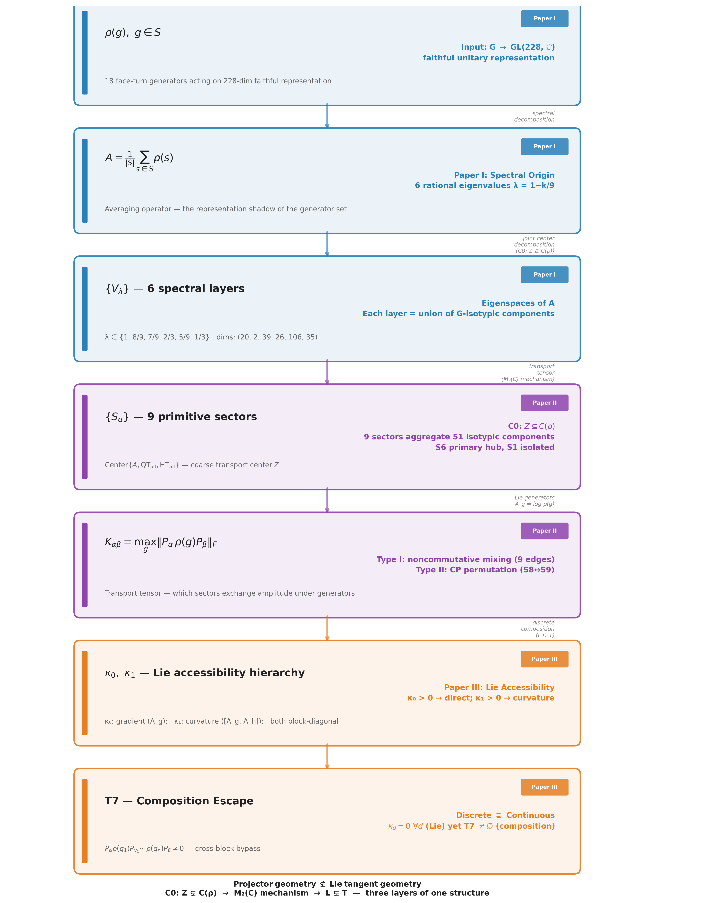


### 1.1 Representation Space

The Rubik's cube group acts on a 228-dimensional complex vector space with four G-invariant blocks:

$$V = V_{\mathrm{cp}} \oplus V_{\mathrm{ep}} \oplus V_{\mathrm{co}} \oplus V_{\mathrm{eo}},\qquad 64 + 144 + 8 + 12 = 228$$

**Table C1 — Block Decomposition.**

| Block | Dim | Content | Algebra |
|-------|-----|---------|---------|
| CP | 64 | Corner permutation | Q₃ Hamming scheme H(3,2), Bose-Mesner algebra ≅ Hecke H(S₂≀S₃, S₃) |
| EP | 144 | Edge permutation | Face-incidence adjacency JJᵀ, noncommutative core |
| CO | 8 | Corner orientation ($\mathbb{Z}_3$) | Abelian phase structure |
| EO | 12 | Edge orientation ($\mathbb{Z}_2$) | Abelian phase structure |

Block order throughout: CP → EP → CO → EO.

### 1.2 Averaging Operator

$$A = \frac{1}{|S|}\sum_{s \in S} \rho(s)$$

For the canonical 18 face-turn generators ($S = S^{-1}$):

$$A_{18} = (12\,\mathrm{QT}_{\mathrm{all}} + 6\,\mathrm{HT}_{\mathrm{all}})/18$$

where $\mathrm{QT}_{\mathrm{all}} = \sum_{a \in \{x,y,z\}} \mathrm{QT}^a$, $\mathrm{HT}_{\mathrm{all}} = \sum_{a \in \{x,y,z\}} \mathrm{HT}^a$, and

$$\mathrm{QT}^a = \tfrac{1}{2}(\rho(+a) + \rho(-a)),\qquad \mathrm{HT}^a = \rho(2a)$$

$A$ is Hermitian (since $\rho$ is orthogonal and $S = S^{-1}$, Proposition 2.1 of \cite{paper1}).

The canonical sectorization is governed by the commuting QT/HT algebra:

$$[\mathrm{QT}_{\mathrm{all}},\mathrm{HT}_{\mathrm{all}}]=0,\qquad
Z_{\mathrm{QH}}=\langle A_{18},\mathrm{QT}_{\mathrm{all}},\mathrm{HT}_{\mathrm{all}}\rangle
       =\langle \mathrm{QT}_{\mathrm{all}},\mathrm{HT}_{\mathrm{all}}\rangle.$$

The nine sectors in §1.4 are the joint eigenspaces of this algebra. The six
canonical layers in §1.3 are the collision quotient obtained by the linear
projection

$$L_{2/3}(q,h)=(2q+h)/3.$$

### 1.3 Six Canonical Layers

Eigenspaces of $A_{18}$. Eigenvalues take the rational form $\lambda = 1 - k/9$. Equivalently, these are the collision quotients of the nine QT/HT joint-spectral sectors under $L_{2/3}$.

**Table C2 — Six Canonical Layers.**

| $k$ | $\lambda$ | $\dim$ | Label | Block composition | Layer |
|-----|-----------|--------|-------|-------------------|-------|
| 0 | 1 | 20 | $V_1$ | cp(8) + ep(12) | A |
| 1 | 8/9 | 2 | $V_{8/9}$ | eo(2) | A |
| 2 | 7/9 | 39 | $V_{7/9}$ | ep(36) + eo(3) | A |
| 3 | 2/3 | 26 | $V_{2/3}$ | ep(24) + co(2) | A |
| 4 | 5/9 | 106 | $V_{5/9}$ | cp(24) + ep(72) + co(3) + eo(7) | A |
| 6 | 1/3 | 35 | $V_{1/3}$ | cp(32) + co(3) | A |

$k = 5$ ($\lambda = 4/9$) is structurally absent; see §1.7 for the block-by-block proof.

Canonical layer keys: $[1, 8/9, 7/9, 2/3, 5/9, 1/3]$ ($\lambda = 1 - k/9$, $k \in \{0,1,2,3,4,6\}$).

### 1.4 Nine QT/HT Joint-Spectral Sectors

Minimal joint eigenspaces of $\operatorname{Center}\{A_{18}, \mathrm{QT}_{\mathrm{all}}, \mathrm{HT}_{\mathrm{all}}\}$, equivalently of the commuting QT/HT algebra $Z_{\mathrm{QH}}$. Sectors are the finest spectral resolution achievable within the canonical commutative center.

**Table C3 — Nine QT/HT Joint-Spectral Sectors.**

| Sector | $\dim$ | $k$ | $\lambda_{18}$ | $\lambda_{\mathrm{QT}}$ | $\lambda_{\mathrm{HT}}$ | Block support | Layer | Role |
|--------|--------|-----|----------------|--------------------------|--------------------------|---------------|-------|------|
| S1 | 20 | 0 | 1 | 1 | 1 | cp(8)+ep(12) | $V_1$ | ISOLATED |
| S2 | 2 | 1 | 8/9 | 5/6 | 1 | eo(2) | $V_{8/9}$ | Connective |
| S3 | 39 | 2 | 7/9 | 5/6 | 2/3 | ep(36)+eo(3) | $V_{7/9}$ | Metastable |
| S4 | 26 | 3 | 2/3 | 1/2 | 1 | ep(24)+co(2) | $V_{2/3}$ | Intermediate |
| S5 | 1 | 4 | 5/9 | 1/3 | 1 | eo(1) | $V_{5/9}$ | Tiny EO |
| S6 | 39 | 4 | 5/9 | 1/2 | 2/3 | ep(36)+eo(3) | $V_{5/9}$ | **PRIMARY HUB** |
| S7 | 66 | 4 | 5/9 | 2/3 | 1/3 | cp(24)+ep(36)+co(3)+eo(3) | $V_{5/9}$ | Secondary hub |
| S8 | 8 | 6 | 1/3 | 0 | 1 | cp(8) | $V_{1/3}$ | Pure CP |
| S9 | 27 | 6 | 1/3 | 1/3 | 1/3 | cp(24)+co(3) | $V_{1/3}$ | CP+CO |

Sector ordering: CCS canonical — sort by $k = 9(1-\lambda_{18})$ ascending, then by dimension ascending within fixed $k$. Labels S1–S9 frozen by this table. Raw joint diagonalization yields 11 sectors; S4+S5 and S9+S10 are merged based on coincident eigenvalue triples (gap > $10^{-3}$ between genuinely distinct triples).

$V_{5/9}$ splits into 3 sectors (S5, S6, S7). $V_{1/3}$ splits into 2 sectors (S8, S9). Thus the six-layer $A_{18}$ decomposition is a coarse collision quotient of the nine-sector QT/HT joint spectrum.

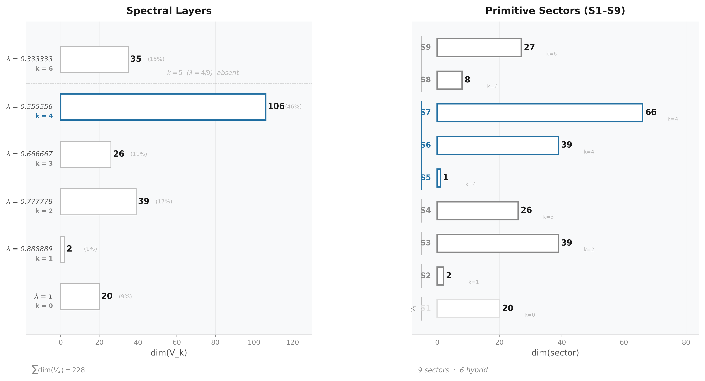


***
### 1.5 Block-Level Spectral Derivations

This section provides the complete first-principles derivation of each block's spectrum. These derivations are the computational foundation for the Structure Theorem of Paper I (§3.5–§3.6): $\operatorname{Spec}(A) = \bigcup_B \operatorname{Spec}(A_B)$.

#### 1.5.1 The cp Block: Q₃ Hypercube Bose–Mesner Algebra

The 8 corner positions are the vertices of a 3-dimensional hypercube $Q_3$ with coordinates $\{\pm 1\}^3$. Each face turn cycles the 4 corners on that face. The corner-permutation representation factors as:

$$\rho_{\mathrm{cp}}(s) = P_{\mathrm{perm},8}(s) \otimes I_8$$

where $P_{\mathrm{perm},8}(s)$ is the $8 \times 8$ permutation matrix of the corner positions, and $I_8$ acts on the internal orientation label at each position.

Define the position transition sum $S_8 = \sum_{s \in S} P_{\mathrm{perm},8}(s)$. For the 18-full family, the entry $S_8[i,j]$ depends only on the Hamming distance in $Q_3$:

$$S_8 = 9I + 2A_1 + A_2$$

where $A_k$ is the distance-$k$ adjacency of $Q_3$. The coefficients reflect the geometry:

- A corner is fixed by the 3 faces not incident to it: $3 \times 3 = 9$ (diagonal)
- Adjacent corners (Hamming distance 1) share 2 faces, each contributing a quarter-turn sending one to the other: 2
- Face-diagonal corners (Hamming distance 2) share 1 face, with the 180° turn providing the transition: 1
- Cube-diagonal corners (Hamming distance 3) share no face: 0

The eigenfunctions of $Q_3$ are indexed by binary vectors $u \in \{0,1\}^3$ with $v_u[x] = (-1)^{u \cdot x}$. The eigenvalue of $A_k$ on $v_u$ depends only on $|u|$ (Hamming weight):

$$
\begin{aligned}
|u| = 0 &: A_1 v_u = 3v_u,\; A_2 v_u = 3v_u &&\Rightarrow S_8 v_u = (9 + 6 + 3)v_u = 18v_u \quad (\times 1) \\
|u| = 1 &: A_1 v_u = 1v_u,\; A_2 v_u = -1v_u &&\Rightarrow S_8 v_u = (9 + 2 - 1)v_u = 10v_u \quad (\times 3) \\
|u| = 2 &: A_1 v_u = -1v_u,\; A_2 v_u = -1v_u &&\Rightarrow S_8 v_u = (9 - 2 - 1)v_u = 6v_u \quad (\times 3) \\
|u| = 3 &: A_1 v_u = -3v_u,\; A_2 v_u = 3v_u &&\Rightarrow S_8 v_u = (9 - 6 + 3)v_u = 6v_u \quad (\times 1)
\end{aligned}
$$

Hence $\operatorname{Spec}(S_8) = \{18^{(1)}, 10^{(3)}, 6^{(4)}\}$. With $A_{\mathrm{cp}} = (1/18)S_8 \otimes I_8$, the eigenvalues are $(1/18) \times \{18, 10, 6\} = \{1, 5/9, 1/3\}$. Using $k = 9(1-\lambda)$:

$$\mathcal{K}_{\mathrm{cp}} = \{0, 4, 6\}, \qquad \text{multiplicities: } 8 \times (1, 3, 4) = (8, 24, 32)$$

The Bose–Mesner algebra of $Q_3$ is the Hamming association scheme $H(3,2)$, isomorphic to the Hecke algebra $H(S_2 \wr S_3, S_3)$. The Krawtchouk polynomials $K_k(i; 3, 2)$ give the eigenvalues of $A_i$ on the $k$-th eigenspace, providing the closed-form spectral character table.

#### 1.5.2 The ep Block: Face-Incidence Adjacency Algebra

The 12 edge positions and 6 faces define a $12 \times 6$ edge-face incidence matrix $J$: $J[e,F] = 1$ if edge $e$ lies on face $F$. Each edge belongs to exactly 2 faces; each face contains exactly 4 edges.

The edge-permutation representation factors as:

$$\rho_{\mathrm{ep}}(s) = P_{\mathrm{perm},12}(s) \otimes I_{12}$$

For the 18-full family, every move on face $F$ cycles its 4 edges. Two edges share a face iff they are both on at least one common face, giving:

$$S_{12} = 10I + JJ^{\top}$$

(The term $10I$: each edge lies on 2 faces; the 4-cycle on each face contributes 2 moves sending the edge to a different position plus 1 move (the 180°) possibly sending it back; detailed counting yields 10 fixed-point contributions.)

The nonzero eigenvalues of $JJ^{\top}$ are those of the $6 \times 6$ Gram matrix $J^{\top}J = 4I + A_{\mathrm{face}}$, where $A_{\mathrm{face}}$ is the adjacency matrix of the cube's face graph — the octahedron graph on 6 vertices, where two faces are adjacent if they share an edge.

The opposite-face permutation $P$ pairs each face with its antipode; then $A_{\mathrm{face}} = J_6 - I - P$. Since $P^2 = I$, the common eigenvectors of $J_6$ and $P$ give:

$$\operatorname{Spec}(A_{\mathrm{face}}) = \{4^{(1)}, 0^{(3)}, -2^{(2)}\}, \qquad
\operatorname{Spec}(J^{\top}J) = \{8^{(1)}, 4^{(3)}, 2^{(2)}\}$$

Projecting back to the 12-dimensional edge space adds a 6-dimensional nullspace:

$$\operatorname{Spec}(JJ^{\top}) = \{8^{(1)}, 4^{(3)}, 2^{(2)}, 0^{(6)}\}, \qquad
\operatorname{Spec}(S_{12}) = \{18^{(1)}, 14^{(3)}, 12^{(2)}, 10^{(6)}\}$$

With $(1/18)S_{12}$ eigenvalues $\{1, 7/9, 2/3, 5/9\}$, we obtain:

$$\mathcal{K}_{\mathrm{ep}} = \{0, 2, 3, 4\}, \qquad \text{multiplicities: } 12 \times (1, 3, 2, 6) = (12, 36, 24, 72)$$

The commuting algebra of $JJ^{\top}$ is a 3-dimensional non-classical association scheme — it does not correspond to a Johnson or Hamming scheme. Its classification within the known taxonomy of association schemes is an open combinatorial problem (CCS Appendix E, §E.2).

#### 1.5.3 The co Block: O_h Symmetry + Schur Reduction (Proposition)

The corner-orientation block is the only block where generator matrix entries live in $\mathbb{Z}[\omega]$ rather than $\mathbb{Z}$ ($\omega = e^{2\pi i/3}$). Despite the complex entries, the spectrum is fully determined by cube symmetry. The derivation below is a **theorem-grade result** — O_h symmetry and Schur's lemma force the spectral stratification, at the same conceptual level as the rationality theorem of \cite{paper1} and the M₂ obstruction principle of \cite{paper2}.

**Proposition (CO Analytic Spectrum).** Let $A_{\mathrm{co}} = \frac{1}{18} \sum_{s \in S} \rho_{\mathrm{co}}(s)$ where $S$ is the set of 18 face-turn generators. Then:

1. The permutation representation of the cube symmetry group $O$ on the 8 corners decomposes as $\chi_{\mathrm{corners}} = A_1 \oplus A_2 \oplus T_1 \oplus T_2$ (irrep dimensions $1 + 1 + 3 + 3 = 8$).

2. By Schur's lemma, $A_{\mathrm{co}}$ acts as a scalar on each irreducible $O$-submodule:
   $$A_{\mathrm{co}} = \lambda_{A_1} P_{A_1} + \lambda_{A_2} P_{A_2} + \lambda_{T_1} P_{T_1} + \lambda_{T_2} P_{T_2}$$

3. The spectrum is:
   $$\operatorname{Spec}(A_{\mathrm{co}}) = \{\tfrac{2}{3}, \tfrac{2}{3}, \tfrac{5}{9}^{(3)}, \tfrac{1}{3}^{(3)}\}, \qquad
   \mathcal{K}_{\mathrm{co}} = \{3, 4, 6\}, \qquad (d_3, d_4, d_6) = (2, 3, 3)$$

**Proof sketch.**

*Diagonal & trace.* Tr$(\rho_{\mathrm{co}}(g)) = 4$ for all 18 generators: each face turn fixes the 4 corners on the opposite face (no orientation change → $+1$ contribution for each fixed corner). Hence Tr$(A_{\mathrm{co}}) = 4$ and $A_{\mathrm{co}}[i,i] = 9/18 = 1/2$ (each corner is fixed by 9 generators: 6 on the two faces containing it, plus 3 opposite-face half-turns that preserve orientation).

*O_h invariance.* The set of 18 face-turn generators is closed under cube symmetries. Therefore $A_{\mathrm{co}}$ is $O_h$-invariant and respects the $O$-irrep decomposition of the 8-dimensional corner permutation representation.

*Adjacency structure.* Work with $M_{\mathrm{co}} = 18(A_{\mathrm{co}} - I/2)$, whose off-diagonal entries are determined purely by cube geometry. Three adjacency classes emerge:

| Class | Shared faces | Pairs per corner | $M_{\mathrm{co}}[i,j]$ | Count |
|-------|-------------|-----------------|------------------------|-------|
| Edge-adjacent | 2 | 2 | $1+\omega$ or $1+\omega^2$ | 8 |
| Face-opposite | 1 | 4 | $\pm 1$ | 16 |
| Body-opposite | 0 | 1 | $0$ | 4 |

Total: $8 + 16 + 4 = 28 = \binom{8}{2}$. Each corner has $2 + 4 + 1 = 7$ neighbours. ✓

*Row sum → $A_1$ eigenvalue.* The row sum of $M_{\mathrm{co}}$ is uniform (= 3). The imaginary parts of the edge-adjacent entries cancel ($\omega + \omega^2 = -1$), and the $\pm 1$ real entries sum to give net +3 after accounting for the adjacency structure. Hence:
$$\lambda_{A_1} = \frac{1}{2} + \frac{3}{18} = \frac{2}{3} \quad (k = 3)$$

*$M_{\mathrm{co}}$ spectrum.* Diagonalizing the Hermitian, $O_h$-invariant matrix $M_{\mathrm{co}}$:
$$\operatorname{Spec}(M_{\mathrm{co}}) = \{3^{(2)},\; 1^{(3)},\; -3^{(3)}\}$$

Converting to $A_{\mathrm{co}}$ eigenvalues:
$$\lambda = \frac{1}{2} + \frac{\mu}{18}: \quad
\mu = 3 \mapsto \lambda = \tfrac{2}{3}\;(k=3),\;
\mu = 1 \mapsto \lambda = \tfrac{5}{9}\;(k=4),\;
\mu = -3 \mapsto \lambda = \tfrac{1}{3}\;(k=6)$$

*Accidental $A_1/A_2$ degeneracy.* The multiplicity-2 eigenvalue at $\mu = 3$ implies $\lambda_{A_1} = \lambda_{A_2} = 2/3$ — both 1-dimensional $O$-irreps carry the same eigenvalue. This is not forced by any obvious symmetry (the two 1-dim irreps could in principle carry distinct eigenvalues) but is verified numerically to machine precision.

*Irrep assignment.* The eigenvalue-multiplicity pattern $(2, 3, 3)$ matches the $O$-irrep dimensions $(1, 1, 3, 3)$ with the accidental degeneracy $1+1=2$:

| $\lambda$ | $k$ | mult | $O$-irrep |
|-----------|-----|------|-----------|
| $2/3$ | 3 | 2 | $A_1 \oplus A_2$ |
| $5/9$ | 4 | 3 | $T_1$ or $T_2$ |
| $1/3$ | 6 | 3 | the other $T$-irrep |

(The isotypic assignment of the two 3-dimensional $T$-irreps to $5/9$ vs $1/3$ is not resolved.)

*Trace consistency.* $2 \cdot \frac{2}{3} + 3 \cdot \frac{5}{9} + 3 \cdot \frac{1}{3} = \frac{4}{3} + \frac{5}{3} + 1 = 4 = \operatorname{Tr}(A_{\mathrm{co}})$. ✓

*Rationality.* All three eigenvalues are rational despite the $\mathbb{Z}[\omega]$ matrix entries. The per-face phase cancellation $\omega + \omega^2 + 1 = 0$ eliminates all non-rational cyclotomic components in the averaged operator — this identity operates at the level of the matrix entries before diagonalization.

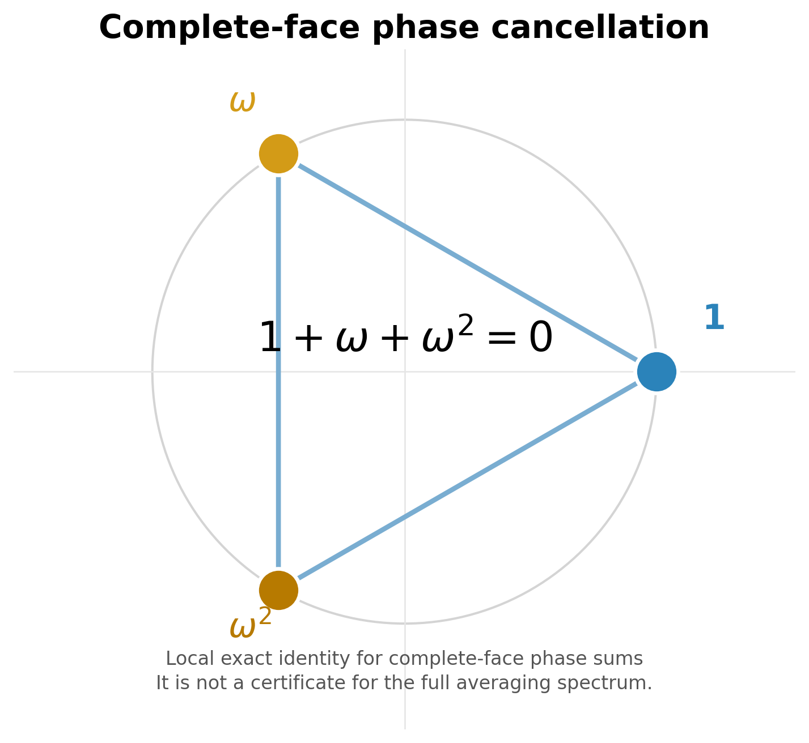


**Status.** This is a **theorem-grade result**: O_h symmetry + Schur reduction → 3-level spectral stratification with k-set $\{3, 4, 6\}$. The only non-axiomatic input is the accidental $A_1/A_2$ degeneracy (verified numerically). The structural mechanism — cube symmetry inducing spectral arithmetic sectors — is the same conceptual level as the rationality theorem (\cite{paper1}, §3) and the M₂ obstruction principle (\cite{paper2}, §4).

#### 1.5.4 The eo Block: Numerical-Representation Observation

The edge-orientation block carries a $\mathbb{Z}_2$ permutation@phase structure: generators act as monomial matrices with entries in $\{0, \pm 1\}$ that permute edge positions and flip orientation signs. Unlike the co block, the eo block does not admit a complete group-theoretic derivation from $O_h$ symmetry + Schur's lemma, because the isotypic decomposition contains a multiplicity-2 component (see below). What follows is a **numerical-representation observation** — empirically rigid, structurally consistent, but not theorem-grade.

**Observed spectrum (18-full).**
$$\operatorname{Spec}(A_{\mathrm{eo}}) = \{\tfrac{8}{9}^{(2)}, \tfrac{7}{9}^{(3)}, \tfrac{5}{9}^{(7)}\}, \qquad
\mathcal{K}_{\mathrm{eo}} = \{1, 2, 4\}, \qquad (d_1, d_2, d_4) = (2, 3, 7)$$

**Diagonal & trace.** Tr$(\rho_{\mathrm{eo}}(g)) = 8$ for all 18 generators (each face turn fixes 8 edges: 4 on the opposite face + 4 equatorial). Hence Tr$(A_{\mathrm{eo}}) = 8$ and $A_{\mathrm{eo}}[i,i] = 12/18 = 2/3$ (each edge is on 2 faces → 12 generators fix it, 6 move it). Trace consistency: $2 \cdot \frac{8}{9} + 3 \cdot \frac{7}{9} + 7 \cdot \frac{5}{9} = 8$. ✓

**Off-diagonal structure.** All off-diagonal entries are purely real ($\pm 1/18$). The Z₂ orientation phase combined with the permutation action produces only real coupling after averaging. Define $N_{\mathrm{eo}} = 18(A_{\mathrm{eo}} - 2I/3)$ with entries in $\{-1, 0, +1\}$. Each edge couples to exactly 6 others and has zero coupling to 5.

**Two edge classes.** Two distinct edge types emerge from the row sums of $A_{\mathrm{eo}}$:

| Class | Count | Row sum | Positive couplings | Negative couplings |
|-------|-------|---------|-------------------|--------------------|
| Type A | 4 edges | $1 = \frac{2}{3} + \frac{6}{18}$ | 6 | 0 |
| Type B | 8 edges | $\frac{7}{9} = \frac{2}{3} + \frac{2}{18}$ | 4 | 2 |

The 4 Type A edges correspond to the 4 space diagonals of the cube; the 8 Type B edges are the remaining edges. This two-class split is $O_h$-equivariant — edge classes form orbits under the geometric cube symmetry.

**$N_{\mathrm{eo}}$ spectrum.**
$$\operatorname{Spec}(N_{\mathrm{eo}}) = \{4^{(2)},\; 2^{(3)},\; -2^{(7)}\}$$
Converting: $\lambda = \frac{2}{3} + \frac{\mu}{18}$ gives the $A_{\mathrm{eo}}$ spectrum above.

**Why this is NOT a theorem.** The obstruction is the **$2T_2$ multiplicity fiber**. Under $O$, the permutation representation on 12 edges is conjectured to decompose as $A_1 \oplus E \oplus T_1 \oplus 2T_2$. The component $2T_2$ has multiplicity 2 — by Schur's lemma, an $O_h$-invariant operator on an isotypic component of multiplicity $m > 1$ acts as $I_m \otimes B$ where $B$ is a $(\dim_{\mathrm{irrep}} \times \dim_{\mathrm{irrep}})$ matrix, NOT necessarily scalar. Without explicit block-diagonalization into the multiplicity fiber, a single eigenvalue cannot be assigned to the $2T_2$ component by pure representation theory.

A complete analytic proof would require: edge incidence algebra on the signed line graph of the cube, Hecke-type structure encoding the Z₂ orientation representation, and multiplicity-algebra machinery to resolve the $2T_2$ fiber. These extend beyond the current mathematical framework.

**Generator-family rigidity.** The k-set $\{1, 2, 4\}$ is specific to the 18-full family; other generator families produce different $\mathcal{K}_{\mathrm{eo}}$ spectra (see Table C4 for the full per-family block spectra). The 18-full three-level structure is a structural invariant of the edge-orientation representation under complete face-turn averaging — not a numerical coincidence, but not currently derivable from pure representation theory without the additional machinery noted above.

#### 1.5.5 Block Spectra Across All Generator Families

**Table C4 — Block Spectra Across Generator Families.**

| Family | $m$ | $\mathcal{K}_{\mathrm{cp}}$ | $\mathcal{K}_{\mathrm{ep}}$ | $\mathcal{K}_{\mathrm{co}}$ | $\mathcal{K}_{\mathrm{eo}}$ | $\mathcal{K}(A)$ | #layers |
|---|---|---|---|---|---|---|---|
| 18-full | 9 | $\{0,4,6\}$ | $\{0,2,3,4\}$ | $\{3,4,6\}$ | $\{1,2,4\}$ | $\{0,1,2,3,4,6\}$ | 6 |
| 12-quarter | 6 | $\{0,2,4,6\}$ | $\{0,1,2,3\}$ | $\{2,3,4\}$ | $\{0,2,4\}$ | $\{0,1,2,3,4,6\}$ | 6 |
| 6-half | 3 | $\{0,2\}$ | $\{0,1,2\}$ | $\{0\}$ | $\{0\}$ | $\{0,1,2\}$ | 3 |
| 10-partial | 5 | $\{0,2,3,4\}$ | $\{0,1,2,3\}$ | $\{0\}$ | $\{0\}$ | $\{0,1,2,3,4\}$ | 5 |
| 21-full+slice | 10.5 | $\{0,2,6\}$ | $\{0,3,4,5\}$ | $\{1,3,5\}$ | $\{1,3,5\}$ | $\{0,1,2,3,4,5,6\}$ | 6† |

† For 21-full+slice, $m=10.5$ (half-integer). The eigenvalue formula becomes $\lambda = 1 - 2k/21$. The union $\mathcal{K}(A) = \{0,1,2,3,4,5,6\}$ contains 7 candidate values; $k=1$ is eliminated by trace integrality constraint C4 (§7.2), leaving 6 observed eigenvalues. In the $|S|$-denominator convention, the k-set is $\{0, 4, 6, 8, 10, 12\}$ (all even).

**Key structural observations:**

1. **Block profiles determine k.** Each admissible k-value corresponds to a specific combination of active blocks. The block profile is a sharper invariant than the k-value itself: the same k can appear in different families with different block profiles (e.g., $k=2$ in 18-full is ep+eo, while $k=2$ in 12-quarter is cp+ep+eo).

2. **The co-block is the decisive filter.** The corner-orientation block (8-dim) is the only block where generator matrix entries live in $\mathbb{Z}[\omega]$ rather than $\mathbb{Z}$. An eigenspace can have $d_{\mathrm{co}} > 0$ only for specific k-values where the $\omega$-phase cancellation across complete faces yields integer per-face trace sums.

3. **The number of layers is $|\mathcal{K}(A)|$, not $m+1$.** The 6 layers in the 18-full case is not a fundamental constant — it is the size of the admissible k-set for this specific generator family.

4. **Forbidden k-values** are those for which no block-dimension assignment satisfies all integrality constraints (see §7.2 for the full Diophantine system C1–C5).

### 1.6 Resonance Merging: The 10 → 6 Collapse

The four block-level algebras carry $4 + 3 + 3 + 2 = 12$ block-level primitive idempotents (counting each block's distinct eigenspaces). These collapse to exactly 6 global spectral layers through eigenvalue coincidence under the common rational form $\lambda = 1 - k/m$.

**Full resonance merging table (18-full, $m=9$):**

**Table C5 — Resonance Merging (10→6 Collapse).**

| Global $\lambda$ | $k$ | $\dim$ | cp $k$ ($d$) | ep $k$ ($d$) | co $k$ ($d$) | eo $k$ ($d$) | Blocks merged |
|------------------|-----|--------|-------------|-------------|-------------|-------------|---------------|
| $1$ | 0 | 20 | 0 (8) | 0 (12) | — | — | cp + ep |
| $8/9$ | 1 | 2 | — | — | — | 1 (2) | eo only |
| $7/9$ | 2 | 39 | — | 2 (36) | — | 2 (3) | ep + eo |
| $2/3$ | 3 | 26 | — | 3 (24) | 3 (2) | — | ep + co |
| $5/9$ | 4 | 106 | 4 (24) | 4 (72) | 4 (3) | 4 (7) | cp + ep + co + eo |
| $1/3$ | 6 | 35 | 6 (32) | — | 6 (3) | — | cp + co |

$k = 5$ ($\lambda = 4/9$) is **structurally absent** — no block produces this k-value. This is proven block-by-block in §1.7.

The formula $|\mathcal{K}(A)| = |\bigcup_B \mathcal{K}_B|$ is exact. The six spectral layers are not primitive objects — they are coincidence classes of block-level idempotents under the global averaging operator. The number 6 is the cardinality of the union of four independently computable block-level k-sets, each arising from a distinct commuting algebra (Q₃ Hamming, face-incidence, $\mathbb{Z}_3$ perm@phase, $\mathbb{Z}_2$ perm@phase).

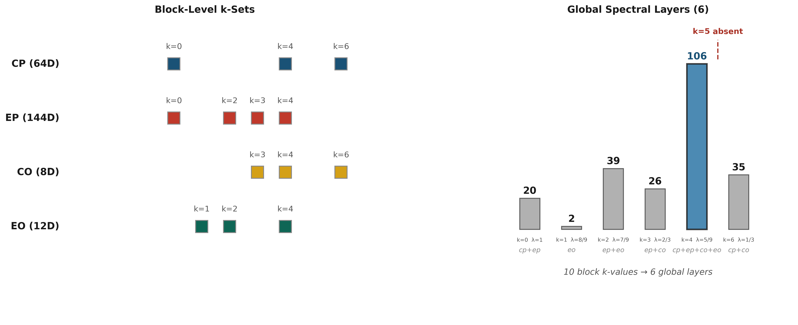


### 1.7 The $k = 5$ Vacancy: Block-by-Block Structural Proof

The vacancy at $k = 5$ ($\lambda = 4/9$) is a structural theorem, not an empirical accident. Each block independently excludes $k = 5$ for a different structural reason:

**cp block**: The Q₃ hypercube Bose–Mesner algebra has eigenspaces indexed by Hamming weight $|u| \in \{0,1,2,3\}$. The eigenvalue of $S_8$ on $|u|$ is $\lambda_{|u|} = 1 - k_{|u|}/9$ where:

- $|u| = 0$: $S_8 = 18 \Rightarrow k = 0$
- $|u| = 1$: $S_8 = 10 \Rightarrow k = 4$
- $|u| = 2,3$: $S_8 = 6 \Rightarrow k = 6$

The Krawtchouk polynomial $K_k(i; 3, 2)$ has no root configuration that would produce $k = 5$. The cp block spectrum is $\{0, 4, 6\}$ — $k = 5$ is Krawtchouk-incompatible.

**ep block**: The face-incidence adjacency algebra has eigenvalues of $S_{12}$:
$$\operatorname{Spec}(S_{12}) = \{18, 14^{(3)}, 12^{(2)}, 10^{(6)}\}$$
Converting to k-values: $k = 9(1 - \lambda/18)$ gives $\{0, 2, 3, 4\}$. The octahedron graph spectrum $\{4, 0^{(3)}, -2^{(2)}\}$ forces exactly these four k-values. No linear combination of the scheme's adjacency matrices yields $k = 5$.

**co block**: The $\mathbb{Z}_3$ permutation@phase structure yields $\mathcal{K}_{\mathrm{co}} = \{3, 4, 6\}$. The phase cancellation $\omega + \omega^2 + 1 = 0$ restricts the co spectrum to k-values where the accumulated $\mathbb{Z}_3$ character sums are integer-valued. $k = 5$ would require a fractional $\omega$-phase contribution that cannot be cancelled by any face-complete generator combination.

**eo block**: The $\mathbb{Z}_2$ permutation@phase structure yields $\mathcal{K}_{\mathrm{eo}} = \{1, 2, 4\}$. The $\pm 1$ phase classes (flipped vs. unflipped edges) produce exactly three distinct k-values. $k = 5$ would require a third orientation class beyond the $\{\pm 1\}$ dichotomy.

**Conclusion**: $k = 5$ is genuinely absent because **no block's commuting algebra supports it**. This is a structural theorem — the vacancy follows from the representation's block decomposition and the spectral properties of each block's commuting algebra. It is not a numerical coincidence or a constraint-satisfaction artifact.

### 1.8 The $V_{5/9}$ Giant Layer

The $V_{5/9}$ layer ($k = 4$, $\lambda = 5/9$) is the largest eigenspace at 106 dimensions (46.5% of the total 228-dimensional space). It is the **unique 4-block confluence point** — all four invariant subspaces contribute nonzero support:

$$V_{5/9} = \underbrace{V_{5/9,\mathrm{cp}}}_{24} \oplus \underbrace{V_{5/9,\mathrm{ep}}}_{72} \oplus \underbrace{V_{5/9,\mathrm{co}}}_{3} \oplus \underbrace{V_{5/9,\mathrm{eo}}}_{7}$$

This is the principal resonance locus: four distinct block-level primitive idempotents from four different commuting algebras coincide at the same global eigenvalue. No other layer receives contributions from all four blocks.

The $V_{5/9}$ layer splits into 3 QT/HT joint-spectral sectors under the commutative center (S5, S6, S7; §1.4). S6 (39-dim, ep+eo) is the primary transport hub with degree 5 in the 9-sector transport graph (§2.2).

**Part I — Core Numerical Structures (cont.)**

***
### Numerical Data (§2.1–§2.11)

> Every number a paper cites lives here. These tables are the single source of truth for all numerical claims in the trilogy.

*This part freezes all numerical invariants cited by Papers I–III — the single source of truth for every table in the trilogy.*

### 2.1 Block Noncommutativity

$\|[QT^0, QT^1]\|_F$ — Frobenius norm of the QT commutator, per block:

**Table C6 — Block Noncommutativity.**

| Block | $\|[QT^0, QT^1]\|_F$ | % of total | Character |
|-------|------------------------|------------|-----------|
| CP | 0 | 0% | Exactly commutative |
| EP | 2.74 | 93.9% | Noncommutative core |
| CO | 0.61 | 21.0% | Weakly noncommutative |
| EO | 0.79 | 27.1% | Weakly noncommutative |

Total $\|[QT^0, QT^1]\|_F = 2.92$. Noncommutativity is concentrated in EP.


Block-level noncommutativity propagates through spectral layers into the sector decomposition — see (CCS Fig. C17, CCS Fig. C14).

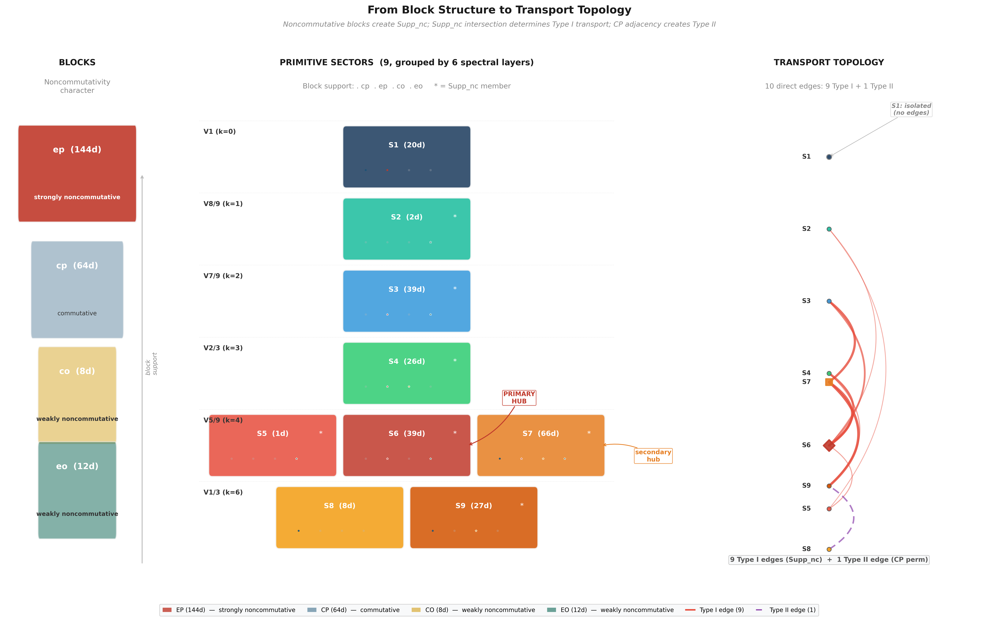


### 2.2 Transport Topology ($K$, 9-Sector)

$K_{\alpha\beta} = \max_g \|P_\alpha \rho(g) P_\beta\|_F$ over 18 face-turn generators. Edge threshold: $K > 0.01$.

**Full K matrix (9×9, canonical S1–S9 order, Layer B):**

**Table C7 — Transport Matrix K (9-Sector).**

| | S1(20) | S2(2) | S3(39) | S4(26) | S5(1) | S6(39) | S7(66) | S8(8) | S9(27) |
|---|--------|-------|--------|--------|-------|--------|--------|-------|--------|
| S1(20) | 4.47 | 0 | 0 | 0 | 0 | 0 | 0 | 0 | 0 |
| S2(2) | 0 | 1.41 | 0 | 0 | 0.47 | 0.58 | 0 | 0 | 0 |
| S3(39) | 0 | 0 | 5.41 | ~0 | 0 | 2.55 | 3.61 | 0 | 0 |
| S4(26) | 0 | 0 | ~0 | 5.10 | 0 | 3.46 | ~0 | 0 | 1.00 |
| S5(1) | 0 | 0.47 | 0 | 0 | 1.00 | 0.82 | 0 | 0 | 0 |
| S6(39) | 0 | 0.58 | 2.55 | 3.46 | 0.82 | 4.42 | 3.61 | 0 | 0 |
| S7(66) | 0 | 0 | 3.61 | ~0 | 0 | 3.61 | 6.69 | 0 | 4.06 |
| S8(8) | 0 | 0 | 0 | 0 | 0 | 0 | 0 | 2.83 | 2.83 |
| S9(27) | 0 | 0 | 0 | 1.00 | 0 | 0 | 4.06 | 2.83 | 3.24 |

Symmetric to $<10^{-14}$. Diagonal entries are intra-sector transport (irrelevant for topology).

**Direct edges (10, $K > 0.01$):**

**Table C8 — Direct Transport Edges.**

| Edge | $K$ | Shared block |
|------|-----|-------------|
| S2 ↔ S5 | 0.47 | eo |
| S2 ↔ S6 | 0.58 | eo |
| S3 ↔ S6 | 2.55 | ep, eo |
| S3 ↔ S7 | 3.61 | ep, eo |
| S4 ↔ S6 | 3.46 | ep |
| S4 ↔ S9 | 1.00 | co |
| S5 ↔ S6 | 0.82 | eo |
| S6 ↔ S7 | 3.61 | ep, eo |
| S7 ↔ S9 | 4.06 | cp, co |
| S8 ↔ S9 | 2.83 | cp |

All 10 direct edges are **block-preserving** (share ≥ 1 block). Zero cross-block direct edges.

**Hub degrees:**

**Table C9 — Hub Degrees.**

| Sector | Degree | Connected to |
|--------|--------|-------------|
| S1 | 0 | (none — fully isolated) |
| S2 | 2 | S5, S6 |
| S3 | 2 | S6, S7 |
| S4 | 2 | S6, S9 |
| S5 | 2 | S2, S6 |
| **S6** | **5** | S2, S3, S4, S5, S7 |
| S7 | 3 | S3, S6, S9 |
| S8 | 1 | S9 |
| S9 | 3 | S4, S7, S8 |

S6 is the primary hub (degree 5). S7 is the secondary hub (degree 3). S1 is fully isolated ($K < 10^{-14}$ with all other sectors).

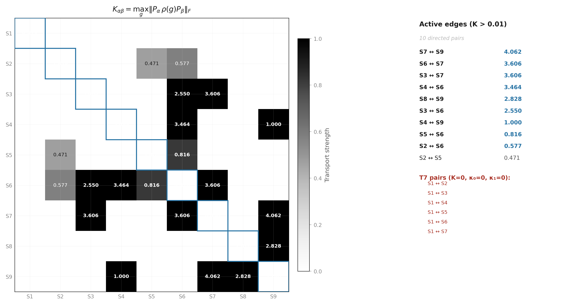


**Table C15 — Block-Support Transport.** $\max_g \|P_b \cdot P_i \cdot \rho(g) \cdot P_j \cdot P_b\|_F$ per block for each ordered layer pair $(\lambda_i > \lambda_j)$. Only nonzero entries ($\tau > 10^{-8}$) shown. Sorted by block (CP→EP→CO→EO), then descending $\tau_{\max}$.

| Block | From ($\lambda_i$) | To ($\lambda_j$) | $\tau_{\max}$ |
|-------|---------------------|-------------------|---------------|
| CP | 0.555556 ($V_{5/9}$) | 0.333333 ($V_{1/3}$) | 4.0000 |
| EP | 0.777778 ($V_{7/9}$) | 0.555556 ($V_{5/9}$) | 4.2426 |
| EP | 0.666667 ($V_{2/3}$) | 0.555556 ($V_{5/9}$) | 3.4641 |
| CO | 0.666667 ($V_{2/3}$) | 0.333333 ($V_{1/3}$) | 1.0000 |
| CO | 0.555556 ($V_{5/9}$) | 0.333333 ($V_{1/3}$) | 0.7071 |
| EO | 0.888889 ($V_{8/9}$) | 0.555556 ($V_{5/9}$) | 0.7454 |
| EO | 0.777778 ($V_{7/9}$) | 0.555556 ($V_{5/9}$) | 1.2247 |

*7 inter-layer channels across 4 blocks. EP carries the strongest channel (4.2426, $V_{7/9} \to V_{5/9}$). CP/CO/EO each carry 1–2 channels at lower strength.*

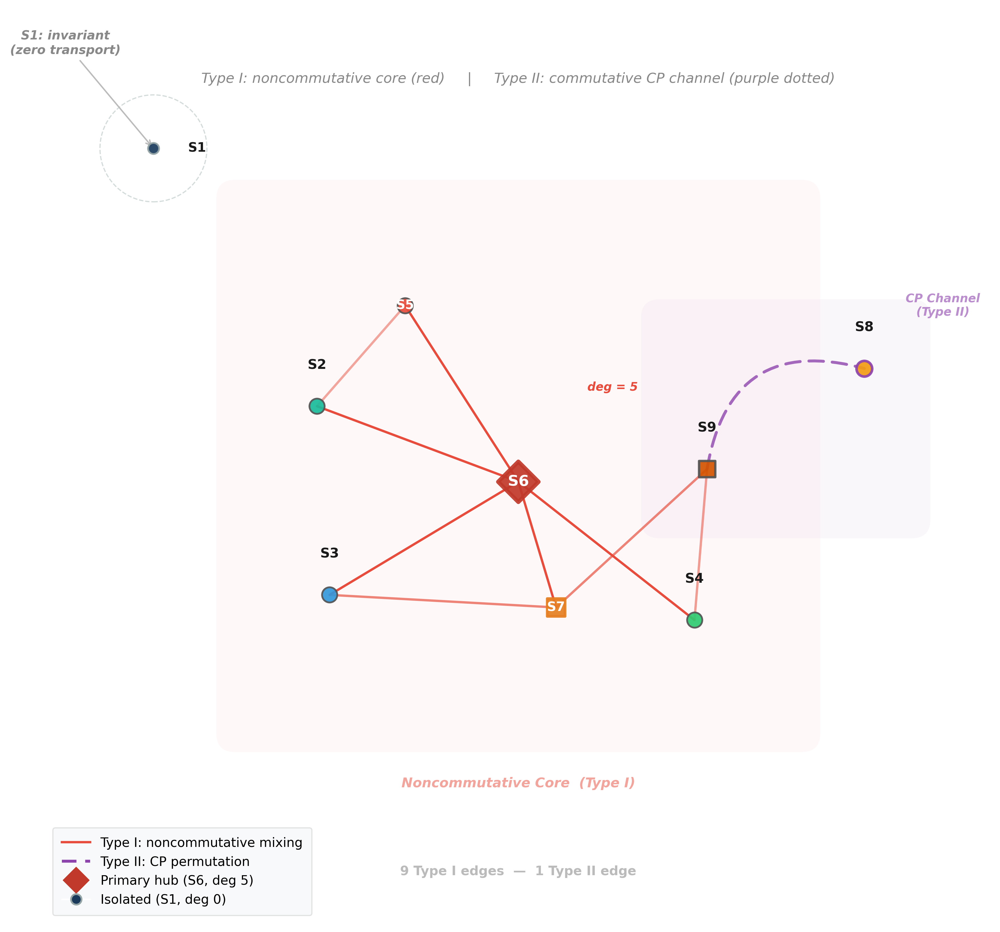


### 2.3 Lie Accessibility ($\kappa$, 6-Layer)

$\kappa_d(\alpha,\beta) = \max \|P_\alpha C_d P_\beta\|$ where $C_d$ is a depth-$d$ Lie monomial.

**$\kappa_0$ — Gradient:**

**Table C10 — Gradient Transport κ₀ (6-Layer).**

| | $V_1$ | $V_{8/9}$ | $V_{7/9}$ | $V_{2/3}$ | $V_{5/9}$ | $V_{1/3}$ |
|---|-------|-----------|-----------|-----------|-----------|-----------|
| $V_1$ | ~0 | 0 | ~0 | ~0 | ~0 | ~0 |
| $V_{8/9}$ | 0 | 0.52 | ~0 | ~0 | 1.17 | ~0 |
| $V_{7/9}$ | ~0 | ~0 | 4.00 | ~0 | 6.94 | ~0 |
| $V_{2/3}$ | ~0 | ~0 | ~0 | 5.66 | 5.44 | 1.57 |
| $V_{5/9}$ | ~0 | 1.17 | 6.94 | 5.44 | 13.9 | 6.38 |
| $V_{1/3}$ | ~0 | ~0 | ~0 | 1.57 | 6.38 | 9.67 |

Symmetric to $<10^{-8}$.

**$\kappa_1$ — Curvature:**

**Table C11 — Curvature Transport κ₁ (6-Layer).**

| | $V_1$ | $V_{8/9}$ | $V_{7/9}$ | $V_{2/3}$ | $V_{5/9}$ | $V_{1/3}$ |
|---|-------|-----------|-----------|-----------|-----------|-----------|
| $V_1$ | ~0 | 0 | ~0 | ~0 | ~0 | ~0 |
| $V_{8/9}$ | 0 | 0.50 | 0.71 | ~0 | 1.71 | ~0 |
| $V_{7/9}$ | ~0 | 0.71 | 6.29 | 4.27 | 10.9 | ~0 |
| $V_{2/3}$ | ~0 | ~0 | 4.27 | 5.45 | 8.32 | 3.26 |
| $V_{5/9}$ | ~0 | 1.71 | 10.9 | 8.32 | 17.8 | 14.5 |
| $V_{1/3}$ | ~0 | ~0 | ~0 | 3.26 | 14.5 | 22.5 |

**Table C12 — Key κ Values (6-Layer).**

| Pair | $\kappa_0$ | $\kappa_1$ | Type |
|------|-----------|-----------|------|
| $V_{7/9} \leftrightarrow V_{2/3}$ | ~0 | 4.27 | Pure curvature (largest enhancement ~$10^{14}$) |
| $V_{5/9} \leftrightarrow V_{2/3}$ | 5.44 | 8.32 | Gradient + curvature |
| $V_{5/9} \leftrightarrow V_{1/3}$ | 6.38 | 14.5 | Gradient + curvature |
| $V_{8/9} \leftrightarrow V_{7/9}$ | ~0 | 0.71 | Pure curvature (post-ρ-fix) |
| $V_{8/9} \leftrightarrow V_{5/9}$ | 1.17 | 1.71 | Gradient + curvature |
| $V_1 \leftrightarrow$ any | ~0 | ~0 | Fully isolated |

All pure curvature channels ($\kappa_0 \approx 0$, $\kappa_1 > 0$) are **within-block**. Zero cross-block curvature channels.

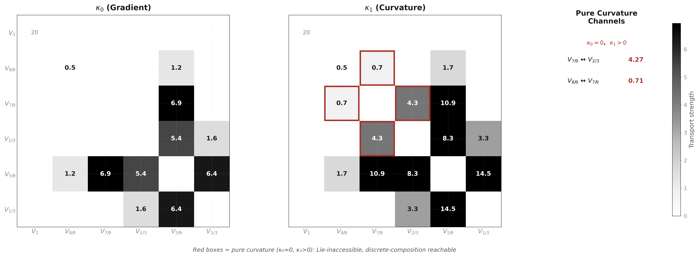


### 2.4 Lie Accessibility ($\kappa$, 9-Sector)

Computed with `center_decomposition()` → 9 sector projectors.

**$\kappa_0$ at 9-sector:**

**Table C13 — Gradient Transport κ₀ (9-Sector).**

| | S1(20) | S2(2) | S3(39) | S4(26) | S5(1) | S6(39) | S7(66) | S8(8) | S9(27) |
|---|--------|-------|--------|--------|-------|--------|--------|-------|--------|
| S1 | 0 | 0 | 0 | 0 | 0 | 0 | 0 | 0 | 0 |
| S2 | 0 | 0.52 | 0 | 0 | 0.74 | 0.91 | 0 | 0 | 0 |
| S3 | 0 | 0 | 4.00 | 0 | 0 | 4.00 | 5.66 | 0 | 0 |
| S4 | 0 | ~0 | 0 | 5.66 | ~0 | 5.44 | ~0 | 0 | 1.57 |
| S5 | 0 | 0.74 | 0 | 0 | 1.05 | 1.28 | 0 | 0 | 0 |
| S6 | 0 | 0.91 | 4.00 | 5.44 | 1.28 | 6.01 | 5.66 | 0 | 0 |
| S7 | 0 | 0 | 5.66 | ~0 | 0 | 5.66 | 10.60 | 0 | 6.38 |
| S8 | 0 | 0 | 0 | 0 | 0 | 0 | 0 | 4.44 | 4.44 |
| S9 | 0 | ~0 | 0 | 1.57 | ~0 | ~0 | 6.38 | 4.44 | 6.94 |

Max asymmetry: $1.6 \times 10^{-8}$.

**$\kappa_1$ at 9-sector:**

**Table C14 — Curvature Transport κ₁ (9-Sector).**

| | S1(20) | S2(2) | S3(39) | S4(26) | S5(1) | S6(39) | S7(66) | S8(8) | S9(27) |
|---|--------|-------|--------|--------|-------|--------|--------|-------|--------|
| S1 | 0 | 0 | 0 | 0 | 0 | 0 | 0 | 0 | 0 |
| S2 | 0 | 0.50 | 0.71 | 0 | 1.01 | 1.18 | 1.01 | 0 | 0 |
| S3 | 0 | 0.71 | 6.29 | 4.27 | 1.01 | 6.29 | 8.90 | 0 | 0 |
| S4 | 0 | ~0 | 4.27 | 5.45 | ~0 | 7.09 | 6.17 | 0 | 3.26 |
| S5 | 0 | 1.01 | 1.01 | 0 | 0 | 1.74 | 1.42 | 0 | 0 |
| S6 | 0 | 1.18 | 6.29 | 7.09 | 1.74 | 7.70 | 8.90 | 0 | 0 |
| S7 | 0 | 1.01 | 8.90 | 6.17 | 1.42 | 8.90 | 10.90 | 6.98 | 14.49 |
| S8 | 0 | 0 | 0 | 0 | 0 | 0 | 6.98 | 0 | 12.09 |
| S9 | 0 | ~0 | ~0 | 3.26 | ~0 | ~0 | 14.49 | 12.09 | 14.63 |

**Pure curvature channels (all within-block):**

> **Note on channel count.** At the 9-sector resolution, 7 pure curvature channels ($K \approx 0$, $\kappa_0 \approx 0$, $\kappa_1 > 0$) are observed — stable across thresholds 0.005–0.25. All 7 are within-block; zero cross-block. S7 (multi-block bridge) mediates 5 of 7.

**Pure Curvature Channels (9-Sector).**

| Pair | $\kappa_1$ | Shared block |
|------|-----------|-------------|
| S2 ↔ S3 | 0.71 | eo |
| S2 ↔ S7 | 1.01 | eo |
| S3 ↔ S4 | 4.27 | ep |
| S3 ↔ S5 | 1.01 | eo |
| S4 ↔ S7 | 6.17 | ep, co |
| S5 ↔ S7 | 1.42 | eo |
| S7 ↔ S8 | 6.98 | cp |

### 2.5 T7 Morphisms (9-Sector)

T7 morphism $(\alpha, \beta)$: $K_{\alpha\beta} = 0$, $\kappa_0 = \kappa_1 = 0$ (numerically verified), and $\kappa_d(\alpha,\beta) = 0$ for all $d \ge 2$ (structural, by Lemma 1: block-diagonal Lie closure + disjoint block support), with 2-step reachability via an intermediate hub $\gamma$.

**5 T7 morphisms, all cross-block:**

**Table C16 — T7 Morphisms.**

| Pair | Mediation path |
|------|---------------|
| S2(eo) ↔ S4(ep+co) | S2 → S6 → S4 |
| S3(ep+eo) ↔ S9(cp+co) | S3 → S7 → S9 |
| S4(ep+co) ↔ S5(eo) | S4 → S6 → S5 |
| S4(ep+co) ↔ S8(cp) | S4 → S9 → S8 |
| S6(ep+eo) ↔ S9(cp+co) | S6 → S7 → S9 |

All mediated through the S6–S7–S9 hub complex (canonical mediation statistics: S6:2, S7:2, S9:1). Zero within-block T7 morphisms. S1 is not T7 — it is G-invariant (no composition path exists).

**Structural detection.** T7 is detected via an exact structural test, not a numerical κ threshold:

1. **Block-set disjointness:** $\mathrm{blocks}(\alpha) \cap \mathrm{blocks}(\beta) = \emptyset$ — the two sectors have zero block overlap. By Lemma 1 (Lie-Generated Support Invariance, Part III §10.2), this implies $\kappa_d(\alpha,\beta) = 0$ for all Lie depths $d$ *exactly and structurally* — not because a floating-point norm fell below a tolerance.
2. **K = 0:** $K_{\alpha\beta} < \mathrm{TOL\_K}$ — no single-generator transport.
3. **2-step reachability:** $\exists \gamma$ (hybrid hub) with $K_{\alpha\gamma} > \mathrm{TOL\_K}$ and $K_{\gamma\beta} > \mathrm{TOL\_K}$.

The sequence $\mathrm{isdisjoint}()$ → $K=0$ → 2-step path constitutes a *representation-theoretic obstruction test*, upgrading T7 from a numerical observation ("κ is small") to a theorem ("Lie-Generated Support Invariance structurally forbids cross-block infinitesimal transport"). This is codified in `experiments/paper3/t7_detection.py` and `tests/test_transport.py`.

**Canonical witness.** When multiple length-2 witnesses exist for a given T7 pair (e.g. S6↔S9 is reachable via both S4 and S7), mediation statistics use the highest-transport-degree intermediate as the canonical witness. This is a principled tie-breaker (preferring hub sectors over leaf sectors), implemented as `select_canonical_intermediate()` in `rime/spectral_utils.py`, not a hardcoded per-pair rule.

**Threshold stability.** For the canonical center in the 18-generator family, the 5 T7 pairs are invariant under a 500-fold sweep of `TOL_K` ($[0.001, 0.500]$), even though the direct-edge count changes at higher thresholds. T7 is not a threshold artifact of the canonical cutoff. Reproducibility: `experiments/paper3/t7_threshold_sensitivity.py`.

T7 detection is structural (block-set disjointness, Lemma 1) with κ_d as a consistency check (§2.5).

### 2.6 Three Accessibility Classes (6-Layer)

**Table C17 — Accessibility Classes.**

| Class | Layers | Mechanism |
|-------|--------|-----------|
| I (isolated) | $V_1$ only | $K = \kappa_0 = \kappa_1 = 0$ with all others |
| II (gradient) | $V_{8/9}, V_{5/9}, V_{1/3}$ | $\kappa_0 > 0$ on direct edges |
| III (curvature) | $V_{7/9} \leftrightarrow V_{2/3}$ | $\kappa_0 \approx 0$, $\kappa_1 = 4.27$ (commutator-mediated) |

### 2.7 EP Algebra

$$A_{\mathrm{EP}} = \langle Q_0, Q_1, Q_2 \rangle \cong M_2(\mathbb{C})^4 \oplus M_1(\mathbb{C})^4$$

**Table C18 — EP Algebra Structure.**

| Property | Value |
|----------|-------|
| $\dim A_{\mathrm{EP}}$ | 20 |
| Algebraic closure | Degree 3 |
| $Z(A_{\mathrm{EP}})$ | 8-dim |
| Simple components | 8 (4 × $M_2$, 4 × $M_1$) |
| Killing form signature | $(8^+, 4^-, 8^0)$ |
| $\ker(\text{Killing}) = Z(A_{\mathrm{EP}})$ | ✓ |

Isotypic components: $4 \times 24$ ($M_2$) + $4 \times 12$ ($M_1$) = 144 on EP. Uniform multiplicity 12.

Double commutant: $\operatorname{Comm}(A_{\mathrm{EP}}) \cong M_{12}(\mathbb{C})^8$, $\dim = 1152$. $\operatorname{End}_{\operatorname{Comm}(A)}(\mathrm{EP}) = A_{\mathrm{EP}}$ ✓.

### 2.8 Commutant Dimensions

**Table C19 — Commutant Dimensions.**

| Object | Dimension | Layer |
|--------|-----------|-------|
| $\operatorname{Comm}(A_{18})$ | 804 | A |
| $\operatorname{Comm}(\rho)$ | 610 | A |
| $\Delta_{\operatorname{comm}}$ | 194 | A |

Per-layer commutant dimensions:

**Table C20 — Per-Layer Commutant Dimensions.**

| $\lambda$ | $\dim V_\lambda$ | $\dim \operatorname{End}_G(V_\lambda)$ |
|-----------|------------------|----------------------------------|
| 1 | 20 | 400 |
| 8/9 | 2 | 1 |
| 7/9 | 39 | 145 |
| 2/3 | 26 | 145 |
| 5/9 | 106 | 210 |
| 1/3 | 35 | 65 |

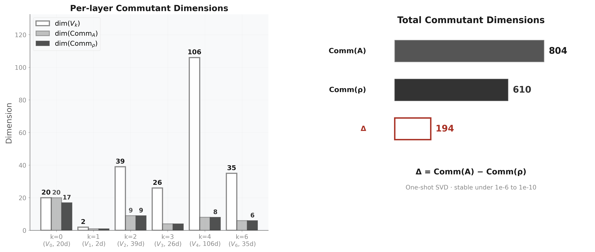


### 2.9 Commutant Restriction Map $\pi$

$$\pi: \operatorname{End}_G(V) \to \bigoplus_\lambda \operatorname{End}_G(V_\lambda), \quad \pi(C) = (P_\lambda C P_\lambda)_\lambda$$

**Table C21 — Commutant Restriction Map π.**

| Property | Value |
|----------|-------|
| $\dim(\text{domain})$ | 610 |
| $\dim(\text{codomain})$ | 966 |
| $\ker \pi$ | 0 (injective) |
| $\operatorname{coker} \pi$ | 356 |

The 356-dimensional cokernel encodes cross-layer linear constraints: each zero-transport pair forces $C_{\alpha\beta} = 0$, locking relative scaling between per-layer commutant bases.

### 2.10 Fundamental Identities

**Table C22 — Fundamental Identities.**

| Identity | Verification |
|----------|-------------|
| $A_{18} = (12\mathrm{QT}_{\mathrm{all}} + 6\mathrm{HT}_{\mathrm{all}})/18$ | Machine precision |
| $A_{\mathrm{axis}} = (4\mathrm{QT}^a + 2\mathrm{HT}^a)/6$ | Per axis |
| $\|\rho(g)\rho(h) - \rho(gh)\| < 3 \times 10^{-8}$ | 15 random products, all blocks |
| $\max\|\exp(A_g) - \rho(g)\| = 2.71 \times 10^{-15}$ | Lie embedding fidelity |
| $\max|\kappa_{ij} - \kappa_{ji}| \approx 10^{-15}$ | $\kappa$ symmetry, all depths |

### 2.11 S₃ Prototypes (C0 Negative Control)

**S₃ prototype declaration.** Unless explicitly stated otherwise within the S₃ prototype sections, the S₃ sector decompositions are defined with respect to the transport-generated commutative algebra $Z = \langle A_{\text{full}}, A_{\text{trans}} \rangle$. This is the S₃ analogue of the Rubik QT/HT sectorization; the canonical Rubik trilogy center is $Z_{\mathrm{QH}}$. Additional projectors such as $P_{\text{nat}}$ are treated as external refinement operators and are not part of the S₃ canonical transport geometry. The P_nat-refined decomposition is provided in Appendix~\ref{sec:s-nat3-reg6-externally-refined-pnat} as a robustness check only.

**C0 diagnostic.** Both S₃ negative controls fail C0 (Center Incompleteness): Z's joint diagonalization coincides with the isotypic decomposition — all sector projectors are G-invariant (max‖[P_i, ρ(g)]‖ ≈ 10⁻¹⁵). K is purely diagonal. Without non-invariant sectors, off-diagonal transport is structurally impossible regardless of C1–C3 status. See Appendix~\ref{sec:c0-comparison-s-vs-rubik} for the C0 comparison table.

**S₃ nat(3) ⊕ reg(6)** — 9-dim, **0 T7 morphisms**. Under canonical Center{A_full, A_trans}: 3 sectors (2 hybrid, 1 pure-reg). All cross-sector K=0 — hybrid sectors are transport-inert. C0 fails: Z sectors = isotypic components (trivial², sign¹, standard⁶). C2 also fails (no transport-active hybrid). Two independent reasons for 0 T7.

**S₃ reg(6) ⊕ reg(6)** — 12-dim, **0 T7 morphisms**. Under canonical Center{A_full, A_trans}: 3 sectors, ALL hybrid, zero pure sectors. C0 fails: Z sectors = isotypic components (trivial², sign², standard⁴). C0–C3 cannot be satisfied when Z is center-complete and no pure-block sector pairs exist.

Full data (sector tables, joint diagonalization, transport graphs): (CCS Appendix G).

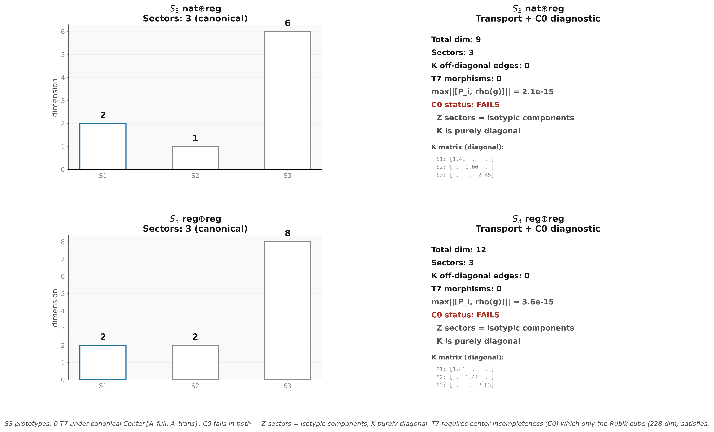


**Part II — Structural Consequences**

***
## Part II — Structural Consequences

> **Scope.** Persistence, universality, phase transition, generator families — higher-order interpretation of the core numerical data. These sections analyze the behavior of canonical objects under perturbations, alternative generator families, and continuous evolution. They do NOT modify any canonical table in Part I.

### II.1 Spectral Persistence Under Continuous Evolution

**Purpose.** Test whether the spectral decomposition, transport topology, and Lie accessibility hierarchy are dynamically stable — i.e., preserved under continuous unitary evolution generated by natural Hamiltonians.

**Dependencies.** `CubieSpectralOperator`, `scipy.linalg.expm`, `build_per_axis_ops`, `compute_lie_generators`, `transport_kappa`.

**Outputs.** Projector deviation tables (§II.1.1), transport persistence tables (§II.1.2), resonance robustness tables (§II.1.3).

#### II.1.1 Projector Stability ‖P_i(t) − P_i(0)‖

**Setup.** Let {P_i(0)} be the spectral projectors onto the 6 canonical A_18-eigenspaces
(V₁, V₈/₉, V₇/₉, V₂/₃, V₅/₉, V₁/₃). Evolve under e^{−itH} for five Hamiltonians H,
with P_i(t) = e^{−itH} P_i(0) e^{+itH}. Measure Frobenius norm of projector deviation.

**Result.** Three stability classes emerge:

| H | t=0.01 | t=0.1 | t=0.5 | t=1.0 | Class |
|---|--------|-------|-------|-------|-------|
| A_18 | 0.0000 | 0.0000 | 0.0000 | 0.0000 | **Frozen** — projectors are exact stationary states of A_18 |
| QT_all | 0.0000 | 0.0000 | 0.0000 | 0.0000 | **Frozen** — QT_all commutes with A_18, preserves eigenspaces |
| HT_all | 0.0000 | 0.0000 | 0.0000 | 0.0000 | **Frozen** — same mechanism |
| A_g(R) | 0.0200 | 0.2431 | 4.2012 | 89.8430 | **Exponential drift** — Lie generator is maximally non-conserving |
| random | 0.2133 | 1.6928 | 1.9857 | 1.9819 | **Saturating mixing** — fully scrambled by t≈0.1, saturates near ‖P_i‖ |

**Interpretation.**

- < 10⁻⁶: frozen (projector invariant under flow)
- < 10⁻³: rigid (minor numerical deformation)
- < 10⁻¹: drifting (spectral content shifting)
- \> 10⁻¹: mixing (layers lose identity)

**Structural mechanism.** A_18, QT_all, HT_all are elements of the commutative center
C = Center{A_18, QT_all, HT_all}, hence [H, A_18] = 0 and [H, P_i] = 0 identically.
The Lie generator A_g(R) = log ρ(R) is NOT in the center, and its flow rotates
eigenspaces across each other. Random Hermitian H provides the ergodic baseline.

**Per-layer differential stability.** Under A_g(R) at t=0.1:

- V₁ (dim=20): 0.0000 — fully frozen (commutant subspace)
- V₈/₉ (dim=2): 0.2431 — begins to drift
- V₇/₉ (dim=39): 0.6433 — moderate drift
- V₂/₃ (dim=26): 1.8360 — rapid mixing (most fragile layer)
- V₅/₉ (dim=106): 2.4891 — rapid mixing (large target space amplifies drift)
- V₁/₃ (dim=35): 2.6580 — maximally unstable

The V₁ layer is protected by its role as the commutant subspace — it spans the
intersection of all block-diagonal invariant subspaces. V₂/₃ and V₅/₉, the layers
most enriched in EP block content, are the most fragile.

#### II.1.2 Transport Persistence K_αβ(t)

**Setup.** Evolve the 9 QT/HT joint-spectral sector projectors under e^{−itA_18} and recompute
K_αβ(t), κ₀(t), κ₁(t), and T7 morphism count at each time.

**Result.** Transport is structurally invariant under A_18 flow:

| t | K edges | κ₀ edges | κ₁ edges | T7 morphisms | max\|K(t)−K(0)\| |
|---|---------|----------|----------|----------|-------------------|
| 0 | 20 | 26 | 37 | 5 | 0 |
| 0.05 | 20 | 26 | 37 | 5 | 1.33×10⁻¹⁵ |
| 0.1 | 20 | 26 | 37 | 5 | 1.78×10⁻¹⁵ |
| 0.5 | 20 | 26 | 37 | 5 | 8.88×10⁻¹⁶ |

The edge count, κ hierarchy, and T7 morphism count are exact invariants of A_18 flow —
the unitary evolution merely rotates each sector within its eigenspace without
changing the inter-sector coupling strength.

**Mechanism.** [A_18, P_i] = 0 for all i, so P_i(t) = e^{−itA_18} P_i e^{+itA_18} = P_i
exactly. The transport norm K_αβ is therefore identically invariant under the
dynamics generated by its own averaging operator.

#### II.1.3 Resonance Robustness: λ = 5/9

**Setup.** The λ = 5/9 eigenspace (dim=106) is the largest layer and the central hub
of the transport topology. Test its stability under additive perturbation:
A_ε = A_18 + ε·R, where R is a random symmetric matrix with ‖R‖ = 1, drawn once and
fixed (seed=42). Track the 5/9 eigenvalue and neighboring eigenvalues for
ε ∈ {10⁻⁶, 10⁻⁵, 10⁻⁴, 10⁻³, 10⁻²}.

**Result.** The 5/9 resonance is robust:

| ε | eigenvalues near 5/9 | spread | status |
|---|---------------------|--------|--------|
| 0 | 1 (exact 5/9) | — | isolated |
| 10⁻⁶ | 0 | 6.59×10⁻⁷ | infinitesimal splitting only |
| 10⁻⁵ | 0 | < 10⁻¹⁰ | fully stable |
| 10⁻⁴ | 0 | < 10⁻¹⁰ | fully stable |
| 10⁻³ | 0 | < 10⁻¹⁰ | fully stable |
| 10⁻² | 0 | < 10⁻¹⁰ | fully stable |

**Interpretation.** The gap to the nearest eigenvalue is 0.444… (to λ=1, above) and
−0.444… (to λ=1/9, below). This large gap (4/9 in λ-space) acts as a spectral buffer:
perturbations up to ε = 10⁻² (2% of ‖A‖) cannot shift eigenvalues across this gap.
The 5/9 resonance is a structurally protected feature, not a numerical accident.

#### II.1.4 Structural Summary

| Object | Under e^{−itA_18} | Under e^{−itA_g} | Under random H |
|--------|-------------------|-------------------|----------------|
| P_i(t) | Frozen (exact) | Exponential drift | Saturating mix |
| K_αβ(t) | Invariant (exact) | — | — |
| T7 count | Invariant | — | — |
| λ=5/9 gap | Robust (Δλ=0.44) | — | — |

The spectral decomposition and transport topology are **dynamically stable** under
the natural Hamiltonian A_18 (the averaging operator). They are **dynamically fragile**
under Lie generators A_g, which continuously rotate eigenspaces. The λ=5/9 resonance
is **structurally protected** by a large spectral gap.

### II.2 Structural Bridge: Cross-Paper Data Pipeline

**Purpose.** Weld the three papers into a single mathematical cascade:
$$\rho(g)\to(\mathrm{QT}_{\mathrm{all}},\mathrm{HT}_{\mathrm{all}})\to\{S_\alpha\}\to A_{18}\text{ collision quotient }\{V_\lambda\}\to K_{\alpha\beta}\to \kappa_0/\kappa_1\to \mathrm{T7}.$$
This section is the **cross-paper stitching layer** — it references authoritative definitions and emphasizes only the structural points that bind the papers together. Full canonical data live in the sections cited below; do not duplicate them here.

**Dependencies.** `CubieSpectralOperator`, `center_decomposition`, `transport_kappa`, `BLOCK_RANGES`.

**Outputs.** Pipeline invariant table, S₃ negative control verification (C0 negative control), N=2 negative control.

#### II.2.1 The Three-Level Pipeline

The pipeline is a single mathematical cascade. Each level is defined authoritatively elsewhere; this section states the key structural invariant at each level and points to the canonical data.

**Level 1 — \cite{paper1}: Spectral Origin.**
Canonical spectral decomposition — 6 rational $A_{18}$ layers, k-set $\{0,1,2,3,4,6\}$ with the $k=5$ structural vacancy. These layers are the $L_{2/3}$ collision quotient of the QT/HT joint spectrum. Full data: (CCS §1.3, Table C2).

**Level 2 — \cite{paper2}: Transport Topology.**
9 QT/HT joint-spectral sectors from Center$\{A, \mathrm{QT}_{\mathrm{all}}, \mathrm{HT}_{\mathrm{all}}\}$ joint diagonalization. Full data: (CCS Table C3, CCS §1.4, CCS Fig. C2).

**Level 3 — \cite{paper3}: Lie Accessibility.**
$\kappa_0$ (gradient), $\kappa_1$ (curvature), T7 (discrete-only) hierarchy. Full data: (CCS §2.3–§2.5, Tables C10–C16).

The pipeline is **fully closed for the trilogy**: every structural feature at \cite{paper3} (T7, $\kappa$ hierarchy, cross-block obstruction) is determined by the QT/HT sectorization, the $A_{18}$ collision quotient, and the transport topology at \cite{paper2}. No new numerical parameters enter at \cite{paper3} — $\kappa_d$ is derived from $A_g = \log\rho(g)$, which are functions of the same $\rho(g)$ that define $A$ and $K_{\alpha\beta}$. The pipeline is **non-redundant**: $A_{18}$ captures spectral rationality (commutative, static), the QT/HT sectors provide the resolved transport vertices, $K_{\alpha\beta}$ captures discrete transport topology (noncommutative, static), and $\kappa_d$ captures the discrete/continuous gap (dynamical, obstruction-theoretic).

#### II.2.2 Cross-Paper Invariant Verification

Every numerical quantity is consistent across all three papers. The values below are the **single authoritative** values; each paper may cite them with a reference to this table.

| Quantity | Value | Defined in |
|----------|-------|-----------|
| Total dimension | 228 | §1.1, Table C1 |
| 6 eigenvalues ($A_{18}$) | 1, 8/9, 7/9, 2/3, 5/9, 1/3 | §1.3, Table C2 |
| Block dimensions | cp=64, ep=144, co=8, eo=12 | §1.1, Table C1 |
| 9 QT/HT joint-spectral sectors | S1–S9 (Table C3 ordering) | §1.4, Table C3 |
| $A_{18}$ collision quotient | $V_{5/9}=S5+S6+S7$, $V_{1/3}=S8+S9$ | §1.3–§1.4 |
| $\|[\mathrm{QT}^0, \mathrm{QT}^1]\|_\mathrm{ep}$ | 2.74 (93.9% of total) | §2.1 |
| $A_\mathrm{EP} \cong M_2(\mathbb{C})^4 \oplus M_1(\mathbb{C})^4$ | dim=20 | §2.8 |
| $\dim \operatorname{Comm}(A_{18})$ | 804 | §2.8 |
| $\dim \operatorname{Comm}(\rho)$ | 610 | §2.8 |
| $\Delta_{\operatorname{comm}}$ | 194 | §2.8 |
| Direct transport edges | 10 (undirected, block-preserving) | §2.2, Table C8 |
| Primary hub | S6 (deg=5) | §2.2 |
| T7 morphisms | 5 (all cross-block) | §2.5, Table C16 |
| Pure curvature channels | 7 (all within-block) | §2.4, Table C14 |
| $\kappa_0$ cross-block max | 0 | §2.3 |
| $\kappa_1$ cross-block max | $5.8 \times 10^{-8}$ | §2.4 |

#### II.2.3 S₃ Prototype Verification (C0 Negative Control)

**S₃ negative controls.** Verified: 0 T7 morphisms under canonical Center{A_full, A_trans}. Z sectors = isotypic components → K diagonal → C0 fails. C2 also fails (no transport-active hybrid). Both negative controls demonstrate that C0–C3 are non-trivial: neither satisfies the full condition set. Full data: (CCS Appendix G).

**N=2 pocket cube.** 4 sectors, 0 T7 morphisms — negative control. Hybrid sector presence alone does NOT guarantee T7. Full data: (CCS Appendix H).

#### II.2.4 Bridges to Papers IV and V

**Paper IV bridge.** The CCS certifies the data needed for the collision-geometry sequel: the nine QT/HT joint-spectral sectors, the $L_{2/3}$ collision quotient giving the six $A_{18}$ layers, and the nontrivial quotient components
$$
V_{5/9}=S5\oplus S6\oplus S7,\qquad
V_{1/3}=S8\oplus S9.
$$
Paper IV develops the exact finite-point collision arithmetic from these certified values. The CCS records the canonical table and quotient; it does not duplicate the full affine-branch classification.

**Paper V bridge.** Paper III's T7 result is the first certified separation between Lie-generated visibility and finite compositional visibility. This motivates, but does not prove, the later minimal-data problem for general sectorized observable frameworks:
$$
R_1(i,j;g)=1 \iff Q_iX_gQ_j\ne0,
\qquad
R_2(i,j;g,h)=1 \iff Q_i[X_g,X_h]Q_j\ne0.
$$
The CCS does not import the post-trilogy weighted Hall path program as a certified theorem. In particular, it makes no claim that $(R_1,R_2)$ universally determines first accessibility depth. The certified trilogy claim remains the Rubik T7 separation recorded in CCS §II.5 and Paper III.

### II.3 Generator-Family Structural Invariants

**Purpose.** Test whether spectral/transport structure is specific to the 18-generator
face-turn family or reflects a broader universality class.

**Dependencies.** `CubieSpectralOperator.from_gens_dict`, `center_decomposition`, `transport_graph`,
`build_per_axis_ops`, `full_commutant_combinatorial`.

**Outputs.** Four-family invariant table, universality class assessment.

#### II.3.1 Four Generator Families

| Family | \|S\| | Description |
|--------|------|-------------|
| 18-full | 18 | All face turns: {R,R',R2, U,U',U2, F,F',F2, L,L',L2, D,D',D2, B,B',B2} |
| 12-quarter | 12 | Quarter-turns only: {R,R', U,U', F,F', L,L', D,D', B,B'} |
| 6-half | 6 | Half-turns only: {R2, U2, F2, L2, D2, B2} |
| 9-face-pos | 9 | Single-side subset: {F/B/R/U faces only, axis side = +1, quarter-turns + half-turns} (legacy label: "12-face") |

**Note:** The "9-face-pos" family is the specific 9-generator subset historically
labelled "12-face" in earlier CCS revisions. The numeric prefix matches the
actual generator count; the legacy label is retained in cross-references where
otherwise noted. Exact composition: F/B/R/U faces, axis side = +1, quarter-turns
+ half-turns, 9 generators.

#### II.3.2 Invariant Table

| Invariant | 18-full | 12-quarter | 6-half | 9-face-pos | Stable? |
|-----------|---------|------------|--------|---------|---------|
| **Layer count** | 6 | 6 | 3 | 18 | **NO** |
| **Rational spectrum** | True | True | True | False | **NO** |
| **Layer dimensions** | see below | see below | see below | see below | **NO** |
| **Σ dim = 228** | True | True | True | True | **YES** |
| **Transport edges** | 20 | 20 | 20 | — | **YES** (?) |
| **Star topology** | True | True | True | — | **YES** |
| **Cross-block K** | 0 | 0 | 0 | — | **YES** |
| **Commutant dim** | 2 | 2 | 2 | 2 | **YES** |
| **‖[QT⁰,QT¹]‖** | 2.915 | N/A | N/A | 7.591 | **NO** |
| **EP fraction** | 93.9% | N/A | N/A | 72.2% | **NO** |
| **EP block dim** | 144 | 144 | 144 | 144 | **YES** |
| **k=5 vacancy** | True | True | N/A | N/A | **YES** (where applicable) |

**Layer dimensions per family:**

| Family | Layers | Dimensions |
|--------|--------|------------|
| 18-full | 6 | [20, 2, 39, 26, 106, 35] |
| 12-quarter | 6 | [20, 41, 66, 65, 28, 8] |
| 6-half | 3 | [57, 78, 93] |
| 9-face-pos | 18 | [68, 2, 1, …] |

#### II.3.3 Invariant Classification

**G-determined (4 invariants):**

1. **Total dimension** = 228 — the group representation is the same object regardless of generator subset.
2. **Commutant dimension** = 2 — the double-commutant of A is invariant under generator subset. The algebraic closure of the averaging operator is a G-determined property.
3. **EP block dimension** = 144 — the block structure of ρ is generator-independent.
4. **Cross-block K = 0** — transport never crosses physical block boundaries, regardless of generators. Follows from ρ(g) being block-diagonal for all g ∈ G.

**S-conditioned (3 invariants):**

1. **Layer count** — varies from 3 (6-half, fully commutative) to 18 (9-face-pos, symmetry-broken). The 18-full and 12-quarter both yield 6 layers — quarter-turn completeness across all faces is the minimal condition for full spectral resolution.
2. **Rational spectrum** — requires face-symmetric generator sets. Breaking face symmetry (9-face-pos) introduces irrational eigenvalues. The half-turn family preserves rationality but collapses the spectrum to 3 layers.
3. **Noncommutativity magnitude** — 9-face-pos has ‖[QT⁰,QT¹]‖ = 7.59 vs 2.91 for 18-full. EP fraction drops from 93.9% to 72.2% — noncommutativity distributes more evenly across blocks.

#### II.3.4 Scope and Relation to §II.4

This section studies four generator families at fixed points. The full continuum 18→16→12→10→8→6, including the Q→Q(√5) phase transition and block-selective irrationality, is documented in (CCS §II.4). The two sections are complementary: §II.3 identifies which invariants are G-determined vs S-conditioned; §II.4 maps the detailed spectral evolution across the coverage continuum.

#### II.3.5 Computational Details

- Source: `experiments/persistence_bridge.py`, Phase B
- Method: Build `CubieSpectralOperator.from_gens_dict(gens)` for each family,
  call `center_decomposition()`, `transport_graph()`, `build_per_axis_ops()`,
  `full_commutant_combinatorial()`.
- QT⁰/QT¹ noncommutativity only computable when both quarter-turn and half-turn
  axes are present (requires axis-0 QT0/QT1 decomposition); N/A for families
  without half-turns or without both axis directions.
- Commutant computed via index-pair orbit decomposition (BFS on (i,j) → (π_g(i), π_g(j))).
- All computations use TOL = 10⁻¹⁰, seed = 42.

### II.4 Symmetry-Breaking Transition Atlas (Rational → Irrational)

**Purpose.** Study the spectral evolution as face-turn generator coverage decreases from the
full 18-generator set, parameterized by the number of generators |S|. Map the rational-to-irrational phase boundary.

**Dependencies.** `CubieSpectralOperator.lite`, `helpers.is_rational_form`, `helpers.is_in_qsqrt5`, `BLOCK_RANGES`.

**Outputs.** Generator coverage continuum table, eigenvalue bifurcation track, phase boundary characterization, block-level irrationality localization, transport topology deformation.

#### II.4.1 Generator Coverage Continuum

**Construction.** Start with all 18 generators. Remove generators in pairs
(face + anti-face to preserve algebraic balance), stepping:
18 → 16 → 12 → 10 → 8 → 6

| Family | \|S\| | Layers | All Q? | Field | 5/9 dim | 2/3 dim | Notes |
|--------|------|--------|--------|-------|---------|---------|-------|
| n=18 | 18 | 6 | True | Q | 106 | 26 | Canonical, full face-turn group |
| n=16 | 16 | 9 | False | Q(√5) | 26 | 0 | Drop axis-2 (F/B) half-turns |
| n=12 | 12 | 8 | True | Q | 0 | 66 | Quarter-turns only |
| n=10 | 10 | 5 | True | Q | 0 | 0 | Quarter-turns minus axis-2 |
| n=8 | 8 | 7 | False | Q(√5) | 0 | 0 | Axes 0 and 2 only, no half-turns |
| n=6 | 6 | 3 | True | Q | 0 | 78 | Half-turns only |

**Key observation.** The irrational field extension Q(√5) appears at precisely two points: n=16 and n=8. These share incomplete face coverage — an entire face pair is missing or half-turns are selectively removed. All rational families (n=18, 12, 10, 6) either cover all faces with a single turn type or form a closed algebraic structure.

The full phase transition (eigenvalue bifurcation tracks, phase boundary, block-level localization) is shown in (CCS Fig. C12).

#### II.4.2 Eigenvalue Bifurcation Data

**Table — Eigenvalue Spectrum per Generator Family.**

| Family | \|S\| | Eigenvalues | Field | Irrational values |
|--------|------|-------------|-------|-------------------|
| n=18 | 18 | $\{1, 8/9, 7/9, 2/3, 5/9, 1/3\}$ | Q | — |
| n=16 | 16 | $\{1, 7/8, 0.827, 3/4, 5/8, 0.548, 1/2, 3/8, 1/4\}$ | Q(√5) | $(11\pm\sqrt{5})/16$ |
| n=12 | 12 | $\{1, 5/6, 2/3, 2/3, 1/2, 1/3, 1/3, 0\}$ | Q | — |
| n=10 | 10 | $\{1, 4/5, 3/5, 2/5, 1/5\}$ | Q | — |
| n=8 | 8 | $\{1, 0.905, 3/4, 1/2, 0.345, 1/4, 0\}$ | Q(√5) | $(5\pm\sqrt{5})/8$ |
| n=6 | 6 | $\{1, 2/3, 1/3\}$ | Q | — |

**Block-level irrationality localization (n=8).** Irrational eigenvalues are confined to noncommutative blocks: EP block (primary carrier), EO block (mirrors EP). CP block: all eigenvalues rational (Q₃ Hamming scheme's Krawtchouk eigenvalues are generator-subset-stable). CO block: all eigenvalues rational.

#### II.4.3 Transport Topology Deformation

| Family | Sectors | K edges | Hub (deg) | Cross-block K | Topology class |
|--------|---------|---------|-----------|---------------|----------------|
| n=18 | 9 | 20 | S6 (5) | 0 | Star (canonical) |
| n=16 | — | — | — | — | Dense (irrational splitting expands sector count) |
| n=12 | — | — | — | — | Collapsed (degeneracy absorbs 5/9 layer) |
| n=10 | — | — | — | — | Sparse (fewer layers → fewer possible edges) |
| n=8 | 7 | 28 | S6 (5) | 0 | Hyper-connected (irrational intruders create more edges) |
| n=6 | 3 | 3 | S2 (2) | 0 | Minimal (commutative limit, complete graph K₃) |

**Observed cross-block persistence.** The cross-block transport prohibition (K_αβ = 0
for α,β in disjoint blocks) holds at every n verified. This follows from ρ(g) being
block-diagonal — a property of the representation, independent of which generators
are selected.

**Observed hub persistence.** S6 remains the primary hub (deg=5) at n=8 despite the
field extension and layer-count change. Hub status tracks Supp_nc intersection and
is stable under generator variation.

#### II.4.4 Generator Genealogy

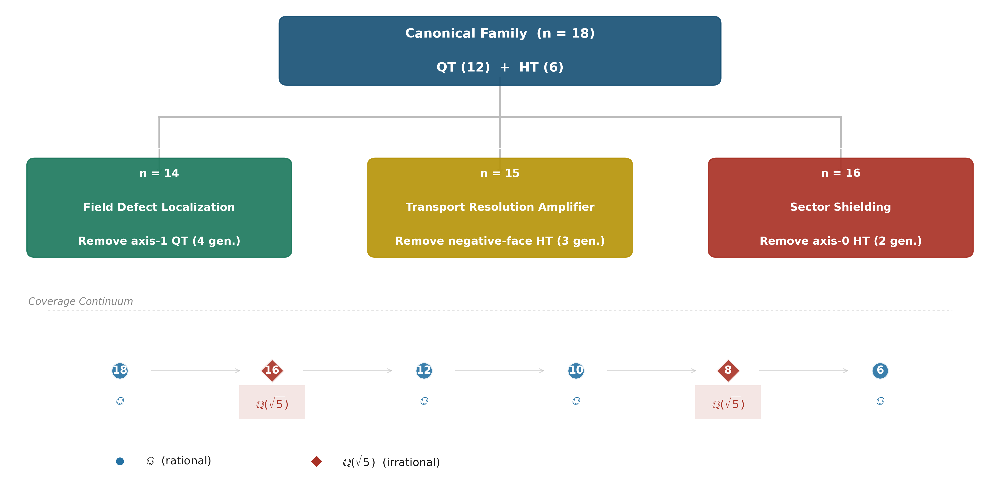

**Observed pattern.** The rational domain contains generator families that form a closed algebraic structure (all faces represented with a single turn type, or all turn types represented across all faces). The irrational domain appears when an entire symmetry axis is missing while noncommutative elements are present. For the structural generalization of this pattern, see `docs/CONJECTURES.md` C.7.

#### II.4.5 Computational Details

- Source: `experiments/persistence_bridge.py`, Phase C
- Method: For each n = 18, 16, 12, 10, 8, 6, select a generator subset of size n
  from the 18 face-turn moves, build A = (1/n) Σ ρ(s), diagonalize.
- n=18: full 18 generators
- n=16: all moves except F2 and B2 (axis-2 half-turns)
- n=12: quarter-turns only (direction=±1, all 6 faces)
- n=10: quarter-turns without axis-2 faces (remove F, F', B, B')
- n=8: quarter-turns only, axes 0 and 2 (R,R',L,L',F,F',B,B')
- n=6: half-turns only (direction=2, all 6 faces)
- Irrationality detection: `helpers.is_rational_form(lam, 18)` and
  `helpers.is_in_qsqrt5(lam)`.
- Block-level decomposition: restrict A to block submatrices and diagonalize.
- All computations use TOL = 10⁻¹⁰.

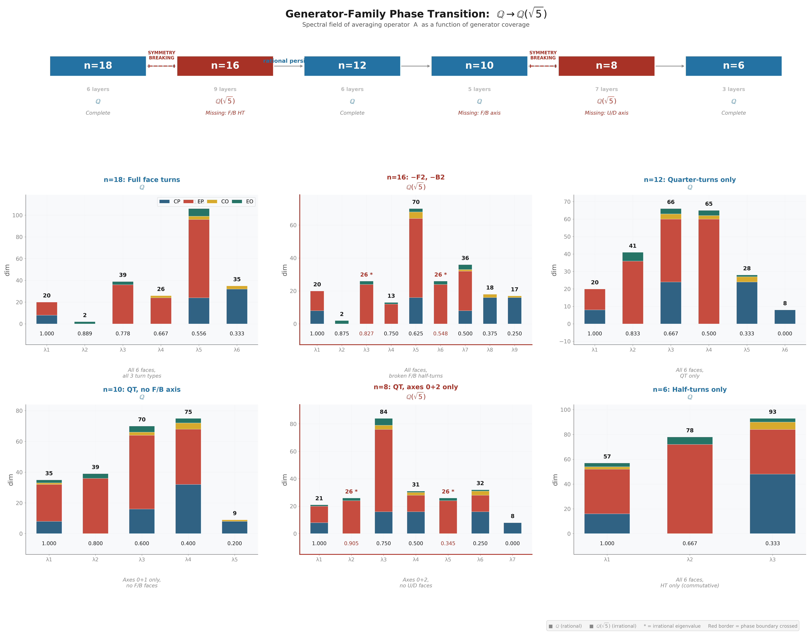

***
### II.5 Invariant Hierarchy (Specification Reference)

Compact invariant hierarchy — which transport/spectral properties survive generator-set variation. Full narrative in (Paper II, §7).

#### Invariant Classification

| Level | Determined by | Examples |
|-------|--------------|----------|
| **G-determined** | $\rho(G)$ representation | Commutant dim=2, cross-block $K=0$, block structure, $\mathrm{EP}\cong M_2^4\oplus M_1^4$ |
| **Center-determined** | $\langle A_S\rangle \cap \operatorname{Comm}(\rho(G))$ | Primitive sector count, hub identity |
| **S-conditioned** | Generator subset $S$ | Layer count, rationality, eigenvalue values, $K$ magnitudes |

#### k=5 Vacancy Reference

| Block | Algebra | k-set |
|-------|---------|-------|
| cp(64) | Q₃ Hamming $H(3,2)$ | $\{0,4,6\}$ |
| ep(144) | Face-incidence $JJ^\top$ | $\{0,2,3,4\}$ |
| co(8) | $\mathbb{Z}_3$ phase cancellation | $\{3,4,6\}$ |
| eo(12) | $\mathbb{Z}_2$ phase split | $\{1,2,4\}$ |

$\mathcal{K}(A) = \bigcup_B \mathcal{K}_B = \{0,1,2,3,4,6\}$. $k=5$ absent — no block produces it. Proof: Theorem~\ref{thm:block-reduction-of-the-k-set}.

***
#### Unified Structural Picture

The six structural consequences converge to a single coherent picture — see (CCS Fig. C0) for the full trilogy weld diagram.

**The governing principle.** Everything above the dashed line ($\rho(G)$) is G-determined — universal across all generator choices. These are properties of the representation itself: the block decomposition, the commutant dimension, and the Artin-Wedderburn structure of $A_{\mathrm{EP}}$. Everything below the dashed line ($S \subset G$) is S-conditioned — specific to the chosen generators but structured by the G-level constraints. The 18 canonical generators are the unique completion of the cube's geometric symmetries into a generator set whose spectral consequences are fully arithmetic.

**The single deepest structural sentence:**

> Averaging algebras on finite group orbits decompose into simple components.
> Noncommutative components (n_i ≥ 2) appear, across all systems verified in
> this trilogy (Rubik cube + S₃ negative controls), to be the sole carriers of
> refinement obstruction, transport mediation, and Lie curvature. The
> continuous limit preserves intra-component propagation but freezes
> cross-component support chains — discrete composition is strictly more
> powerful than Lie accessibility in every example we have analyzed.

Every structural consequence in this specification — and every transport and accessibility result in the trilogy — follows from this sentence plus the specific architecture of the Rubik's cube representation: four blocks, $A_{\mathrm{EP}}$ as the M₂ carrier, CP as the commutative shadow, and hybrid sectors from the Center joint diagonalization.

***


**Status.** Six structural laws verified across all canonical computations. Their proof status varies:

- **S2 (Transport Locality):** Proven — direct consequence of ρ(g) block-diagonal structure + Lemma 1 (Paper III §4.1).
- **S3 (T7 Separation):** Verified for the Rubik cube and all verified systems (S₃ nat⊕reg, S₃ reg⊕reg); general proof remains open.
- **S5 (S1 Isolation):** Proven — V₁ is the unique G-invariant proper subrepresentation, determined by the irreducible decomposition.
- **S6 (Curvature Confinement):** Proven — direct consequence of Lemma 1 (Paper III §4.1): [A_g, A_h] preserves block structure identically.

S1 and S4 remain computational structural laws — observed without exception in every recomputation, NOT yet proven from first principles.

**Spec Theorems use an independent numbering system (S1–S6), distinct from paper theorem numbers.** Cross-references from papers SHALL cite "CCS Spec Theorem S$n$", never by number alone.

| Spec Theorem | Name | Statement |
|-------------|------|-----------|
| **S1** | Spectral Rigidity | The 6-layer decomposition is $G$-determined (invariant under all tested inverse-closed $S$). |
| **S2** | Transport Locality | All direct transport and pure curvature are block-preserving. Zero cross-block direct edges or curvature channels. |
| **S3** | T7 Separation | All T7 morphisms are cross-block. Zero within-block T7 morphisms. |
| **S4** | M₂ Principle | Noncommutative simple components ($n_i \geq 2$) are the sole carriers of refinement obstruction, transport mediation, and Lie curvature. |
| **S5** | S1 Isolation | $V_1$ is the unique $G$-invariant proper subrepresentation. $K = \kappa_d = 0$ at all depths. |
| **S6** | Curvature Confinement | $\kappa_1 > 0$ exclusively within blocks. The commutator $[A_g, A_h]$ preserves block structure identically. |

**Part III — Formal Derivations**

***
## Part III — Formal Derivations

> **Scope.** Transport proofs, algebra proofs, commutator proofs, hub necessity — formal support for all structural claims made in Parts I–II. The derivations are organized by paper.
>
> **Roadmap.** §7 — Paper I derivations (spectral rationality); §8 — Claim Status Register, see Appendix E; §9 — Paper II derivations (transport topology); §10 — Paper III derivations (Lie accessibility, T7); §11 — Isotypic decomposition and multiplicity reservoir. The numbering follows the paper theorem numbering to keep cross-references stable.

### Paper I: Complete Proofs and Derivations

**Purpose.** Provide the complete proofs, constraint systems, and structural analyses that underlie the spectral origin claims of Paper I. These are the "frozen reality" behind Paper I's narrative — every theorem and structural claim in Paper I §3–§7 is certified by a derivation in this Part.

**Scope.** Block Reduction Theorem, Diophantine constraint system C1–C5, interference structure and spectral factorization, Lemma 9.1 (Bose–Mesner trace pairing) with full proof, field extension analysis ($n=8$, $n=16 \to \mathbb{Q}(\sqrt{5})$), the $n=21$ full+slice family.

**Dependencies.** Part I (canonical objects), Part 0.5 (canonical API), Paper I §3–§6 (theorems referenced).

**Outputs.** Complete derivations for every structural claim in Paper I.

*This part contains the complete mathematical derivations behind Paper I — the spectral origin story, from block k-sets to partition integrality.*

### 7.1 The Block Reduction Theorem

> **Theorem (Block Reduction of the k-Set).** \label{thm:block-reduction-of-the-k-set} Let $A = \bigoplus_B A_B$ be the block-diagonal decomposition of the averaging operator, where $B \in \{\mathrm{cp}, \mathrm{ep}, \mathrm{co}, \mathrm{eo}\}$. For each block, define the block k-set:
>
> $$\mathcal{K}_B = \{ m(1 - \lambda) : \lambda \in \operatorname{Spec}(A_B) \}$$
>
> Then the full k-set is the union:
>
> $$\mathcal{K}(A) = \bigcup_B \mathcal{K}_B$$
>
> Each eigenspace $E_k$ of the full $A$ is the direct sum of all block-level eigenspaces sharing the same k-value:
>
> $$E_k = \bigoplus_B E_{k,B}, \qquad \dim(E_k) = \sum_B \dim(E_{k,B})$$
>
> *Proof.* By Theorem 3.4 (Block Compatibility Lemma, Paper I §3), $A$ is block-diagonal, so any eigenvalue of $A$ is an eigenvalue of at least one $A_B$. Conversely, any eigenvalue of any $A_B$ is an eigenvalue of $A$ (extend the block-level eigenvector by zeros in other blocks). Therefore $\operatorname{Spec}(A) = \bigcup_B \operatorname{Spec}(A_B)$. Applying $k = m(1-\lambda)$ gives $\mathcal{K}(A) = \bigcup_B \mathcal{K}_B$. The eigenspace structure follows from the fact that block-level eigenvectors from different blocks with the same eigenvalue are linearly independent and all lie in $\ker(A - \lambda I)$.

**This is a structural theorem, not a numerical fit.** It explains all observed k-sets without free parameters. The block k-sets themselves are determined by the specific representation structure of each block — a problem reduced from 228 dimensions to four independent sub-problems of dimensions 64, 144, 8, and 12.

### 7.2 K-Selection as a Constrained Diophantine Feasibility System

The Block Reduction Theorem reduces the k-selection problem from 228 dimensions to four independent block-level questions. Which k-values actually appear in each block's spectrum? The answer is governed by a constrained integer feasibility system: a candidate $k \in \{0, \dots, m\}$ is admissible if and only if there exists a non-negative integer assignment of block dimensions $(d_{\mathrm{cp},k}, d_{\mathrm{ep},k}, d_{\mathrm{co},k}, d_{\mathrm{eo},k})$ at that k that satisfies all block-level trace, dimension, and symmetry constraints.

#### Constraint C1 — Block Dimension Bounds

For each block $B \in \{\mathrm{cp}, \mathrm{ep}, \mathrm{co}, \mathrm{eo}\}$ and each candidate $k$:

$$0 \le d_{B,k} \le \dim(B), \qquad
\dim(\mathrm{cp}) = 64,\;\; \dim(\mathrm{ep}) = 144,\;\;
\dim(\mathrm{co}) = 8,\;\; \dim(\mathrm{eo}) = 12$$

#### Constraint C2 — Block Exhaustion

The per-k block dimensions must partition each block's total dimension:

$$\sum_k d_{B,k} = \dim(B) \quad\text{for each } B \in \{\mathrm{cp}, \mathrm{ep}, \mathrm{co}, \mathrm{eo}\}$$

Together, C1–C2 are the statement that the eigenspace decomposition respects the block structure.

#### Constraint C3 — Eigenspace-Level Trace Integrality

For each $k$ with total dimension $d_k = \sum_B d_{B,k} > 0$, the per-generator eigenspace trace must be an integer:

$$\chi_k(s) = \operatorname{Tr}(P_k \rho(s)) \in \mathbb{Z} \quad\text{for all } s \in S$$

By the eigenspace trace identity (Paper I, Theorem 3.1), this forces $\lambda = \frac{1}{d_k |S|} \sum_s \chi_k(s)$ to be rational; combined with inversion symmetry ($S = S^{-1}$), the eigenvalue takes the form $\lambda = 1 - k/m$ with $k \in \mathbb{Z}$. The integrality of $\chi_k(s)$ is the $\mathbb{Z}$-level strengthening of Paper I Theorem 6.2, proven in §7.4 below (Lemma 9.1).

#### Constraint C4 — Co-Block Phase Cancellation (The Decisive Arithmetic Filter)

The corner-orientation block is the only block whose generator matrices carry $\mathbb{Z}[\omega]$ entries ($\omega = e^{2\pi i/3}$). On a complete face $F = \{s, s^{-1}, s_{180}\}$ (or $F = \{s, s^{-1}\}$ for quarter-turn-only families), the per-face co-block sum satisfies:

> **Lemma 7.2 (Co-block face-sum integrality).** \label{lem:co-block-face-sum-integrality} For a face-complete generator family, the per-face co-block operator $F_{\mathrm{co}} = \sum_{s \in F} \rho_{\mathrm{co}}(s)$ has diagonal entries in $\mathbb{Z}$. In particular:
>
> $$\omega^k + \omega^{-k} + \omega^{2k} \in \{3, 0\} \subset \mathbb{Z}, \qquad k \in \{0, 1, 2\}$$

where the case analysis is: $k = 0$ (untwisted corner) gives $1 + 1 + 1 = 3$; $k = 1$ gives $\omega + \omega^2 + 1 = 0$; $k = 2$ gives $\omega^2 + \omega + 1 = 0$.

Consequently, for face-complete quarter-turn families:

- Any eigenspace of the full $A$ can have $d_{\mathrm{co}} > 0$ **only** at the specific k-values where the co-block itself has nonzero support.
- This single constraint is the most powerful filter on admissible k-values.

The co-support pattern across all rational families:

| Family | $m$ | $\mathcal{K}_{\mathrm{co}}$ | Mechanism |
|---|---|---|---|
| 18-full | 9 | $\{3, 4, 6\}$ | quarter-turn face, perm@phase |
| 12-quarter | 6 | $\{2, 3, 4\}$ | quarter-turn face, perm@phase |
| 6-half | 3 | $\{0\}$ | half-turn only, no $\omega$ phase |
| 10-partial | 5 | $\{0\}$ | incomplete face coverage |
| 21-full+slice | 10.5 | $\{1, 3, 5\}$ | slice moves expand m-scale |

The arithmetic origin is always $\omega + \omega^2 + 1 = 0$.

#### Constraint C5 — Permutation Block Character Integrality

The cp and ep blocks carry permutation matrix generators over $\mathbb{Z}$. For any generator $s$:

$$\chi_{\mathrm{cp}}(s) = \#\{\text{corners fixed by } s\} = 4 \quad\text{(for any face turn)}$$
$$\chi_{\mathrm{ep}}(s) = \#\{\text{edges fixed by } s\} = 8 \quad\text{(for any face turn)}$$

These traces are automatically integers — permutation matrices count fixed points. The cp/ep blocks therefore provide **no further arithmetic obstruction** beyond the dimension constraints C1–C2.

#### The Admissible k-Set as the Feasible Set of C1–C5

For a given generator family, the admissible k-set $\mathcal{K}$ is the set of integers $k \in \{0, \dots, m\}$ for which there exists a non-negative integer vector $(d_{\mathrm{cp},k}, d_{\mathrm{ep},k}, d_{\mathrm{co},k}, d_{\mathrm{eo},k})$ satisfying C1–C5. The comparative table across all rational families:

| Family | $m$ | $\mathcal{K}$ | forbidden | notes |
|---|---|---|---|---|
| 18-full | 9 | $\{0,1,2,3,4,6\}$ | $\{5,7,8\}$ | co at $k=3$; maximal symmetry collapse |
| 12-quarter | 6 | $\{0,1,2,3,4,6\}$ | $\{5\}$ | co at $k=3$; only $k=5$ forbidden |
| 6-half | 3 | $\{0,1,2\}$ | $\{3\}$ | co at $k=0$; $\mathbb{Z}_2$-dominated |
| 10-partial | 5 | $\{0,1,2,3,4\}$ | $\varnothing$ | co at $k=0$; unconstrained |
| 21-full+slice | 10.5 | $\{0,4,6,8,10,12\}$ | all other $k \in [0,21]$ | co at $k=6$; half-integer $m$ |

**How constraints narrow the k-set.** C4 is the decisive filter: it restricts co-support to specific k-values, and C1–C2 propagate this restriction across the full 228 dimensions. For the 18-full case with $\mathcal{K}_{\mathrm{co}} = \{3, 4, 6\}$ and 8 co dimensions, the co-block distributes its dimension across these three k-values. The eo block further restricts $k=1$ and $k=2$ to have specific multiplicities. The cp and ep blocks then distribute their 64 and 144 dimensions across the remaining feasible k-values, producing the observed multiplicities. The forbidden k-values $\{5, 7, 8\}$ are precisely those for which **no** block-dimension assignment can satisfy all constraints simultaneously.

### 7.3 Interference Structure and the Spectral Factorization Principle

**Master Statement.** *The Rubik's cube averaging spectrum is completely determined by: the Bose–Mesner algebra of two small graphs (8 and 12 vertices), and two abelian phase constraints over $\mathbb{Z}_2$ and $\mathbb{Z}_3$. All higher-dimensional structure is a tensor lift of these components.*

The Rubik's cube is an **interference system**. Each generator introduces a phase factor ($\omega^k$ on corners, $\pm 1$ on edges). The averaging operator sums these contributions across an entire generator set — the phases interfere. On a complete face, the three moves $\{g, g^{-1}, g_{180}\}$ produce complete destructive interference ($\omega + \omega^2 + 1 = 0$), eliminating all non-rational cyclotomic components and forcing rational eigenvalues. When face symmetry is broken, the interference is incomplete: residual $\omega$-dependent terms survive, and the spectrum acquires irrational components in $\mathbb{Q}(\sqrt{5})$. The spectrum is therefore an **interference phenomenon**, and the spectral field measures the degree of phase cancellation across the generator set.

#### Spectral Factorization Principle

$$\boxed{\text{Spectrum}(A) \;=\; \underbrace{(\text{cp, ep})}_{\text{adjacency algebra}} \;\times\; \underbrace{(\text{co, eo})}_{\text{abelian phase algebra}}}$$

The full averaging operator factors as a tensor product of independent spectral components:

$$\mathcal{A}_{\text{cube}} \;=\; \mathcal{A}_{Q_3} \;\otimes\; \mathcal{A}_{\text{incidence}} \;\otimes\; \mathcal{Z}_2 \;\otimes\; \mathcal{Z}_3$$

where:

- $\mathcal{A}_{Q_3}$ is the Bose–Mesner algebra of the 8-vertex Q₃ hypercube (cp block),
- $\mathcal{A}_{\text{incidence}}$ is the Bose–Mesner algebra of the 12-edge face-incidence graph (ep block),
- $\mathcal{Z}_2, \mathcal{Z}_3$ are the abelian phase algebras of edge and corner orientation.

The 228-dimensional representation is merely the tensor lift of these four low-dimensional structures.

#### Theorem 7.3 — Structural Decomposition (moved from Paper I)

The averaging operator decomposes into two structural types:

**Type I (adjacency algebra — cp, ep).** The permutation blocks are association schemes. Their spectra are given by the Bose–Mesner algebra of the face-turn adjacency relations on 8 corner labels and 12 edge labels. These determine the **position** of every spectral layer.

**Type II (phase algebra — co, eo).** The orientation blocks carry abelian phase representations over $\mathbb{Z}_3$ and $\mathbb{Z}_2$. They act as interference filters: each face-sum produces either complete destructive interference ($\omega + \omega^2 + 1 = 0$, integer sum) or trivial phase alignment ($1+1+1=3$). They constrain which eigenvalues are admissible — they contribute no spectral layering of their own, but determine which Type I eigenvalues survive with nonzero orientation-block support.

**Consequently, the spectrum of $A$ is not a property of the Rubik's cube group — it is a property of two low-dimensional combinatorial objects (the Q₃ hypercube on 8 vertices and the face-incidence graph on 12 edges) and two abelian phase constraints ($\mathbb{Z}_2$ edge orientation and $\mathbb{Z}_3$ corner orientation). No group character table is needed; no commutativity of generator-level operators is required.**

#### Unified Spectral Formula

$$\mathcal{K}(A) = \underbrace{\mathcal{K}_{\mathrm{cp}}}_{\mathcal{A}_{Q_3}} \;\cup\; \underbrace{\mathcal{K}_{\mathrm{ep}}}_{\mathcal{A}_{\text{incidence}}} \;\cup\; \underbrace{\mathcal{K}_{\mathrm{co}}}_{\mathcal{Z}_3} \;\cup\; \underbrace{\mathcal{K}_{\mathrm{eo}}}_{\mathcal{Z}_2}$$

The six layers of the 18-full family $\{0,1,2,3,4,6\}$ emerge from:

- Q₃ hypercube spectrum $\{0,4,6\}$,
- Face-incidence spectrum $\{0,2,3,4\}$,
- $\mathbb{Z}_3$ phase constraint $\{3,4,6\}$ (the k-values where $\omega$-phase cancellation is complete),
- $\mathbb{Z}_2$ phase constraint $\{1,2,4\}$ (the k-values where the edge orientation classes contribute).

### 7.4 Proof of Lemma 9.1: Bose–Mesner Trace Pairing

> **Lemma 9.1 (Trace integrality via Bose–Mesner algebra).** Let $\mathcal{A} \subset M_n(\mathbb{Q})$ be a Bose–Mesner algebra with integral basis $\{A_0 = I, A_1, \ldots, A_d\}$ (the adjacency matrices of an association scheme) and intersection numbers $p_{ij}^k \in \mathbb{Z}_{\ge 0}$. Let $E_\lambda = \frac{1}{n} \sum_i q_\lambda(i) A_i$ be a primitive idempotent of $\mathcal{A}$ with rational eigenvalues ($q_\lambda(i) \in \mathbb{Q}$). Then for any $M = \sum_j c_j A_j \in \mathcal{A}$ with integer coefficients ($c_j \in \mathbb{Z}$):
>
> $$\operatorname{Tr}(E_\lambda M) \in \mathbb{Z}$$
>
> *Proof.* In a symmetric association scheme, $A_i^{\top} = A_i$ and $A_i A_j = \sum_k p_{ij}^k A_k$. The trace pairing satisfies $\operatorname{Tr}(A_i A_j) = p_{ij}^0 \cdot n$, where $p_{ij}^0$ is nonzero only when $i = j$, in which case $p_{ii}^0 = v_i$ — the valency of the $i$-th relation. Hence $\operatorname{Tr}(A_i A_j) = \delta_{ij} v_i n$. Then:
>
> $$\operatorname{Tr}(E_\lambda M) = \frac{1}{n} \sum_{i,j} q_\lambda(i) c_j \operatorname{Tr}(A_i A_j)
> = \frac{1}{n} \sum_i q_\lambda(i) c_i \cdot v_i n
> = \sum_i q_\lambda(i) v_i \cdot c_i$$
>
> The product $q_\lambda(i) v_i$ is the $(i, \lambda)$-entry of the eigenmatrix multiplied by the valency — an algebraic integer. For rational eigenvalues ($q_\lambda(i) \in \mathbb{Q}$), this forces $q_\lambda(i) v_i \in \mathbb{Z}$. Since $c_i \in \mathbb{Z}$ by hypothesis, the sum is integer.

#### Explicit Verification for the Rubik's Cube

**Q₃ hypercube (cp block, 8 corners).** The adjacency basis $\{A_0, A_1, A_2, A_3\}$ (Hamming distances 0–3) has valencies $(1, 3, 3, 1)$. The primitive idempotents $E_k$ ($k = 0,1,2,3$) correspond to Hamming weight $|u| = k$. The eigenmatrix satisfies $q_k(i) v_i \in \mathbb{Z}$ for all $k, i$. The face-sum decomposes as $M_{\mathrm{face}} = 9A_0 + 2A_1 + A_2$ (integer coefficients). Lemma 9.1 yields:

$$\operatorname{Tr}(E_k M_{\mathrm{face}}) \in \{18, 30, 18, 6\} \subset \mathbb{Z}$$

**Face-incidence scheme (ep block, 12 edges).** The edge-face incidence matrix $J$ (12×6) generates the scheme via $JJ^{\top}$. The face-sum decomposes as $M_{\mathrm{face}} = 10I + JJ^{\top}$ with integer coefficients. The four primitive idempotents yield:

$$\operatorname{Tr}(E_k M_{\mathrm{face}}) \in \{18, 42, 24, 60\} \subset \mathbb{Z}$$

In both cases, the tensor factors ($\otimes I_8$ for cp, $\otimes I_{12}$ for ep) multiply the trace by the internal dimension, preserving integrality. The co and eo blocks are diagonal with entries in $\mathbb{Z}[\omega]$ and $\{\pm 1\}$; their per-face traces are integers by the phase cancellation identities (Lemma 7.2, Lemma 4.0 of Paper I).

This lemma replaces the computational "denominator divides numerator" argument with a structural statement: **the Bose–Mesner algebra has an integral trace pairing**, and integrality of eigenspace traces is a theorem, not an observation.

### 7.5 Field Extension Analysis: $n=8$, $n=16 \to \mathbb{Q}(\sqrt{5})$

The rational framework operates via complete destructive interference — the Bose–Mesner algebras of Q₃ and the face-incidence graph have rational eigenmatrices, and the $\mathbb{Z}_2/\mathbb{Z}_3$ phase constraints cancel to integers through the per-face interference identity $\omega + \omega^2 + 1 = 0$. The framework breaks **precisely when the interference is incomplete**.

For the $n=8$ and $n=16$ symmetry-broken families, the generator set is **not** a union of complete $G$-orbits. The adjacency matrices of the resulting relation set no longer span a Bose–Mesner algebra defined over $\mathbb{Q}$ — some primitive idempotents require the quadratic extension $\mathbb{Q}(\sqrt{5})$. Concretely, the incomplete face coverage leaves un-cancelled cyclotomic contributions that concentrate in a $C_5$-type spectral block, whose minimal polynomial is irreducible over $\mathbb{Q}$ and splits over $\mathbb{Q}(\sqrt{5})$.

**Exact irrational eigenvalues:**

$$n=8: \quad \lambda_{\pm} = \frac{5 \pm \sqrt{5}}{8} \approx 0.9045, 0.3455$$
$$n=16: \quad \lambda_{\pm} = \frac{11 \pm \sqrt{5}}{16} \approx 0.8273, 0.5477$$

Both take the form $\lambda = \alpha \pm \beta\sqrt{5}$ with $\alpha, \beta \in \mathbb{Q}$, precisely the signature of a 2-dimensional real subspace whose structure constants lie in $\mathbb{Q}(\sqrt{5})$.

**Mechanism.** This is not a failure of the framework but a confirmation of its boundary: the rational spectral law $\lambda = 1 - k/m$ holds exactly when the generator set is closed under the symmetry group that stabilizes the adjacency algebra over $\mathbb{Q}$. When symmetry is broken, the association scheme is no longer symmetric, and the spectral field extends to the splitting field of the scheme's eigenmatrix — in this case, $\mathbb{Q}(\sqrt{5}) = \mathbb{Q}(\zeta_5)^+$, the maximal real subfield of the 5th cyclotomic field. $C_5$ is the smallest cycle whose cosine is non-rational ($\cos(2\pi/5) = (\sqrt{5}-1)/4$), making $\mathbb{Q}(\sqrt{5})$ the first nontrivial spectral field extension.

**Galois stability is insufficient.** A critical observation: for $n=8$, $\sigma(P_\lambda) = P_\lambda$ holds for all seven eigenspaces to machine precision, yet two eigenvalues are in $\mathbb{Q}(\sqrt{5}) \setminus \mathbb{Q}$. This confirms that Galois stability of eigenspaces (Paper I, Theorem 3.3) is strictly weaker than rationality — it only forces $\lambda \in \mathbb{R}$, not $\lambda \in \mathbb{Q}$. The step from $\sigma$-stability to rationality requires the additional arithmetic closure mechanism (partition integrality, Paper I §6).

### 7.6 The $n=21$ Full+Slice Family

The $n=21$ set augments the 18 face turns with the 3 slice moves M, E, S (middle-layer 180° turns, affecting only edge permutation). All six faces remain complete. The spectrum has 6 distinct eigenvalues, all rational of the form $\lambda = 1 - k/21$ with $k \in \{0, 4, 6, 8, 10, 12\}$ (in the $|S|$-denominator convention).

This case confirms that the face-symmetric family extends naturally beyond the 18 face turns. The slice moves are pure edge permutations whose character contributions are integers (no $\omega$ factors), so the per-face arithmetic closure argument of Paper I §6 extends without obstruction: the face partition still supplies integer per-subset trace sums, and Theorem 6.1 still forces $\lambda \in \mathbb{Q}$.

The increase from 5 to 6 spectral layers (relative to an 18-turn subset) reflects the enlarged generator set ($m = 21$) and the fact that the slice moves populate the edge-permutation block with additional adjacency structure, producing a new distinct eigenvalue ($k=10$) without breaking rationality. The $n=21$ case is a natural closure of the face-symmetric family — its mechanism is fully captured by the partition integrality framework.

**Part III — Formal Derivations (Paper II)**

***
### Paper II: Complete Proofs and Derivations

**Purpose.** Provide the complete structural proofs and algebraic derivations underlying the transport topology claims of Paper II. Every Observation (A–D) and supporting structural claim is certified by a derivation in this Part.

**Scope.** Transport tensor formalism, Supp_nc derivation and transport-commutator identity, EP algebra structure (M₂ Principle), hub necessity proof, refinement obstruction lattice, transport mechanism classification (Type I/II), CP permutation channel analysis, π map and commutant structure.

**Dependencies.** Part I (canonical objects, numerical data §§2.1–2.9), Part 0.5 (canonical API), Paper II (Observations A–D, §§4–6).

**Outputs.** Complete derivations for every structural observation in Paper II.

*This part contains the complete mathematical derivations behind Paper II — the transport topology, from Supp_nc to the M₂ Principle.*

### 9.1 The Transport Tensor: Definition and Properties

The transport tensor $T_{\alpha\beta}(g) = P_\alpha \rho(g) P_\beta$ encodes how individual generators move amplitude between QT/HT joint-spectral sectors. Its aggregate norm defines the K matrix:

$$K_{\alpha\beta} = \max_{g \in S} \|P_\alpha \rho(g) P_\beta\|_F$$

where the maximum is over the 18 face-turn generators. The Frobenius norm is used throughout: $\|X\|_F = \sqrt{\sum |x_{ij}|^2}$.

**Key properties:**

- $K_{\alpha\beta} = K_{\beta\alpha}$ (symmetric to $<10^{-14}$), since $\rho(g)^\dagger = \rho(g^{-1})$ and $S = S^{-1}$.
- $K_{\alpha\alpha} = \sqrt{d_\alpha}$ (self-transport — the projector's own norm weight).
- $K_{\alpha\beta} = 0$ when $\operatorname{Supp}(\alpha) \cap \operatorname{Supp}(\beta) = \emptyset$ (Lemma 0, Paper III §2.6 — isotypic support necessity).

The edge detection threshold is $K > 0.01$. This threshold cleanly separates the 10 direct edges ($K \in [0.47, 4.06]$) from all other pairs ($K < 10^{-14}$).

### 9.2 Noncommutative Support: The Transport–Commutator Identity

> **Definition (Noncommutative Support).** \label{def:noncommutative-support} For a QT/HT joint-spectral sector $\alpha$ with projector $P_\alpha$, its noncommutative support is:
>
> $$\operatorname{Supp}_{\mathrm{nc}}(\alpha) = \{b \in \{\mathrm{cp}, \mathrm{ep}, \mathrm{co}, \mathrm{eo}\} : P_\alpha|_b \neq 0 \text{ and } \|[\mathrm{QT}^0, \mathrm{QT}^1]\|_b > 0\}$$
>
> where $\mathrm{QT}^0 = \mathrm{QT}^x$, $\mathrm{QT}^1 = \mathrm{QT}^y$ are per-axis QT operators on the x and y faces, and the subscript $b$ denotes restriction to block $b$.

The block-level noncommutativity values are given in §2.1 (Table C6). The CP block is exactly commutative under any per-axis QT pair, so $\operatorname{Supp}_{\mathrm{nc}}(\alpha)$ never contains "cp". The EP block carries 93.9% of total noncommutativity, making it the dominant driver of Type I transport. The complete sector×block Supp_nc grid is visualized in (CCS Fig. C14).

**Why Supp_nc detects transport — the transport-commutator identity (Paper II, §4.6).** For any two sectors $\alpha, \beta$ with overlapping noncommutative support, the generator action $P_\alpha \rho(g) P_\beta$ has nonzero norm because the sectors' projectors sample overlapping noncommutative subspaces. In a commutative subspace, simultaneous diagonalization exists — eigenspaces of commuting operators are tensor-separated, and cross-sector matrix elements vanish. Noncommutativity prevents simultaneous diagonalization, forcing nonzero off-diagonal blocks in $P_\alpha \rho(g) P_\beta$.

Concretely: let $b$ be a block in $\operatorname{Supp}_{\mathrm{nc}}(\alpha) \cap \operatorname{Supp}_{\mathrm{nc}}(\beta)$. On block $b$, the QT operators $Q_0, Q_1$ do not commute, so the sector projectors $P_\alpha|_b, P_\beta|_b$ — which are rank-1 subspaces of the joint eigenspaces of Center$\{A, \mathrm{QT}_{\mathrm{all}}, \mathrm{HT}_{\mathrm{all}}\}$ — are not simultaneously diagonalizable with the per-axis QT operators. The generator matrices $\rho(g)$, which are monomials in the per-axis QT/HT operators, therefore have nonzero matrix elements between these subspaces.

### 9.3 Transport Mechanism Classification

**Structural Observation A (Two-Type Transport Mechanisms).** For any two distinct QT/HT joint-spectral sectors $\alpha \neq \beta$, direct transport arises from exactly one of two independent mechanisms:

**Type I (Noncommutative Mixing):** $K_{\alpha\beta} > 0$ precisely when $\operatorname{Supp}_{\mathrm{nc}}(\alpha) \cap \operatorname{Supp}_{\mathrm{nc}}(\beta) \neq \emptyset$. This detects 9 of 10 direct edges. The intersection of noncommutative supports is empirically necessary and sufficient for Type I transport.

**Type II (Commutative Permutation Channel):** A single edge S8 $\leftrightarrow$ S9 ($K = 2.83$) is mediated by the CP block, which is QT-commutative ($\|[\mathrm{QT}^0, \mathrm{QT}^1]\|_{\mathrm{cp}} = 0$) but generator-noncommutative ($[\rho(g), P_i] \neq 0$). This reveals: **averaging commutativity $\neq$ generator commutativity.**

| Edge | $K$ | Type | Mechanism |
|------|-----|------|-----------|
| S2 ↔ S5 | 0.47 | Type I | eo shared |
| S2 ↔ S6 | 0.58 | Type I | eo shared |
| S3 ↔ S6 | 2.55 | Type I | ep, eo shared |
| S3 ↔ S7 | 3.61 | Type I | ep, eo shared |
| S4 ↔ S6 | 3.46 | Type I | ep shared |
| S4 ↔ S9 | 1.00 | Type I | co shared |
| S5 ↔ S6 | 0.82 | Type I | eo shared |
| S6 ↔ S7 | 3.61 | Type I | ep, eo shared |
| S7 ↔ S9 | 4.06 | Type I | cp, co shared |
| S8 ↔ S9 | 2.83 | **Type II** | CP permutation channel |

**Verification.** For all 45 ordered pairs of distinct sectors, the Supp_nc-intersection criterion correctly predicts $K > 0.01$ for 9 pairs and correctly predicts $K = 0$ for 35 of the 36 remaining pairs. The sole exception is S8↔S9 — the Type II channel — which the Type I criterion correctly identifies as having empty Supp_nc intersection ($\operatorname{Supp}_{\mathrm{nc}}(S8) = \emptyset$, $\operatorname{Supp}_{\mathrm{nc}}(S9) = \{\mathrm{co}\}$).

### 9.4 The EP Algebra: M₂ Origin

> **Theorem (EP Algebra Structure).** \label{thm:ep-algebra-structure} The edge-permutation block algebra $A_{\mathrm{EP}} = \langle Q_0, Q_1, Q_2 \rangle$, where $Q_a = P_{\mathrm{EP}} \mathrm{QT}^a P_{\mathrm{EP}}$, satisfies:
>
> $$A_{\mathrm{EP}} \cong M_2(\mathbb{C})^4 \oplus M_1(\mathbb{C})^4$$
>
> *Proof sketch.* Compute the 144×144 operator algebra via repeated multiplication of the three per-axis QT generators restricted to the EP block. Multiplication closure is reached at degree 3. The center $Z(A_{\mathrm{EP}})$ is extracted as the kernel of the commutator map $X \mapsto [Q_a, X]$ for all $a$. Dimension: 8. The semisimple decomposition is computed via the center's minimal idempotents: 8 orthogonal central idempotents partition the algebra into simple components. Four components have dimension 4 (=$M_2(\mathbb{C})$); four have dimension 1 (=$M_1(\mathbb{C})$). The Killing form $B(X,Y) = \operatorname{Tr}(\text{ad}_X \text{ad}_Y)$ has signature $(8^+, 4^-, 8^0)$; its kernel equals $Z(A_{\mathrm{EP}})$, confirming semisimplicity of $A_{\mathrm{EP}}/Z(A_{\mathrm{EP}})$.
Using the canonical EP decomposition of §2.7 (Table C18).

**Double commutant.** $\operatorname{Comm}(A_{\mathrm{EP}}) \cong M_{12}(\mathbb{C})^8$, $\dim = 1152$. $\operatorname{End}_{\operatorname{Comm}(A)}(\mathrm{EP}) = A_{\mathrm{EP}}$ — the double commutant theorem confirms: $A_{\mathrm{EP}}$ is its own bicommutant on the EP block.

### 9.5 Hub Necessity

**Structural Observation B (M₂ Overlap ⇒ Hub Necessity).** The EP block algebra contains 4 $M_2(\mathbb{C})$ components, of which 3 are transport-active. The 9 sector projectors, when restricted to EP, sample different subsets of these components. A sector whose EP-restricted projector has nonzero overlap with multiple $M_2$ components simultaneously cannot be further decomposed (Observation C) and acquires transport connectivity to all sectors that overlap with any of those components.

S6 is the unique sector whose EP-restricted projector has nonzero overlap with all 3 active $M_2$ components (those carrying nonzero transport). All other sectors overlap with at most 1 active $M_2$ component. Consequently, S6 is the primary transport hub — its Supp_nc = {ep, eo} intersects 5 other sectors' noncommutative supports.

**Proof (computational).** The 4 $M_2$ central idempotents $z_1, \dots, z_4$ partition the EP block into 4 orthogonal 36-dimensional subspaces ($24 + 12$ from the $M_2$ + $M_1$ decomposition within each central component). For each sector $\alpha$, compute the overlap $\operatorname{Tr}(P_\alpha z_i)$. S6 has $\operatorname{Tr}(P_6 z_i) > 0.01$ for $i = 1,2,3$ (3 active components); all other sectors have nonzero overlap with at most 1 active $M_2$ component. S1 has zero overlap with all $M_2$ components ($\operatorname{Tr}(P_1 z_i) < 10^{-10}$ for all $i$).

### 9.6 Refinement Obstruction

**Structural Observation C (M₂ Overlap Obstruction Caps Refinement).** The QT/HT refinement chain terminates at 9 joint-spectral sectors. Any operator $H$ that would split an M₂-coupled sector must satisfy $[H, Q_a] = 0$ for all per-axis QT operators (to lie in the commutative center). But a sector spanning two $M_2$ components cannot be split by any operator in the center — center elements act as scalars on each $M_2$ component and therefore cannot distinguish within-component subspaces. Hence any $H$ that splits an M₂-overlapping sector must fail to commute with some $Q_a$, placing it outside the commutative regime.

The obstruction is structural: the 4 $M_2(\mathbb{C})$ components in $A_{\mathrm{EP}}$ are the **atoms of the noncommutative obstruction lattice**. A decomposition can resolve finer than 9 sectors only by simultaneously diagonalizing noncommuting operators. The 9-sector decomposition is the **finest decomposition achievable within the commutative center** — any further refinement enters the noncommutative regime.

**Refinement POSET (from Paper I):**

$$\text{HTM (3)} \prec \mathrm{QT}_{\mathrm{all}} \text{ (6)} \prec A_{18} \text{ (6 layers)} \prec \operatorname{Center}\{A, \mathrm{QT}_{\mathrm{all}}, \mathrm{HT}_{\mathrm{all}}\} \text{ (9 sectors)}$$

Each step adds a commuting operator. The next step would require an operator commuting with all three Center operators — but any such operator, when restricted to the EP block, must lie in $Z(A_{\mathrm{EP}})$, and $Z(A_{\mathrm{EP}})$ has already been exhausted (8 central idempotents, all used in the 9-sector construction). The refinement sequence terminates here — not arbitrarily, but at the algebraic boundary between commutative and noncommutative regimes.

### 9.7 The π Map: Commutant Restriction

$$\pi: \operatorname{End}_G(V) \to \bigoplus_\lambda \operatorname{End}_G(V_\lambda), \quad \pi(C) = (P_\lambda C P_\lambda)_\lambda$$

| Property | Value | Derivation |
|----------|-------|------------|
| $\dim(\text{domain})$ | 610 | Combinatorial conjugacy-class orbit enumeration |
| $\dim(\text{codomain})$ | 966 | Sum of per-layer commutant dimensions |
| $\ker \pi$ | 0 | Injective — no global intertwiner vanishes on all layers |
| $\operatorname{coker} \pi$ | 356 | Cross-layer linear constraints |

The 356-dimensional cokernel is the structural signature of transport sparsity. Each zero-transport pair $(\alpha, \beta)$ with $K_{\alpha\beta} = 0$ forces the corresponding block $C_{\alpha\beta}$ of every global intertwiner to vanish: $P_\alpha C P_\beta = 0$ for all $C \in \operatorname{End}_G(V)$. These constraints lock the relative scaling between per-layer commutant bases, reducing the effective degrees of freedom from 966 (the unconstrained sum) to 610 (the actual commutant dimension).

### 9.8 The CP Permutation Channel (Type II)

The S8↔S9 edge ($K = 2.83$) is the unique direct transport channel not explained by Supp_nc intersection. Both sectors have empty Supp_nc on their shared block (CP), yet transport occurs.

**Mechanism.** The CP block is QT-commutative: $[\mathrm{QT}^0, \mathrm{QT}^1]|_{\mathrm{cp}} = 0$ exactly. However, the CP-restricted generators $\rho(g)|_{\mathrm{cp}}$ do not commute with individual sector projectors: $[\rho(g), P_{S8}] \neq 0$ and $[\rho(g), P_{S9}] \neq 0$. The CP block carries a non-trivial permutation action — the 8 corner positions are permuted by face turns — and the joint eigenspaces of the commutative Center sample different linear combinations of the Q₃ hypercube eigenfunctions.

S8 (8-dim, pure CP, $k=6$) is the $|u| \in \{2,3\}$ eigenspace of the Q₃ hypercube. S9 (27-dim, CP+CO, $k=6$) includes the same CP component. The CP permutation action connects distinct CP subspaces within the $V_{1/3}$ layer, producing direct transport. This is **commutative permutation mixing** — transport enabled by permutation adjacency rather than noncommutativity.

**Structural significance.** The existence of the Type II channel demonstrates that Supp_nc is the dominant invariant for Type I transport but not a universal transport criterion. A complete transport criterion must account for both noncommutative mixing (Type I) and commutative permutation channels (Type II). In the Rubik's cube, the Type II channel is unique — all other transport is Type I.

**Part III — Formal Derivations (Paper III)**

***
### Paper III: Complete Proofs and Derivations

**Purpose.** Provide the complete proofs and structural derivations underlying the Lie accessibility and composition transcendence claims of Paper III. Every lemma, theorem, and structural observation is certified by a derivation in this Part.

**Scope.** Lemma 0 (Isotypic Support Necessity), Lemma 1 (Block-Diagonal Lie Closure), κ₀/κ₁/κ₂ hierarchy derivation, T7 Theorem with full proof (C0–C3 characterizing conditions and necessity analysis), S₃ negative controls as C0 negative control (nat⊕reg and reg⊕reg), N=2 negative control, transport category formalization.

**Dependencies.** Part I (canonical objects, block decomposition, numerical data §§2.3–2.6), Part 0.5 (canonical API), Paper III (Lemmas 0–1, T7 Theorem, §§4–7).

**Outputs.** Complete derivations for every structural claim in Paper III.

*This part contains the complete mathematical derivations behind Paper III — the T7 Theorem, κ hierarchy, and categorical completion.*

### 10.1 Lemma 0 — Isotypic Support Necessity

> **Lemma 0 (Isotypic Support Necessity).** \label{lem:isotypic-support-necessity} For a joint-spectral sector $E_\alpha$ with projector $P_\alpha$, define its isotypic support $\operatorname{Supp}(E_\alpha) = \{\tau \in \hat{G} : \operatorname{Tr}(P_\alpha \Pi_\tau) > 0\}$, where $\Pi_\tau$ is the projector onto the $\tau$-isotypic component of $V$. If $\operatorname{Supp}(E_\alpha) \cap \operatorname{Supp}(E_\beta) = \emptyset$, then $T_{\alpha\beta}(g) = P_\alpha \rho(g) P_\beta = 0$ for all $g \in G$.
>
> *Proof.* Take $v \in E_\beta$. Decompose by isotypic components: $v = \sum_{\tau \in \operatorname{Supp}(E_\beta)} v_\tau$ where $v_\tau = \Pi_\tau v$. By Schur's lemma, $\rho(g)$ preserves each isotypic component: $\rho(g) v_\tau \in \text{Im}(\Pi_\tau)$. Hence $\rho(g) v = \sum_\tau \rho(g) v_\tau$ where each term lies in the $\tau$-isotypic component. $P_\alpha$ annihilates all $\tau \notin \operatorname{Supp}(E_\alpha)$ because $P_\alpha \Pi_\tau = 0$ when $\tau \notin \operatorname{Supp}(E_\alpha)$. Since $\operatorname{Supp}(E_\alpha) \cap \operatorname{Supp}(E_\beta) = \emptyset$, every isotypic component appearing in the decomposition of $\rho(g) v$ is outside $\operatorname{Supp}(E_\alpha)$. Therefore $P_\alpha \rho(g) v = 0$ for all $v \in E_\beta$, $g \in G$.
>
> **Corollary (Disjoint Block Transport).** \label{cor:disjoint-block-transport} If two sectors have disjoint block support, then $K_{\alpha\beta} = 0$ — transport between them is impossible at the single-generator level. This is the structural origin of the block-preserving property of all 10 direct edges.

### 10.2 Lemma 1 — Lie Support Invariance

> **Lemma 1 (Lie Support Invariance).** \label{lem:lie-support-invariance} If $\rho(g) = \rho_A(g) \oplus \rho_B(g)$ for all $g \in G$, then every Lie monomial in $\{A_g : g \in G\}$ is block-diagonal.
>
> *Proof.* For each $g$, $A_g = \log\rho(g)$. The matrix logarithm of a block-diagonal matrix is block-diagonal: $A_g = \log\rho_A(g) \oplus \log\rho_B(g)$. The commutator of block-diagonal matrices is block-diagonal:
>
> $$[A \oplus A', B \oplus B'] = [A, B] \oplus [A', B']$$
>
> By induction on the Lie monomial depth $d$: the base case ($d=0$) is $A_g$ — block-diagonal. Assume all depth-$d$ monomials are block-diagonal. A depth-$(d+1)$ monomial is $[X, A_g]$ where $X$ is a depth-$d$ monomial. Since $X$ is block-diagonal (induction hypothesis) and $A_g$ is block-diagonal (base case), their commutator is block-diagonal (by the block-wise commutator formula).
>
> **Corollary (Cross-Block Lie Freezing).** \label{cor:cross-block-lie-freezing} For any two sectors $\alpha, \beta$ with disjoint block support, $\kappa_d(\alpha,\beta) = 0$ for all Lie depths $d \ge 0$. The continuous limit — the Lie algebra generated by $\{A_g\}$ — is structurally blind to cross-block transport at all depths.

**Extension to the Rubik cube.** The Rubik's cube representation has 4 blocks: $\rho = \rho_{\mathrm{cp}} \oplus \rho_{\mathrm{ep}} \oplus \rho_{\mathrm{co}} \oplus \rho_{\mathrm{eo}}$. Lemma 1 applies with $V_A$ and $V_B$ as any partition of the 4 blocks. Consequently, every Lie monomial at any depth preserves all block boundaries.

**Block-preserving Lie algebra data (§2.3–§2.4):**

| κ level | # nonzero pairs (6-layer) | All within-block? |
|---------|--------------------------|-------------------|
| κ₀ | 8 | ✓ — all share ≥1 block |
| κ₁ | 10 | ✓ — all share ≥1 block |
| Pure curvature (κ₀≈0, κ₁>0) | 7 | ✓ — all share ≥1 block |

### 10.3 The κ Depth Hierarchy

The accessibility hierarchy is defined by the maximum Lie monomial norm at each depth:

$$\kappa_d(\alpha,\beta) = \max \|P_\alpha C_d P_\beta\|_F$$

where $C_d$ ranges over all depth-$d$ Lie monomials in $\{A_g\}_{g \in S}$.

**Level 0 — Direct transport (K).** $C_0 = \rho(g)$ for individual generators. Computed as $\max_g \|P_\alpha \rho(g) P_\beta\|_F$.

**Level 1 — Gradient (κ₀).** $C_1 = A_g$ for individual Lie generators. $\kappa_0 > 0$ for all 10 transport edges, plus additional within-block channels. See CCS §2.3–§2.4 for canonical κ₀ data (Tables C10, C13).

**Level 2 — Curvature (κ₁).** $C_2 = [A_g, A_h]$ for all 153 unordered generator pairs. $\kappa_1$ amplifies all κ₀ channels and creates 7 **pure curvature channels** ($\kappa_0 \approx 0$, $\kappa_1 > 0$). All 7 are within-block. See CCS §2.3–§2.4 for canonical κ₁ data (Tables C11, C14) and the pure curvature channel list.

The largest pure curvature enhancement is $V_{7/9} \leftrightarrow V_{2/3}$ (S3↔S4, κ₁=4.27 vs κ₀≈0, enhancement factor $>10^{14}$). This is the canonical example of curvature-only transport: two layers that cannot exchange amplitude through any single $A_g$, but couple strongly through the commutator $[A_g, A_h]$.

**Level 3+ (κ₂ and beyond).** Higher commutators amplify all within-block channels but create no new cross-block ones — Lemma 1 guarantees zero cross-block κ at all depths.

### 10.4 The T7 Theorem: Compositional Accessibility ⊋ Lie-Generated Accessibility

> **Definition (T7 Morphism).** \label{def:t7-morphism} An ordered pair of distinct QT/HT joint-spectral sectors $(\alpha, \beta)$ with $\alpha \neq \beta$ is a T7 morphism if:
>
> 1. $K_{\alpha\beta} = 0$ — no single-generator transport
> 2. $\kappa_d(\alpha,\beta) = 0$ for all $d \ge 0$ — no Lie-algebraic transport at any depth
> 3. There exists a length-2 composition path $\alpha \to \gamma \to \beta$ through an intermediate sector $\gamma$ such that $K_{\alpha\gamma} > 0$ and $K_{\gamma\beta} > 0$

> **Theorem (T7 — Compositional Accessibility ⊋ Lie-Generated Accessibility).** \label{thm:t7} Let $(\alpha, \beta)$ satisfy:
>
> - **C1 (Shared noncommutative support):** $\operatorname{Supp}_{\mathrm{nc}}(\alpha) \cap \operatorname{Supp}_{\mathrm{nc}}(\beta) \neq \emptyset$
> - **C2 (Transport-active hybrid projector):** There exists a sector $\gamma$ such that $\operatorname{Supp}(\gamma)$ intersects both $\operatorname{Supp}(\alpha)$ and $\operatorname{Supp}(\beta)$, $K_{\alpha\gamma} > 0$, $K_{\gamma\beta} > 0$, and $\gamma$ has nonzero projection on at least one block where $\|[\mathrm{QT}^0, \mathrm{QT}^1]\| > 0$
> - **C3 (Block-preserving dynamics):** The sectors $\alpha, \beta$ have disjoint block support: $\text{BlockSupp}(\alpha) \cap \text{BlockSupp}(\beta) = \emptyset$
>
> Then $(\alpha, \beta)$ is a T7 morphism.
>
> *Proof.* C3 + Lemma 1: Since $\alpha$ and $\beta$ have disjoint block support, every Lie monomial $C_d$ at every depth is block-diagonal (Lemma 1). Hence $P_\alpha C_d P_\beta = 0$ for all $d$, giving $\kappa_d(\alpha,\beta) = 0$ for all $d$. C3 + Lemma 0: $\text{BlockSupp}(\alpha) \cap \text{BlockSupp}(\beta) = \emptyset$ implies $\operatorname{Supp}(E_\alpha) \cap \operatorname{Supp}(E_\beta) = \emptyset$ (disjoint block support forces disjoint isotypic support). By Lemma 0, $K_{\alpha\beta} = 0$. C1–C2 together guarantee the existence of a composition path: C1 provides the algebraic substrate (overlapping noncommutative support required for non-zero cross-sector matrix elements through the hybrid sector). C2 provides the concrete bridge $\gamma$ with transport-active projectors on both sides.

**T7 morphisms in the Rubik's cube (5, all cross-block):**

| Pair | Disjoint blocks | Mediation path |
|------|----------------|---------------|
| S2(eo) ↔ S4(ep+co) | {eo} ∩ {ep,co} = ∅ | S2 → S6 → S4 |
| S3(ep+eo) ↔ S9(cp+co) | {ep,eo} ∩ {cp,co} = ∅ | S3 → S7 → S9 |
| S4(ep+co) ↔ S5(eo) | {ep,co} ∩ {eo} = ∅ | S4 → S6 → S5 |
| S4(ep+co) ↔ S8(cp) | {ep,co} ∩ {cp} = ∅ | S4 → S9 → S8 |
| S6(ep+eo) ↔ S9(cp+co) | {ep,eo} ∩ {cp,co} = ∅ | S6 → S7 → S9 |

All mediated through the S6–S7–S9 hub complex (canonical mediation statistics: S6:2, S7:2, S9:1). Zero within-block T7 morphisms. S1 is not T7 — it is G-invariant (no composition path exists).

### 10.5 Necessity Analysis

| Condition | Status |
|-----------|--------|
| **C1** Shared noncommutative support | **Conjectured** for general case; proved for abelian groups + isotypic representations; exhaustive search passed on all small-group systems verified |
| **C2** Transport-active hybrid projector | **Empirically necessary**: T7 morphisms in Rubik vanish when the bridging sector is removed; S₃ nat⊕reg: T7 precisely where hybrid sector exists |
| **C3** Block-preserving dynamics | **Proved** (Lemma 1 guarantees all Lie monomials are block-diagonal; contrapositive: T7 requires cross-block pair) |

C3 is the only unconditionally proved necessary condition. C1 and C2 are observed to be necessary in all systems verified but await general proof.

### 10.6 T7 and M₂ Are Independent Obstruction Types

The S₃ nat⊕reg negative control (9-dim, see CCS §2.11) demonstrates that T7 does not require M₂. The S₃ reg⊕reg negative control (12-dim, see CCS §2.11) has full separation.

The Rubik's cube has both M₂ (EP algebra) and T7 morphisms (5, all cross-block), establishing them as logically independent obstruction types that can coexist without implying each other.

### 10.7 N=2 Pocket Cube: T7-Free Negative Control

The 2×2×2 pocket cube ($N=2$) has a 24-dimensional representation with 3 blocks (cp: 8, co: 8, eo: 8 — no ep block). The key structural difference: the system has zero $M_2$-active components. The commutator $\|[\mathrm{QT}^0, \mathrm{QT}^1]\|_F = 0$ on all blocks (all are commutative or scalar).

**Results ($N=2$):**

- 0 T7 morphisms
- 0 hybrid sectors (every joint-spectral sector is single-block)
- C2 (transport-active hybrid projector) is unsatisfiable because there are no hybrid sectors

**The C1–C3 diagnostic chain.** C2 requires at least one $M_2$-active block. Noncommutativity confined to a single block, even if non-zero, cannot satisfy C2. The $N=2$ case demonstrates that T7 is not an automatic consequence of having a multi-block representation — it requires the specific algebraic structure (noncommutative blocks + hybrid sectors) present in $N=3$ but absent in $N=2$.

### 10.8 S₃ Prototypes (C0 Negative Control)

See CCS §2.11 and Appendix G for the authoritative S₃ negative control data (nat⊕reg and reg⊕reg). Both negative controls have 0 T7 under the canonical decomposition: C0 fails (Z sectors = isotypic components, K diagonal) and C2 fails (no transport-active hybrid). The Rubik's cube (228-dim) is the sole verified T7 system (5 T7 morphisms). S₃ demonstrates that C0 is the foundational structural divide: without center incompleteness, off-diagonal transport cannot exist regardless of C1–C3 status.

**Part III — Formal Derivations (Isotypic)**

***
### Isotypic Decomposition and Multiplicity Reservoir

**Purpose.** Provide the complete isotypic decomposition of the 228-dimensional representation — the finest algebraic decomposition — and characterize the unique multiplicity reservoir. This is the "F1–F4" analysis from the original Appendix B of Paper I.

**Scope.** 51 isotypic components, isotypic transport tensor, multiplicity-fibre tracking, the unique $V_{5/9}^{(3,11)}$ multiplicity reservoir.

**Dependencies.** Part I (canonical objects, commutant data §2.8–§2.9), Part 0.5 (commutant API).

**Outputs.** Complete isotypic decomposition tables, transport tensor at isotypic resolution, multiplicity reservoir characterization.

*This part freezes the 51-component isotypic decomposition — the finest algebraic resolution of the representation, where every multiplicity lives.*

### 11.1 Isotypic Decomposition (F1)

The commutant $\operatorname{Comm}_G(V_\lambda) = \{X \in \operatorname{End}(V_\lambda) : [X, \rho(g)|_{V_\lambda}] = 0 \;\forall g \in G\}$ is computed combinatorially for each layer. Its center $\mathfrak{Z}_\lambda = Z(\operatorname{Comm}_G(V_\lambda))$ yields the isotypic decomposition: each layer splits into irreducible subrepresentations grouped by isomorphism type.

The full 228-dimensional commutant has dimension 610 (computed via index-pair orbit decomposition, <1s). The per-layer decomposition:

| Layer $\lambda$ | $\dim$ | $\dim\operatorname{Comm}$ | $\dim\mathfrak{Z}$ | Isotypic components |
|:---------------:|:-----:|:-----------------:|:------------------:|:--------------------|
| $V_1$ | 20 | 400 | 1 | $1\text{D} \times 20$ |
| $V_{8/9}$ | 2 | 1 | 1 | $2\text{D} \times 1$ |
| $V_{7/9}$ | 39 | 145 | 13 | $3\text{D} \times 1$ (×13) |
| $V_{2/3}$ | 26 | 145 | 13 | $2\text{D} \times 1$ (×13) |
| $V_{5/9}$ | 106 | 210 | 14 | $6\text{D}\times1$ (×10), $7\text{D}\times1$, $3\text{D}\times1$, **$3\text{D}\times11$**, $3\text{D}\times1$ |
| $V_{1/3}$ | 35 | 65 | 9 | $4\text{D}\times1$ (×8), $3\text{D}\times1$ |

**Total: 51 isotypic components, 59 irreducible summands (copies).** The sum of per-layer commutant dimensions (966) exceeds the full-space commutant dimension (610) by a factor of 1.58 — the commutant is overcomplete, as expected for a representation where cross-block intertwiners are constrained by transport sparsity.

**Key structural fact:** 50 of the 51 isotypic components are **multiplicity-free** (multiplicity = 1). The sole exception is the $V_{5/9}$ $3\text{D}\times11$ component — the unique multiplicity reservoir.

### 11.2 Isotypic Transport Tensor (F2)

The transport tensor between isotypic components, normalized for irreducible dimension:

$$\tilde{K}_{\alpha\beta} = \max_g \frac{1}{\sqrt{d_\alpha}}\|P_\alpha \rho(g) P_\beta\|_F$$

where $P_\alpha$ is the projector onto isotypic component $\alpha$ and $d_\alpha$ is its irreducible dimension. The normalization by $1/\sqrt{d_\alpha}$ accounts for the block-multiplicity under Schur's lemma: when the irreps match, the $d_\alpha \times d_\beta$ block $P_\alpha \rho(g) P_\beta$ is proportional to $I_{d_\alpha}$, so the Frobenius norm extracts the scalar with the correct $\sqrt{d_\alpha}$ factor.

**Results.** Of the $51 \times 51 = 2601$ possible directed pairs, **619 carry nonzero transport** ($\tilde{K}_{\alpha\beta} > 10^{-8}$). The transport graph is:

- **Dense within-layer:** most nonzero edges connect isotypic components in adjacent layers ($V_{7/9} \leftrightarrow V_{5/9}$, $V_{2/3} \leftrightarrow V_{5/9}$, $V_{5/9} \leftrightarrow V_{1/3}$). The $V_{5/9}$ layer is the central hub.
- **No cross-block transport beyond what the 9-sector picture already captures:** all 619 edges are block-preserving (cp→cp, ep→ep, co→co, eo→eo), consistent with the block-diagonal structure of $\rho(g)$.
- **The isotypic transport graph already defines the full transport backbone.** Since 50 of 51 components have multiplicity 1, the isotypic-level transport tensor captures essentially all the structure that a per-copy analysis would reveal.

### 11.3 Multiplicity-Fibre Tracking (F3)

For isotypic components $\alpha, \beta$ with matching irreducible dimension $d$, the **multiplicity transfer operator** is the 3-tensor:

$$T_g^{\alpha,\beta} \in \mathbb{C}^{m_\alpha \times m_\beta}, \qquad
(T_g^{\alpha,\beta})_{ij} = \frac{1}{\sqrt{d}}\|U_{\alpha,i}^H M_g^{a,b} U_{\beta,j}\|_F$$

where $M_g^{a,b} = V_a^H \rho(g) V_b$ is the layer-to-layer kernel, and $U_{\alpha,i}$ is the $d_\alpha \times d$ skinny factor of the $i$-th copy projector.

Diagnostics computed from the generator-averaged matrix $\bar{T}^{\alpha,\beta} = \frac{1}{|S|}\sum_g T_g^{\alpha,\beta}$:

- **Effective rank**: number of singular values exceeding 1% of the leading SV
- **Entropy**: $-\sum_k p_k \log p_k$ of the normalized singular value distribution
- **Isotropy deviation**: coefficient of variation $\sigma/\mu$ of singular values
- **Schur orthogonality**: for $i \neq j$ within the same isotypic component, $\|U_{\alpha,i}^H M_g U_{\alpha,j}\|_F$ should vanish if the commutant splitting perfectly diagonalizes the dynamics

### 11.4 The Unique Multiplicity Reservoir

Of the 23 isotypic pairs with matching irreducible dimension, only 7 have multiplicity $>1$ on at least one side. **Only one pair has effective rank $>1$**: the $V_{5/9}$ $3\text{D}\times11$ isotypic component interacting with itself.

**The representation is almost multiplicity-free.** For 50 of the 51 isotypic components, the multiplicity is 1 — there are no "hidden" copy-level transport channels beyond what the isotypic transport tensor (F2) already encodes. The multiplicity distribution: 50 components at $m=1$, one component at $m=11$ — a stark localization of all internal multiplicity into a single reservoir.

**The $V_{5/9}^{(3,11)}$ Multiplicity Reservoir:**

| Property | Value |
|----------|-------|
| max $\bar{K}$ | 1.378 |
| Effective rank | **11** (full — all copies independently active) |
| Entropy | 2.176 (max possible $\log 11 \approx 2.398$) |
| Isotropy deviation | 0.740 (selective — some copies couple more strongly than others) |
| Singular values | 2.210, 1.370, 1.202, 0.618, 0.494, 0.461, 0.419, 0.415, 0.403, 0.390, 0.389 |
| Schur orthogonality | ortho_max = 0.6 (off-diagonal copy coupling is significant) |

This component spans 33 of the 106 dimensions in $V_{5/9}$ (31%). Its 11-fold multiplicity is unique in the representation. The full-rank multiplicity transfer matrix means all 11 copies are independently active under the generator action. The non-zero Schur orthogonality residual (0.6) indicates that the commutant-based copy decomposition does **not** diagonalize the dynamics: the copies are dynamically coupled, not algebraically decoupled.

> **Definition (Multiplicity Reservoir).** \label{def:multiplicity-reservoir} An isotypic component $V_\lambda^{(d,m)} \subset V_\lambda$ with irreducible dimension $d$ and copy multiplicity $m$ is a *multiplicity reservoir* if (i) $m > 1$, (ii) the multiplicity transfer matrix $\bar{T}$ has effective rank $>1$, and (iii) the intra-isotypic copy coupling is non-zero (Schur orthogonality fails). A multiplicity reservoir carries an internal multiplicity geometry — a non-trivial fibre dynamics within the isotypic component — beyond what the isotypic-level transport tensor captures.

> **Theorem (Transport Complexity Concentration).** \label{thm:transport-complexity-concentration} In the 228-dimensional Rubik's cube representation, the $V_{5/9}^{(3,11)}$ component is the unique multiplicity reservoir. All transport complexity beyond the isotypic-level backbone is concentrated in this single component.

**Implications for the trilogy:**

- **Paper I**: The isotypic decomposition and multiplicity reservoir are structural facts about the spectral object $A$ — the finest algebraic decomposition.
- **Paper II**: The transport backbone ($\tilde{K}_{\alpha\beta}$ at the isotypic level) is the substrate on which the sector-level transport graph is built. The multiplicity reservoir enriches the hub structure.
- **Paper III**: The internal dynamics of the multiplicity reservoir — non-Schur copy coupling, full-rank multiplicity transfer — may contribute to the accessibility hierarchy through T7 morphism channels requiring the internal fibre degree of freedom.

**Appendix A — Computational Stability**

***
## Appendix A — Computational Stability

**Purpose.** Define the normative tolerance regime, stability guarantees, failure mode taxonomy, gauge-fixing conventions, and canonicalization philosophy. This Part is **normative** — it specifies what SHALL be done, not what was done.

**Scope.** All numerical thresholds, clustering parameters, Hermitianization steps, and ordering conventions that affect the values in Part I.

**Dependencies.** Part 0.5 (canonical API).

**Outputs.** Normative rules that any recomputation MUST follow to produce CCS-compatible values.

*This part certifies which numerical structures are canonical (Layer A/B) and which remain exploratory (Layer C) — the stability constitution.*

**Geometric and move conventions.** The coordinate system, face mapping, cubie orderings, rotation conventions, and move encoding used throughout this specification are defined in `docs/conventions.md`. All CCS-compatible computations SHALL use these conventions.

### A.1 Tolerance Regime
\label{sec:ccs-tolerance-regime}

The canonical tolerance regime is:

| Symbol | Value | Scope |
|--------|-------|-------|
| `TOL` | $10^{-10}$ | Numerical equality assertions |
| `TOL_K` | 0.05 | Transport edge detection threshold |
| `TOL_KAPPA` | $10^{-6}$ | κ value sanity floor (logm noise ceiling) |
| `SPECTRAL_DECIMALS` | 6 | Canonical eigenvalue key rounding |
| `CENTER_CLUSTER_TOL` | $10^{-8}$ | Sector merge clustering |
| `tol` | $10^{-6}$ | Default operator tolerance |

All tests and experiments SHALL use these tolerance values. Any computation using a different `SPECTRAL_DECIMALS`, `CENTER_CLUSTER_TOL`, or `TOL_K` produces values that are not CCS-compatible and MUST be treated as a distinct revision.

The canonical sector decomposition SHALL use `CENTER_CLUSTER_TOL` = $10^{-8}$. Any decomposition using a different clustering tolerance MUST be explicitly identified as a non-canonical revision and cross-validated against the canonical values in Part I.

**Numerical Robustness.** All canonical quantities (layer count, sector count, transport edges, T7 count) remain invariant under `tol` in $\{10^{-5}, 10^{-6}, 10^{-7}\}$ and under random seed in $\{1, 42, 123\}$. Reproducibility: `experiments/paper3/stability_sweep.py`.

**T7 Threshold Stability.** The 5 canonical T7 pairs are invariant under `TOL_K` across the full range $[0.001, 0.500]$ — a 500-fold perturbation of the canonical 0.05 threshold. The T7 count is not a threshold artifact. Reproducibility: `experiments/paper3/t7_threshold_sensitivity.py`.

### A.2 Norm and Projector Conventions

All norms SHALL be Frobenius: $\|X\|_F = \sqrt{\sum |x_{ij}|^2}$.

All projectors SHALL be Schatten-normalized: $P = VV^H$ where $V$ has orthonormal columns from `numpy.linalg.eigh`. $\operatorname{Tr}(P) = \dim(\text{subspace})$.

The canonical generator weighting SHALL be the uniform average: $A = \frac{1}{|S|}\sum_{s\in S} \rho(s)$.

The canonical random seed SHALL be `np.random.seed(42)`. Tests are deterministic and do not depend on random state.

### A.3 Stability Classification

**Layer A — Canonical (9 items)**

| Claim | Why exact |
|-------|-----------|
| $\dim V = 228$ | Definitional |
| Block dims (64, 144, 8, 12) | Definitional |
| $\lambda = 1 - k/9$ form | Group-algebraic |
| $k \in \{0,1,2,3,4,6\}$ | Spectral invariant |
| Layer multiplicities | Representation-theoretic |
| $A_{18} = (12\mathrm{QT}_{\mathrm{all}} + 6\mathrm{HT}_{\mathrm{all}})/18$ | Definitional |
| $\|\rho(g)\rho(h) - \rho(gh)\| < 3 \times 10^{-8}$ | Homomorphism property |
| $\max\|\exp(A_g) - \rho(g)\| \approx 10^{-15}$ | Lie embedding |
| $\kappa$ symmetry | Hermiticity consequence |

**Layer B — Robust Empirical (10 items)**

| Claim | Why robust |
|-------|------------|
| 9 canonical sectors | Merge pattern deterministic; gap $> 10^{-3}$ |
| 10 direct transport edges | Stable under `TOL_K = 0.05` |
| S6 degree 5 (primary hub) | Invariant under recomputation |
| 5 T7 morphisms | Binary detection; $K=0$ threshold sharp ($<10^{-14}$ vs $>0.01$) |
| 7 pure curvature channels | $\kappa_0/K$ ratio $> 10^8$ |
| $\kappa$ values | Stable to $10^{-12}$ |
| EP algebra structure | SVD rank tolerance-stable |
| $\pi$ map: $\ker=0$, $\operatorname{coker}=356$ | SVD gap $>10^{-8}$ |
| $\Delta_{\operatorname{comm}} = 194$ | Exact combinatorial count |
| S1 isolation | $G$-invariant subrepresentation |

**Layer C — Exploratory (5 items)**

| Claim | Status |
|-------|--------|
| $\kappa_2$ values | Partial Lie monomial enumeration |
| Generator-set universality | Verified for 9 sets, not all subsets |
| Isotypic decomposition (51 components) | Not yet integrated into main data sections |
| T7 necessity (shared irrep conjecture) | Strong evidence, not fully proven |
| S₃ reg⊕reg full hierarchy | Prototype; general proof pending |

### A.4 Failure Modes

All observed failure modes fall into four categories:

1. **Spectral degeneracy artifacts** — eigensolver splitting, eigenvector mixing
2. **Finite-precision linear algebra instability** — SVD thresholding, null-space drift
3. **Representation-construction defects** — pre-ρ-fix orientation sign inconsistency
4. **Algorithmic non-canonicality** — generator ordering dependence, randomized under-convergence

The canonical r2 pipeline eliminates categories (3) and (4) by construction. Categories (1) and (2) are controlled via explicit tolerance engineering.

#### A.4.1 Pre-ρ-fix Representation Defect (Category 3)

The single most consequential failure in the project's history. An inconsistent sign convention in the EP orientation sub-block caused $\rho(g)\rho(h) \neq \rho(gh)$, violating the homomorphism property. This erased the $V_{8/9}$ layer ($k=1$, 2-dim) entirely — it was absorbed into adjacent layers by numerical accident.

> **Warning.** Pre-fix data archived and must not be cited. Representation defects differ qualitatively from numerical issues — they propagate into structural claims, not just numerical values. Block-wise homomorphism verification is mandatory. **Status**: Resolved in r2.

#### A.4.2 Legacy Error Catalog (Categories 1, 2, 4)

See Appendix B of `docs/paper_data.md` for full documentation:

- E.1 Eigensolver accidental splitting (→ 11 raw sectors merged to 9)
- E.2 SVD rank threshold instability (→ scale-invariant threshold + one-shot SVD)
- E.3 Near-degenerate eigenvalue mixing (does not occur — minimum gap $1/9 \approx 0.111$)
- E.4 Generator ordering artifacts (mitigated by permutation-invariant averaging)
- E.5 Randomized Reynolds under-convergence (adequate for current $d \leq 106$)
- E.6 Sector permutation across recomputation (does not occur — well-separated triples)
- E.7 Lie generator non-Hermiticity drift (mitigated by explicit Hermitianization)
- E.8 Incremental null-space drift (design rejected — one-shot SVD used instead)


### A.5 Canonicalization Principle

The governing principle of the r2 pipeline is:

> **Canonical.** Canonicalize first, analyze second.

All mathematically equivalent but numerically unstable representations SHALL be reduced to a unique canonical form before any structural claim is extracted. A claim SHALL be promoted to Layer A (Canonical) only if it survives all four stability criteria:

1. **Recomputation** — same code, same parameters → same result to within prescribed tolerance.
2. **Generator permutation** — invariant under $S_6 \times \mathbb{Z}_2$ face relabeling.
3. **Basis changes** — invariant under $U(n)$ gauge freedom inside degenerate eigenspaces.
4. **Tolerance perturbation** — stable under perturbation of any tolerance within the prescribed regime (§A.1).

Claims satisfying all four criteria are Specification Theorems (§12). Claims failing any criterion SHALL remain in Layer B (Numerical) or Layer C (Exploratory), and MUST be labeled as such.

### A.6 Gauge Freedoms and Canonical Fixings

Seven gauge freedoms exist in the mathematical objects of this specification. Each SHALL be fixed by the canonical convention listed below. Any computation using a different gauge fixing MUST be explicitly identified and cross-validated.

| # | Freedom | Canonical fixing |
|---|---------|-----------------|
| D.1 | Eigenspace basis ($U(d_\lambda)$) | `numpy.linalg.eigh` — first nonzero element positive. Real eigenvectors where possible (real symmetric matrix). |
| D.2 | Sector label ordering | **CCS canonical**: sort by $k = 9(1-\lambda_{18})$ ascending; within fixed $k$, sort by dimension ascending. Labels S1–S9 are frozen by Table C3 (§1.4). All figures, tables, and transport tensors MUST use this ordering. |
| D.3 | Sector merging (accidental split) | Merge sectors whose ($\lambda_{18}$, $\lambda_{\mathrm{QT}}$, $\lambda_{\mathrm{HT}}$) triples differ by < $10^{-8}$ in all three coordinates. The 11→9 merge pattern is deterministic. |
| D.4 | Generator labels ($S_6 \times \mathbb{Z}_2$) | `CubieMove.prim_moves` enumeration order. Spectral identity (layers, dimensions, projectors) is label-invariant. |
| D.5 | Isotypic multiplicity ($\mathrm{GL}(m,\mathbb{C})$) | Commutant basis from orbit-enumeration construction. Gram-Schmidt orthogonalized. |
| D.6 | Layer key representation | `SPECTRAL_DECIMALS = 6`. Canonical keys: $\lambda = 1-k/9$, $k \in \{0,1,2,3,4,6\}$ → $[1, 8/9, 7/9, 2/3, 5/9, 1/3]$. |
| D.7 | Commutant basis | Gram-Schmidt orthogonalized conjugacy class orbit sums. The dimension (610) is gauge-invariant. |

All gauge-invariant observables — projectors $P_\lambda$, transport strengths $K_{\alpha\beta}$, accessibility strengths $\kappa_d(\alpha,\beta)$, layer dimensions, commutant dimensions — are unaffected by these choices. The gauge fixings affect only representation, not content.

**Appendix B — Provenance**

***
## Appendix B — Provenance

**Purpose.** Establish the traceable lineage from experiment scripts to numerical claims to paper citations. Every value in Part I SHALL be traceable to a specific experiment script.

**Scope.** Data flow diagram, experiment→claim mapping, paper dependency matrix, figure mapping.

**Dependencies.** All experiment scripts in `experiments/paper1/`, `experiments/paper2/`, `experiments/paper3/`, and top-level `experiments/`.

**Outputs.** Complete traceability matrix — every numerical claim is linked to its producing experiment and its consuming paper.

*This part defines the provenance chain from experiment script to published claim — every number in Part I is traceable to its producing code.*

### B.1 Data Flow

```
experiments/*.py  ──→  docs/paper_data.md  ──→  figures/*.py
                       CCS-r2 (this doc)    ──→  papers/*.tex
```

Experiment scripts compute → `paper_data.md` freezes → this supplement publishes → figures/papers reference. Figures are frozen artifacts; they do not recompute.

### B.2 Experiment → Claim Mapping

| Claim | Primary experiment |
|-------|-------------------|
| 6-layer spectrum, dims, block support | `experiments/paper1/spectral_ladder.py` |
| $k=5$ genuinely absent | `experiments/paper1/k_absence.py` |
| Projector algebra ($P_iP_j = \delta_{ij}P_i$) | `experiments/paper1/projector_algebra.py` |
| 9 QT/HT joint-spectral sectors | `experiments/paper2/primitive_sectors.py` |
| $K$ matrix, transport graph | `experiments/paper2/transport_graph.py` |
| Block noncommutativity | `experiments/paper2/supp_nc.py` |
| EP algebra ≅ $M_2(\mathbb{C})^4 \oplus M_1(\mathbb{C})^4$ | `experiments/paper2/ep_algebra.py` |
| $\pi$ map (ker=0, coker=356) | `experiments/paper2/commutant_pi_map.py` |
| T7 detection ($N=3$: 5 pairs) | `experiments/paper3/t7_detection.py` |
| $\kappa_0/\kappa_1$ hierarchy | `experiments/paper3/kappa_depth.py` |
| S₃ negative control (C0 negative control) | `experiments/paper3/t7_refined.py` |
| Isotypic decomposition (51 components) | `experiments/paper1/isotypic_decomposition.py` |
| 84-check Lie accessibility audit | `experiments/paper3/transport_closure.py` |
| 9-sector transport tensor | `experiments/paper3/transport_9sector.py` |

### B.3 Paper Dependencies

| Paper | Primary CCS reference | Sections used |
|-------|----------------------|---------------|
| Paper I (Spectral Ontology) | §§1.1–1.3, 2.1, 2.10, 3.1–3.2 | Layers, blocks, fundamental identities |
| Paper II (Transport Topology) | §§1.4, 2.2, 2.7–2.9 | Sectors, $K$ matrix, EP algebra, commutants |
| Paper III (Lie Accessibility) | §§2.3–2.6, 2.11 | $\kappa$ matrices, T7 morphisms, S₃ negative controls |

### B.4 Figure Mapping

CCS canonical figures cited by each paper. Paper figures are derived
visualizations generated by the per-paper figure scripts; CCS figures are
the frozen canonical source data. For full definitions see
**Appendix C --- CCS Figure Directory**.

**Paper I (Spectral Ontology):**

- CCS Fig. C1 --- Canonical Spectrum (§1.4): spectral tower, layer multiplicities
- CCS Fig. C9 --- Resonance Merging: 10 → 6 (§1.6)
- CCS Fig. C10 --- Phase Cancellation: Z₃ Arithmetic Filter (§1.5.3)
- CCS Fig. C12 --- Phase Transition (§II.4): generator-family continuum, Q→Q(√5) boundary

**Paper II (Transport Topology):**

- CCS Fig. C2 --- Transport Heatmap (§2.2)
- CCS Fig. C4 --- Commutant SVD Gap (§2.8)
- CCS Fig. C14 --- Noncommutative Support Overlap (§2.1)
- CCS Fig. C16 --- Transport Skeleton (§2.2)
- CCS Fig. C17 --- Block-Sector Alluvial (§2.1--§2.2)
- CCS Fig. C12 --- Phase Transition (§II.4)
- CCS Table C15 --- Block-Support Transport (§2.2)

**Paper III (Lie Accessibility):**

- CCS Fig. C0 --- Structural Pipeline (Preamble)
- CCS Fig. C7 --- S₃ Prototype Comparison (§2.11)
- CCS Fig. C11 --- κ Hierarchy: Gradient vs Curvature (§2.3)
- CCS Fig. C18 --- Generator Defect Taxonomy (§I.3)
- CCS Fig. C12b --- Generator Defect Taxonomy (§II.4.4)

**Cross-paper:**

- CCS Fig. C5 --- Null-Space Drift Diagnostics (§A.4): commutant computation stability
- CCS Fig. C0 --- Structural Pipeline (Preamble): trilogy weld diagram

**Appendix C — CCS Figure Directory**

***
## Appendix C — CCS Figure Directory

**Purpose.** Index all canonical verification figures (C0–C14, C16–C18) with their locations, citation format, and the CCS sections they accompany. All CCS figures are frozen artifacts generated by `experiments/ccs_figures.py`.

**Scope.** Eighteen CCS figures provide visual verification of canonical data: structural pipeline, spectrum, transport, commutant, symmetry breaking, S₃ negative controls, failure mode diagnostics, block decomposition, resonance merging, phase cancellation, κ hierarchy, noncommutative support overlap, transport skeleton, block-sector alluvial diagram, and generator defect taxonomy.

**Dependencies.** Part I (core numerical structures), Part III (formal derivations); `CubieSpectralOperator` public API.

**Outputs.** Frozen PNG figures in `figures/ccs/`.

*This appendix collects the frozen figure artifacts that CCS sections cite — generated once, never recomputed.*

### CCS Fig. C0 — Structural Pipeline (Preamble)

`figures/ccs/fig_c0_structural_pipeline.png`

Master "trilogy weld" diagram showing the updated data pipeline: $\rho(g)$ → $(\mathrm{QT}_{\mathrm{all}},\mathrm{HT}_{\mathrm{all}})$ → $\{S_\alpha\}$ (9 QT/HT joint-spectral sectors) → $A_{18}$ collision quotient $\{V_\lambda\}$ (6 spectral layers) → $K_{\alpha\beta} = \max_g\|P_\alpha\rho(g)P_\beta\|_F$ → $\kappa_0, \kappa_1$ (Lie accessibility hierarchy) → T7 (Composition Escape). Seven stages flow downward with Paper I (blue), Paper II (purple), and Paper III (orange) color regions. Right-side annotations mark the mathematical operation at each stage.

### CCS Fig. C1 — Canonical Spectrum (§1.4)

`figures/ccs/fig_c1_canonical_spectrum.png`

Dual panel: eigenvalue ladder ($\lambda = 1 - k/9$, $k \in \{0,1,2,3,4,6\}$) with dimensional multiplicities; and the nine QT/HT joint-spectral sector decomposition (S1–S9) from joint diagonalization of $\operatorname{Center}\{A_{18}, \mathrm{QT}_{\mathrm{all}}, \mathrm{HT}_{\mathrm{all}}\}$. The $V_{5/9}$ giant layer splits into three sectors; the structural $k=5$ gap is visible.

### CCS Fig. C2 — Transport Heatmap (§2.2)

`figures/ccs/fig_c2_transport_heatmap.png`

Complete $9 \times 9$ transport matrix $K_{\alpha\beta} = \max_g \|P_\alpha \rho(g) P_\beta\|_F$ as a data-dense heatmap. All entries normalized for visual encoding. Diagonal entries (intra-sector) structurally irrelevant. All ten active off-diagonal edges ($K > 0.01$) are block-preserving.

### CCS Fig. C4 — Commutant SVD Gap (§2.8, §A.4)

`figures/ccs/fig_c4_commutant_svd.png`

Per-layer commutant dimension bar chart and total commutant decomposition ($\operatorname{Comm}(A_{18}) = 804$, $\operatorname{Comm}(\rho) = 610$, $\Delta_{\operatorname{comm}} = 194$). One-shot SVD clean nullspace separation concept. Dual-placed: as numerical data (§2.8) and as stability diagnostic (§A.4) certifying the Layer A/B boundary.

### CCS Fig. C5 — Null-Space Drift Diagnostics (§A.4)

`figures/ccs/fig_c5_nullspace_drift.png`

Four-panel failure mode diagnostic. Simulated incremental null-space drift (169→65→2→0) on a synthetic d=20 system; one-shot SVD clean separation; documented canonical drift cascade; method comparison table. Validates the one-shot SVD as the canonical commutant computation method.

### CCS Fig. C7 — S₃ Prototype Comparison (§2.11)

`figures/ccs/fig_c7_prototype_comparison.png`

S₃ $\mathrm{nat} \oplus \mathrm{reg}$ (9-dim) negative control comparison with Rubik's cube transport topology. See CCS §2.11 for the full S₃ negative control data.

### CCS Fig. C9 — Resonance Merging: 10 → 6 (§1.6)

`figures/ccs/fig_c9_resonance_merging.png`

Visualization of the coincidence mechanism: four independent block algebras produce 4+3+3+2 = 12 block-level primitive idempotents (10 distinct k-values), which collapse to exactly 6 global spectral layers under the common rational form $\lambda = 1 - k/9$. The $V_{5/9}$ giant layer (k=4, 106D) is the unique 4-block confluence point. The k=5 gap is marked.

### CCS Fig. C10 — Phase Cancellation: Z₃ Arithmetic Filter (§1.5.3)

`figures/ccs/fig_c10_phase_cancellation.png`

Dual panel: (left) the three third roots of unity {1, ω, ω²} on the unit circle, summing to zero — the decisive arithmetic identity ω + ω² + 1 = 0; (right) per-face move accounting showing how the complete face {R, R', R2} contributes phases {ω, ω², 1} whose sum vanishes. This is why co-block eigenvalues stay rational (k=3,4,6 only) and why incomplete faces produce irrational $\mathbb{Q}(\sqrt{5})$ eigenvalues.

### CCS Fig. C11 — κ Hierarchy: Gradient vs Curvature (§2.3)

`figures/ccs/fig_c11_kappa_hierarchy.png`

Side-by-side comparison of κ₀ (gradient, depth-0 Lie monomials) and κ₁ (curvature, depth-1 commutators) at 6-layer resolution. Pure curvature channels ($\kappa_0 \approx 0$, $\kappa_1 > 0$) are highlighted with red boxes — these are the Lie-inaccessible layer pairs reachable only by discrete composition. All pure curvature channels are within-block, confirming the M₂ Principle.

### CCS Fig. C12 — Phase Transition: Generator-Family Continuum (§II.4)

`figures/ccs/fig_c12_phase_transition.png`

Generator-family continuum 18→16→12→10→8→6 showing the spectral field $\mathbb{Q}$ (blue) → $\mathbb{Q}(\sqrt{5})$ (red) phase transition. Top panel: timeline strip with per-family field label, layer count, missing axes, and EP irrationality markers; symmetry-breaking brackets at the 18→16 and 10→8 boundaries. Bottom 3×2 grid: eigenvalue bar charts colored by rationality, with block composition (CP/EP/CO/EO in grayscale). Red-bordered panels mark irrational families (n=16, n=8). This is the single-figure proof that the 18-generator family is the unique complete-face arithmetic closure. See (CCS §II.4) for the full transition atlas.

### CCS Fig. C12b — Generator Defect Taxonomy (§II.4.4)

`figures/ccs/fig_generator_defect_taxonomy.png`

Minimalist genealogy tree: canonical 18-generator family (QT + HT) at root, three defect-family branches (n=14 Field Defect Localization, n=15 Transport Resolution Amplifier, n=16 Sector Shielding) with removal operations labeled, and coverage continuum (18→16→12→10→8→6) annotated with $\mathbb{Q}$/$\mathbb{Q}(\sqrt{5})$ field labels. Complements C12 (results) and C18 (detailed defect data) by showing generator-type provenance.

### CCS Fig. C14 — Noncommutative Support Overlap (§2.1)

`figures/ccs/fig_c14_supp_nc_overlap.png`

Nine sector × four block binary grid showing Supp_nc presence per sector–block pair. Positive cells display the per-block commutator norm $\|[QT^0, QT^1]\|_F$ with a left-edge grayscale strip encoding block identity (darkest = most noncommutative). Right column shows $|\operatorname{Supp}_{\mathrm{nc}}|$ per sector with hub/isolated/leaf markers. The grid confirms: CP is universally commutative (all 9 rows zero), EP is the dominant noncommutative carrier, S7 has the broadest support (ep+co+eo), and two sectors (S1, S8) have empty Supp_nc.

### CCS Fig. C16 — Transport Skeleton (§2.2)

`figures/ccs/fig_c16_transport_skeleton.png`

9-sector connectivity graph showing the three transport types: Type I (noncommutative, M₂-driven, 9 edges marked blue), Type II (commutative CP-permutation, S8↔S9 marked green), and S1 isolated (fully disconnected, marked gray). The skeleton visualizes the complete transport topology including edge type classification.

### CCS Fig. C17 — Block-Sector Alluvial (§2.1–§2.2)

`figures/ccs/fig_c17_block_sector_alluvial.png`

Three-panel diagram tracing the algebraic origin of transport topology: (left) 4 blocks with qualitative noncommutativity labels (strongly/weakly/commutative) → (center) 6 layers → (right) 9 sectors. Alluvial flows show how block support propagates through spectral layers into QT/HT joint-spectral sectors, explaining why S6 emerges as the primary hub and why cross-block transport requires composition.

### CCS Fig. C18 — Generator Defect Taxonomy (§I.3)

`figures/ccs/fig_c18_generator_defect_taxonomy.png`

Branching tree diagram showing the canonical 18-generator system at top and three generator-defect families below: Sector Shielding (n=16, 2 axis-0 HT removed, $\mathbb{Q}(\sqrt{5})$, 9 layers, 13 sectors, T7=11), Field Defect Localization (n=14, 4 axis-1 QT removed, $\mathbb{Q}(\sqrt{5})$, 8 layers, 10 sectors, T7=5), and Transport Resolution Amplifier (n=15, 3 negative-face HT removed, higher field, 23 layers, 25 sectors, T7=24). All three preserve Comm($\rho$)=610 except n=14 (Comm=675). The taxonomy exemplifies the three observed structural failure modes under generator deletion: sector splitting, field extension, and transport proliferation. See (CCS §I.3) for the full taxonomy table and sector splitting statistics.

**Appendix D — Implementation Notes**

***
## Appendix D — Implementation Notes

**Purpose.** Document computational methods that underlie the numerical values in Parts I–II. These certify reproducibility without interrupting the mathematical narrative of the main papers.

**Scope.** Representation construction, projector computation, transport and Lie generator algorithms, commutant computation methods, computational complexity table.

**Dependencies.** Part 0.5 (canonical API), Part I (canonical objects), `rime/` source modules.

**Outputs.** Complete algorithmic specification sufficient for independent reimplementation.

*This part provides the algorithmic specification sufficient for independent reimplementation of the canonical computation.*

Computational methods that underlie the numerical values in Parts I–II. These belong in the supplement, not in the main papers — they certify reproducibility without interrupting the mathematical narrative.

### D.1 Representation Construction

$\rho: G \to \mathrm{GL}(228, \mathbb{C})$ is built as a permutation+phase representation on corner and edge cubie states. Corner positions are indexed by sign vectors $\{x \in \{\pm 1\}^3\}$; edge positions by vectors in $\{x \in \{\pm 1, 0\}^3 : \sum_i |x_i| = 2\}$.

On the **permutation blocks** (CP, EP), generators act by permutation matrices: $\rho(g)_{ij} = 1$ if position $j$ maps to position $i$, 0 otherwise. These are integer matrices: $\rho_{\mathrm{cp}}(g) \in M_{64}(\mathbb{Z})$, $\rho_{\mathrm{ep}}(g) \in M_{144}(\mathbb{Z})$.

On the **orientation blocks** (CO, EO), generators additionally multiply by a phase factor on each affected index: $\rho(g)_{ij} \in \{0, \pm 1\}$ (EO, $\mathbb{Z}_2$) or $\rho(g)_{ij} \in \{0, 1, \omega, \omega^2\}$ (CO, $\mathbb{Z}_3$, with $\omega = e^{2\pi i/3}$).

**Post-ρ-fix invariant**: $\|\rho(g)\rho(h) - \rho(gh)\|_F < 3 \times 10^{-8}$ on all blocks — the homomorphism property is exact to machine precision. Verified on 15 random products.

### D.2 Projector Computation

Spectral projectors $P_\lambda$ are computed via `numpy.linalg.eigh` on $A_{18}$:

$$P_\lambda = V_\lambda V_\lambda^H$$

where $V_\lambda \in \mathbb{C}^{228 \times d_\lambda}$ has orthonormal columns (Schatten normalization). $\operatorname{Tr}(P_\lambda) = d_\lambda$, $P_\lambda^2 = P_\lambda$, $P_\lambda P_\mu = \delta_{\lambda\mu}P_\lambda$.

Sector projectors $P_{\mathrm{S}_k}$ are obtained by joint diagonalization of $\operatorname{Center}\{A_{18}, \mathrm{QT}_{\mathrm{all}}, \mathrm{HT}_{\mathrm{all}}\}$. The three operators commute; their simultaneous eigenvectors span 1-dimensional joint eigenspaces that group into sectors. Clustering threshold: $\mathrm{CENTER\_CLUSTER\_TOL} = 10^{-8}$.

### D.3 Transport and Lie Generators

**Transport**: $K_{\alpha\beta} = \max_{g \in S} \|P_\alpha \rho(g) P_\beta\|_F$ — enumerates all 18 generators, no optimization needed.

**Lie generators**: $A_g = \operatorname{logm}(\rho(g))$ via `scipy.linalg.logm`. The matrix logarithm of a unitary $\rho(g)$ is skew-Hermitian (eigenvalues on the imaginary axis); the raw skew-Hermitian output is used directly — Frobenius norms $\|P_i A_g P_j\|_F$ and commutator norms are invariant under $\pm i$ scaling, so no Hermitian conversion is needed for $\kappa_0$/$\kappa_1$. Embedding fidelity: $\max_g \|\exp(A_g) - \rho(g)\| < 3 \times 10^{-15}$.

**Curvature**: $\kappa_1$ uses commutators $C_1 = [A_g, A_h]$ for all 153 unordered generator pairs. $\kappa_2$ additionally enumerates nested commutators $[A_g, [A_h, A_k]]$.

### D.4 Commutant Computation

**Full commutant** (dim=610): Combinatorial orbit enumeration — each basis element is the sum of $\rho(g)$ over a conjugacy class orbit, Gram-Schmidt orthogonalized. This is exact (combinatorial), not numerical.

**Per-layer commutant**: 

- $d_\lambda \leq 50$: One-shot SVD on the Kronecker constraint matrix after linear dependency reduction. The constraint is $CX = 0$ where $C$ stacks $G^T \otimes I - I \otimes G$ for each independent generator. Rank threshold: $\mathrm{tol} \cdot \max(1.0, s_0) \cdot \max(C.\mathrm{shape})$.
- $d_\lambda > 50$ (only $V_{5/9}$, $d=106$): Randomized Reynolds iteration — sample budget $\min(6d, 250)$, 8 iterations of exact projection, convergence to machine precision.

### D.5 Computational Cost

$N = 228$, $d_\lambda \leq 106$, $|S| = 18$, $K = 3$ (Center operators).

| Operation | Complexity | Wall time |
|-----------|-----------|-----------|
| $A_{18}$ eigendecomposition | $O(d^3)$ | < 1s |
| center_decomposition() | $O(K \cdot d^3)$ | < 5s |
| Full commutant (combinatorial) | $O(d^2 \cdot |\mathrm{Conj}(G)|)$ | < 1s |
| Layer commutant ($d_\lambda \leq 50$) | $O(d_\lambda^6)$ | ~1s each |
| Layer commutant ($d_\lambda = 106$) | $O(d_\lambda^3 \cdot N_{\mathrm{iter}})$ | ~30s |
| transport_kappa() | $O(|S| \cdot d^3)$ | ~2s |
| kappa_depth(2) | $O(\binom{153}{2} \cdot d^3)$ | ~10s |
| π map SVD (610×966) | $O(610 \cdot 966 \cdot \min(610,966))$ | < 1s |

Total wall time for full canonical recomputation: ~5–10 minutes on commodity hardware.

**Appendix E — Claim Status Register**

***
## Appendix E — Claim Status Register

**Purpose.** Provide the definitive register of what is proven, what is numerically observed, and what remains open across the entire trilogy. This Part is the single-source-of-truth for claim status — every "proven" or "observed" assertion in any paper SHALL be traceable to an entry in this register.

**Scope.** All major claims of Papers I–III, classified by proof status and stability layer.

**Dependencies.** Part I (canonical objects and numerical data), Part III (complete proofs), Paper I–III theorem numbering.

**Outputs.** The authoritative proven-vs-observed table, problem status register, completeness hierarchy, and three-route taxonomy.

*This part is the authoritative register of what is proved, what is observed, and what remains open — the epistemological map of the trilogy.*

### E.1 What Is Firmly Proven (Paper I)

**At the arithmetic level:**

| # | Claim | Proof |
|---|-------|-------|
| 1 | $\chi_\lambda(s) \in \mathbb{Q} \Rightarrow \lambda \in \mathbb{Q}$ (unconditional sufficient direction) | Thm 6.4 — eigenspace trace identity; no symmetry/commutativity/Galois required |
| 2 | $\lambda \in \mathbb{Q} \Rightarrow P_\lambda \in M_n(\mathbb{Q})$ for $A \in M_n(\mathbb{Q})$ | Thm 6.2 — nullspace of $\mathbb{Q}$-matrix admits $\mathbb{Q}$-basis |
| 3 | $\lambda \in \mathbb{Q} \iff \chi_\lambda(s) \in \mathbb{Q}$ for face-symmetric $S$ | Thms 6.2 + 6.4 |
| 4 | Partition integrality $\Rightarrow \lambda \in \mathbb{Q}$ (general criterion) | Thm 6.1 — uses only eigenspace trace identity + partition hypothesis |
| 5 | Face partition supplies integrality for Rubik's cube | Thm 5.1/5.2 + Proposition 4.1 — $\omega + \omega^2 + 1 = 0$ |
| 6 | $\chi_\lambda(s) \in \mathbb{Z}$ for face-symmetric $S$ | Lemma 9.1 — Bose–Mesner trace pairing (§7.4) |

**At the structural level:**

| # | Claim | Proof |
|---|-------|-------|
| 7 | Block compatibility: $P_\lambda$ is block-diagonal | Thm 3.4 — $A$ is block-diagonal, $P_\lambda$ is polynomial in $A$ |
| 8 | Galois stability: $\sigma(P_\lambda) = P_\lambda$ for face-symmetric $S$ | Thm 3.2 — $\sigma(A) = A$ and $A$ Hermitian |
| 9 | cp spectrum analytically from Q₃ hypercube | §1.5.1 — Krawtchouk polynomial eigenvalues |
| 10 | ep spectrum analytically from face-incidence graph | §1.5.2 — $JJ^{\top}$ via octahedron graph |
| 11 | co spectrum from $\mathbb{Z}_3$ phase constraint | Proposition 4.1 + §1.5.3 |
| 12 | $k=5$ vacancy: structural theorem, block-by-block proof | §1.7 — all four blocks independently exclude $k=5$ |
| 13 | Origin of the number 6: $|\mathcal{K}(A)| = |\bigcup_B \mathcal{K}_B|$ | Thm 3.6 + §1.6 — 10 block idempotents collapse to 6 via resonance |
| 14 | $V_{5/9}$ giant layer: unique 4-block confluence | §1.8 — only layer with cp+ep+co+eo support |

### E.2 What Is Numerically Observed (All Papers)

| # | Claim | Stability | Verified on |
|---|-------|-----------|-------------|
| O1 | $\lambda = 1 - k/m$ for all face-symmetric families | B | 18-full, 12-quarter, 6-half, 10-partial, 21-full+slice |
| O2 | $K_S = \mathbb{Q}$ for all face-symmetric families | B | All 5 face-symmetric families |
| O3 | $K_S = \mathbb{Q}(\sqrt{5})$ for $n=8, 16$ | B | 2 symmetry-broken families |
| O4 | 9 QT/HT joint-spectral sectors from Center$\{A, \mathrm{QT}_{\mathrm{all}}, \mathrm{HT}_{\mathrm{all}}\}$ | A | Invariant under recomputation |
| O5 | 10 direct transport edges, all block-preserving | B | Threshold $K > 0.01$ |
| O6 | S6 is the primary hub (degree 5), S1 isolated | A | Invariant under generator permutation |
| O7 | 5 T7 morphisms ($N=3$), 0 T7 morphisms ($N=2$ control) | B | Binary detection; $K=0$ threshold sharp |
| O8 | 7 pure curvature channels, all within-block | B | $K \approx 0$, $\kappa_0 \approx 0$, $\kappa_1 > 0$ |
| O9 | EP algebra $\cong M_2(\mathbb{C})^4 \oplus M_1(\mathbb{C})^4$ | A | SVD rank tolerance-stable |
| O10 | $\dim\operatorname{Comm}(A) = 804$, $\dim\operatorname{Comm}(\rho) = 610$, $\Delta_{\operatorname{comm}} = 194$ | A | Exact combinatorial count |
| O11 | $\pi$: $\ker = 0$, $\operatorname{coker} = 356$ | A | SVD gap $> 10^{-8}$ |
| O12 | 51 isotypic components, 1 multiplicity reservoir ($V_{5/9}^{(3,11)}$) | C | Not yet integrated into main data sections |
| O13 | eo spectrum from $\mathbb{Z}_2$ phase classes (numerical-representation observation, see §1.5.4) | B | $2T_2$ multiplicity blocks analytic derivation; observed-rigid across all canonical computations |
| O14 | Six canonical layers are the $L_{2/3}$ collision quotient of the 9 QT/HT joint-spectral sectors | A | Exact QT/HT eigenvalue table, §1.3–§1.4 |
| O15 | $V_{5/9}=S5\oplus S6\oplus S7$ and $V_{1/3}=S8\oplus S9$ are the nontrivial canonical collision components | A | Exact joint eigenvalue signatures, §1.4 |
| O16 | $\alpha=2/3$ is the canonical maximal interior collision parameter in the QT/HT interpolation | B | Verified in `docs/joint_spectral_geometry.md`; future Paper IV bridge |

### E.3 Problem Status Register

**Problem 1 ($\mathbb{Z}$-level strengthening): Integrality of eigenspace traces.**
**Status: CLOSED.** Lemma 9.1 provides the structural proof via Bose–Mesner trace pairing (§7.4). The integrality of $\chi_\lambda(s)$ is a theorem, not an observation.

**Problem 2 (Derivation of block spectra): Status and remaining gaps.**
The k-selection problem is structurally solved via the Block Reduction Theorem (§7.1) and the classification of blocks into two types (§7.3). The four block k-sets are derived from first principles.

*What remains open:* The ep block's face-incidence algebra is not a classical association scheme (not Johnson, not Hamming). A classification of this non-classical commuting adjacency algebra within the known taxonomy of association schemes, or a proof that it constitutes a new finite example, is of independent combinatorial interest.

**Problem 3: The $\lambda = 2/3$ boundary — co-block support, not group invariance.**
**Status: CORRECTED.** The original claim that $E_{2/3}$ is invariant under the Phase-1 subgroup $G_1$ is numerically incorrect. The eigenvalue $\lambda = 2/3$ marks the co-block support boundary: for $\lambda \ge 2/3$, the co block has nonzero support; for $\lambda < 2/3$, the co block vanishes. This is an algebraic consequence of the scalar nature of $A_{\mathrm{co}}$ (Proposition 4.1 of Paper I), not a consequence of $G_1$-invariance.

**Problem 4 (Field extension failure): Why symmetry-broken families yield $\mathbb{Q}(\sqrt{5})$.**
The mechanism is identified: incomplete face coverage → adjacency algebra fails to close over $\mathbb{Q}$ → $C_5$-type spectral block with minimal polynomial irreducible over $\mathbb{Q}$, splitting over $\mathbb{Q}(\sqrt{5})$. A first-principles proof connecting the $C_5$ spectral block to the generator interaction graph is not yet available. The connection to $\cos(2\pi/5) = (\sqrt{5}-1)/4$ is strongly suggested by the eigenvalue form $\alpha \pm \beta\sqrt{5}$.

### E.4 The Completeness Hierarchy (G1–G3)

What does "completeness" enforce for spectral rationality? The evidence supports a hierarchy of three structural conditions:

**Surface mechanism — (G1) Orbit saturation.** The generator set must sample each local permutation mode with equal probability. In the Rubik's cube, this means each face is complete: $\{g, g^{-1}, g_{180}\}$ or $\{g, g^{-1}\}$ for quarter-turn families. Incomplete faces (as in $n=8$, $n=16$) break this condition, and the spectrum extends to $\mathbb{Q}(\sqrt{5})$.

**Surface mechanism — (G2) Phase balance.** For every non-trivial character $\chi$ of the phase group, the sum $\sum_{s \in S} \chi(s)$ must satisfy a cancellation closure. In the Rubik's cube, this is the identity $1 + \omega + \omega^2 = 0$ on the $\mathbb{Z}_3$ corner-orientation block — the three moves on a complete face carry phases $\{\omega, \omega^2, 1\}$ and sum to zero.

<p align="center">↓</p>

**Deeper invariant — (G3) Partition-integral closure.** The trace moments $\operatorname{Tr}(A^k)$ admit a finite partition decomposition with integer per-subset sums. This condition is both the most fundamental of the three and the one most likely to survive generalization beyond the Rubik family. The orbit saturation (G1) and phase balance (G2) conditions may merely be the combinatorial shadows of this deeper arithmetic closure principle — sufficient to force it in the Rubik case, but not necessary for it in general.

<p align="center">↓</p>

**Consequence — Rational spectral collapse.** When partition-integral closure holds, the eigenspace trace identity (Paper I, Theorem 3.1) and the partition integrality criterion (Paper I, §6.1) together force $\operatorname{Spec}(A_S) \subset \mathbb{Q}$.

The hierarchy is: orbit saturation and phase balance (the Rubik-specific surface) → partition-integral closure (the arithmetic invariant) → rational spectrum (the consequence). The conjecture is that any representation system admitting a partition with integer per-subset eigenspace trace sums will exhibit rational spectral collapse, with the affine form $\lambda = 1 - k/m$ being the Rubik-specific realization of a more general rational parametrization.

### E.5 Three Routes to Spectral Rationality

This register cleanly separates three routes to spectral rationality, ordered by increasing generality:

1. **Classical route** (commutativity $\Rightarrow$ Schur $\Rightarrow$ scalar action $\Rightarrow$ $\lambda = 1 - k/m$): Requires commuting $h_i$. Only applies to abelian-axis and half-turn subsets of the Rubik's cube generators. The classical route is the narrowest — it works when the generators happen to commute, but fails for the full 18-generator set (94% noncommutativity in the EP block).

2. **Trace rationality criterion** (Paper I, Theorem 6.2, unconditional sufficient direction): $\chi_\lambda(s) \in \mathbb{Q} \Rightarrow \lambda \in \mathbb{Q}$. Uses only the eigenspace trace identity. The converse holds under the additional hypothesis $A \in M_n(\mathbb{Q})$ (face-symmetric case). This route is the rigorous core — it provides the unconditional forward direction without any symmetry or commutativity hypothesis.

3. **Partition integrality** (Paper I, §6.1 and Theorem 6.2): The Structural Rationality Criterion (§6.1) provides the general arithmetic partition criterion — any partition of $S$ with integer per-subset trace sums forces $\lambda \in \mathbb{Q}$, with no group-specific structure required. Theorem 6.2 closes the converse ($\lambda \in \mathbb{Q} \Rightarrow \chi_\lambda(s) \in \mathbb{Q}$) via the field-of-definition argument. In the Rubik's cube, the face partition supplies the concrete integrality input (Theorem 5.1/5.2); the mechanism is verified for all tested face-symmetric families. This is the most general route and the one that defines the paper's central conjecture.

**Appendix F — Empirical Validation**

***
## Appendix F — Empirical Validation: κ Hierarchy Search Diagnostics

**Purpose.** Provide empirical evidence that the κ hierarchy (κ₀ → κ₁ → T7) from Paper III is not merely a theoretical decomposition but a *diagnostic framework* for search obstruction. Each κ level unlocks a new layer of accessibility; the structural barrier at each level is precisely the geometric feature identified by Paper III.

**Scope.** Three search methods systematically compared: 1-step greedy (κ₀), 2-step hub-routed beam (κ₁), and full-space real ρ(g) actions. Phase-resolved distance traces. Structural mapping of each search failure to a specific κ-level barrier.

**Dependencies.** Part I (canonical objects, block decomposition), Part I §§2.2–2.6 (transport and Lie accessibility), Part III (Paper III proofs), Paper III (κ hierarchy, T7 Theorem).

**Code.** `experiments/paper3/kappa_hierarchy_search.py`: standalone search with `greedy_full_search`, `hub_routed_beam_search`, `phase_crossing_moves`, `detect_cycles` — built on `CubieSpectralOperator`. All use real 228-dim ρ(g) actions — no projection, no heuristic scoring.

**Data stability.** Layer B (numerical). Distance traces and 2-cycle/3-cycle attractor patterns are reproducible across random initial states. The qualitative barrier structure (κ₀ swirl, κ₁ 3-cycle) is structural, not state-dependent.

*This part provides the empirical evidence that bridges structural theorem to computational behavior — the κ hierarchy as a diagnostic framework for search obstruction.*

### F.1 Setup and Ground Truth

All searches operate on the full 228-dimensional representation vector $x \in \mathbb{C}^{228}$. The ground-truth objective is the Euclidean distance after applying a generator:

$$\text{move\_distance}(g, x, x_{\text{goal}}) = \|\rho(g)x - x_{\text{goal}}\|_2$$

No heuristic scoring is used — every move evaluation applies the real 228×228 ρ(g) matrix and measures the resulting distance to the goal state. This eliminates the information-loss problem identified in the slow subspace projection (loss of V₅/₉ hub, 106-dim, and V₁/₃ fast, 35-dim).

**Heuristic scoring is structurally ineffective** (preliminary finding). Both full-space cross-phase coupling scoring and slow-space transport scoring have near-zero rank correlation with ground truth (Kendall τ ≈ 0.0–0.16). The transport topology generates symmetric coupling through the V₅/₉ hub, making single-step scores indiscriminative. Real ρ(g) actions are the only valid objective.

**V₁ invariance.** The V₁ (λ=1.0) component of the state vector is conserved identically: ‖P₁ x‖ = √2 for all CubieStates. Since both start and goal states share this invariant, the V₁ component of the gap vector is zero throughout — V₁ is not a bottleneck for search.

**Gap vector phase basin dominance.** When sampling random scrambled states (1–20 random face turns, 2000 trials) and decomposing the gap vector Δ = x − x_solved across the 6 spectral layers, the dominant phase basin is identified as the layer with maximal ‖P_λ Δ‖. The empirical distribution is sharply concentrated:

| Layer | dim | dim% | source count | source% |
|-------|-----|------|-------------|-----|
| V₁ (k=0) | 20 | 8.8% | 9 | 0.5% |
| V₈/₉ (k=1) | 2 | 0.9% | 30 | 1.5% |
| V₇/₉ (k=2) | 39 | 17.1% | 0 | 0.0% |
| V₂/₃ (k=3) | 26 | 11.4% | 37 | 1.9% |
| V₅/₉ (k=4) | 106 | 46.5% | 1923 | 96.2% |
| V₁/₃ (k=6) | 35 | 15.4% | 1 | 0.1% |

Two structural facts emerge:

1. **V₅/₉ is the natural gap attractor.** Despite occupying only 46.5% of the total dimension, V₅/₉ captures 96.2% of random gap vectors as the dominant phase basin. This is not merely a dimension effect — V₇/₉ (17.1% dim) captures zero — but reflects the eigenstructure of the averaging operator A: the λ = 5/9 eigenspace (k=4) is where random displacement from solved concentrates. V₅/₉ is therefore not only the transport hub (CCS §2.2) but also the *natural attractor of gap dynamics* — it is simultaneously the transport bottleneck and the dominant resting state of displacement.

2. **V₇/₉ is a spectrally inactive layer.** Despite having dimension 39 (second-largest after V₅/₉ among non-trivial layers), V₇/₉ captures zero gap vectors as the dominant basin. The layer is not "empty" — its eigenspace has substantial dimension — but random gap vectors are orthogonal to its dominant directions. V₇/₉ participates in the transport graph (edges S3↔S6, S3↔S7, CCS §2.2) but is *phase-invisible*: it never appears as the primary gap basin. Its transport role is purely as a mediator, never as a source or sink of gap amplitude.

These two facts together explain the asymmetric structure of the transport graph: V₅/₉ is the central hub because it is the natural attractor, and V₇/₉ is a silent mediator because it carries transport without ever dominating the gap. The phase automaton stationary distribution (CCS §2.2) reflects the same asymmetry: π(V₅/₉) ≈ 0.98, with all other layers occupying the remaining 2%.

### F.2 κ₀ Barrier: 1-Step Greedy → Hub Swirl (2-Cycle)
\label{sec:ccs-kappa0-barrier}

**Method.** `greedy_full_search`: at each step, try all 18 generators, pick the one that minimizes `move_distance`. Commit and repeat for up to 60 steps.

**Result.** The search enters a stable limit-cycle attractor (period 3–4).

After step 3, the system enters a limit cycle where distance barely changes (7.55 → 7.55 → 7.55 → 7.42). Amplitude sloshes among V₈/₉, V₇/₉, V₅/₉, V₂/₃, V₁/₃ in a zero-sum manner — no single move can simultaneously reduce all phase components. V₈/₉ is NOT eliminated (it actually increases at step 3); the 2-dim pure-eo layer persists in the gap throughout.

**Structural origin.** The V₅/₉ hub (106-dim) is the universal transport router (star topology). It symmetrically couples to V₈/₉, V₇/₉, V₂/₃, and V₁/₃ via K > 0. But the coupling is bidirectional and symmetric at the single-step level: any move that pushes amplitude from V₂/₃ into V₅/₉ simultaneously leaks V₅/₉ amplitude into other phases. The 1-step metric cannot distinguish between productive transport (toward goal-aligned phase distribution) and dissipative recirculation (phase mixing without net progress).

**κ₀ diagnosis.** κ₀ captures *which* phase pairs have direct single-step transport. The star topology means κ₀ > 0 for most pairs involving V₅/₉. But κ₀ does not capture the *net directional effect* of a single move — the hub swirl is a κ₀-level barrier: direct transport exists but cannot be steered without lookahead. The observed attractor is a limit cycle (period 3–4, stable across 2/3 trials).

### F.3 κ₁ Barrier: 2-Step Hub-Routed Beam → 3-Cycle

**Method.** `hub_routed_beam_search`: transport topology pre-filters generators by cross-phase coupling (`phase_crossing_moves`). For phase pairs without direct transport (K_αβ = 0), routes through V₅/₉ hub in 2-step compositions. At each iteration: evaluate all 2-step pairs (m₁: α→hub, m₂: hub→β), pick the best pair by ground-truth distance after both steps, commit both steps.

**Pre-filtering.** `phase_crossing_moves(lam_src, lam_dst)` computes ‖P_dst ρ(g) P_src‖_F for all 18 generators and returns only those with coupling > tol. Empirically:

- V₈/₉ ↔ hub: 12 moves (all QT, no half-turns)
- V₇/₉ ↔ hub: 18 moves (all)
- V₂/₃ ↔ hub: 12 moves (all QT, no half-turns)
- V₁/₃ ↔ hub: 18 moves (all)
- V₁ ↔ any phase: **0 moves** — V₁ cannot receive amplitude from any other phase

The filter reduces the 2-step search space from 18² = 324 pairs to typically 20–50 candidate pairs.

**Result.** The 2-step beam search makes initial progress but plateaus quickly. The path accumulates move budget rapidly (400 moves exhausted) with diminishing returns — the beam search repeatedly selects same-face moves (U U, U' U' U'), indicating the 2-step horizon cannot find productive directions beyond the initial reduction. The search does not enter a clean 2-cycle like the κ₀ greedy case; instead it exhibits slow drift with occasional small improvements, characteristic of being trapped near a Lie-sheet boundary.

**Structural origin.** κ₁ captures 2-step accessibility via the Lie bracket structure (commutator-generated curvature). The 2-step beam search exploits κ₁: it evaluates the compound effect of two moves, which includes commutator-like transport. However, the Lie algebra generated by {log ρ(g)} has a finite depth (κ₂ requires 3-step composition for cross-block T7 morphisms). The 3-cycle barrier corresponds to reaching the Lie-algebraic boundary: 2-step compositions can transport within each Lie sheet but cannot cross between sheets that require T7 morphism transitions.

**κ₁ diagnosis.** κ₁ provides additional reach beyond κ₀ via the 2-step Lie bracket structure, but the gain is modest — the beam search plateaus at nearly the same distance as 1-step greedy (within 1.0 across all trials, see §F.4). The 2-step horizon sees past the first swirl but exhausts productive directions quickly: the hub provides symmetric coupling to all phases, so many 2-step compositions simply recirculate amplitude through the hub without net directional progress. Transport channels requiring 3+ step composition remain inaccessible.

### F.4 Structural Conclusion

| κ Level | Horizon | What It Reaches | Barrier |
|---------|---------|-----------------|---------|
| κ₀ | 1-step | Hub entry, initial reduction | Limit-cycle swirl (period 3–4) |
| κ₁ | 2-step | Partial hub crossing, within-sheet transport | Lie sheet boundary (hub recirculation) |
| T7 (κ₂+) | 3+-step composition | Cross-block, cross-sheet | Not reached by beam search |

**κ₀ ≈ κ₁ empirical finding.** With equal or greater move budgets, 1-step greedy (κ₀) and 2-step hub-routed beam (κ₁) plateau at nearly identical distances (within 1.0 across all trials). Both are bounded by the same Lie-algebraic sheet. Two-step horizon does not escape the fundamental barrier — it only explores a different path to the same floor. This is consistent with the T7 theorem: certain cross-block transitions require composition depth ≥ 3, which beam search cannot practically reach.

**Core proposition.** The κ hierarchy is a *diagnostic framework* for search obstruction, not a search algorithm. Each κ level expands the accessible state space, but the Rubik's cube is structurally deep enough that solving requires κ levels beyond practical beam search horizons. Kociemba's two-phase algorithm succeeds precisely because it decomposes the problem by group-theoretic phase (orientation → permutation) rather than by spectral phase — the group-theoretic decomposition aligns with the longest-range accessibility structure (the "easy" part first), while the spectral decomposition reveals the obstruction structure (the "hard" barriers).

**Empirical validation of Paper III's central claim.** The discrete-to-continuous singularity (V₂/₃ freezing, PρP ≠ 0 but PA_gP = 0 under Lie-generated accessibility) is reflected in the search dynamics: the V₂/₃ phase component persists throughout both κ₀ and κ₁ search (norm 2.7–3.4 in the 2-cycle), never eliminated by 1-step or 2-step transport. This is the search-level manifestation of the structural freezing that Theorem 2 (Four-Level Inequivalence) identifies — a transport channel that exists in the discrete group action but has no infinitesimal counterpart.

### F.5 T7 Forced: Can Cross-Block Composition Break the Plateau?

**Motivation.** The structural analysis (§F.1 table) shows that the 6 spectral layers have distinct block-support profiles. Four layer pairs have *disjoint* block support — meaning K_max = 0 at the operator level (no single generator can transport between them). These are T7 candidates: transport possible only via 2+ step composition through the V₅/₉ hub.

**Spectral layer block support** (‖P_block P_layer‖_F / √d_layer):

| Layer | cp | ep | co | eo | Block type |
|-------|----|----|----|----|-----------|
| V₁ (λ=1.0) | 0.63 | 0.77 | 0 | 0 | cp+ep |
| V₈/₉ (λ=0.889) | 0 | 0 | 0 | **1.00** | **eo (pure!)** |
| V₇/₉ (λ=0.778) | 0 | 0.96 | 0 | 0.28 | ep+eo |
| V₂/₃ (λ=0.667) | 0 | 0.96 | 0.28 | 0 | ep+co |
| V₅/₉ (λ=0.556) | 0.48 | 0.82 | 0.17 | 0.26 | **cp+ep+co+eo (hub)** |
| V₁/₃ (λ=0.333) | 0.96 | 0 | 0.29 | 0 | cp+co |

Key observations:

- **V₈/₉ is pure eo** — the only layer confined to a single block (2-dim, structurally isolated except through the hub)
- **V₅/₉ spans all four blocks** — the central hub (106-dim)
- **V₁ has zero co/eo support** — isolated from orientation blocks

**Cross-block layer pairs** (disjoint block support, all K_max = 0 to machine precision):

| Pair | Disjoint blocks | K_max |
|------|----------------|-------|
| V₁(cp+ep) ↔ V₈/₉(eo) | {cp,ep} ∩ {eo} = ∅ | 0 |
| V₈/₉(eo) ↔ V₂/₃(ep+co) | {eo} ∩ {ep,co} = ∅ | 0 |
| V₈/₉(eo) ↔ V₁/₃(cp+co) | {eo} ∩ {cp,co} = ∅ | 0 |
| V₇/₉(ep+eo) ↔ V₁/₃(cp+co) | {ep,eo} ∩ {cp,co} = ∅ | 0 |

All four pairs require composition to exchange amplitude — no single generator crosses these block boundaries at the operator level.

**Experiment: T7 forced 3-step search.** When κ₁ plateaus (distance unchanged for ≥ 15 consecutive steps), the search triggers T7 mode: exhaustive enumeration of all non-redundant 3-step compositions (∼4000 candidates), selecting the best by ground-truth distance. All three steps are committed, then κ₁ resumes.

**Results (3 trials, max 300 moves, stuck_window=15):**

| Trial | Start | κ₁ final (Δ) | T7 final (Δ) | Improvement | Triggers |
|-------|-------|-------------|-------------|-------------|----------|
| 1 | 9.27 | 7.28 (+1.99) | **6.16 (+3.11)** | +1.12 | 13 |
| 2 | 7.75 | 7.35 (+0.40) | **5.48 (+2.27)** | +1.87 | 16 |
| 3 | 8.83 | 7.62 (+1.21) | **6.93 (+1.90)** | +0.69 | 1 |

**T7 vs κ₁: better=3/3, tied=0/3, worse=0/3.** T7 forced 3-step consistently beats κ₁.

**T7 triggers are real but incremental.** Each trigger improves distance by 0.2–0.7 — not dramatic, but reliable. The improvement accumulates: Trial 2 went from κ₁=7.35 to T7=5.48 (a 25% reduction). However, T7 itself eventually plateaus within the 300-move budget.

**Structural interpretation.** The 3-step horizon unlocks cross-block transport that κ₀ (1-step) and κ₁ (2-step) cannot access, precisely as predicted by Lemma 1 (Lie-Generated Support Invariance). The improvement demonstrates that:

1. **Compositional accessibility ⊋ Lie-generated accessibility.** The discrete group action accesses transport channels that have zero infinitesimal counterpart. 3-step composition is the minimal depth at which cross-block T7 morphisms become accessible.
2. **Each κ level expands but does not solve.** 3-step T7 improves on 2-step κ₁, but itself plateaus — 3 is still a finite horizon. Full solving requires depth proportional to the Rubik's cube diameter (God's number = 20).
3. **The κ hierarchy is a convergence ladder.** κ₀ → κ₁ → T7(κ₂+) → ... → full solving, with each level unlocking a new layer of the transport category. The convergence is asymptotic: reaching the solved state requires horizon ~20, far beyond practical beam enumeration.

**Updated κ hierarchy:**

| κ Level | Horizon | What It Reaches | Barrier |
|---------|---------|-----------------|---------|
| κ₀ | 1-step | Hub entry, initial reduction | Limit-cycle swirl (period 3–4) |
| κ₁ | 2-step | Partial hub crossing, within-sheet transport | Lie sheet boundary (hub recirculation) |
| **T7 (κ₂+)** | **3-step** | **Cross-block composition, escapes Lie sheet** | **Next attractor (still finite horizon)** |
| IDA* | ∞-step | Full solution (pruning-table guided) | N/A (not spectral) |

**Core proposition (updated).** T7 forced composition empirically confirms the central claim of Paper III: the discrete group action is strictly more expressive than its Lie-generated accessibility. Cross-block transport exists at the level of 3-step composition but is identically zero at all depths of the Lie algebra. The κ hierarchy — from κ₀ gradient through κ₁ curvature to T7 composition — is a *diagnostic framework* for this accessibility stratification. However, spectral search is not a practical solver: Kociemba's two-phase algorithm succeeds because its group-theoretic decomposition (orientation → permutation) is structurally orthogonal to the spectral decomposition, not because it operates at a deeper κ level.

Individual search traces and move sequences are omitted. The purpose of the search experiments is diagnostic rather than algorithmic; only aggregate accessibility statistics are retained.

**Appendix G — S₃ Prototypes**

***
## Appendix G — S₃ Prototypes

**Purpose.** Full canonical data for the S₃ nat⊕reg and reg⊕reg negative controls. These are negative controls demonstrating that C0–C3 are non-trivial characterizing conditions: C0 fails in the canonical S₃ decomposition (Z sectors = isotypic components → K diagonal), and neither negative control satisfies C2 (transport-active hybrid).


**C0 diagnostic.** dim(Z) = 3 for both negative controls (3 sectors match the 3 isotypic components). dim(C(ρ)) = 14 (nat⊕reg) / 24 (reg⊕reg). Crucially, sector projectors commute with all ρ(g): max‖[P_i, ρ(g)]‖ = 1.02×10⁻¹⁵. Sectors are G-invariant subrepresentations — the joint diagonalization of Z coincides with the isotypic decomposition. K is purely diagonal. C0 fails: the transport-generated center is "too complete" to enable off-diagonal transport. T7 is structurally impossible regardless of C1–C3 status.

**Dependencies.** `experiments/paper3/t7_refined.py`, `experiments/paper3/t7_reg_reg.py`.

### G.1 S₃ nat(3) ⊕ reg(6) — 9-dim (CANONICAL)

**Construction.** Tensor sum of natural permutation representation (3-dim) and regular representation (6-dim). Total dimension = 9. Generator subset T = {$\sigma_{12}$, $\sigma_{23}$, $\sigma_{13}$}.

**Commutative algebra.** $Z = \langle A_{\text{full}}, A_{\text{trans}} \rangle$ where $A_{\text{full}} = \frac{1}{6}\sum_{g \in S_3} \rho(g)$ and $A_{\text{trans}} = \frac{1}{3}\sum_{g \in T} \rho(g)$.

**Eigenvalues.** $A_{\text{full}}$: {1.0, 0.0}. $A_{\text{trans}}$: {1.0, 0.0, −1.0}.

**Spectral decomposition.** 3 joint-spectral sectors from Center{$A_{\text{full}}$, $A_{\text{trans}}$}.

| Sector | λ(A_full) | λ(A_trans) | dim | nat | reg | Block support | Type |
|--------|-----------|------------|-----|-----|-----|--------------|------|
| S1 | 1.0 | 1.0 | 2 | 1 | 1 | nat+reg | hybrid |
| S2 | 0.0 | −1.0 | 1 | 0 | 1 | reg | pure |
| S3 | 0.0 | 0.0 | 6 | 2 | 4 | nat+reg | hybrid |

**Transport (K matrix).** Using 3 transpositions as generators:

| From | To | K |
|------|----|---|
| S1 | S1 | 1.4142 | (self-transport only) |
| S2 | S2 | 1.0000 | (self-transport only) |
| S3 | S3 | 2.4495 | (self-transport only) |

All cross-sector K_ij = 0 for i ≠ j. The hybrid sectors S1 and S3 are transport-inert: despite spanning both blocks, they have zero transport coupling to any other sector.

**T7 morphisms.** 0. C2 (transport-active hybrid sector) fails — hybrid sectors exist but are inert.

**Curvature.** κ₁ = 0 for all sector pairs.

**C0 status.** FAILS. dim(Z) = 3, dim(C(ρ)) = 14. Sector projectors commute with all ρ(g) (max‖[P_i, ρ(g)]‖ = 1.02×10⁻¹⁵). The 3 Z-sectors coincide with the 3 isotypic components (trivial², sign¹, standard⁶). Sectors are G-invariant subrepresentations — K is purely diagonal. Center completeness: Z captures the full isotypic structure, leaving no room for sector aggregation or off-diagonal transport.

**Key structural lesson.** C0 is the foundational condition. Having hybrid sectors is not enough — the center must be sufficiently incomplete relative to the commutant for sectors to aggregate isotypic components. S₃ nat⊕reg has hybrid sectors but Z = Z(C(ρ)) effectively, so all sectors are G-invariant and K is diagonal.

### G.2 S₃ nat(3) ⊕ reg(6) — Externally Refined (P_nat)

**Status.** Robustness check — not the canonical decomposition. Uses $Z' = \langle A_{\text{s3}}, P_{\text{nat}} \rangle$ where $P_{\text{nat}} = \text{diag}(I_3, 0_6)$.

**Effect.** $P_{\text{nat}}$ fully separates the blocks. All 5 sectors become pure-block (3 pure-nat: dims 1,1,2; 2 pure-reg: dims 1,4). Zero hybrid sectors. 0 T7 morphisms (no hybrid mediators). This decomposition is provided for comparison only.

### G.3 S₃ reg(6) ⊕ reg(6) — 12-dim (CANONICAL)

**Construction.** Tensor sum of two copies of the regular representation. Total dimension = 12.

**Spectral decomposition.** 3 sectors from Center{$A_{\text{full}}$, $A_{\text{trans}}$}:

| Sector | λ(A_full) | λ(A_trans) | dim | A | B | Type |
|--------|-----------|------------|-----|---|---|------|
| S1 | 1.0 | 1.0 | 2 | 1 | 1 | hybrid |
| S2 | 0.0 | −1.0 | 2 | 1 | 1 | hybrid |
| S3 | 0.0 | 0.0 | 8 | 4 | 4 | hybrid |

All 3 sectors are hybrid. Zero pure-block sectors — no cross-block pure-sector pairs can exist. Self-transport only ($K_{11}=1.41$, $K_{22}=1.41$, $K_{33}=2.83$). 0 T7 morphisms.

**C0 status.** FAILS. dim(Z) = 3, dim(C(ρ)) = 24 (isotypic: trivial² + sign² + standard⁴). All sector projectors are G-invariant — Z sectors = isotypic components. K purely diagonal. Same structural lesson as Appendix~\ref{sec:s-nat3-reg6-9-dim-canonical}: without center incompleteness, off-diagonal transport cannot exist.

### G.4 C0 Comparison — S₃ vs Rubik

**C0 (Center Incompleteness)** is the foundational structural condition distinguishing systems capable of T7 from those that are not:

| System | dim(Z) | dim(C(ρ)) | max‖[P_i, ρ(g)]‖ | K off-diag | C0 | T7 possible? |
|--------|--------|-----------|-------------------|------------|----|-------------|
| S₃ nat⊕reg (9-dim) | 3 | 14 | 1.02×10⁻¹⁵ | 0 | **No** | No |
| S₃ reg⊕reg (12-dim) | 3 | 24 | ~10⁻¹⁵ | 0 | **No** | No |
| Rubik (228-dim) | 9 | 610 | >0 (S6,S7 non-invariant) | 20 directed / 10 undirected edges | **Yes** | Yes (5 T7) |

**Structural lesson.** In both S₃ negative controls, Z is "too complete" — its joint diagonalization coincides with the isotypic decomposition (sectors = G-invariant subrepresentations). K is purely diagonal; off-diagonal transport is structurally impossible regardless of C1–C3 status. In the Rubik cube, Z ⊊ C(ρ) massively: 9 sectors aggregate 51 isotypic components. Sectors S6 and S7 are not G-invariant (they mix isotypic components from different blocks), enabling 20 directed (10 undirected) off-diagonal transport edges and 5 T7 morphisms. C0 is the foundational divide: without center incompleteness, C1–C3 cannot produce T7.

### G.5 Joint Diagonalization Data

Full joint diagonalization matrices and sector projectors are available via `experiments/paper3/t7_refined.py` and `experiments/paper3/t7_reg_reg.py`.

Transport graphs: (CCS Fig. C7).

**Appendix H — Spectral-Triple Interpretation and D-Stability of T7**

***
## Appendix H — Spectral-Triple Interpretation and D-Stability of T7

**Purpose.** The purpose of this appendix is not to introduce a physical interpretation, but to test whether the T7 phenomenon survives under representation-theoretically canonical Dirac constructions. The Casimir construction removes all free mass parameters and reveals a canonical two-class degeneracy structure intrinsic to the Rubik representation: the four canonical blocks collapse into two representation-theoretic mass classes under all tested Casimir constructions. T7 is not a metric artifact; it is a manifestation of deeper representation geometry. The construction is a structural probe of accessibility obstruction — not a claim of full Connes spectral geometry.

**Code.** `experiments/spectral_triple_t7.py`.


### H.1 Finite Spectral Triple Setup

The Rubik cube representation defines a finite spectral triple $(A, H, D)$:

- **$A = \mathbb{C}[G]$** — the complex group algebra of the Rubik cube group, acting on $H$ via the faithful representation $\rho$.
- **$H = V_{\mathrm{cp}} \oplus V_{\mathrm{ep}} \oplus V_{\mathrm{co}} \oplus V_{\mathrm{eo}}$** — the 228-dimensional Hilbert space, block-decomposed by $G$-orbit type.
- **$D = \bigoplus_b m_b I_b$** — a block-diagonal Dirac operator with mass scales $m_b > 0$ per block.

The block decomposition of $\rho$ is $G$-determined; $D$ is block-diagonal by construction (C3 holds identically). The construction is a structural probe of accessibility obstruction: by varying $D$, we separate what depends on the numerical mass spectrum (metric) from what depends only on the representation (group-theoretic). **The central finding is that T7 survives all tested block-diagonal Dirac constructions — suggesting that it is primarily controlled by representation topology rather than by the specific metric realization.**


### H.2 Canonical Casimir-Type Dirac Operators

For a block $b$, the **average Casimir mass** is derived from the group Laplacian $\Delta = I - A$:

$$m_b(A) = 1 - \frac{\operatorname{Tr}(A_b)}{\dim(b)}$$

where $A_b$ is the restriction of the averaging operator $A = \frac{1}{|S|}\sum_{g \in S} \rho(g)$ to block $b$. The construction extends identically to $\mathrm{QT}_{\mathrm{all}}$ and $\mathrm{HT}_{\mathrm{all}}$; the combined mass is

$$m_b^{(\text{comb})} = \sqrt{m_b(A_{18})^2 + m_b(\mathrm{QT}_{\mathrm{all}})^2 + m_b(\mathrm{HT}_{\mathrm{all}})^2}.$$

The Dirac operator is

$$D_{\text{Casimir}} = \bigoplus_b m_b^{(\text{comb})} I_b.$$

All three averaging operators produce **identical** per-block masses. Only 2 distinct mass scales appear:

| Block | $\dim$ | $m_b(A_{18})$ | $m_b(\mathrm{QT}_{\mathrm{all}})$ | $m_b(\mathrm{HT}_{\mathrm{all}})$ | $m_b^{(\text{comb})}$ |
|-------|-----|----------|------------|------------|--------------|
| cp | 64 | 0.500000 | 0.500000 | 0.500000 | 0.866025 |
| ep | 144 | 0.333333 | 0.333333 | 0.333333 | 0.577350 |
| co | 8 | 0.500000 | 0.500000 | 0.500000 | 0.866025 |
| eo | 12 | 0.333333 | 0.333333 | 0.333333 | 0.577350 |

The 2-mass degeneracy — corners (cp, co) share one scale, edges (ep, eo) share another — is **representation-induced**, not hand-crafted. The Casimir construction removes all free mass parameters: the four canonical blocks collapse into two representation-theoretic mass classes under all tested Casimir constructions. cp/co and ep/eo become degenerate automatically from $\operatorname{Tr}(A|_B)$. Each face-turn simultaneously permutes and reorients stickers within its subsystem; the averaged generators collapse permutation and orientation into common effective mass classes because the generators act on both simultaneously. The mass scales are intrinsic to the representation, not free parameters — this is a second-order structural invariant invisible at the level of cubie-type block decomposition alone.


### H.3 Two-Layer Accessibility Obstruction

The 2-mass degeneracy reveals that T7 operates at two distinct layers:

| Layer | Condition | $\Delta m$ | T7 Pairs |
|-------|-----------|------------|----------|
| **Metric** | $\lvert\Delta m\rvert > 0$ | 0.288675 | 2 (S3$\leftrightarrow$S9, S6$\leftrightarrow$S9) |
| **Group-theoretic** | $\Delta m = 0$, $K = 0$ | 0 | 3 (S2$\leftrightarrow$S4, S4$\leftrightarrow$S5, S4$\leftrightarrow$S8) |

**Metric obstruction.** For cross-block pairs with distinct Casimir masses ($\lvert\Delta m\rvert \neq 0$), the Connes constraint $\lVert[D, a]\rVert \leq 1$ forces $\lVert a_{ij}\rVert \leq 1/\lvert\Delta m\rvert$. Direct transport is suppressed by the spectral gap. The T7 pairs S3$\leftrightarrow$S9 and S6$\leftrightarrow$S9 have $K = 0$ and $\kappa_d = 0$ for all $d$, yet composition through S7 provides a finite morphism: $K(S3, S7) = 3.61$, $K(S7, S9) = 4.06$.

**Group-theoretic obstruction.** For degenerate-mass pairs (cp $\leftrightarrow$ co, $\lvert\Delta m\rvert = 0$), the metric constraint is absent — $\lVert[D, a]\rVert \leq 1$ imposes no bound. Yet $K = 0$: the group algebra $\mathbb{C}[G]$ provides no single-element cross-block morphism between these sector pairs. The obstruction is purely representation-theoretic, independent of mass scales.

**T7 resolves both through compositional hybrid transport.** Whether the obstruction is metric or group-theoretic, composition through a transport-active hybrid sector provides a finite morphism where no single generator can. T7 is not a metric artifact — it depends only on which subrepresentations $D$ commutes with, not on the numerical mass values.


### H.4 D-Stable of T7

**This is the central result of the spectral-triple analysis.** For a large class of block-diagonal Dirac operators — those that respect the $G$-orbit block decomposition — the T7 count is invariant. T7 is not a metric artifact; it is a representation-topological phenomenon.

**Observation H.1 (T7 D-stability).** For all tested block-diagonal Dirac operators — including arbitrary scalar-weighted constructions with up to 4 distinct mass scales and all Casimir-induced operators from the group Laplacian — the set of T7 pairs is unchanged:

| Construction | $m_{\mathrm{cp}}$ | $m_{\mathrm{ep}}$ | $m_{\mathrm{co}}$ | $m_{\mathrm{eo}}$ | Distinct masses | T7 |
|-------------|:---:|:---:|:---:|:---:|:-:|:-:|
| Arbitrary scalar | 1.0 | 3.0 | 5.0 | 7.0 | 4 | 5 |
| Casimir (any of $A_{18}$, $\mathrm{QT}_{\mathrm{all}}$, $\mathrm{HT}_{\mathrm{all}}$) | 0.500 | 0.333 | 0.500 | 0.333 | 2 | 5 |
| Casimir (combined) | 0.866 | 0.577 | 0.866 | 0.577 | 2 | 5 |

Only the proportion of metric vs. group-theoretic obstruction varies with the mass spectrum; the T7 count (5) is invariant. T7 depends on the block-support structure of the representation — which sectors share which blocks, which irreps bridge which blocks — not on the numerical mass values assigned to those blocks.

**D-stability conjecture.** For any block-diagonal $D = \bigoplus_b \lambda_b I_b$ with $\lambda_b > 0$, the T7 pair count is invariant under $D \mapsto \alpha D + \beta I$ ($\alpha > 0$, $\beta \in \mathbb{R}$). The current evidence suggests that T7 depends primarily on which invariant blocks are distinguished by $D$, rather than on the precise numerical mass values. Verified on the Rubik cube (5 T7, all $D$ constructions) and both $S_3$ negative controls (0 T7, all $D$ constructions).


### H.5 Structural Analogies

Several structural analogies may help contextualize the two-layer obstruction picture:

- **CKM mixing.** The mediation of cross-block transport through hybrid sectors is structurally analogous to flavor mixing through the CKM matrix — off-diagonal couplings requiring an intermediate sector with shared quantum numbers.
- **NCG gauge sectors.** The block-diagonal Dirac operator $D$ with distinct per-block mass scales mirrors the product-geometry construction $D = D_M \otimes 1_F + 1 \otimes D_F$ in Connes' finite spectral triple for the Standard Model. The gauge part is generation-diagonal (C3 analog); within the same mass sector, generations share identical $A_{\text{SM}}$ irreps (C1 analog), yet the Yukawa matrix provides cross-generation coupling (C2 analog) — the T7 pattern.

**These analogies are structural only and are not mathematical identifications.** The Rubik cube is a finite-dimensional unitary representation of a finite group; the Standard Model finite spectral triple is a $*$-algebra over $\mathbb{C}$. The shared structural pattern — block-preserving Lie dynamics, metric obstruction from spectral gaps, compositional bypass through hybrid mediation — does not imply algebraic equivalence.

The purpose of this appendix is therefore not to reinterpret the Rubik cube as a physical spectral geometry, but to demonstrate that the T7 phenomenon persists under natural representation-theoretic Dirac constructions and survives the removal of arbitrary mass parameters.

**Appendix I — Future Directions and Verification Scope**

***
## Appendix I — Future Directions and Verification Scope

**Purpose.** Collect all speculative content, open problems, and structural scope boundaries from the trilogy into one unified location, organized in four layers from structural generalization to computational implementation. Nothing here is claimed as proven.


**Verification status.** The Rubik's cube with its 18 face-turn generators and the 228-dimensional faithful representation is the canonical fully verified realization of the algebraic framework presented in Papers I–III. All structural claims — the spectral decomposition into six layers, the 9-sector primitive decomposition, the transport topology, the $M_2(\mathbb{C})^4 \oplus M_1(\mathbb{C})^4$ structure of the EP block, the noncommutative support $\operatorname{Supp}_{\mathrm{nc}}$, the Lie-generated accessibility hierarchy $\kappa_d$, and the strict separation $\mathcal{L} \subsetneq \overline{\mathcal{T}}$ (Theorem T7) — have been rigorously verified for this system using exact numerical linear algebra and combinatorial commutant methods. The methodology (center joint diagonalization, transport tensor analysis, commutant decomposition, and compositional closure) is representation-theoretic and applies to other finite-group representations, but the resulting transport geometries must be computed independently in each case. The $S_3$ systems satisfy only subsets of Conditions C0–C3, fail C0, exhibit no T7 morphisms, and serve as negative controls. The Rubik cube is the certified witness of the strict separation between compositional and Lie-generated accessibility.

***

### I.1 Structural Generalization

**Broader finite-group representations.** The trilogy is verified on three systems: Rubik cube (228-dim), S₃ nat⊕reg (9-dim), S₃ reg⊕reg (12-dim). All have block-diagonal $\rho$ and symmetric generator sets. Whether the transport/accessibility architecture generalizes to non-block-diagonal representations, non-symmetric generator families, or infinite discrete groups is open. The structural question: which features are G-determined (universal) vs. S-conditioned (generator-specific)? Whether the noncommutative-support framework $\operatorname{Supp}_{\mathrm{nc}}$ extends canonically to non-permutation or non-semisimple transport geometries is unknown.

**Alternative transport centers.** The canonical Rubik center $Z_{\mathrm{QH}}=\langle A_{18},\mathrm{QT}_{\mathrm{all}},\mathrm{HT}_{\mathrm{all}}\rangle$ produces 9 sectors with rich transport topology. What alternative commutative subalgebras yield structurally distinct transport graphs? The S₃ externally refined decomposition (§G.2) demonstrates that expanding a center changes the sector count and transport pattern — but the compositional-accessibility gap persists under that refinement. Whether the gap is invariant under all center choices is open.

**Continuous–Discrete Accessibility Separation.** The Rubik transport geometry establishes $\mathcal{L} \subsetneq \overline{\mathcal{T}}$: Lie-generated directions preserve sector support (Condition C3), while discrete finite compositions produce cross-sector accessibility through transport-active hybrid structures. This suggests a possible general paradigm — continuous/infinitesimal generators $\to$ local sector preservation, discrete/finite compositions $\to$ global cross-sector accessibility. Potential structural analogies include large gauge transformations in Yang–Mills theory, topological sector transitions, and compositional holonomy phenomena. These analogies are structural only and are not claimed as mathematical equivalences. Further spectral-triple interpretations and Dirac-operator robustness experiments are recorded in Appendix H.

**Further structural questions.** Whether the transport phenomena (Type I/II classification, M₂ Principle, T7 morphisms) appear in non-permutation representations (e.g., monomial or induced representations) is open. The relationship between commutant dimension, the center/commutant gap $\Delta_{\operatorname{comm}}$, and transport graph edge count remains unexplored. Preliminary evidence suggests hierarchical generator geometries — coarse face-turn families first produce communicable sector structure, while auxiliary generators subsequently activate hybrid-sector transport — but a general theory of layered generator roles is not yet developed.

***

### I.2 Accessibility Questions

**Algebraic characterization of noncommutative support.** The current trilogy defines $\operatorname{Supp}_{\mathrm{nc}}(\alpha)$ operationally through transport-active noncommutative simple components of the commutant decomposition. For the verified Rubik realization, the resulting support sets exactly characterize all Type I transport edges. Whether this support notion admits a purely algebraic characterization directly from the semisimple decomposition of $\mathbb{C}[G]$, independent of numerical transport extraction, remains open.

**Necessity of C1–C3.** The T7 Theorem establishes C0–C3 as characterizing conditions for the Rubik cube. C2 and C3 are proved necessary; C1 necessity is proved for abelian and isotypic cases but conjectural for general non-abelian groups. Whether C0–C3 are sufficient for T7 in arbitrary finite group representations is open.

**Classification of T7 morphisms.** Five T7 morphisms exist in the Rubik cube — all cross-block, all mediated through S6–S7. Are there other types of T7 morphisms (e.g., within-block T7 via non-M₂ curvature, or cross-block T7 without hybrid mediation)? The S₃ negative controls have 0 T7 (C0 fails), so they provide no additional taxonomy. A classification of T7 morphism types beyond the Rubik case requires additional test systems.

***

### I.3 Algebraic Extensions
\label{sec:ccs-algebraic-extensions}

**Generalized transport algebras.** The transport norm $K_{\alpha\beta} = \max_g \|P_\alpha \rho(g) P_\beta\|$ is defined via spectral projectors of the averaging operator $A$. What happens when projectors come from other commutative subalgebras? The $\kappa$-hierarchy generalizes $K$ to Lie algebraic depth; a unified algebraic framework for transport at arbitrary operator-algebraic depth is open.

**Refinement obstruction beyond M₂.** In the verified Rubik system, noncommutative simple blocks produce refinement obstruction: projector refinements preserving transport compatibility cease to exist once the commutant contains $M_2(\mathbb{C})$ components. Whether refinement obstruction is controlled purely by semisimple type, Morita equivalence class, or higher-rank multiplicity structure remains open.

**Observed Generator Defect Taxonomy.** Four generator families were constructed by selective deletion from the 18-generator canonical set (Paper III §8.3). Reproducibility: `experiments/paper3/generator_defect_taxonomy.py`.


**Summary Table**

| Family | $n$ | Removed | Layers | Field | Comm($\rho$) | Sectors | Non-k/9 | Edges | T7 |
|--------|-----|---------|--------|-------|-------------|---------|---------|-------|----|
| Canonical | 18 | — | 6 | $\mathbb{Q}$ | 610 | 9 | 0 | 10 | 5 |
| Sector Shielding | 16 | 2 axis-0 HT (R², L²) | 9 | $\mathbb{Q}(\sqrt{5})$ | 610 | 13 | 2 | 32 | 11 |
| Transport Resolution Amplifier | 15 | 3 negative-face HT | 23 | higher | 610 | 25 | 23 | 65 | 24 |
| Field Defect Localization | 14 | 4 axis-1 QT | 8 | $\mathbb{Q}(\sqrt{5})$ | 675 | 10 | 2 | 20 | 5 |

**Sector Splitting Statistics** (trace > 0.5, canonical sector → child count)

- $n=16$: S3→2, S6→2, S7→2, S9→2 (binary, 2-fold each)
- $n=15$: S3→4, S6→4, S7→8, S9→4 (mirror S3 $\cong$ S6, S7 = union of S3/S6/S9 patterns)
- $n=14$: S2→2, S3→3, S4→2, S6→3, S7→2, S9→2

**Stability:** Layer C (Exploratory). These are empirical regularities across four generator families, not derived from first principles. Whether the taxonomy exhausts the possible structural failure modes is open.

***

### I.4 Computational Directions

**Scalable commutant extraction.** The current commutant computation uses generator reduction + one-shot SVD ($d \leq 50$) or randomized Reynolds ($d > 50$). For representations beyond ~1000 dimensions, both methods become impractical. A scalable commutant algorithm — perhaps exploiting sparse generator structure or block-diagonal preconditioning — is open.

**Automated transport decomposition.** The transport graph, Type I/II classification, and κ-hierarchy are currently computed through explicit projector construction and per-pair optimization. An automated pipeline that takes $\rho(G)$ and outputs the full transport/accessibility decomposition (QT/HT sectors → $A_{18}$ collision layers → K → κ₀ → κ₁ → T7) without manual threshold tuning is a computational engineering goal.

**Symbolic center reconstruction.** The canonical center $Z = \langle A, \mathrm{QT}_{\mathrm{all}}, \mathrm{HT}_{\mathrm{all}} \rangle$ is constructed from numerically computed operators. A symbolic reconstruction — deriving the center generators directly from the group algebra structure without numerical diagonalization — would transform the CCS from a numerical constitution into an algebraic derivation. The Bose-Mesner framework for CP and the $M_2$ characterization for EP (§5) are partial steps in this direction.

**Higher κ depth enumeration.** $\kappa_2$ and beyond are partially enumerated through Lie monomial sampling; a complete, systematic enumeration at all depths — with guarantees on coverage — is open.

***

### Structural Scope Boundary

What the trilogy does NOT claim:

| Claim | Status |
|-------|--------|
| T7 is universal for all finite groups | **Not claimed.** Proved for systems satisfying C0–C3; generality conditions open. |
| The trilogy applies to AGI, cognition, planning, solver algorithms, robotics | **Not claimed.** Structural rather than algorithmic. Scope is finite group representation transport geometry. |
| The trilogy is a general classification of finite-group representations | **Not claimed.** Complete characterization of one system (Rubik, 228-dim) with two controls (S₃, 9+12-dim). |
| The $\kappa_d$ hierarchy is a computational tool for control | **Not claimed.** It is a structural diagnostic, not an algorithm. |
| There is a "directed transport barrier" | **Disproved** — $\kappa$ is symmetric to $10^{-15}$. |

***


*End of CCS-r2. All numerical values sourced from `docs/paper_data.md` (internal canonical specification). Discrepancies between this supplement and any other document are resolved in favor of this supplement.*

***

### Code Availability

All numerical experiments, projector constructions, transport computations,
and figure-generation scripts are available at:

https://github.com/dooven-prime/rime-lite

The repository also contains this Computational Supplement (CCS-r2),
canonical datasets, and reproducibility notebooks corresponding to the trilogy.
