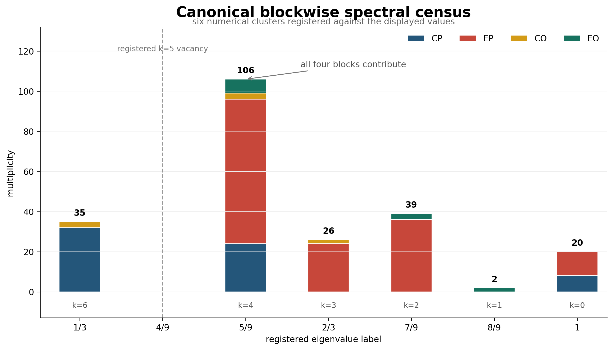
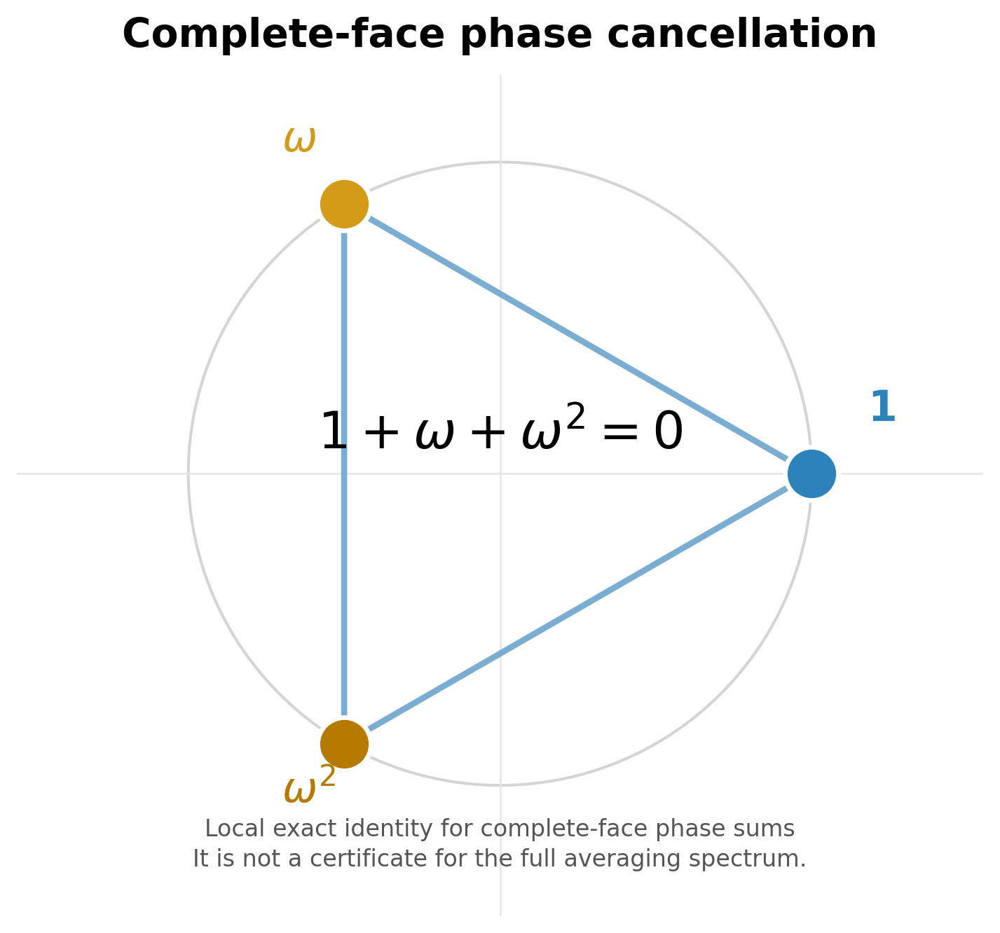
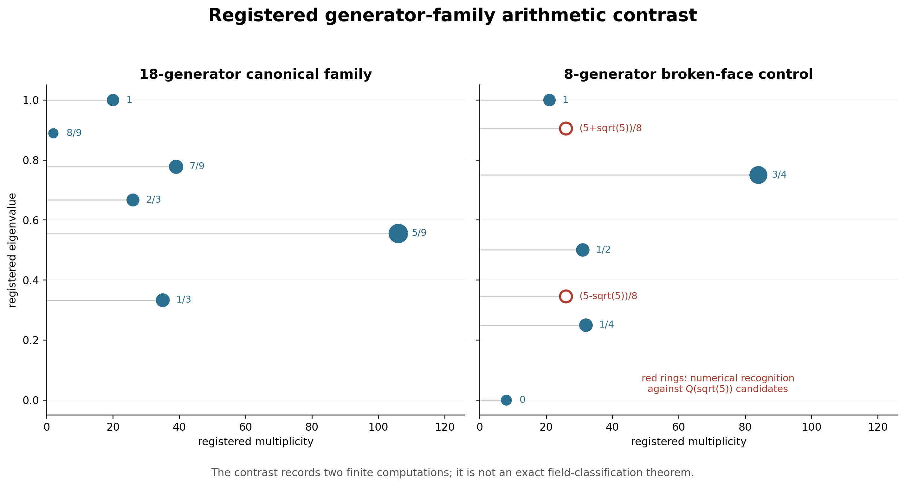

# Spectral Sector Decomposition in the Rubik's Cube Representation

### Block Spectral Structure and a Conditional Rationality Criterion

**WuJun Chen**

Independent Researcher | RIME Project | 2026

***

## Abstract

**Problem.** We study the averaging operator $A = \frac{1}{|S|}\sum_{s\in S} \rho(s)$ of a finite group representation, separating its block-spectral structure from possible arithmetic explanations. In the 228-dimensional Rubik's cube representation with the standard 18 face-turn generators, six eigenvalues are numerically registered against the displayed rational values.

**Approach.** We decouple the spectral calculation from the arithmetic question. First, block restriction reduces the canonical spectrum to four finite block computations. Second, the eigenspace compression-trace identity gives an elementary rationality criterion and a partition-integrality certificate format. The latter is not used to prove canonical Rubik rationality: the registered face partition does not supply its integer hypothesis.

**Results.** For the standard 18-generator realization, the computed block spectra have union $\lambda \in \{1,8/9,7/9,2/3,5/9,1/3\}$, with multiplicities summing to 228. The cp and ep reductions are analytic. On the co block, covariance under the orientation-preserving cubic rotation group $O$ supplies a Schur reduction, while the accidental degeneracy remains computational; the eo assignment remains a numerical-representation observation. No complex-linear $O_h$ action is used.

**Boundary.** Spectral rationality is not uniform across generator choices: a registered broken-face control contains a conjugate pair numerically recognized against $\mathbb{Q}(\sqrt{5})$. This finite contrast does not establish a general arithmetic classification. The six-layer census and the conditional trace criteria remain logically independent outputs.

***

## Notation {.unnumbered}

| Symbol | Meaning |
|--------|---------|
| $G$ | Finite group |
| $S \subset G$ | Symmetric generating set ($S = S^{-1}$) |
| $\rho: G \to \mathrm{GL}(V)$ | Finite-dimensional unitary representation |
| $V$ | Representation space (228-dim for the Rubik cube) |
| **block** | A cubie-type invariant subspace: cp (corner perm, 64-dim), ep (edge perm, 144-dim), co (corner ori, 8-dim), eo (edge ori, 12-dim) |
| $A = \frac{1}{\lvert S\rvert}\sum_s \rho(s)$ | Averaging operator — Hermitian when $S = S^{-1}$ and $\rho$ is unitary |
| $\lambda = 1 - k/m$ | Eigenvalue parametrization used for the registered families ($m=9$ for 18 face-turn generators) |
| $k$-set | Set of $k$ values producing distinct eigenvalues: $\{0,1,2,3,4,6\}$ for 18-full |
| $P_{\lambda}$ | Spectral projector onto eigenspace $E_{\lambda}$ |
| **layer** $V_{\lambda} = \mathrm{im}(P_{\lambda})$ | An eigenspace of the averaging operator $A$ — 6 canonical layers |
| $O$, $U_R$ | Orientation-preserving cubic rotation group and its registered complex-linear unitary action |
| $V_1, V_{8/9}, V_{7/9}, V_{2/3}, V_{5/9}, V_{1/3}$ | Canonical layers ($\lambda = 1 - k/9$, $k \in \{0,1,2,3,4,6\}$) |
| $\chi_{\lambda}(s) = \operatorname{Tr}(P_{\lambda} \rho(s)P_{\lambda})$ | Eigenspace compression trace used in the conditional rationality criterion |
| **Bose-Mesner algebra** | Commuting algebra of a permutation association scheme; used in the cp reduction |
| $J$ | Edge--face incidence matrix, with $J_{e,f}=1$ when edge position $e$ lies on face $f$ |

> **Definition (Spectral Layer).** \label{def:spectral-layer} An eigenspace $V_{\lambda} = \operatorname{im}(P_{\lambda})$ of the averaging operator $A$. The 228-dimensional Rubik's cube representation has 6 canonical layers: $V_1$, $V_{8/9}$, $V_{7/9}$, $V_{2/3}$, $V_{5/9}$, $V_{1/3}$, corresponding to $\lambda = 1 - k/9$ with $k \in \{0,1,2,3,4,6\}$.

## Introduction

Averaging group elements in a finite-dimensional representation often produces substantial spectral collapse. In the Rubik's cube setting, the averaging operator built from the standard 18 face-turn generators has six computed eigenvalues, parametrized by $\lambda=1-k/9$ with $k\in\{0,1,2,3,4,6\}$. The first question is structural: how does the invariant cubie-type decomposition reduce this spectrum? The second is arithmetic: what additional hypothesis would force rational eigenvalues? These questions are independent. Block diagonality determines how restricted spectra combine, but it does not determine their arithmetic field.

The arithmetic statement is elementary and conditional. Specifically, the compression-trace identity renders eigenvalue rationality equivalent to the rationality of a single total trace sum. **Partition integrality** is only a stronger certificate format: if a predeclared partition has integer compression-trace sums on every part, then the total sum is rational. In the registered canonical computation, however, the Rubik face partition does not supply this integer hypothesis. Ordinary generator traces and eigenspace compression traces must therefore remain distinct.

**Four claim-status levels.** The paper distinguishes four claim levels:

1. **Theorem.** Block spectral union and the conditional trace criteria are
   exact under their stated hypotheses.

2. **Computational Certificate.** The registered block $k$-sets, analytic
   reductions, and computational inputs are reported and labelled separately
   below.

3. **Computational Observation.** The broken-face control provides a finite
   numerical contrast rather than a general arithmetic classification.

4. **Research Program.** A unified exact arithmetic explanation of all four
   canonical blocks remains open.

**Finite-family contrast.** A registered broken-face control contains conjugate values numerically recognized in $\mathbb{Q}(\sqrt{5})$. Thus the ambient representation data alone do not determine the observed spectral field. This is a computational negative control, not a general symmetry theorem.

The paper first proves the general averaging and block-union theorems, then records the canonical Rubik census with its per-block proof status. It next establishes the conditional trace criteria, reports one finite negative control, and closes with an explicit theorem-computation boundary. The blockwise output can serve as spectral input to finer joint-sector analyses, while the arithmetic criterion remains a separate conditional layer.

## Setting and notation

### Concrete conventions

We use a right-handed Cartesian coordinate system: $+X \to R$, $+Y \to U$, $+Z \to F$. Corner positions are indexed by sign vectors $\{x \in \{\pm 1\}^3 : \prod_i x_i \neq 0\}$; edge positions by vectors in $\{x \in \{\pm 1, 0\}^3 : \sum_i |x_i| = 2\}$. The accompanying computational artifacts record the face mapping, generator encoding, and array ordering used throughout the computational case study.

The representation space $V = \mathbb{C}^{228}$ decomposes into four $G$-invariant blocks:
$$V = V_{\mathrm{cp}} \oplus V_{\mathrm{ep}} \oplus V_{\mathrm{co}} \oplus V_{\mathrm{eo}},\qquad 64 + 144 + 8 + 12 = 228,$$
laid out in cp $\to$ ep $\to$ co $\to$ eo order. The generator set $S$ is the 18 standard face-turn generators ($S = S^{-1}$).

### Abstract setting

Let $G$ be a finite group and let $\rho:G\to\mathrm{GL}(V)$ be a finite-dimensional unitary representation. Let $S\subseteq G$ be a finite inverse-closed generating set, meaning $S=S^{-1}$. Define the averaging operator
$$
A = \frac{1}{|S|} \sum_{s\in S} \rho(s) \in \operatorname{End}(V).
$$
**Proposition 2.1 (Inverse-Closure Hermiticity).** For a unitary representation $\rho$, inverse closure $S=S^{-1}$ is sufficient for the averaging operator $A=|S|^{-1}\sum_{s\in S}\rho(s)$ to be Hermitian.

*Proof.* Since $\rho$ is unitary, $\rho(s)^\dagger=\rho(s^{-1})$ for every $s\in G$. The adjoint of $A$ is
$$
A^\dagger = \frac{1}{|S|}\sum_{s\in S}\rho(s)^\dagger = \frac{1}{|S|}\sum_{s\in S}\rho(s^{-1}) = \frac{1}{|S|}\sum_{t\in S^{-1}}\rho(t).
$$
Hence $S=S^{-1}$ implies $A^\dagger=A$. The converse need not hold for an arbitrary representation because distinct group-algebra coefficients can have the same represented operator.

**Boundary note.** For the Rubik's cube, the standard 18 face-turn generators satisfy $S=S^{-1}$ with equal weights, so $A$ is Hermitian and admits an orthogonal spectral decomposition. Non-inverse-closed families require a separate normality or nonnormal spectral analysis.

We write $E_{\lambda}$ for the eigenspace of $A$ with eigenvalue $\lambda$,
and $P_{\lambda}$ for the orthogonal projector onto $E_{\lambda}$.

## Main results

### Proposition 3.1 (Eigenspace Compression-Trace Identity)

For every eigenvalue $\lambda$ of $A$ with orthogonal projector $P_{\lambda}$
onto $E_{\lambda}$,
$$
\lambda = \frac{1}{d_{\lambda}}\cdot\frac{1}{|S|}\sum_{s\in S}\chi_{\lambda}(s),
\qquad
\chi_{\lambda}(s) := \operatorname{Tr}(P_{\lambda}\rho(s)P_{\lambda}),
\qquad d_{\lambda} = \dim E_{\lambda}.
$$

**Terminology — eigenspace compression trace.** The quantity
$\chi_{\lambda}(s)$ is the trace on $E_{\lambda}$ of the compression
$P_{\lambda}\rho(s)P_{\lambda}$. It is not the character of a restricted
subrepresentation unless $E_{\lambda}$ is $\rho(G)$-invariant. Cyclicity and
$P_{\lambda}^2=P_{\lambda}$ give
$\operatorname{Tr}(P_{\lambda}\rho(s)P_{\lambda})
=\operatorname{Tr}(P_{\lambda}\rho(s))$.

*Proof.*

Since $AP_{\lambda}=\lambda P_{\lambda}$, taking traces gives
$$
\operatorname{Tr}(AP_{\lambda}) = \lambda\cdot\operatorname{Tr}(P_{\lambda})=\lambda d_{\lambda}.
$$
On the other hand, by linearity of the trace,
$$
\operatorname{Tr}(AP_{\lambda})
= \frac{1}{|S|}\sum_{s\in S}\operatorname{Tr}(P_{\lambda}\rho(s)P_{\lambda})
= \frac{1}{|S|}\sum_{s\in S}\chi_{\lambda}(s).
$$
Combining the two identities yields the claim.

### Theorem 3.2 (Block Compatibility Lemma)

Let $A$ be Hermitian on a finite-dimensional Hilbert space, and let

$$
V = \bigoplus_{i=1}^{k} V_i,
$$

be an orthogonal decomposition with block projectors $P_i$. If
$[P_i,A]=0$ for every $i$, then each spectral projector $P_{\lambda}$ of $A$
satisfies

$$
P_{\lambda} = \bigoplus_{i=1}^{k} P_{\lambda,i}, \qquad P_{\lambda,i} := P_i P_{\lambda} P_i.
$$

Equivalently, $P_{\lambda}$ commutes with every block projector:
$[P_{\lambda},P_i]=0$ for all $i$.

*Proof.*

The commutation hypotheses imply that $A$ is block diagonal:
$A=\bigoplus_i A_i$, where $A_i=A|_{V_i}$. By Lagrange interpolation on
the distinct eigenvalues, $P_{\lambda}$ is a polynomial in $A$. It therefore
commutes with every $P_i$ and is block diagonal, giving the stated formula.

**Rubik specialization.** Each cubie-type block is $\rho(G)$-invariant, so its
projector commutes with every $\rho(g)$ and hence with the average $A$.

### Corollary 3.3

For each block $V_i$, the restricted projector $P_{\lambda,i}$ is an orthogonal projector on $V_i$ satisfying $P_{\lambda,i}^2 = P_{\lambda,i}$, $P_{\lambda,i}^* = P_{\lambda,i}$, and $P_{\lambda,i} A_i = A_i P_{\lambda,i} = \lambda P_{\lambda,i}$ whenever $P_{\lambda,i} \neq 0$.

**Role of the lemma.**

Theorem~\ref{thm:block-compatibility-lemma} is a direct consequence of block diagonality. Its value is organizational: it reduces the 228-dimensional problem to four independent sub-problems and shows that every global spectral projector restricts blockwise.

### Block Spectral Union and Canonical Census

**Theorem 3.4 (Block Spectral Union).** If $V=\bigoplus_B V_B$ and every $V_B$ is $A$-invariant, then

$$
\operatorname{Spec}(A)=\bigcup_B\operatorname{Spec}(A_B),
\qquad A_B=A|_{V_B}.
$$

This is a set-theoretic union. If the same eigenvalue occurs in several blocks, the corresponding global eigenspace is the direct sum of those block eigenspaces.

*Proof.*

The orthogonal block decomposition implies $A=\bigoplus_B A_B$. Therefore, the characteristic polynomial factors as $\det(tI-A)=\prod_B\det(tI_B-A_B)$, yielding the claimed spectral union.

**Computational Proposition 3.5 (Canonical Block Census).** For the registered 18-generator Rubik realization, the four block spectra are:

| Block | dim | $k$-set in $\lambda=1-k/9$ | multiplicities by $k$ | Status |
|:-----:|:---:|:---------------------------:|:---------------------:|:-------|
| cp | 64 | $\{0,4,6\}$ | $(8,24,32)$ | analytic Hamming-scheme reduction |
| ep | 144 | $\{0,2,3,4\}$ | $(12,36,24,72)$ | analytic face-incidence reduction |
| co | 8 | $\{3,4,6\}$ | $(2,3,3)$ | symmetry-guided computation; one accidental degeneracy remains numerical |
| eo | 12 | $\{1,2,4\}$ | $(2,3,7)$ | numerical-representation observation |

Their union is $\{0,1,2,3,4,6\}$, giving six global layers. The block contributions are:

| Global layer | $\lambda$ | $k$ | dim | cp | ep | co | eo |
|---|---|---|---|---|---|---|---|
| $V_1$ | $1$ | 0 | 20 | 8 | 12 | — | — |
| $V_{8/9}$ | $8/9$ | 1 | 2 | — | — | — | 2 |
| $V_{7/9}$ | $7/9$ | 2 | 39 | — | 36 | — | 3 |
| $V_{2/3}$ | $2/3$ | 3 | 26 | — | 24 | 2 | — |
| $V_{5/9}$ | $5/9$ | 4 | 106 | 24 | 72 | 3 | 7 |
| $V_{1/3}$ | $1/3$ | 6 | 35 | 32 | — | 3 | — |

The dimensions sum to 228. The value $k=5$ is absent from every registered block spectrum. This proposition is a finite canonical census; it does not identify a universal algebraic factorization.

## Per-block spectral analysis

The 228-dimensional space decomposes into four $\rho(G)$-invariant blocks:

$$
V = V_{\mathrm{cp}} \oplus V_{\mathrm{ep}} \oplus V_{\mathrm{co}} \oplus V_{\mathrm{eo}},
$$

with dimensions 64, 144, 8, and 12, respectively. By Theorem~\ref{thm:block-compatibility-lemma}, each eigenspace projector splits as

$$
P_{\lambda} = P_{\lambda,\mathrm{cp}} \oplus P_{\lambda,\mathrm{ep}} \oplus P_{\lambda,\mathrm{co}} \oplus P_{\lambda,\mathrm{eo}}.
$$

The four restricted spectra do not have the same proof status. The following
summary is therefore part of the claim boundary, not merely an implementation
detail.

### Permutation blocks

The generators act by permutation matrices on $V_{\mathrm{cp}}$ and
$V_{\mathrm{ep}}$. Both spectra admit exact combinatorial reductions on the
position factors.

#### Corner-permutation reduction

Write

$$
\rho_{\mathrm{cp}}(s)=P_8(s)\otimes I_8,
\qquad
S_8=\sum_{s\in S}P_8(s).
$$

Identify the eight corner positions with the binary hypercube $Q_3$, and let
$A_r$ be its distance-$r$ adjacency matrix. Entrywise counting of the 18 face
turns yields

$$
S_8=9I+2A_1+A_2.
$$

Indeed, a corner has nine fixed contributions; distance-one corners receive
two transitions, distance-two corners one, and antipodal corners none. For
$u\in\{0,1\}^3$, the character $v_u(x)=(-1)^{u\cdot x}$ is a common
eigenvector. The eigenvalues depend only on $w=|u|$:

| $w$ | multiplicity | $A_1$ | $A_2$ | $S_8$ |
|---:|---:|---:|---:|---:|
| 0 | 1 | 3 | 3 | 18 |
| 1 | 3 | 1 | $-1$ | 10 |
| 2 | 3 | $-1$ | $-1$ | 6 |
| 3 | 1 | $-3$ | 3 | 6 |

Therefore

$$
\operatorname{Spec}(A_{\mathrm{cp}})
=\{1^{(8)},(5/9)^{(24)},(1/3)^{(32)}\},
\qquad A_{\mathrm{cp}}=\frac1{18}S_8\otimes I_8.
$$

#### Edge-permutation reduction

Let $J\in\{0,1\}^{12\times6}$ be the edge--face incidence matrix. Every edge
belongs to two faces and every face contains four edges. With
$\rho_{\mathrm{ep}}(s)=P_{12}(s)\otimes I_{12}$, entrywise counting gives

$$
S_{12}:=\sum_{s\in S}P_{12}(s)=10I+JJ^*,
\qquad
J^*J=4I+A_{\mathrm{oct}},
$$

where $A_{\mathrm{oct}}$ is the adjacency matrix of the octahedron graph on
the six faces. Since

$$
\operatorname{Spec}(A_{\mathrm{oct}})
=\{4^{(1)},0^{(3)},(-2)^{(2)}\},
$$

the nonzero spectrum of $JJ^*$ is $\{8^{(1)},4^{(3)},2^{(2)}\}$, with an
additional six-dimensional kernel. Hence

$$
\operatorname{Spec}(S_{12})
=\{18^{(1)},14^{(3)},12^{(2)},10^{(6)}\},
$$

and therefore

$$
\operatorname{Spec}(A_{\mathrm{ep}})
=\{1^{(12)},(7/9)^{(36)},(2/3)^{(24)},(5/9)^{(72)}\},
\qquad A_{\mathrm{ep}}=\frac1{18}S_{12}\otimes I_{12}.
$$

These exact finite reductions justify the analytic/combinatorial status of
the permutation blocks. The orientation blocks below retain different claim
statuses.

### Corner-orientation block (co)

The corner-orientation block carries non-real phase entries. The generators act by matrices over $\mathbb{Z}[\omega]$, where $\omega=e^{2\pi i/3}$:

$$
\rho_{\mathrm{co}}(s) \in M_{8}(\mathbb{Z}[\omega]) \subset M_{8}(\mathbb{Q}(\omega)).
$$

**Computational Proposition 4.1 (Corner-Orientation Spectrum).** For the
registered 18-generator realization,

$$
\operatorname{Spec}(A_{\mathrm{co}})
=\{(2/3)^{(2)},(5/9)^{(3)},(1/3)^{(3)}\}.
$$

The permutation action of the orientation-preserving cubic rotation group $O$
on the eight corners decomposes as
$A_1\oplus A_2\oplus T_1\oplus T_2$. The registered rephased unitaries
$U_R$ satisfy $[U_R,A_{\mathrm{co}}]=0$ to numerical precision, so this
multiplicity-free decomposition supplies a Schur reduction. No complex-linear
action of the full reflection group $O_h$ is used.

For $M_{\mathrm{co}}=18(A_{\mathrm{co}}-I/2)$, the registered calculation
gives
$$\operatorname{Spec}(M_{\mathrm{co}}) = \{3^{(2)},\; 1^{(3)},\; -3^{(3)}\}$$
and hence the displayed spectrum. The equality of the two one-dimensional
eigenvalues is not forced by the $O$-module dimensions and remains a numerical
input. Similarly, the two three-dimensional irrep labels are not explicitly assigned. Thus the
Schur reduction is structural, but the complete eigenvalue assignment is a
computational proposition.

### Edge-orientation block

**Computational Observation 4.2 (Edge-Orientation Spectrum).** The registered
$12\times12$ signed-permutation average has

$$
\operatorname{Spec}(A_{\mathrm{eo}})
=\{(8/9)^{(2)},(7/9)^{(3)},(5/9)^{(7)}\}.
$$

The trace check is
$2(8/9)+3(7/9)+7(5/9)=8=\operatorname{Tr}(A_{\mathrm{eo}})$.
The edge permutation representation contains a multiplicity-two $T_2$
component, so rotation covariance alone permits a non-scalar multiplicity
matrix and does not determine the three eigenvalues. This block therefore
remains a numerical-representation observation.

### Computational Projector Certificate

**Computational Certificate 4.3 (Canonical Projector Residuals).** In the
registered complex128 realization, the six numerical spectral projectors have
maximum idempotence residual $1.09\times10^{-14}$, maximum pairwise
orthogonality residual $4.09\times10^{-15}$, and completeness residual
$1.70\times10^{-14}$ in Frobenius norm. Individual compression traces
$\operatorname{Tr}(P_\lambda\rho(s)P_\lambda)$ can be complex.

This observation is basis-dependent and makes no algebraic classification
claim. In particular, rational eigenvalues do not justify treating the
computed projectors or individual compression traces as entrywise rational in
the declared realization.

## Generator traces

This section concerns ordinary traces of the representation blocks. These are
not the compression traces
$\chi_\lambda(s)=\operatorname{Tr}(P_\lambda\rho(s)P_\lambda)$ used below.

$$
\rho(g)=P_{\mathrm{cp}}(g)\oplus P_{\mathrm{ep}}(g)\oplus \Omega_{\mathrm{co}}(g)\oplus \Sigma_{\mathrm{eo}}(g).
$$

**Computational Proposition 5.1 (Registered Generator Traces).** For each of the 18 registered face-turn generators $s$, the ordinary block traces

$$
\tau_B(s):=\operatorname{Tr}(\rho_B(s)),\qquad B\in\{\mathrm{cp},\mathrm{ep},\mathrm{co},\mathrm{eo}\},
$$

are integers.

*Proof.*

The permutation-block traces count fixed basis states. The signed edge-orientation block has integer trace. In the corner-orientation block, the $\omega$ and $\omega^2$ contributions occur with balanced multiplicities for each canonical face turn, leaving an integer trace.

**Computational Corollary 5.2 (Ordinary Face-Triple Trace).** For a canonical face triple $\{g,g^{-1},g_{180}\}$,

$$
\operatorname{Tr}\!\left(\rho(g)+\rho(g^{-1})+\rho(g_{180})\right)\in\mathbb Z.
$$

This corollary concerns the ordinary trace on $V$. It does not imply that $\sum_s\operatorname{Tr}(P_\lambda\rho(s))$ is integral on each eigenspace.

## Conditional arithmetic criteria

### Corollary 6.1 (Trace Rationality Criterion)

Let $S$ be finite, let

$$
A=\frac{1}{|S|}\sum_{s\in S}\rho(s).
$$

For every eigenvalue $\lambda$ of $A$,

$$
\lambda\in\mathbb Q
\quad\Longleftrightarrow\quad
\sum_{s\in S}\chi_\lambda(s)\in\mathbb Q.
$$

*Proof.* Proposition 3.1 gives

$$
\sum_{s\in S}\chi_\lambda(s)=|S|d_\lambda\lambda.
$$

Since $|S|d_\lambda$ is a positive integer, either side is rational exactly
when the other is rational.

### Proposition 6.2 (Partition-Integrality Certificate)

Fix an eigenvalue $\lambda$ and a predeclared partition
$S=\bigsqcup_{i=1}^k S_i$. If

$$
\sum_{s\in S_i}\chi_\lambda(s)\in\mathbb Z,
\qquad i=1,\ldots,k,
$$

then $\lambda\in\mathbb Q$.

*Proof.* Summing the integer part-sums produces an integer total sum, which is
therefore rational, so
Corollary 6.1 applies.

**Boundary.** This proposition is a sufficient certificate format. It does not
assert that such a partition exists, and the partition has no further role in
the proof beyond decomposing the total sum.

**Computational Observation 6.3 (Canonical Face-Partition Audit).** In the
declared canonical realization, individual compression traces can be complex,
and the computed per-face sums are not all integers. In particular, the
symmetric face sums for $V_{8/9}$ and $V_{5/9}$ are $16/3$ and $530/3$,
respectively. Thus, the ordinary generator-trace integrality established in
Computational Proposition 5.1 does not supply the hypothesis required by
Proposition 6.2.

## Finite Generator-Family Contrast

The block-union theorem alone does not determine the arithmetic field of a modified
averaging operator. A finite negative control makes that boundary explicit.

**Computational Observation 7.1 (Registered Broken-Face Control).** In the
registered generator family containing eight quarter turns, formed by removing
one spatial axis, the computed spectrum contains

$$
\lambda_\pm=\frac{5\pm\sqrt5}{8}
\approx0.90450850,\;0.34549150.
$$

These values occur in the ep and eo restrictions. Their displayed quadratic
forms are numerical recognitions against the declared matrices, not exact
minimal-polynomial certificates. The observation shows only that changing the
generator family can change the observed spectral field. It does not make
face completeness necessary or sufficient for rationality. A broader finite
generator-family census is available as supplementary data.

## Discussion

The paper has two independent outputs. Block compatibility reduces the
canonical averaging operator to four restrictions, and the registered census
matches six eigenvalues to the displayed rational values. Separately, the
compression-trace identity gives an elementary equivalence between eigenvalue
rationality and rationality of the total compression-trace sum. Partition
integrality is only a stronger certificate format. Because the tested
canonical face partition fails this integer hypothesis, partition integrality
does not explain the six registered spectral values.

The blockwise census also interfaces with a finer joint-spectral construction.
Let
$\mathrm{QT}_{\mathrm{all}}$ be the uniform average of the twelve quarter
turns and $\mathrm{HT}_{\mathrm{all}}$ the uniform average of the six half
turns. Then, exactly by definition,

$$
A_{18}=\frac23\mathrm{QT}_{\mathrm{all}}
      +\frac13\mathrm{HT}_{\mathrm{all}}.
$$

If these two Hermitian averages commute exactly, the images of the primitive
spectral idempotents of their generated commutative algebra form a joint
spectral resolution. The QT/HT joint-sector registration and its conditional
collision-quotient interpretation are studied separately
\cite{paper2,paper4}; neither is used in the proofs here.

## Claim Status and Boundary

The general statements concern finite-dimensional unitary representations,
finite inverse-closed generator sets, orthogonal reducing decompositions, and
the conditional trace criteria. The six layers, their
multiplicities, the missing $k=5$, and the broken-face control are
realization-specific.

We distinguish four claim levels: Theorem, Computational Certificate,
Computational Observation, and Research Program. Mathematical labels such as
proposition and corollary remain result types inside the Theorem level.

### Theorem

- **Inverse-closure Hermiticity:** inverse closure is a sufficient condition for a unitary average to be Hermitian.
- **Compression-trace identity:** every eigenvalue satisfies the stated projector-trace identity.
- **Block compatibility and spectral union:** an orthogonal decomposition whose block projectors commute with $A$ reduces the spectrum to the set-theoretic union of block spectra.
- **Conditional trace criteria:** eigenvalue rationality is equivalent to rationality of the total compression-trace sum; per-part integrality is a stronger sufficient certificate.

### Computational Certificate

- The registered 18-generator realization has six numerical layers matched to the displayed rational values and the block multiplicities in Proposition 3.5.
- The cp and ep spectra have analytic combinatorial reductions; the co accidental degeneracy and eo spectrum retain their stated computational qualifications.
- The registered generator matrices have integer block traces. These are
  ordinary traces, not compression traces.
- The canonical numerical projectors satisfy the displayed residual bounds.

### Computational Observation

- The eight-generator control has two values numerically recognized in
  $\mathbb{Q}(\sqrt5)$.

### Research Program

The canonical Rubik rationality still lacks a single exact arithmetic theorem
covering all four blocks under the present hypotheses. Exact co/eo
certificates, generator families satisfying partition integrality, and any
nontrivial structural rationality mechanism remain open.

## Conclusion

Inverse closure makes the averaging operator Hermitian, invariant physical
blocks reduce its spectrum to a blockwise union, and the registered Rubik
realization yields six layers with the displayed multiplicities. The
permutation blocks have analytic reductions; the orientation blocks retain
their stated computational qualifications. Partition integrality is a valid
sufficient certificate format, but it is not satisfied by the tested canonical
face partition and is not used to promote the numerical census.

***

## Appendix A: Canonical Spectral Summary

Compact reference for the six canonical layers. The exact permutation-block
derivations appear in Section 4. The finite verification scripts and structured
repository records provide the reproducibility material for the registered
census.

### A.1 Six Canonical Layers

| $k$ | $\lambda = 1 - k/9$ | Dim | Label | Block composition |
|:---:|:--------------------:|:---:|:-----:|:------------------|
| 0 | 1 | 20 | $V_1$ | cp(8) + ep(12) |
| 1 | 8/9 | 2 | $V_{8/9}$ | eo(2) |
| 2 | 7/9 | 39 | $V_{7/9}$ | ep(36) + eo(3) |
| 3 | 2/3 | 26 | $V_{2/3}$ | ep(24) + co(2) |
| 4 | 5/9 | 106 | $V_{5/9}$ | cp(24) + ep(72) + co(3) + eo(7) |
| 6 | 1/3 | 35 | $V_{1/3}$ | cp(32) + co(3) |

Total: $20+2+39+26+106+35 = 228$. In the registered canonical block census, $k=5$ ($\lambda=4/9$) is absent from every block spectrum.

### A.2 Block $k$-Sets

The union formula $\mathcal{K}(A) = \bigcup_B \mathcal{K}_B$ (Theorem~\ref{thm:block-spectral-union}):

| Block | Dim | $k$-set | Algebraic origin |
|:-----:|:---:|:--------|:-----------------|
| cp | 64 | $\{0,4,6\}$ | Q₃ Hamming scheme (Krawtchouk) |
| ep | 144 | $\{0,2,3,4\}$ | Face-incidence adjacency algebra |
| co | 8 | $\{3,4,6\}$ | Symmetry-guided computation |
| eo | 12 | $\{1,2,4\}$ | Numerical-representation observation |

Union: $\{0,4,6\} \cup \{0,2,3,4\} \cup \{3,4,6\} \cup \{1,2,4\} = \{0,1,2,3,4,6\}$. This is the six-value outcome of the registered block census. The absent values are not promoted here to a universal exclusion theorem.

## Related Work and Novelty Boundary

The closest mathematical backgrounds are association schemes and
Bose--Mesner algebras for the permutation blocks, finite-group representation
theory for the cubie representation, and harmonic analysis on finite groups
for averaging operators. The core question is not a general
commutative-operator theorem, but how exact block reductions and conditional
arithmetic criteria relate to the displayed registered spectral values.

The association-scheme background is supplied by the standard texts of
Bannai--Ito and Godsil \cite{bannaiIto1984,godsil1993}. The CP block is the
binary Hamming scheme $H(3,2)$, whose Krawtchouk eigenvalues account for the
CP block's integer spectral contribution. The EP face-incidence algebra sits
near the coherent-configuration side of the same algebraic-combinatorial
framework.

The representation-theoretic background is finite semisimple representation
theory \cite{serre1977,curtisReiner1962}. The averaging operator is also the
representation-theoretic form of a random walk operator on a finite group, in
the sense of Diaconis \cite{diaconis1988}. The Rubik group and cubie-state
conventions follow the standard cube-group literature \cite{joyner2008}.

**Rubik computational context.** The declared 18-generator face-turn setting
also occurs in the computational cube literature, including Kociemba's
two-phase algorithm and the diameter computation of
Rokicki--Kociemba--Davidson--Dethridge
\cite{kociemba1992,rokicki2013diameter}. These references provide problem
context rather than support for the spectral results.

Related work studies the finer QT/HT joint-spectral resolution and direct
transport \cite{paper2}. Extended tables and earlier numerical controls are
available as supplementary material and are not used in the proofs.

## Appendix B: Computational Artifacts

The following repository artifacts provide the reproducible support layer for
the registered finite computations in this paper. The default directory is
`experiments/paper1/`; paths in the table are relative to that directory.

| Artifact | Role | Short path |
|----------|-----------------|------------|
| B1 | registered six-layer spectrum and block census | \path{validation/spectral_ladder.py} |
| B2 | registered absence of the $k=5$ layer | \path{validation/k_absence.py} |
| B3 | blockwise spectral support | \path{validation/block_composition.py} |
| B4 | numerical projector identities and residuals | \path{validation/projector_algebra.py} |
| B5 | qualified CO/EO block audit | \path{validation/co_eo_analytic_spectrum.py} |
| B6 | finite broken-face arithmetic control | \path{validation/symmetry_breaking.py} |
| B7 | frozen claim-aware figure display data | \path{results/figure_data.json} |

From the repository root, an executable artifact is run as
`python experiments/paper1/<short path>`. These artifacts support the stated
Computational Certificates and Computational Observations; they are not used
in the exact proofs.

All listed artifacts are available in the
[RIME repository](https://github.com/dooven-prime/rime-lite).

***
