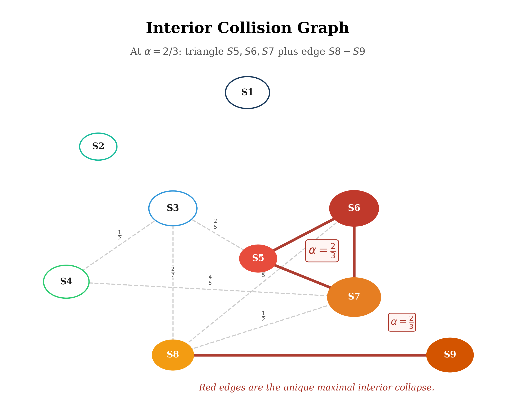

# Collision Geometry of Joint Spectra

### Affine Branch Arrangements, Exact Finite Censuses, and Conditional Spectral Quotients

**WuJun Chen**

Independent Researcher | RIME Project | 2026

***

## Abstract

**Problem.** A finite joint spectrum can be observed at two resolutions: a
resolved set of joint spectral points and a coarser spectrum obtained by a
linear functional. We ask how collisions of affine branches organize the
resulting quotient, explicitly separating general finite-point theorems from a
numerically registered operator realization.

**Approach.** For a fixed finite arrangement
$P=\{(q_i,h_i)\}_{i=1}^N\subset\mathbb R^2$, we study
$L_\alpha(q,h)=\alpha q+(1-\alpha)h$ and the equivalence relation induced by
equal $L_\alpha$ values. We prove the collision formula, finiteness of the
critical set, constancy of branch order on its complementary chambers, and the
spectral quotient theorem for commuting Hermitian realizations. Rational
coordinates give rational finite collision parameters. A two-parameter
rectangular family provides an exact control beyond the main example. We then
perform a complete exact census for one explicitly declared nine-point rational
arrangement.

**Results.** For the explicit arrangement $P_9$, the $36$
unordered pairs split into $2$ parallel, $10$ interior, $15$ endpoint, and $9$
exterior pairs. On $[0,1]$ the interior critical parameters are
$2/7$, $2/5$, $1/2$, $2/3$, and $4/5$. The layer-count drops are respectively
$1$, $2$, $2$, $3$, and $1$, so $\alpha=2/3$ is the unique interior parameter
of maximal drop.
Its nontrivial quotient classes contain S5, S6, and S7, and S8 and S9,
respectively.
For the rectangular family with side parameters $a,b>0$, the sole interior
collision occurs at $\alpha=b/(a+b)$ and produces one two-point class.

**Boundary.** In the declared complex128 Rubik computation,
coordinate-matched labels, ranks, and projectors are stable across the tested clustering
tolerances, and the maximum raw-to-$P_9$ table discrepancy is below
$10^{-15}$. Machine-zero commutator and projector residuals support this
registration but do not prove exact commutation or exact rational joint
eigenvalues. The six exact averaging layers are the $L_{2/3}$ collision
quotient of $P_9$ only when exact operator
admissibility, exact labelled joint registration, and the exact averaging
identity all hold. No parameter-dependent or maximality conclusion is drawn.

***

## Notation and Claim Layers {.unnumbered}

| Symbol | Meaning |
|--------|---------|
| $P=\{p_i\}_{i=1}^N$ | fixed finite set of distinct points $p_i=(q_i,h_i)$ |
| $L_\alpha(q,h)$ | $\alpha q+(1-\alpha)h$ |
| $\lambda_i(\alpha)$ | affine branch $L_\alpha(p_i)$ |
| $\mathcal C(P)$ | finite collision set in $\mathbb R$ |
| $i\sim_\alpha j$ | equality $L_\alpha(p_i)=L_\alpha(p_j)$ |
| $P/\!\sim_\alpha$ | collision quotient at $\alpha$ |
| $N_P(\alpha)$ | number of quotient classes |
| $\Delta_P(\alpha)$ | layer-count drop $|P|-N_P(\alpha)$ |
| $m_{\mathrm{pair}}(\alpha)$ | number of colliding unordered pairs at $\alpha$ |
| $P_9$ | explicit weighted nine-point rational arrangement |
| $Q,H$ | commuting Hermitian operators in the exact general theory |
| $Q_{\mathrm{num}},H_{\mathrm{num}}$ | numerically constructed Rubik QT/HT averages |
| $A_{18}$ | canonical 18-generator Rubik average |

The paper uses four claim-status levels:

1. **Theorem.** The statement uses exact objects, displayed hypotheses, and a
   proof. A conditional corollary is available only after every displayed
   hypothesis is established.
2. **Computational Certificate.** The statement is a reproducible finite
   computation tied to declared operators, tolerance policy, and a result
   record. Residual agreement does not discharge an exact theorem hypothesis.
3. **Computational Observation.** The statement records a bounded finite
   comparison under a declared threshold. The observed pattern supplies no
   general implication or promotion theorem.
4. **Research Program.** The statement is an explicitly open construction or
   question. It is not used as an assumption, lemma, or explanation of an
   established result.

The classification is fail-closed. Exact arithmetic performed after a numerical
registration does not promote the registration, and a conditional corollary
does not certify its own assumptions. In particular, the exact finite census
of $P_9$ and the conditional Rubik corollary lie in the Theorem level for
different reasons: the former is proved directly from displayed rational data,
whereas the latter applies only under the exact assumptions listed in
Section 7.

***

## Introduction

Let a fixed finite joint-spectrum arrangement be given by

$$
P=\{(q_i,h_i)\}_{i=1}^N\subset\mathbb R^2.
$$

The one-parameter family of linear observables

$$
L_\alpha(q,h)=\alpha q+(1-\alpha)h
$$

assigns to each point an affine branch

$$
\lambda_i(\alpha)=L_\alpha(q_i,h_i).
$$

At a generic parameter the branch values are distinct. At a critical
parameter, two or more values coincide and the resolved point set is replaced
by a quotient partition. If $P$ is the exact joint spectrum of commuting
Hermitian operators $Q$ and $H$, this quotient is precisely the eigenspace
decomposition of $A(\alpha)=\alpha Q+(1-\alpha)H$.

This observation is elementary, but three logically distinct tasks must not
be conflated:

- proving the general finite-point quotient theorem;
- classifying one explicitly declared rational arrangement exactly;
- registering a numerical operator computation against that arrangement under
  declared tolerances.

The present paper separates these tasks. Its contributions are:

1. a self-contained collision-quotient theorem for fixed finite arrangements;
2. a rationality proposition for finite collision parameters;
3. an exact rectangular control family and a complete phase census on
   $[0,1]$ for a weighted nine-point rational arrangement $P_9$;
4. a claim-status-aware computational certificate for the Rubik QT/HT
   clusters;
5. a conditional corollary identifying the Rubik averaging layers with the
   exact quotient under three separately stated exact assumptions.

The general theory does not require Rubik data. Conversely, the numerical
registration does not become exact merely because the downstream finite-point
arithmetic uses rational numbers. This direction of dependence is the central
claim discipline of the paper.

The fixed-arrangement output may be applied pointwise once an exact or
explicitly registered joint spectrum is available. By contrast, any
parameter-dependent application requires a certified normal spectral chart and
coherent projector continuation.

***

## Finite Collision Arrangements

**Definition 2.1 (Affine branch arrangement).**

Let $P=\{p_i=(q_i,h_i)\}_{i=1}^N\subset\mathbb R^2$ be finite with distinct
points. For $\alpha\in\mathbb R$, define

$$
L_\alpha(q,h)=\alpha q+(1-\alpha)h,
\qquad
\lambda_i(\alpha)=L_\alpha(p_i).
$$

Thus

$$
\lambda_i(\alpha)=h_i+\alpha(q_i-h_i).
$$

**Definition 2.2 (Collision set and quotient).**

The collision set is

$$
\mathcal C(P)
=
\{\alpha\in\mathbb R:
\lambda_i(\alpha)=\lambda_j(\alpha)
\text{ for some }i\ne j\}.
$$

At fixed $\alpha$, define

$$
i\sim_\alpha j
\quad\Longleftrightarrow\quad
\lambda_i(\alpha)=\lambda_j(\alpha).
$$

The partition $P/\!\sim_\alpha$ is the collision quotient. Write

$$
N_P(\alpha)=|P/\!\sim_\alpha|,
\qquad
\Delta_P(\alpha)=N-N_P(\alpha).
$$

**Definition 2.3 (Pair multiplicity and quotient drop).**

Let $C_1,\ldots,C_r$ be the non-singleton classes of
$P/\!\sim_\alpha$. Define

$$
m_{\mathrm{pair}}(\alpha)
=
\sum_{a=1}^r\binom{|C_a|}{2},
\qquad
\Delta_P(\alpha)
=
\sum_{a=1}^r(|C_a|-1).
$$

These two quantities are distinct. For example, a triple collision contributes
three pair equalities but only two units of layer-count drop.

**Definition 2.4 (Branch order).**

For $\alpha\notin\mathcal C(P)$, the values $\lambda_i(\alpha)$ are distinct.
Their descending order defines the branch order at $\alpha$. A chamber is a
connected component of $\mathbb R\setminus\mathcal C(P)$.

The quotient partition is discrete on every chamber. The branch order is the
additional datum that distinguishes neighboring chambers.

***

## General Collision--Quotient Theorem

**Theorem 3.1 (Finite collision arrangement).**
\label{thm:paper4-general-collision}

Let $P=\{(q_i,h_i)\}_{i=1}^N\subset\mathbb R^2$ be a finite set of distinct
points.

1. If the branches $i$ and $j$ have different slopes, they collide at the
   unique parameter

   $$
   \alpha_{ij}
   =
   \frac{h_j-h_i}
   {(q_i-h_i)-(q_j-h_j)}.
   $$

2. If the slopes agree, the distinct branches are parallel and never collide.
3. The collision set $\mathcal C(P)$ is finite.
4. On each chamber of $\mathbb R\setminus\mathcal C(P)$, the quotient is
   discrete and the strict branch order is constant.
5. At a critical parameter, the non-singleton collision classes are exactly
   the connected components of the graph whose edges are the pairs satisfying
   $\alpha_{ij}=\alpha$.

**Proof.** Equality of two branches gives

$$
h_i+\alpha(q_i-h_i)
=
h_j+\alpha(q_j-h_j).
$$

If the coefficient of $\alpha$ is nonzero, solving for $\alpha$ yields the
displayed formula and guarantees uniqueness. If the coefficient is zero, the
slopes agree. The distinctness of the points then implies $h_i\ne h_j$, so the
parallel affine functions never meet. Because there are only $\binom N2$
pairs, the collision set is finite.

Outside $\mathcal C(P)$, every difference
$\lambda_i-\lambda_j$ is nonzero. Its sign is continuous and therefore
constant on each connected chamber. Consequently, the strict branch order
remains constant within each chamber. At a critical parameter, equality is
transitive; thus, the equality classes correspond exactly to the connected
components of the equal-label graph. $\square$

**Theorem 3.2 (Spectral layers as collision classes).**
\label{thm:paper4-spectral-quotient}

Let $Q,H$ be exactly commuting Hermitian operators on a finite-dimensional
complex Hilbert space. Let

$$
V=\bigoplus_{i=1}^N E_i,
\qquad
Q|_{E_i}=q_iI,
\qquad
H|_{E_i}=h_iI,
$$

where equal joint eigenvalue pairs have already been combined. Then the
eigenspaces of

$$
A(\alpha)=\alpha Q+(1-\alpha)H
$$

are precisely

$$
\bigoplus_{i\in C}E_i,
\qquad
C\in P/\!\sim_\alpha.
$$

**Proof.** On $E_i$, the operator $A(\alpha)$ acts by the scalar
$L_\alpha(q_i,h_i)$. Two joint eigenspaces belong to the same eigenspace of
$A(\alpha)$ exactly when their scalar values agree. $\square$

**Boundary.** This theorem assumes exact commutation and exact joint spectral
data. A small numerical commutator residual does not establish its hypotheses.

***

## Rational Arrangements

**Proposition 4.1 (Rational collision parameters).**
\label{prop:paper4-rational-collisions}

If $P\subset\mathbb Q^2$ is finite, every finite collision parameter belongs
to $\mathbb Q$.

**Proof.** The collision formula uses subtraction and division by a nonzero
rational number. $\square$

We do not claim a denominator bound that depends solely on a common coordinate
denominator. Such a bound would also require a declared input height or
coordinate range. For the explicit arrangement studied below, small
denominators are established through a direct exact census rather than by
invoking a general height theorem. The comparison with Farey-type
small-denominator organization is descriptive only \cite{hardyWright2008}.

**Proposition 4.2 (Rectangular control family).**
\label{prop:paper4-rectangular-family}

For $a,b>0$, let

$$
P_{\mathrm{rect}}(a,b)
=
\{p_{00}=(0,0),\ p_{10}=(a,0),\ p_{01}=(0,b),\ p_{11}=(a,b)\}.
$$

The unique collision parameter in the open interval $(0,1)$ is

$$
\alpha_\ast=\frac{b}{a+b}.
$$

At $\alpha_\ast$, the only non-singleton quotient class is
$\{p_{10},p_{01}\}$, so $N_{P_{\mathrm{rect}}}(\alpha_\ast)=3$ and
$\Delta_{P_{\mathrm{rect}}}(\alpha_\ast)=1$. At every other parameter in $(0,1)$,
the four branch values are distinct. If $a,b\in\mathbb Q_{>0}$, then
$\alpha_\ast\in\mathbb Q$.

**Proof.** The four branches are

$$
0,\qquad \alpha a,\qquad (1-\alpha)b,\qquad
\alpha a+(1-\alpha)b.
$$

For $0<\alpha<1$, the first is strictly smaller and the last strictly larger
than both middle branches. The middle branches agree exactly when
$\alpha a=(1-\alpha)b$, which gives the displayed value. Rationality follows
immediately when $a$ and $b$ are rational. $\square$

This family shows that an interior collision quotient is not peculiar to the
nine-point census below. It also separates a general adjustable collision
parameter from the special multiplicity and maximal-drop properties of $P_9$.

***

## Exact Nine-Point Census

Define the following weighted rational arrangement independently of any
operator realization:

$$
P_9
=
\{(S_i,d_i,q_i,h_i):1\le i\le9\}.
$$

| Label | Weight $d_i$ | $q_i$ | $h_i$ | $q_i-h_i$ | $L_{2/3}(q_i,h_i)$ |
|-------|---------------|-------|-------|-------------|--------------------|
| S1 | 20 | $1$ | $1$ | $0$ | $1$ |
| S2 | 2 | $5/6$ | $1$ | $-1/6$ | $8/9$ |
| S3 | 39 | $5/6$ | $2/3$ | $1/6$ | $7/9$ |
| S4 | 26 | $1/2$ | $1$ | $-1/2$ | $2/3$ |
| S5 | 1 | $1/3$ | $1$ | $-2/3$ | $5/9$ |
| S6 | 39 | $1/2$ | $2/3$ | $-1/6$ | $5/9$ |
| S7 | 66 | $2/3$ | $1/3$ | $1/3$ | $5/9$ |
| S8 | 8 | $0$ | $1$ | $-1$ | $1/3$ |
| S9 | 27 | $1/3$ | $1/3$ | $0$ | $1/3$ |

The weights sum to $228$. In this section, they are attached integer weights;
their interpretation as operator ranks belongs to the computational
registration and conditional corollary below.

**Theorem 5.1 (Exact nine-point census).**
\label{thm:paper4-nine-point-census}

For the displayed rational arrangement:

1. the $36$ unordered pairs split into $2$ parallel, $10$ interior,
   $15$ endpoint, and $9$ exterior pairs;
2. the interior collision set on $[0,1]$ is

   $$
   \{2/7,2/5,1/2,2/3,4/5\};
   $$

3. the critical quotient data are:

| $\alpha$ | Classes | $N_P(\alpha)$ | $\Delta_P(\alpha)$ | $m_{\mathrm{pair}}(\alpha)$ |
|----------|---------|----------------|----------------------|----------------------------------|
| $0$ | S1=S2=S4=S5=S8; S3=S6; S7=S9 | 3 | 6 | 12 |
| $2/7$ | S3=S8 | 8 | 1 | 1 |
| $2/5$ | S3=S5; S6=S8 | 7 | 2 | 2 |
| $1/2$ | S3=S4; S7=S8 | 7 | 2 | 2 |
| $2/3$ | S5=S6=S7; S8=S9 | 6 | 3 | 4 |
| $4/5$ | S4=S7 | 8 | 1 | 1 |
| $1$ | S2=S3; S4=S6; S5=S9 | 6 | 3 | 3 |

4. $\alpha=2/3$ is the unique **interior** parameter maximizing the
   layer-count drop $\Delta_P$.

**Proof.** Appendix A lists all
$\binom92=36$ pairs, their exact $\alpha_{ij}$ values, and their classifications.
The table contains $2$ parallel, $10$ interior, $15$ endpoint, and $9$ exterior
pairs. Grouping equal interior values yields
$\{2/7,2/5,1/2,2/3,4/5\}$. Direct substitution of the nine displayed points at
the seven parameters in the critical table produces the quotient classes,
sizes, drops, and pair multiplicities. The interior drops are $1,2,2,3,1$, so the
interior maximum is uniquely attained at $2/3$. Every step uses only the
displayed rational coordinates and the collision formula. $\square$

**Corollary 5.2 (Exact weighted quotient at alpha two-thirds).**

At $\alpha=2/3$, the weighted quotient of $P_9$ is

| Value | Members | Total weight |
|-------|---------|--------------|
| $1$ | S1 | 20 |
| $8/9$ | S2 | 2 |
| $7/9$ | S3 | 39 |
| $2/3$ | S4 | 26 |
| $5/9$ | S5, S6, S7 | 106 |
| $1/3$ | S8, S9 | 35 |

This is an exact statement about the displayed weighted point set.

### Chamber order on the unit interval

Every open chamber has nine distinct values. The descending branch orders are:

| Chamber | Descending order |
|---------|------------------|
| $(0,2/7)$ | S1, S2, S4, S5, S8, S3, S6, S7, S9 |
| $(2/7,2/5)$ | S1, S2, S4, S5, S3, S8, S6, S7, S9 |
| $(2/5,1/2)$ | S1, S2, S4, S3, S5, S6, S8, S7, S9 |
| $(1/2,2/3)$ | S1, S2, S3, S4, S5, S6, S7, S8, S9 |
| $(2/3,4/5)$ | S1, S2, S3, S4, S7, S6, S5, S9, S8 |
| $(4/5,1)$ | S1, S2, S3, S7, S4, S6, S5, S9, S8 |

Together with the critical table, this is the full interpolation phase diagram
of $P_9$ on $[0,1]$.

***

## Computational Rubik Registration

In the declared $228$-dimensional complex128 cubie realization, define

$$
Q_{\mathrm{num}}=\mathrm{QT}_{\mathrm{all}},
\qquad
H_{\mathrm{num}}=\mathrm{HT}_{\mathrm{all}}.
$$

The generator counts give the definitional identity

$$
A_{18}
=
\frac{12Q_{\mathrm{num}}+6H_{\mathrm{num}}}{18}
=
\frac23Q_{\mathrm{num}}+\frac13H_{\mathrm{num}}.
$$

This identity does not imply that $Q_{\mathrm{num}}$ and
$H_{\mathrm{num}}$ commute exactly or that their numerical clusters have exact
rational eigenvalues.

### Registration algorithm

For each declared clustering tolerance $\tau$, the registration is the following
deterministic numerical procedure. First diagonalize $Q_{\mathrm{num}}$ and
partition its ordered numerical eigenvalues into clusters by the absolute rule

$$
|\widehat q_j-\widehat q_i|<\tau,
$$

where $\widehat q_i$ is the first eigenvalue in the cluster. Within each
resulting $Q_{\mathrm{num}}$ eigenspace, diagonalize the restricted
$H_{\mathrm{num}}$ and apply the same absolute rule. The resulting orthonormal
basis $B_i$ defines

$$
P_i=B_iB_i^\ast,
\qquad
\widehat q_i=\frac{\operatorname{tr}(B_i^\ast Q_{\mathrm{num}}B_i)}{\dim B_i},
\qquad
\widehat h_i=\frac{\operatorname{tr}(B_i^\ast H_{\mathrm{num}}B_i)}{\dim B_i}.
$$

Thus the representative is a mean Rayleigh scalar and the rank is the number
of orthonormal basis columns. The nine raw coordinate pairs are then matched
one-to-one to the predeclared set $P_9$ by a Hungarian assignment with cost

$$
d_\infty((q,h),(q',h'))=\max\{|q-q'|,|h-h'|\}.
$$

There is no random step, denominator search, or rational reconstruction: the
procedure measures only agreement with the independently declared table.

**Computational Certificate 6.1 (Registered QT/HT clusters).**
\label{cert:paper4-rubik-registration}

In the declared complex128 construction, the registration algorithm above
produces nine clusters with coordinate-matched ranks

$$
(20,2,39,26,1,39,66,8,27).
$$

Their raw scalar coordinates match the rational coordinates of $P_9$. The
maximum raw-to-table discrepancy across the QT, HT, and $A_{18}$ coordinates is

$$
9.992\times10^{-16}.
$$

The principal numerical diagnostics are:

| Diagnostic | Frobenius residual |
|------------|--------------------|
| $Q_{\mathrm{num}}-Q_{\mathrm{num}}^\ast$ | $2.73\times10^{-16}$ |
| $H_{\mathrm{num}}-H_{\mathrm{num}}^\ast$ | $0$ |
| $[Q_{\mathrm{num}},Q_{\mathrm{num}}^\ast]$ | $3.17\times10^{-18}$ |
| $[H_{\mathrm{num}},H_{\mathrm{num}}^\ast]$ | $0$ |
| $[Q_{\mathrm{num}},H_{\mathrm{num}}]$ | $3.77\times10^{-16}$ |
| $A_{18}-(2Q_{\mathrm{num}}+H_{\mathrm{num}})/3$ | $2.94\times10^{-17}$ |
| $\max_i\|P_i^2-P_i\|_F$ | $1.087\times10^{-14}$ |
| $\max_i\|P_i-P_i^\ast\|_F$ | $6.314\times10^{-16}$ |
| $\max_{i<j}\|P_iP_j\|_F$ | $4.782\times10^{-15}$ |
| $\|\sum_iP_i-I\|_F$ | $2.229\times10^{-14}$ |
| maximum rank--trace discrepancy | $1.421\times10^{-14}$ |
| maximum joint-eigen residual | $8.661\times10^{-15}$ |

For $\tau\in\{10^{-6},10^{-8},10^{-10},10^{-12}\}$, the audit returns nine
clusters with the same coordinate-matched label--rank pairs, zero coordinate
and projector drift relative to $\tau=10^{-10}$ at printed precision, and
minimum normalized trace overlap

$$
\min_i\frac{\operatorname{tr}(P_i(\tau)P_i(10^{-10}))}{\operatorname{rank}P_i}
=0.9999999999999983.
$$

The predeclared arrangement has the exact separation

$$
\min_{i\ne j}\|p_i-p_j\|_\infty=\frac16.
$$

The complete tolerance certificate appears in Appendix B.

**Certificate boundary.** This finite computation certifies numerical
stability and proximity to the declared rational table for the declared
complex128 realization, clustering rule, tolerances, and implementation. It
does not establish any exact hypothesis used by Corollary 7.1: in particular,
it does not prove exact commutation, exact rational joint spectral data, or
exact primitive idempotents.

Within this numerical layer, S1--S9 are called the **registered joint
clusters**. The phrase ``primitive idempotent of $\mathbb C[Q,H]$'' is
reserved for the exact conditional setting.

***

## Conditional Rubik Interpretation

The promotion from Computational Certificate 6.1 to an exact Rubik statement
is governed by the following three independently checkable assumptions.

**Assumption R1 (exact operator admissibility).** The exact operators
$Q=\mathrm{QT}_{\mathrm{all}}$ and $H=\mathrm{HT}_{\mathrm{all}}$ are
Hermitian and commute:

$$
Q=Q^\ast,\qquad H=H^\ast,\qquad [Q,H]=0.
$$

**Assumption R2 (exact labelled joint registration).** There is an orthogonal
decomposition

$$
V=\bigoplus_{i=1}^{9}E_i
$$

such that $\dim E_i=d_i$, $Q|_{E_i}=q_iI$, and $H|_{E_i}=h_iI$, with the
labelled triples $(d_i,q_i,h_i)$ exactly equal to the displayed $P_9$ table.

**Assumption R3 (exact averaging identity).** The exact canonical average
satisfies

$$
A_{18}=\frac{2Q+H}{3}.
$$

When $Q$ and $H$ are defined as the equal-weight averages of the twelve
quarter turns and six half turns, respectively, R3 is the corresponding exact
finite-sum identity. Its numerical residual in Certificate 6.1 is an
implementation check, not a substitute for that exact definition.

The checklist is conjunctive: the conclusion below is available only when
R1, R2, and R3 all hold. Certificate 6.1 supplies numerical evidence relevant
to R1 and R2 but discharges neither assumption.

**Corollary 7.1 (Conditional Rubik collision quotient).**
\label{cor:paper4-conditional-rubik}

Under Assumptions R1--R3, the eigenspace partition of $A_{18}$ is the
direct-sum partition induced by the $L_{2/3}$ collision quotient of $P_9$.
In particular, the exact eigenvalues and eigenspace dimensions are

$$
(1,20),\ (8/9,2),\ (7/9,39),\ (2/3,26),\ (5/9,106),\ (1/3,35).
$$

**Proof.** Apply Theorem~\ref{thm:paper4-spectral-quotient} and
Corollary 5.2. $\square$

Under these hypotheses, the nine exact joint projectors are the primitive
idempotents of the represented algebra $\mathbb C[Q,H]$. This primitivity is
relative to the declared algebra only. It does not assert maximality among
larger commuting extensions in $\operatorname{End}(V)$.

The corollary explains the relationship between the registered six-layer
census and the finer nine-cluster table. However, it does not prove the exact
registration hypotheses, nor does it provide an independent arithmetic proof
of canonical Rubik rationality. The corresponding six-layer census has been
recorded elsewhere as a finite computation with mixed analytic and numerical
input \cite{paper1}.

***

## Negative Control

Collision adjacency depends only on equality of projected scalar values.
Transport and composition require an additional labelled operative family and
its projected blocks. The distinction already has an exact negative control.

**Proposition 8.1 (Diagonal negative control).**
\label{prop:paper4-diagonal-negative-control}

Let $P=\{(q_i,h_i)\}_{i=1}^N$ be any finite arrangement with a nontrivial
collision $i\sim_\alpha j$. On $V=\mathbb C^N$, let $Q$ and $H$ be diagonal
with diagonal entries $q_i$ and $h_i$, and let every operator in a declared
operative family $\mathcal Y$ be diagonal in the same basis. Then the collision
edge $i\text{--}j$ is present, while every off-diagonal direct-support block
and every projected composition between distinct sectors is zero.

**Proof.** For the coordinate projectors $P_i$, diagonality gives
$P_iYP_j=0$ whenever $i\ne j$ and $Y\in\mathcal Y$. Every projected product
with distinct endpoint sectors contains such a diagonal off-sector block and
therefore vanishes. The equality $L_\alpha(q_i,h_i)=L_\alpha(q_j,h_j)$ is
unchanged because it depends only on $Q$ and $H$. $\square$

Thus collision adjacency alone implies neither transport adjacency nor a
nonzero routed composition. The Rubik registration gives a less degenerate
finite comparison. For the explicit arrangement, the $2/3$ collision graph
contains the complete triangle

$$
S5\text{--}S6,
\qquad
S5\text{--}S7,
\qquad
S6\text{--}S7.
$$

### Triangle versus chain

**Computational Observation 8.2 (Rubik triangle versus support chain).**

In the declared Rubik numerical registration, direct generator-support blocks
are nonzero for S5--S6 and S6--S7 and below the declared threshold for S5--S7.
Thus the registered direct-support graph on these three clusters is the chain

$$
S5\text{--}S6\text{--}S7,
$$

not the collision triangle.

**No-promotion boundary.** The exact negative control
and the finite Rubik observation have different roles. Proposition 8.1 refutes
any general implication from collision adjacency to transport or composition.
Observation 8.2 records a nontrivial numerical separation in the declared
Rubik realization, but it does not establish a general transport theorem.
Collision geometry records equality of affine scalar values, whereas direct
support records nonzero projected generator blocks. Even a direct-support
chain does not by itself certify a nonzero projected composition; that step
requires a separate image--kernel audit \cite{paper3}. If sectors are merged,
graph incidence and operator products must be explicitly recomputed at the new
resolution rather than automatically pushed forward through the collision
quotient.

***

## Claim Status and Boundary

The table uses the four claim levels. Exact finite theorems and
conditional corollaries remain in the Theorem level under their displayed
hypotheses.

| Claim | Status |
|-------|--------|
| Collision formula and finite critical set | Theorem |
| Chamberwise constancy of branch order | Theorem |
| Spectral layers equal collision classes for commuting Hermitian $Q,H$ | Theorem |
| Rational coordinates imply rational finite collision parameters | Theorem |
| Rectangular family has one adjustable interior collision | Theorem |
| Complete census of the displayed $P_9$ | Theorem |
| $2/3$ is the unique interior maximal-drop point of $P_9$ | Theorem |
| Numerical QT/HT clusters match $P_9$ to declared residuals | Computational Certificate |
| Exact Rubik eigenspaces are the $2/3$ quotient under R1--R3 | Theorem |
| Collision adjacency does not generally imply transport or composition | Theorem |
| Collision triangle differs from direct-support chain | Computational Observation |
| QH algebra is canonical or maximal among commuting refinements | Research Program |
| Moving arrangements and spectral-wall inclusions | Research Program |
| Spectral coarse-graining preserves information flow | Research Program |

The principal failure boundary is the promotion step:

$$
\text{numerical cluster registration}
\not\Longrightarrow
\text{exact joint spectral theorem}.
$$

Exact arithmetic on the predeclared table validates that table. It does not
retroactively prove that the numerical operator data are exact rational spectral
data. Likewise, a `PASS` result for Certificate 6.1 does not mark R1 or R2 as
proved; the three-item checklist in Section 7 remains external to that
certificate.

***

## Related Work and Novelty Boundary

Simultaneous diagonalization and joint eigenspaces are standard matrix analysis
\cite{hornJohnson2013}. This fixed commuting setting differs from general
Hermitian pencils and analytic perturbation theory: eigenvalue branches need
not be affine, and noncommuting perturbations can produce avoided crossings.
Classical perturbation theory supplies that broader boundary; see
\cite{kato1995perturbation} and \cite{vonNeumannWigner1929}.

Pair equalities

$$
L_\alpha(p_i-p_j)=0
$$

are one-dimensional sections of a hyperplane discriminant arrangement. The
language of hyperplane arrangements and discriminants provides the natural
geometric comparison class \cite{orlikTerao1992}. This paper does not claim a
new general eigenvalue-perturbation theorem. Its contribution is the explicit
organization of a fixed joint-spectrum projection as a collision quotient,
the rectangular control family, the exact census of $P_9$, and the
claim-status-separated Rubik registration.

Association schemes provide a second comparison class: their Bose--Mesner
algebras are finite-dimensional commutative semisimple algebras organized by
primitive idempotents, and quotient schemes arise from additional equitable
partition structure \cite{bannaiIto1984,godsil1993,godsilMartin1995quotients}.
No association-scheme or coherent-configuration structure is claimed for the
registered QT/HT pair. Godsil--Martin quotient theory provides a comparison
analogy, not a proof of Theorem~\ref{thm:paper4-spectral-quotient}.

The Rubik operators are represented group-algebra averages in the standard
finite-group and cubie setting \cite{serre1977,joyner2008}. Related studies
record the block-spectral census, direct transport on the registered QT/HT
clusters, and the separation between support-graph paths and projected matrix
composition \cite{paper1,paper2,paper3}. These results are not used in the
general finite-point proofs.

***

## Research Program

The following directions are not established in this article.

### Moving arrangements

Generator deletion or reweighting may replace the fixed arrangement $P$ by a
moving family $P(w)$. Before collision quotients can be assigned, a deformation
theory must pass the gates

$$
\begin{gathered}
\text{commutativity}
\longrightarrow
\text{normality}
\longrightarrow
\text{spectral chart}
\\
\downarrow
\\
\text{orthogonal joint projectors}
\longrightarrow
\text{candidate layer and field walls}
\end{gathered}
$$

This sequence remains a proposed programmatic outline. The existence of such
charts, constancy of rank, projector continuation, and wall inclusions are not
established here. Commutativity alone does not supply normality or orthogonal
joint projectors.

### Candidate wall hierarchy

Symbols such as $\Sigma_{\mathrm{comm}}$, $\Sigma_{\mathrm{spec}}$,
$\Sigma_L$, and $\Sigma_{\mathrm{field}}$ belong to a deformation program. No
subset chain among them is asserted here. Establishing a valid hierarchy would
require definitions on a common admissible weight space and proofs of each
domain inclusion.

### Maximal commuting refinements

The numerical QH clusters are minimal at the declared clustering tolerance.
Under the exact hypotheses of Corollary 7.1, the exact joint projectors would
be primitive relative to $\mathbb C[Q,H]$. Whether this algebra is canonical or
maximal in a symmetry-constrained class is open.

### Higher-dimensional arrangements

For $P\subset\mathbb R^d$ and a weight vector $w$, pair collisions lie on the
hyperplanes $w\cdot(p_i-p_j)=0$. Developing the corresponding chamber and
quotient theory beyond the one-dimensional interpolation studied here is a
natural extension.

### Spectral coarse-graining and information flow

The triangle-versus-chain observation shows that a spectral quotient can hide
resolved direct-support data. A future spectral coarse-graining or ``spectral
RG'' theory would need explicit criteria for which support, word-composition,
or Lie-accessibility data survive quotienting. While the Rubik
triangle-versus-chain comparison motivates this question, it does not
establish a general information-flow theorem.

***

## Conclusion

For a fixed finite arrangement, collision quotients are exact finite objects.
The critical set is finite, the branch order is chamberwise constant, and a
commuting-Hermitian realization identifies quotient classes with spectral
layers. The rectangular family supplies an adjustable one-collision control.
The explicit rational set $P_9$ admits a complete exact census on $[0,1]$,
with $2/3$ the unique interior parameter of maximal layer-count drop.

The Rubik interpretation has a different status. The declared numerical
operators produce nine stable clusters extremely close to $P_9$, which is a
Computational Certificate. Numerical residuals and table agreement do not
prove R1 or R2. Only under the conjunctive assumptions R1--R3 does Corollary
7.1 identify the exact $A_{18}$ eigenspace partition with the $L_{2/3}$
collision quotient of the nine-point arrangement.

Finally, collision data do not carry transport or composition semantics. The
diagonal negative control proves the general nonimplication, while the Rubik
triangle-versus-chain comparison remains a separate Computational Observation.

The resulting architecture is therefore:

$$
\boxed{
\begin{gathered}
\text{general finite-point theorem}
\\[-0.15em]
\downarrow
\\[-0.15em]
\text{exact control family and nine-point census}
\\[-0.15em]
\downarrow
\\[-0.15em]
\text{Rubik computational certificate}
\\[-0.15em]
\downarrow
\\[-0.15em]
\text{conditional interpretation}
\end{gathered}
}.
$$

Moving arrangements, normal spectral charts, maximal refinements, and
information-flow preservation begin only after this fixed-arrangement theory.

***

## Appendix A: Complete Pair Certificate

This appendix gives a human-checkable certificate for Theorem 5.1. For each
unordered pair, the entry is obtained by substituting the displayed rational
coordinates into Theorem 3.1. A dash means equal slopes and hence no finite
collision. The four tables contain all $36$ pairs exactly once.

### Parallel pairs

| Pair | $\alpha_{ij}$ | Classification |
|------|----------------|----------------|
| S1--S9 | -- | parallel |
| S2--S6 | -- | parallel |

### Interior pairs

| Pair | $\alpha_{ij}$ | Classification |
|------|----------------|----------------|
| S3--S4 | $1/2$ | interior |
| S3--S5 | $2/5$ | interior |
| S3--S8 | $2/7$ | interior |
| S4--S7 | $4/5$ | interior |
| S5--S6 | $2/3$ | interior |
| S5--S7 | $2/3$ | interior |
| S6--S7 | $2/3$ | interior |
| S6--S8 | $2/5$ | interior |
| S7--S8 | $1/2$ | interior |
| S8--S9 | $2/3$ | interior |

### Endpoint pairs

| Pair | $\alpha_{ij}$ | Classification |
|------|----------------|----------------|
| S1--S2 | $0$ | endpoint |
| S1--S4 | $0$ | endpoint |
| S1--S5 | $0$ | endpoint |
| S1--S8 | $0$ | endpoint |
| S2--S3 | $1$ | endpoint |
| S2--S4 | $0$ | endpoint |
| S2--S5 | $0$ | endpoint |
| S2--S8 | $0$ | endpoint |
| S3--S6 | $0$ | endpoint |
| S4--S5 | $0$ | endpoint |
| S4--S6 | $1$ | endpoint |
| S4--S8 | $0$ | endpoint |
| S5--S8 | $0$ | endpoint |
| S5--S9 | $1$ | endpoint |
| S7--S9 | $0$ | endpoint |

### Exterior pairs

| Pair | $\alpha_{ij}$ | Classification |
|------|----------------|----------------|
| S1--S3 | $2$ | exterior |
| S1--S6 | $-2$ | exterior |
| S1--S7 | $2$ | exterior |
| S2--S7 | $4/3$ | exterior |
| S2--S9 | $4$ | exterior |
| S3--S7 | $2$ | exterior |
| S3--S9 | $-2$ | exterior |
| S4--S9 | $4/3$ | exterior |
| S6--S9 | $2$ | exterior |

The counts are therefore $2+10+15+9=36$. Grouping the ten interior rows by
their exact parameter gives multiplicities $1,2,2,4,1$ at
$2/7,2/5,1/2,2/3,4/5$, respectively. The quotient-class table in Theorem 5.1
then follows by transitive closure at each common parameter.

***

## Appendix B: Registration Stability Certificate

The baseline registration uses $\tau=10^{-10}$. Across all four tested
tolerances, coordinate matching to $P_9$ returns the same label--rank list

$$
(\mathrm{S1},20),(\mathrm{S2},2),(\mathrm{S3},39),(\mathrm{S4},26),
(\mathrm{S5},1),(\mathrm{S6},39),(\mathrm{S7},66),(\mathrm{S8},8),
(\mathrm{S9},27).
$$

The projector comparison uses the labels assigned by the global
$d_\infty$ matching, not a sorted rank census.

| $\tau$ | Clusters | Label--rank stable | Max $d_\infty$ match to $P_9$ | Max coordinate drift |
|--------|----------|--------------------|-----------------------------------|----------------------|
| $10^{-6}$ | 9 | yes | $9.992\times10^{-16}$ | $0$ |
| $10^{-8}$ | 9 | yes | $9.992\times10^{-16}$ | $0$ |
| $10^{-10}$ | 9 | yes | $9.992\times10^{-16}$ | $0$ |
| $10^{-12}$ | 9 | yes | $9.992\times10^{-16}$ | $0$ |

| $\tau$ | Max projector drift in Frobenius norm | Min normalized overlap |
|--------|-----------------------------------------|------------------------|
| $10^{-6}$ | $0$ | $0.9999999999999983$ |
| $10^{-8}$ | $0$ | $0.9999999999999983$ |
| $10^{-10}$ | $0$ | $0.9999999999999983$ |
| $10^{-12}$ | $0$ | $0.9999999999999983$ |

Zeros denote values returned in floating-point complex128 arithmetic, not exact
symbolic identities. The overlap is

$$
\frac{\operatorname{tr}(P_i(\tau)P_i(10^{-10}))}
{\operatorname{rank}P_i}.
$$

The implementation records the clustering rule, matching metric, dtype,
package versions, source hashes, Git state, and runtime in the observation
artifact. These data certify reproducibility of the stated numerical audit;
they do not promote numerical projectors or coordinates to exact objects.

***

## Appendix C: Computational Artifacts

The following repository artifacts support the exact finite census and the
computational Rubik case study. The default directory is
`experiments/paper4/`; paths are relative to that directory.

| Artifact | Role | Short path |
|----------|------------------|------------|
| C1 | exact `Fraction` census of the declared $P_9$ arrangement | \path{validation/rubik_collision_quotient.py} |
| C2 | numerical Rubik registration and residual audit | \path{validation/rubik_joint_spectrum_registration.py} |
| C3 | collision-triangle/direct-support-chain comparison | \path{validation/v59_collision_vs_transport.py} |
| C4 | source-addressed v2.1 registration observation | \path{results/rubik_joint_spectrum_registration_v2_1.observation.json} |

C2 reports operator Hermiticity and normality, QT/HT commutation,
$A_{18}$ reconstruction, projector identities, ranks, joint-eigen residuals,
raw-to-$P_9$ discrepancies, $\ell_\infty$ separation, and matched-projector
stability. From the repository root, run an executable artifact as
`python experiments/paper4/<short path>`; append `--check-result` to C2 to
check C4 against its declared source hashes.

C4 is a source-addressed run record, not an independent proof. Reproducing the
certificate requires a full run of C2.

All listed artifacts are available in the
[RIME repository](https://github.com/dooven-prime/rime-lite).
