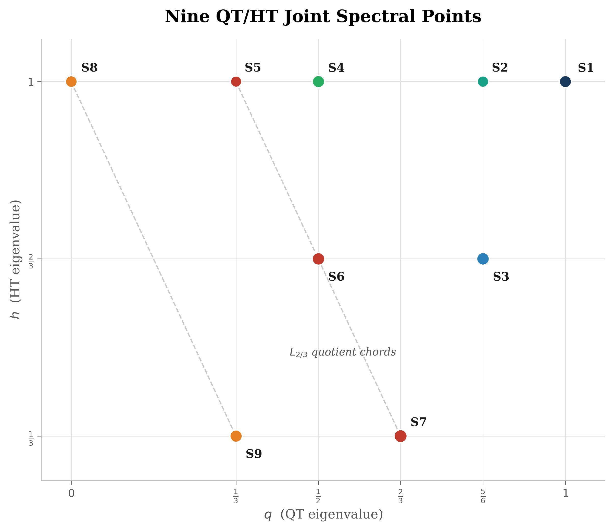

# Collision Geometry of Joint Spectra

### Affine Branch Arrangements, Visible Collisions, and Spectral Quotients

**WuJun Chen**

Independent Researcher · RIME Project · 2026

*This paper is Part IV of the RIME program. Papers I--III establish the Rubik-centered spectral, transport, and accessibility trilogy. The present paper studies the geometry that determines spectral layers: a finite joint spectrum can produce collision quotients under linear projection.*

***

## Abstract

**Problem.** Why do coarse spectral layers arise from a finer joint spectrum? A finite commutative spectral algebra can have two visible resolutions: a resolved joint spectrum and a coarser spectrum obtained by projecting that joint spectrum along a linear functional. The structural question is when the coarse spectrum is not primitive data, but a collision quotient of affine branches.

**Approach.** We study the finite joint spectrum of two commuting Hermitian operators $Q$ and $H$. Each joint eigenspace gives a point $(q_i,h_i)$ and an affine branch $\lambda_i(\alpha)=\alpha q_i+(1-\alpha)h_i$ for $A(\alpha)=\alpha Q+(1-\alpha)H$. Pairwise branch collisions are then computed exactly from the point set.

**Results.** The Rubik system provides the motivating example. Its QT/HT joint spectrum consists of nine rational points. The $36$ sector pairs split as $2$ parallel pairs, $10$ interior crossings, $15$ endpoint crossings, and $9$ exterior crossings. The canonical point $\alpha=2/3$ is the unique interior parameter producing maximal collapse: $S5,S6,S7$ merge into $V_{5/9}$ and $S8,S9$ merge into $V_{1/3}$, yielding the six layers of $A_{18}$.

**Implications.** The canonical six-layer spectrum is not the primitive sector geometry. It is the image of a more fundamental nine-point QT/HT joint spectrum under the linear functional $L_{2/3}(q,h)=(2q+h)/3$. This explains why these six layers occur: at $\alpha=2/3$, the nine affine branches undergo the unique maximal interior collision. The general object is a finite-point branch arrangement and its spectral quotients.

***

## Notation Table

| Symbol | Meaning |
|--------|---------|
| $V$ | finite-dimensional complex Hilbert space |
| $Q,H$ | commuting Hermitian operators on $V$ |
| $Z=\mathbb{C}[Q,H]$ | commutative algebra generated by $Q$ and $H$ |
| $E_i$ | joint eigenspace of $Q$ and $H$ |
| $P_i$ | orthogonal projector onto $E_i$ |
| $(q_i,h_i)$ | joint spectral point: $Q|_{E_i}=q_iI$, $H|_{E_i}=h_iI$ |
| $P$ | finite joint spectrum $\{(q_i,h_i)\}$ |
| $A(\alpha)$ | interpolation $\alpha Q+(1-\alpha)H$ |
| $L_\alpha(q,h)$ | linear functional $\alpha q+(1-\alpha)h$ |
| $\lambda_i(\alpha)$ | affine branch $L_\alpha(q_i,h_i)$ |
| $\alpha_{ij}$ | collision parameter for branches $i,j$ |
| $\Gamma_{\mathrm{int}}(P)$ | interior collision graph of $P$ |
| $\Delta(\alpha)$ | layer-count drop at $\alpha$: $|P|-|\{L_\alpha(p):p\in P\}|$ |
| $\operatorname{conv}(P)$ | convex hull of the finite joint spectrum |
| $\varphi_P$ | support function of $\operatorname{conv}(P)$ |
| $\mathrm{QT}_{\mathrm{all}}$ | average over the 12 quarter-turn generators |
| $\mathrm{HT}_{\mathrm{all}}$ | average over the 6 half-turn generators |
| $A_{18}$ | canonical Rubik average $(2/3)\mathrm{QT}_{\mathrm{all}}+(1/3)\mathrm{HT}_{\mathrm{all}}$ |

***

## Introduction

Why do the six canonical Rubik spectral layers exist? The answer developed in
this paper is that they are not the primitive sector geometry. They are the
collision quotient of a nine-point QT/HT joint spectrum under the projection
$L_{2/3}(q,h)=(2q+h)/3$. Thus the six layers occur because the nine affine
branches undergo a unique maximal interior collision at $\alpha=2/3$.

The Rubik system provides the motivating example. Paper I studies the canonical
averaging operator $A_{18}$ in the $228$-dimensional cubie representation of
the Rubik cube group, using the standard finite-group and cubie-state setting
\cite{serre1977,joyner2008}. It proves that the spectrum consists of six
rational layers:

$$
\{1,8/9,7/9,2/3,5/9,1/3\}.
$$

Paper II studies transport not on those six layers alone, but on nine resolved
QT/HT joint-spectral sectors. These are not competing decompositions. The
nine-sector
structure comes first. The six-layer structure is its collision quotient at the
canonical QT:HT weight ratio. In the general finite-point setting, the resolved
object is a point set $P=\{(q_i,h_i)\}$ and the coarse layers are quotient
classes of the affine branch values $L_\alpha(P)$.

Let

$$
\mathrm{QT}_{\mathrm{all}}
  = \frac{1}{12}\sum_{\text{quarter turns }s}\rho(s),
\qquad
\mathrm{HT}_{\mathrm{all}}
  = \frac{1}{6}\sum_{\text{half turns }s}\rho(s).
$$

In the canonical representation, the computation used below verifies that these
two operators commute to numerical precision:

$$
\|[\mathrm{QT}_{\mathrm{all}},\mathrm{HT}_{\mathrm{all}}]\|_F
  = 3.77\times 10^{-16}.
$$

This verified commuting pair is used to compute the QT/HT joint eigenspaces.
Once that joint table is fixed, the collision statements below are exact
finite-point statements over the reconstructed rational grid. On those joint
eigenspaces the canonical averaging operator is simply

$$
A_{18}
  = \frac{12\mathrm{QT}_{\mathrm{all}}+6\mathrm{HT}_{\mathrm{all}}}{18}
  = \frac{2}{3}\mathrm{QT}_{\mathrm{all}}
    +\frac{1}{3}\mathrm{HT}_{\mathrm{all}}.
$$

Thus the six eigenvalues of $A_{18}$ are the values of the linear functional

$$
L_{2/3}(q,h)=\frac{2q+h}{3}
$$

on the finite joint spectrum of $(\mathrm{QT}_{\mathrm{all}},\mathrm{HT}_{\mathrm{all}})$.

This paper isolates that mechanism. The finite-point formalism is the primary
object. The Rubik QT/HT joint spectrum is the motivating realization in which
exact rational arithmetic shows that $\alpha=2/3$ is the unique maximal
interior collision.

Throughout this paper, the joint commutativity, eigenvalue multiplicities, and
collision partitions are treated as exact computational facts obtained by
rational reconstruction, rather than as floating-point observations.

***

## Joint Spectra and Affine Branches

### Definition 1 (Joint Spectral Point)

Let $Q,H$ be commuting Hermitian operators on a finite-dimensional complex Hilbert space $V$. By the standard simultaneous diagonalization theorem for commuting normal, in particular Hermitian, matrices \cite{hornJohnson2013}, a joint spectral sector is a nonzero subspace $E_i\subseteq V$ on which

$$
Q|_{E_i}=q_iI,
\qquad
H|_{E_i}=h_iI.
$$

The pair $(q_i,h_i)$ is the joint spectral point associated to $E_i$.

The set of distinct joint spectral points is denoted

$$
P=\{(q_i,h_i)\}_{i=1}^m.
$$

If two different joint eigenspaces have the same pair $(q,h)$, they are indistinguishable by $\mathbb{C}[Q,H]$ and should be combined for the purposes of this paper. Thus we assume $P$ contains distinct points.

### Definition 2 (Interpolation Branch)

For $\alpha\in\mathbb{R}$, define

$$
A(\alpha)=\alpha Q+(1-\alpha)H.
$$

The branch associated to $(q_i,h_i)$ is

$$
\lambda_i(\alpha)
  = \alpha q_i+(1-\alpha)h_i
  = h_i+\alpha(q_i-h_i).
$$

The number of spectral layers of $A(\alpha)$ is

$$
N(\alpha)=|\{\lambda_i(\alpha):1\le i\le m\}|.
$$

The layer-count drop is

$$
\Delta(\alpha)=m-N(\alpha).
$$

### Proposition 1 (Collision Formula)

If two branches $\lambda_i$ and $\lambda_j$ have different slopes, then they collide at the unique parameter

$$
\alpha_{ij}
  =
  \frac{h_j-h_i}{(q_i-h_i)-(q_j-h_j)}.
$$

If $q_i-h_i=q_j-h_j$, the branches are parallel. Since the points are distinct, parallel branches never collide.

**Proof.** Solve

$$
h_i+\alpha(q_i-h_i)
  =
h_j+\alpha(q_j-h_j).
$$

Moving terms gives

$$
\alpha\big((q_i-h_i)-(q_j-h_j)\big)=h_j-h_i.
$$

If the coefficient of $\alpha$ is nonzero, division gives the stated formula. If it is zero, the branches have the same slope; since the points are distinct, $h_i\ne h_j$, so equality never occurs. $\square$

### Definition 3 (Collision Graph)

The interior collision graph $\Gamma_{\mathrm{int}}(P)$ is the labeled graph whose vertices are the points of $P$, whose edges are pairs $(i,j)$ with

$$
0<\alpha_{ij}<1,
$$

and whose edge label is $\alpha_{ij}$.

For a fixed $\alpha$, the collision components are the connected components of the subgraph of $\Gamma_{\mathrm{int}}(P)$ spanned by edges with label $\alpha$.

### Remark 1 (Layer-Drop Visibility)

A collision label $\alpha$ is visible at the quotient level if
$N(\alpha)<m$, equivalently $\Delta(\alpha)>0$.

For a set of distinct affine branches, a verified equality
$\lambda_i(\alpha)=\lambda_j(\alpha)$ already forces a layer-count drop at
that parameter. What is nontrivial in the Rubik computation is not this
definition, but the exact recovery of the rational collision labels, the
grouping of several pairwise collisions at a common $\alpha$, and the fact that
the resulting quotient components account for the observed layer structure.

***

## The Rubik QT/HT Joint Spectrum

For the canonical Rubik cubie representation, take

$$
Q=\mathrm{QT}_{\mathrm{all}},
\qquad
H=\mathrm{HT}_{\mathrm{all}}.
$$

The joint spectral sector computation gives the following exact rational table. The sector labels agree with the canonical RIME sector order.

| Sector | Dim | $q$ | $h$ | $q-h$ | $L_{2/3}(q,h)$ |
|--------|-----|-----|-----|-------|----------------|
| S1 | 20 | $1$ | $1$ | $0$ | $1$ |
| S2 | 2 | $5/6$ | $1$ | $-1/6$ | $8/9$ |
| S3 | 39 | $5/6$ | $2/3$ | $1/6$ | $7/9$ |
| S4 | 26 | $1/2$ | $1$ | $-1/2$ | $2/3$ |
| S5 | 1 | $1/3$ | $1$ | $-2/3$ | $5/9$ |
| S6 | 39 | $1/2$ | $2/3$ | $-1/6$ | $5/9$ |
| S7 | 66 | $2/3$ | $1/3$ | $1/3$ | $5/9$ |
| S8 | 8 | $0$ | $1$ | $-1$ | $1/3$ |
| S9 | 27 | $1/3$ | $1/3$ | $0$ | $1/3$ |

The possible $q$-coordinates are

$$
\{0,1/3,1/2,2/3,5/6,1\},
$$

and the possible $h$-coordinates are

$$
\{1/3,2/3,1\}.
$$

Thus the joint spectrum occupies nine points in a small rational grid.

### Proposition 2 (Computationally Verified Rubik Joint Spectrum)

In the canonical Rubik cubie representation, the algebra

$$
Z_{\mathrm{QH}}
  =\mathbb{C}[\mathrm{QT}_{\mathrm{all}},\mathrm{HT}_{\mathrm{all}}]
$$

has nine distinct joint spectral sectors on $V$. Here $\mathrm{QT}_{\mathrm{all}}$ and $\mathrm{HT}_{\mathrm{all}}$ are represented group-algebra averages in the cubie representation \cite{serre1977,joyner2008}. Their joint spectral points are precisely the nine points in the table above. The canonical averaging operator $A_{18}$ is obtained from this joint spectrum by the projection $L_{2/3}$.

This proposition is a computationally verified input to the finite-point
collision theory. The subsequent collision quotient theorems use the rational
table as exact data.

**Verification.** This is verified by the QH-spectrum audit in the
reproducibility section. It checks

$$
\|[\mathrm{QT}_{\mathrm{all}},\mathrm{HT}_{\mathrm{all}}]\|_F
=3.766\cdot10^{-16},
\qquad
\left\|A_{18}-\frac{2\mathrm{QT}_{\mathrm{all}}+\mathrm{HT}_{\mathrm{all}}}{3}\right\|_F
=0.
$$

It then verifies the nine rational signatures, projector completeness, and
orthogonality:

$$
\left\|\sum_i P_i-I\right\|_F=1.77\cdot10^{-14},
\qquad
\max_{i<j}\|P_iP_j\|_F=3.08\cdot10^{-15}.
$$

All rational values are snapped to fractions with denominator dividing $6$ for $q,h$ and $9$ for $A_{18}$.

***

## The Canonical Collision Quotient

At $\alpha=2/3$,

$$
\lambda_i(2/3)=\frac{2q_i+h_i}{3}.
$$

Applying this functional to the nine joint spectral points gives six distinct values:

| $A_{18}$ layer | Sectors | Dimension |
|----------------|---------|-----------|
| $V_1$ | S1 | 20 |
| $V_{8/9}$ | S2 | 2 |
| $V_{7/9}$ | S3 | 39 |
| $V_{2/3}$ | S4 | 26 |
| $V_{5/9}$ | S5, S6, S7 | 106 |
| $V_{1/3}$ | S8, S9 | 35 |

Thus

$$
V_{5/9}=S5\oplus S6\oplus S7,
\qquad
V_{1/3}=S8\oplus S9.
$$

The six-layer decomposition of Paper I is therefore the quotient of the nine-sector decomposition by the equivalence relation

$$
S_i\sim_\alpha S_j
\quad\Longleftrightarrow\quad
L_\alpha(q_i,h_i)=L_\alpha(q_j,h_j)
$$

at $\alpha=2/3$.

### Theorem 1 (Canonical Collision Quotient)

The six canonical layers of $A_{18}$ are exactly the $L_{2/3}$ collision quotient of the nine QT/HT joint-spectral sectors.

**Proof.** By Proposition 2, the nine sectors are simultaneous eigenspaces of $Q=\mathrm{QT}_{\mathrm{all}}$ and $H=\mathrm{HT}_{\mathrm{all}}$ with the listed eigenvalues $(q_i,h_i)$. Since

$$
A_{18}=(2/3)Q+(1/3)H,
$$

the $A_{18}$ eigenvalue on sector $S_i$ is $L_{2/3}(q_i,h_i)$. Evaluating $L_{2/3}$ gives the six values in the table above and the stated sector groupings. The dimensions add as

$$
1+39+66=106,
\qquad
8+27=35,
$$

with the remaining four sectors singleton. $\square$

### Remark 2 (What This Does Not Replace)

Theorem 1 explains the relation between the six-layer and nine-sector
decompositions. It does not replace the arithmetic mechanism of Paper I. Paper
I proves rationality for the canonical averaging operator. The present theorem
explains why the rational spectrum has precisely this six-layer shape: the
nine-point QT/HT joint spectrum has a unique maximal interior collision at the
canonical weight $\alpha=2/3$.

***

## Exact Collision Classification

There are $\binom{9}{2}=36$ sector pairs. Applying Proposition 1 to the nine rational points gives an exact classification.

| Category | Count | Description |
|----------|-------|-------------|
| Parallel | 2 | same slope, distinct intercept |
| Interior | 10 | $0<\alpha_{ij}<1$ |
| Endpoint | 15 | $\alpha_{ij}=0$ or $\alpha_{ij}=1$ |
| Exterior | 9 | $\alpha_{ij}<0$ or $\alpha_{ij}>1$ |

The two parallel pairs are

$$
S1\parallel S9,
\qquad
S2\parallel S6.
$$

The interior collision values are:

| $\alpha$ | Layers | Drop $\Delta$ | Collision components |
|----------|--------|---------------|----------------------|
| $2/7$ | 8 | 1 | S3=S8 |
| $2/5$ | 7 | 2 | S3=S5; S6=S8 |
| $1/2$ | 7 | 2 | S3=S4; S7=S8 |
| $2/3$ | 6 | 3 | S5=S6=S7; S8=S9 |
| $4/5$ | 8 | 1 | S4=S7 |

The endpoints are also degenerate:

| $\alpha$ | Operator | Layers |
|----------|----------|--------|
| $0$ | $H=\mathrm{HT}_{\mathrm{all}}$ | 3 |
| $1$ | $Q=\mathrm{QT}_{\mathrm{all}}$ | 6 |

### Theorem 2 (Rubik Collision Classification)

For the Rubik QT/HT joint spectrum:

1. the $36$ sector pairs classify as $2$ parallel, $10$ interior, $15$ endpoint, and $9$ exterior pairs;
2. every interior collision label produces the asserted global layer-count drop;
3. $\alpha=2/3$ is the unique interior parameter with maximal drop.

**Proof.** The pairwise collision parameters are computed from the exact formula

$$
\alpha_{ij}
  =
  \frac{h_j-h_i}{(q_i-h_i)-(q_j-h_j)}
$$

using the rational table above. The resulting categories give the counts in the first table. The five interior parameter values are exactly

$$
\{2/7,2/5,1/2,2/3,4/5\}.
$$

For each interior value, evaluating all nine affine branches gives respectively

$$
8,7,7,6,8
$$

distinct values. Hence every interior collision label produces a global quotient
drop. The corresponding drops are

$$
1,2,2,3,1.
$$

The maximum drop is therefore $3$, and it occurs only at $\alpha=2/3$. $\square$

**Verification.** This is verified by the collision-quotient audit listed in
Computational Reproducibility. It uses exact `Fraction` arithmetic and asserts
all counts, all interior collision labels, the endpoint layer counts, the
parallel pairs, and the maximality of $\alpha=2/3$.

***

## The Collision Graph

The interior collision graph $\Gamma_{\mathrm{int}}(P)$ has nine vertices and ten labeled edges:

| Label | Edges |
|-------|-------|
| $2/7$ | S3--S8 |
| $2/5$ | S3--S5, S6--S8 |
| $1/2$ | S3--S4, S7--S8 |
| $2/3$ | S5--S6, S5--S7, S6--S7, S8--S9 |
| $4/5$ | S4--S7 |

At $\alpha=2/3$, the graph contains a triangle on $\{S5,S6,S7\}$ and a separate edge S8--S9. This is the graph-theoretic form of the canonical maximal collapse.

The $V_{5/9}$ layer is therefore a triple collision component:

$$
S5,S6,S7\longrightarrow V_{5/9}.
$$

This collision component should not be confused with the transport graph of Paper II. The collision graph records equality of affine spectral branches. The transport graph records nonzero generator-resolved matrix blocks $P_i\rho(g)P_j$. In the $V_{5/9}$ triple, the collision graph is complete, while the direct transport graph is a chain mediated by S6. Spectral collision and transport adjacency are different structures.

***

## Rational Grid Constraints

The Rubik QT/HT joint spectrum lies in a small rational grid. Every coordinate has denominator dividing $6$. Therefore, after clearing denominators,

$$
\alpha_{ij}
  =
  \frac{h_j-h_i}{(q_i-h_i)-(q_j-h_j)}
$$

is a ratio of small integers.

This explains why the critical values

$$
2/7,\quad 2/5,\quad 1/2,\quad 2/3,\quad 4/5
$$

are small rational numbers. They are not fitted numerical transition points. They are forced by the finite rational point arrangement.

### Proposition 3 (Finite Rational Collision Set)

Let $P\subseteq \mathbb{Q}^2$ be a finite set of distinct points. Then the set of collision parameters

$$
\{\alpha_{ij}: i<j,\ q_i-h_i\ne q_j-h_j\}
$$

is a finite subset of $\mathbb{Q}$. If all coordinates of $P$ have denominator dividing $N$, then every collision parameter is a ratio of integers whose numerators and denominators are bounded in terms of the coordinate differences of the $N$-grid.

**Proof.** Finiteness is immediate from the finite number of pairs. Rationality follows because $\alpha_{ij}$ is obtained from rational numbers by subtraction and division by a nonzero rational number. If all coordinates lie in $(1/N)\mathbb{Z}$, then $h_j-h_i$ and $(q_i-h_i)-(q_j-h_j)$ also lie in $(1/N)\mathbb{Z}$; after multiplying numerator and denominator by $N$, $\alpha_{ij}$ is a ratio of integer differences. $\square$

### Remark 3 (Farey-Like Behavior)

The Rubik values resemble a small Farey arrangement because all collision parameters arise from ratios of small integer differences; the comparison is only with the classical small-denominator rational organization familiar from Farey sequences \cite{hardyWright2008}. This paper does not prove a Farey classification theorem. The safe statement is the finite rational grid constraint above.

***

## General Collision Quotients

The Rubik system provides the motivating example. The construction itself is
the following general finite-point construction.

Let $Z=\mathbb{C}[Q,H]$ be a finite-dimensional commutative semisimple algebra acting on $V$ with distinct joint spectral points. In the Hermitian setting used here, semisimplicity and joint diagonalization are the finite-dimensional spectral-theorem background \cite{hornJohnson2013}.

$$
P=\{(q_i,h_i)\}_{i=1}^m.
$$

For each $\alpha$, the interpolation $A(\alpha)=\alpha Q+(1-\alpha)H$ induces a quotient of the joint-spectral sector set:

$$
i\sim_\alpha j
\quad\Longleftrightarrow\quad
L_\alpha(q_i,h_i)=L_\alpha(q_j,h_j).
$$

The quotient classes are the spectral layers of $A(\alpha)$.

### Definition 4 (Collision Quotient)

The collision quotient of $P$ at $\alpha$ is the partition

$$
P/\!\sim_\alpha.
$$

If $P$ is realized as the joint spectrum of $(Q,H)$, the corresponding operator decomposition is

$$
V
  =
  \bigoplus_{C\in P/\sim_\alpha}
  \left(\bigoplus_{i\in C}E_i\right).
$$

### Proposition 4 (Layers as Collision Classes)

For commuting Hermitian $Q,H$, the eigenspaces of $A(\alpha)=\alpha Q+(1-\alpha)H$ are precisely the sums of joint eigenspaces whose joint spectral points lie in the same collision quotient class.

**Proof.** Since $Q$ and $H$ commute and are Hermitian, $V$ decomposes into orthogonal joint eigenspaces $E_i$. On $E_i$, $A(\alpha)$ acts by the scalar $L_\alpha(q_i,h_i)$. Therefore two joint eigenspaces belong to the same eigenspace of $A(\alpha)$ exactly when their $L_\alpha$ values coincide. $\square$

This proposition is the abstract finite-point form of the Rubik
six-layer/nine-sector relation.

***

## Convex Envelope Reformulation

The collision quotient has an equivalent geometric reading in terms of linear
projections of a finite point arrangement. There is also a useful convex
envelope shadow of the same construction.

Let

$$
K=\operatorname{conv}(P)\subset\mathbb{R}^2.
$$

For a covector $u\in(\mathbb{R}^2)^*$, define the support function

$$
\varphi_P(u)
  =
  \sup_{p\in P}\langle u,p\rangle
  =
  \sup_{x\in K}\langle u,x\rangle .
$$

For the projection direction

$$
u_\alpha=(\alpha,1-\alpha),
$$

the upper envelope of the affine branch arrangement is

$$
\varphi_P(u_\alpha)
  =
  \max_i \lambda_i(\alpha).
$$

Thus the affine branch arrangement determines a piecewise-linear convex
support function. When the maximizing set

$$
F_\alpha
  =
  \{p\in P:\langle u_\alpha,p\rangle=\varphi_P(u_\alpha)\}
$$

has more than one point, the support envelope has a degeneracy: the projection
direction exposes a positive-dimensional face or a multiple-point supporting
class. In this boundary sense, branch collision appears as non-unique support.

This reformulation should be kept separate from the full collision quotient.
The quotient $P/\!\sim_\alpha$ records every fiber of the projection
$L_\alpha$, including collisions among non-maximal or interior points. The
support function records only the exposed envelope.

By contrast, the collision quotient records the full finite-fiber projection
data, including exposed and non-exposed collisions.

The convex-envelope picture is not a replacement for Theorem 1. It is a dual
boundary projection of the same finite arrangement.

### Legendre-Dual Coordinates

On the open interval $0<\alpha<1$, one may pass from normalized interpolation
coordinates to an affine dual coordinate. For example, set

$$
t=\frac{\alpha}{1-\alpha}.
$$

Then

$$
L_\alpha(q,h)
  =
  (1-\alpha)(tq+h).
$$

After removing the positive scalar $(1-\alpha)$, the upper envelope is

$$
\Phi(t)
  =
  \sup_{(q,h)\in P}(tq+h).
$$

This is the Legendre-Fenchel support function of the finite polytope
$\operatorname{conv}(P)$ in the one-parameter family of directions $(t,1)$.
It is a piecewise-linear convex function of $t$. Breakpoints of $\Phi$ mark
changes in the exposed maximizer. Multiple exposed maximizers are envelope
degeneracies.

The full spectral quotient remains finer than this convex dual picture: two
non-maximal branches may collide without changing the upper envelope. For that
reason, the primary object of Paper IV remains the finite branch arrangement
and its collision quotient, while the convex support function gives a compact
dual language for the exposed geometry of the arrangement.

In this language, Paper IV can be reinterpreted as studying the envelope
geometry of the joint spectral polytope $P$ under the linear projections
$L_\alpha$. Collision quotients record projection degeneracies of the finite
point set; the Legendre-dual support function records the exposed convex
envelope as a piecewise-linear object.

***

## Consequences for the RIME Program

### Paper I

Paper I studies the canonical quotient $L_{2/3}(P)$. Its main theorem remains a theorem about the rational spectrum of $A_{18}$, but the joint-spectrum viewpoint explains why the six layers are exactly the collision quotient of a finer nine-sector structure at $\alpha=2/3$.

### Paper II

Paper II is best read as transport on the resolved QT/HT joint-spectral sectors. The old shorthand

$$
A_{18}
\longrightarrow
\text{sectors}
\longrightarrow
\text{transport}
$$

should be replaced by

$$
(\mathrm{QT}_{\mathrm{all}},\mathrm{HT}_{\mathrm{all}})
\longrightarrow
\text{joint-spectral sectors}
\longrightarrow
\text{transport graph},
$$

with

$$
A_{18}
=L_{2/3}(\mathrm{QT}_{\mathrm{all}},\mathrm{HT}_{\mathrm{all}})
\longrightarrow
\text{collision quotient}.
$$

The transport graph lives on the resolved sectors, not on the coarse collision quotient alone.

### Paper III

Paper III's T7 morphisms are decomposition-relative. At the resolved nine-sector level, the canonical Rubik system has five T7 morphisms. At coarser layer resolution, some distinctions are merged. The collision quotient therefore changes what is visible, but it does not invalidate the resolved transport/accessibility structure.

In particular, the $V_{5/9}$ triple collision is not itself a T7 phenomenon. Collision adjacency, direct transport, Lie curvature, and composition accessibility are separate structures built over the same sector set.

***

## Related Work and Terminology

The sectors in this paper are joint eigenspace sectors of a commutative
spectral algebra. Association schemes provide an algebraic comparison class:
Bose--Mesner algebras are finite-dimensional commutative semisimple algebras
organized by primitive idempotents \cite{bannaiIto1984,godsil1993}, and
Godsil--Martin quotient theory studies how equitable partitions and simple
cells lead to quotient Bose--Mesner structures
\cite{godsilMartin1995quotients}. The term "primitive sector" appears in
earlier RIME manuscripts as a legacy shorthand; "QT/HT joint-spectral sector"
is the more precise term for the Rubik system.

This paper does not claim that the QT/HT algebra is a Bose--Mesner algebra of an association scheme, nor that its joint sectors are literally orbitals or simple cells of an equitable partition. The safe statement is that it is a finite-dimensional commutative semisimple spectral algebra with nine primitive idempotents on the cubie representation. Establishing a genuine association-scheme or coherent-configuration interpretation would require additional closure and intersection-number data of the kind used to certify association schemes or coherent configurations \cite{bannaiIto1984,godsil1993,godsilMartin1995quotients}.

***

## Limitations and Open Questions

1. **Center dependence.** The canonical QT/HT center is natural for the Rubik generator set, but other commutative centers may produce different sectorizations. Which centers factor through the same nine-point geometry remains open.

2. **Beyond two generators.** This paper studies algebras generated by two commuting operators. Higher-dimensional joint spectra would lead to arrangements of linear projections from $\mathbb{R}^d$ rather than planar point sets.

3. **Rational grid classification.** The Rubik joint spectrum lies in a small rational grid. A full classification of possible interior collision labels for such grids is not attempted here.

4. **Transport independence.** Collision edges are not transport edges. A future theory should compare collision graphs, transport graphs, and accessibility graphs as three different structures on the same sector set.

5. **Generator-defect deformation.** CCS I.3 suggests that removing half-turns,
quarter-turns, or face-selected generators changes the underlying joint
arrangement in different ways. The moving collision quotient is then defined
only on normal commutative spectral charts
$\Sigma_{\mathrm{spec}}\subseteq\Sigma_{\mathrm{comm}}$. Paper IV uses this
as an explanatory framework only; it does not classify all generator defects.

6. **Universality.** The construction applies to any pair of commuting Hermitian operators, but the specific exact collision table and unique-maximal-collapse property are Rubik facts unless proved for a broader class.

***

## Future Direction: Generator-Set Perturbations

The main theorem of this paper is closed in the following sense. Fix a finite joint spectrum

$$
P\subset \mathbb{R}^2
$$

and a commuting pair $(Q,H)$. The family

$$
A(\alpha)=\alpha Q+(1-\alpha)H
$$

changes spectral layers by changing the projection direction

$$
L_\alpha(q,h)=\alpha q+(1-\alpha)h.
$$

Thus the canonical six-layer spectrum is the collision quotient $L_{2/3}(P)$ of the fixed nine-point QT/HT joint spectrum.

Generator-set perturbation is a different problem. Removing or reweighting
generators changes the averaging operators themselves, so the joint spectral
arrangement is no longer the same fixed point set. In schematic form, one
should expect

$$
(P,L_\alpha)
\quad\leadsto\quad
(P',L'_\alpha),
$$

where $P'$ is the joint spectral arrangement associated to the perturbed generator set or perturbed commutative algebra.

This belongs to the later deformation theory, not to the fixed-arrangement
theorem of the present paper. The relevant future
object is the generator-set moduli space

$$
\mathcal{M}=[0,1]^m,
$$

with a moving arrangement $P=P(w)$ defined on normal commutative spectral
charts

$$
\Sigma_{\mathrm{spec}}\subseteq\Sigma_{\mathrm{comm}},
$$

where

$$
\Sigma_{\mathrm{comm}}
=
\{w:[Q_T(w),H_T(w)]=0\}.
$$

Inside $\Sigma_{\mathrm{spec}}$, one can then ask how layer-count and field
walls organize the induced collision quotients:

$$
\Sigma_{\mathrm{field}}
\subseteq
\Sigma_L
\subseteq
\Sigma_{\mathrm{spec}}
\subseteq
\Sigma_{\mathrm{comm}}.
$$

Paper IV does not classify these perturbations. Such perturbations act on the
joint spectral arrangement itself, rather than on the projection quotient of a
fixed arrangement.

In this language, Collision Geometry studies fixed arrangements with varying projections. Generator-Set Deformation studies varying arrangements together with their induced collision quotients.

Paper IV studies collision quotients of a fixed arrangement. A deformation theory would require understanding how the arrangement itself moves inside a generator-set moduli space and how collision quotients bifurcate across the resulting discriminant walls.

## Horizon: Spectral Coarse-Graining and Information Flow

The collision quotient can also be read as a first example of spectral
coarse-graining. The resolved QT/HT sectors carry more information than the
six layers of $A_{18}$: the projection $L_{2/3}$ preserves eigenvalue-level
data while merging several joint-spectral sectors into common spectral
classes.

This coarse-graining is not automatically faithful to information flow. The
$V_{5/9}$ component is the local warning sign. Spectrally, $S5,S6,S7$ form one
triple collision class. But the transport structure on the same sectors is not
a uniform blob: the collision graph is a triangle, while direct transport is
the chain $S5$--$S6$--$S7$ mediated by $S6$. Thus spectral equivalence,
transport adjacency, Lie accessibility, and compositional accessibility are
different shadows of the same resolved sector geometry.

This suggests a future "spectral RG" language: a quotient map may preserve the
visible spectrum while concealing the data needed to reconstruct information
flow. In that language, an RG flaw is a failure of spectral coarse-graining to
preserve accessibility data. Paper IV identifies the first coarse-graining map;
the later repair and deformation layers ask what additional data and wall
structures are needed when coarse spectral information no longer determines how
information can move.

***

## Conclusion

Affine branch arrangements give a finite-point mechanism for spectral
quotients. A resolved joint spectrum $P$ is projected by $L_\alpha$; whenever
branches collide, distinct joint eigenspaces merge into a coarser spectral
layer.

The Rubik system realizes this mechanism sharply. Its canonical six-layer
spectrum is the collision quotient of a nine-point QT/HT joint spectrum. Exact
collision arithmetic gives the full phase diagram: $36$ sector pairs split into
$2$ parallel, $10$ interior, $15$ endpoint, and $9$ exterior crossings. Every
interior collision label is visible as a layer-count drop, and $\alpha=2/3$ is the unique interior point of
maximal collapse.

Thus the six-layer story of Paper I and the nine-sector story of Paper II are two views of the same finite spectral geometry: resolved joint spectrum first, collision quotient second.

***

## Computational Reproducibility

The support suite consists of three repository audits:

| Label | Role |
|-------|------|
| QH-spectrum audit | $A_{18}$ reconstruction, nine rational QT/HT signatures, projector completeness, and orthogonality |
| Collision-quotient audit | exact collision classification, layer-count drops, endpoint counts, parallel pairs, and unique maximality of $\alpha=2/3$ |
| $V_{5/9}$ check | collision triangle on S5,S6,S7 versus direct-transport chain S5--S6--S7 |

The upstream exploratory collision script is kept only for provenance; the
canonical support is the collision-quotient audit used for this paper.

***

## References

**Program lineage.** Paper IV begins the post-trilogy spectral-geometry line.
Papers I--III and the CCS provide the Rubik spectral, sector, transport, and
accessibility data \cite{paper1,paper2,paper3,ccs}: Paper I proves the
rational six-layer spectrum of $A_{18}$, Paper II resolves transport on the
QT/HT joint-spectral sectors, Paper III studies the Lie/composition
accessibility consequences, and the CCS records the canonical numerical
specification.

**External background.** The basic object is a finite joint spectrum of
commuting Hermitian operators, so the linear-algebra foundation is simultaneous
diagonalization and the finite-dimensional spectral theorem
\cite{hornJohnson2013}. The Rubik instance is representation-theoretic:
$\mathrm{QT}_{\mathrm{all}}$ and $\mathrm{HT}_{\mathrm{all}}$ are represented
group-algebra averages in the cubie representation, within the standard
semisimple theory of finite-group representations \cite{serre1977} and the
usual Rubik group presentation \cite{joyner2008}. Bose--Mesner algebras,
primitive idempotents, coherent configurations, and quotient theory for
association schemes provide the algebraic-combinatorial comparison class
\cite{bannaiIto1984,godsil1993,godsilMartin1995quotients}. The QT/HT algebra
is used here only as a finite-dimensional commutative semisimple spectral
algebra; the paper does not identify it with an association scheme. The
small-denominator collision parameters are compared only with the rational
organization familiar from Farey sequences \cite{hardyWright2008}; no Farey
classification theorem is claimed.

**Computational provenance.** The manuscript-level support consists of the
finite collision quotient audit, the $V_{5/9}$ collision-versus-transport
check, and the Paper IV figure scripts in the repository. The repository also
contains the manuscript sources, figures, and reproducibility scripts used for
the present paper.
